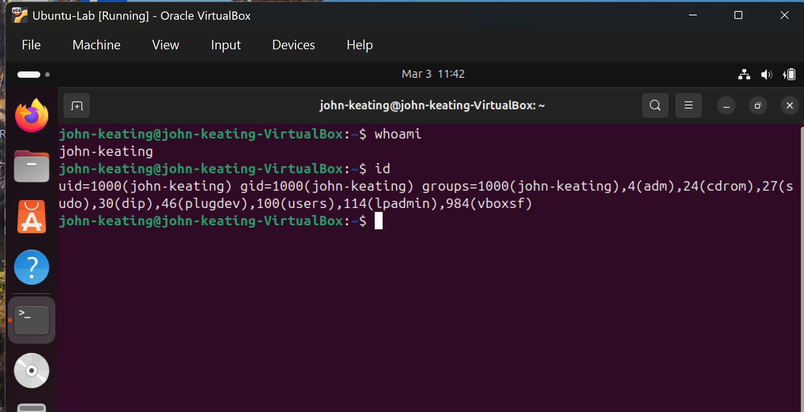
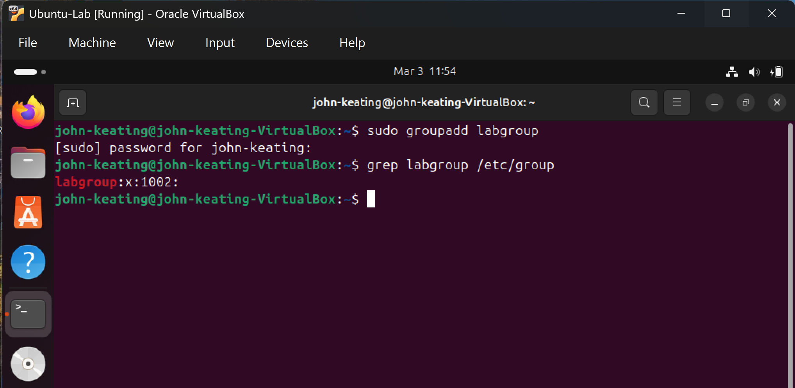

# Linux Fundamentals — Users & Groups

## Objective
Demonstrate practical understanding of Linux user and group management by creating users, modifying group membership, adjusting file and directory ownership, configuring permissions, and validating access behavior in a multi-user environment.

---

## Environment
- Ubuntu (Virtual Machine)
- Git Bash (Windows)
- Local Linux lab environment

---

## Commands Used & What They Do

- `whoami` — Displays the currently logged-in user.

- `id` — Shows user ID (UID), primary group ID (GID), and all group memberships.

- `cat /etc/passwd` — Displays system user account information.

- `cat /etc/group` — Displays system group information.

- `groupadd <group>` — Creates a new group.

- `useradd <user>` — Creates a new user account.

- `usermod -aG <group> <user>` — Adds an existing user to a secondary group without removing existing memberships.

- `groups <user>` — Displays all groups a user belongs to.

- `chown <user>:<group> <file>` — Changes file ownership (user and/or group).

- `ls -l` — Displays file permissions, owner, and group.
  
- `chgrp <group> <file/directory>` — Changes the group ownership of a file or directory.
- `chmod <permissions> <file/directory>` — Modifies file or directory permissions.
- `ls -ld <directory>` — Displays directory permissions, owner, and group.
- `su - <user>` — Switches to another user account to test access behavior.

---
---

## What Was Tested

### User Creation
- Created a new test user
- Verified user existence in `/etc/passwd`

### Group Management
- Created a new group
- Added user to secondary group
- Verified group membership

### Ownership Changes
- Changed file ownership using `chown`
- Verified updated ownership with `ls -l`

---

## Key Concepts

- Every file has an owner (user) and an associated group.
- Each user has a primary group and may belong to multiple secondary groups.
- Group membership directly affects file and directory access.
- Ownership and permissions work together to enforce access control.

---

## Visual Evidence

### Current User Identity

### Group Creation

### File Ownership Before Change

### File Ownership After Change

### Final Access Verification

## What I Learned

This lab strengthened my understanding of how Linux enforces access control using users, groups, file ownership, and directory permissions.

I learned that file permissions alone do not determine access — directory execute (`x`) permission is required to enter a directory and access files within it.

Through testing with multiple users, I validated how group membership and ownership changes directly impact access behavior in a multi-user Linux environment.

