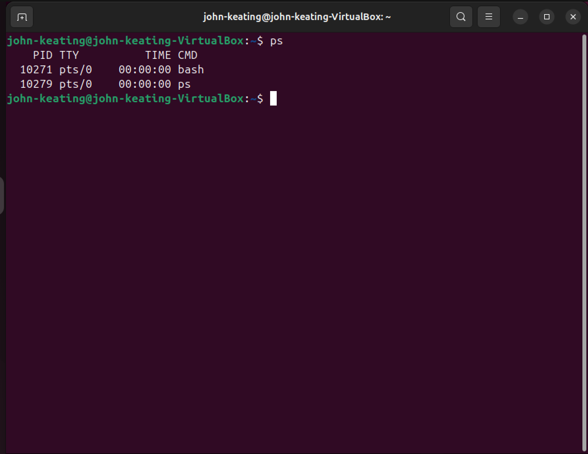
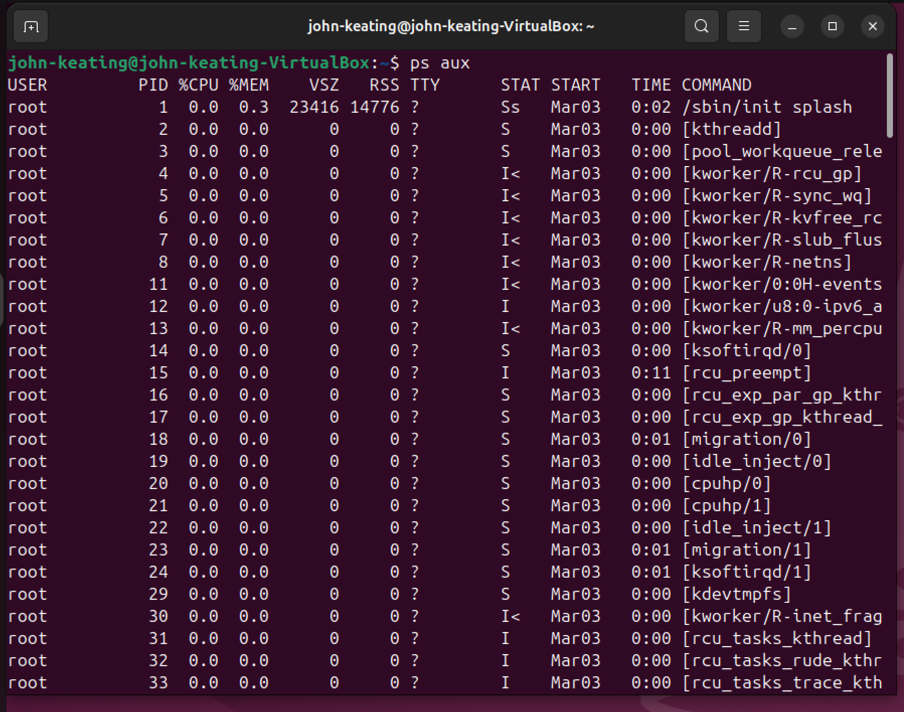
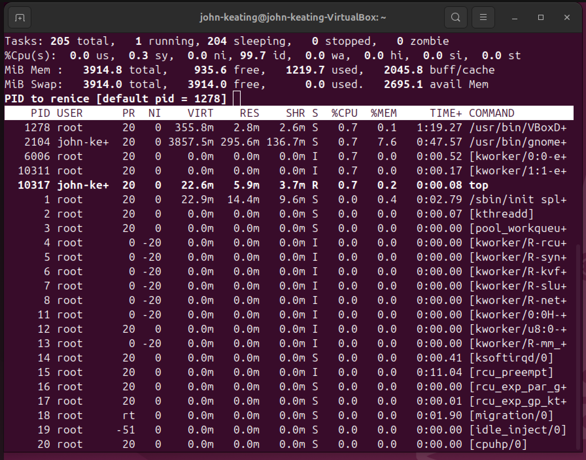
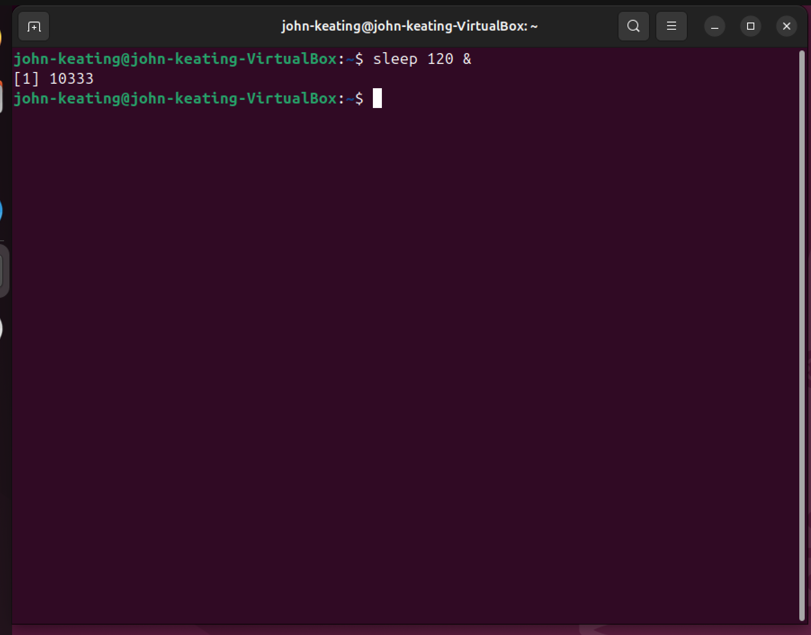

# Linux Processes Lab

## Objective

Demonstrate how Linux processes can be monitored, run in the background, and terminated.

## Environment

* Ubuntu Linux (Virtual Machine)
* Oracle VirtualBox
* Windows 11 Host Machine
* Linux Terminal

## Commands Used

### top

Displays running processes and system resource usage in real time.

### sleep

Creates a temporary process used for testing.

### &

Runs a command in the background.

### jobs

Displays background jobs in the current shell session.

### kill

Terminates a running process using its Process ID (PID).

## What Was Tested

### Process Monitoring

Used `top` to observe running system processes.

### Background Processes

Created a background process using:

sleep 120 &

### Job Verification

Confirmed the process was running using:

jobs

### Process Termination

Stopped the process using:

kill PID

## Key Concepts Learned

* Linux processes run in either foreground or background.
* Every process has a unique PID.
* System administrators can monitor and terminate processes.

## Visual Evidence

### Basic Process List

### All Processes

### Process Monitoring with top

### Background Process

### Jobs Command

### Killing a Process

## What I Learned

This lab demonstrates how Linux manages processes and how administrators monitor and control running tasks.
