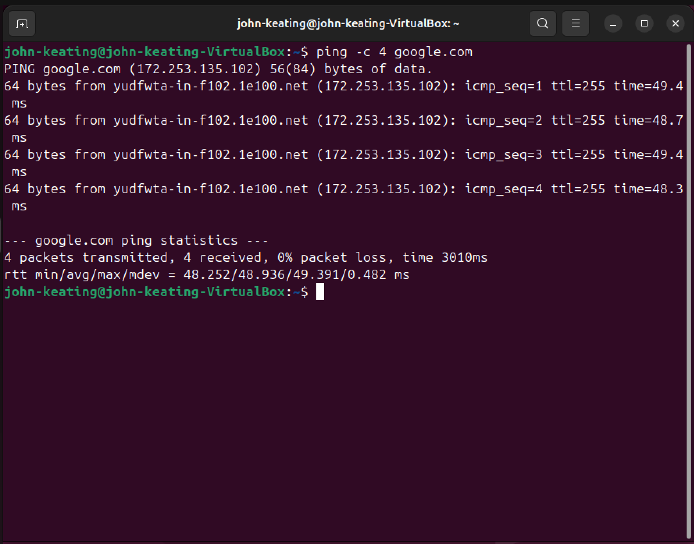
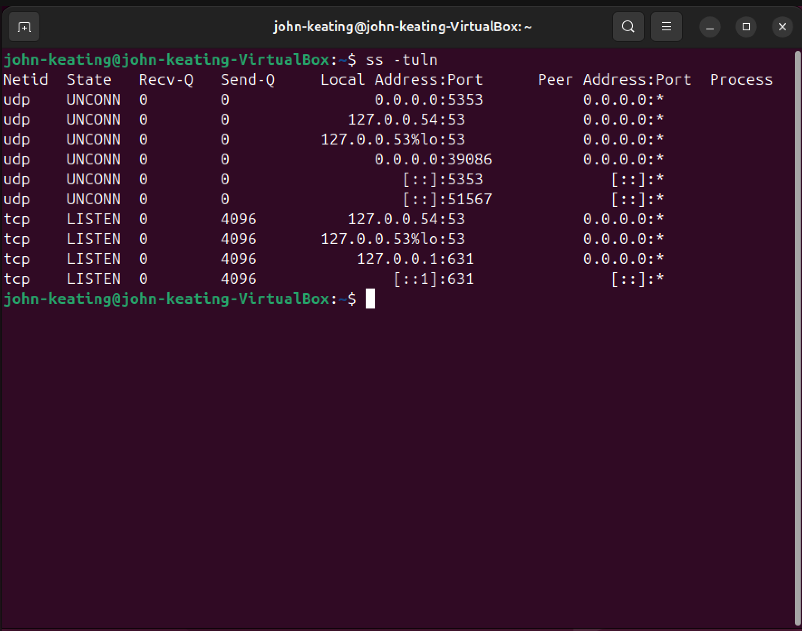

# Linux Networking Lab

## Objective
Demonstrate basic Linux networking diagnostics including interface configuration, routing tables, connectivity testing, and open ports.

## Environment
- Ubuntu Linux (Virtual Machine)
- Oracle VirtualBox
- Windows 11 Host Machine
- Linux Terminal

## Commands Used

### ip a
Displays network interfaces and assigned IP addresses.

### ip route
Displays the system routing table and default gateway.

### ping -c 4 google.com
Tests internet connectivity and DNS resolution.

### ss -tuln
Displays listening network sockets and open ports.

### hostname -I
Displays the system IP addresses.

## What Was Tested

- Verified network interface configuration
- Identified the default gateway
- Confirmed internet connectivity
- Observed listening network ports
- Retrieved system IP address

## Key Networking Concepts

- Network Interfaces
- IP Addressing
- Default Gateway
- DNS Resolution
- Open Ports
- Network Connectivity Testing

## Screenshots

### Network Interfaces (ip a)

### Routing Table (ip route)

### Internet Connectivity Test (ping)

### Open Network Ports (ss -tuln)

### System IP Address (hostname -I)

## What I Learned

This lab demonstrated how to inspect Linux networking configuration, verify internet connectivity, and identify active network services using common Linux networking commands.