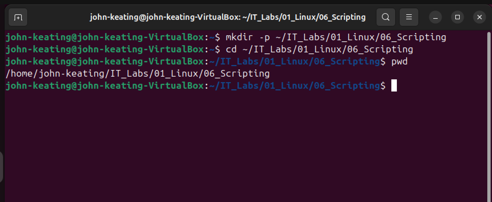
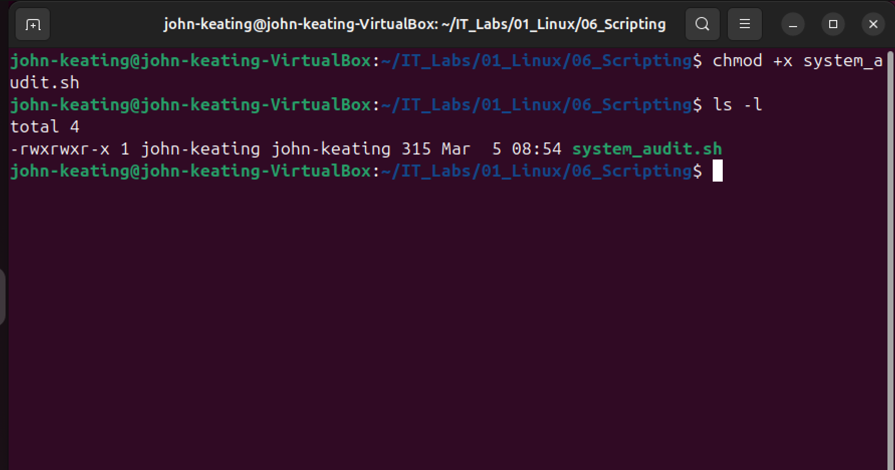

# Linux Scripting Lab

## Objective
Create and execute a basic Bash script that collects system information including user details, system uptime, disk usage, memory usage, logged-in users, and open network ports.

---

## Environment
- Ubuntu Linux (VirtualBox VM)
- Bash Shell
- VS Code for documentation
- Git & GitHub for version control

---

## Script Created
system_audit.sh

This script performs a basic system audit by displaying:

- Current logged in user
- System uptime
- Disk usage
- Memory usage
- Logged in users
- Open network ports

---

## Commands Used

| Command | Description |
|------|------|
| nano | Create and edit the script |
| chmod +x | Make the script executable |
| ./scriptname | Execute the script |
| df -h | Show disk usage |
| free -h | Show memory usage |
| whoami | Display current user |
| who | Show logged-in users |
| uptime | Display system uptime |
| ss -tuln | Show open network ports |

---

## Screenshots

### Script Directory

### Writing the Script

### Script Permissions

### Script Output

---

## What I Learned

- How to create Bash scripts
- How to make scripts executable using chmod
- How to run scripts from the terminal
- How to gather system information using Linux commands
- How to document technical work for GitHub

---