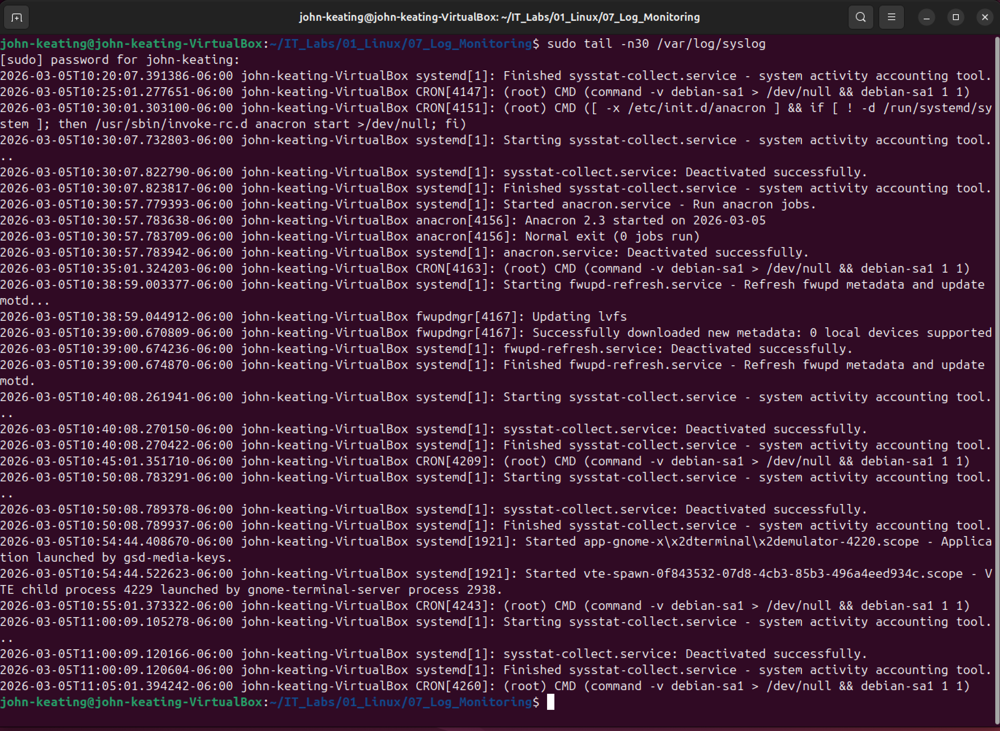
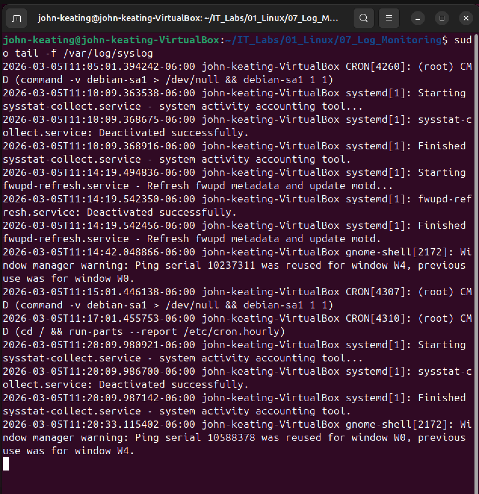

# Linux Log Monitoring Lab

## Objective
Learn how Linux system logs work and how administrators monitor system activity, troubleshoot problems, and detect errors using log analysis tools.

---

## Environment

- Ubuntu Linux (VirtualBox VM)
- Bash Terminal
- Windows Host Machine
- Git & GitHub for lab documentation

---

## Commands Used

| Command | Description |
|--------|-------------|
| ls /var/log | Lists all available Linux system log files |
| tail -n 30 /var/log/syslog | Displays the last 30 entries from the system log |
| grep -i "error" /var/log/syslog | Searches the log file for error messages |
| tail -f /var/log/syslog | Monitors system logs in real time |

---

## Command Breakdown Example

### Searching System Logs for Errors

Command used:

sudo grep -i "error" /var/log/syslog | tail -n 20

Explanation:

| Part | Meaning |
|-----|--------|
| sudo | Runs the command with administrator privileges |
| grep | Searches text inside files |
| -i | Ignores uppercase/lowercase differences |
| "error" | Searches for the word "error" |
| /var/log/syslog | Main Linux system log file |
| tail -n 20 | Shows the last 20 matching results |

---

## Key Concepts Learned

Linux stores system logs inside the **/var/log** directory.

System administrators use log files to:

- Troubleshoot system problems
- Investigate security incidents
- Monitor system activity
- Identify errors or failed services

Important log analysis tools include:

- tail – view recent log entries
- grep – search logs for keywords
- tail -f – monitor logs live as the system runs

---

## Screenshots

### Viewing the Log Directory

### Viewing Recent Log Entries

### Searching Logs for Errors

### Live Log Monitoring

### Command Breakdown Example

---

## What I Learned

Through this lab I learned how Linux stores system activity in log files and how administrators analyze those logs to troubleshoot issues.

I practiced:

- Navigating system log directories
- Viewing recent log entries
- Searching logs for error messages
- Monitoring logs in real time

These skills are essential for **System Administration, DevOps, Cloud Engineering, and Cybersecurity troubleshooting**.

---

## Lab Author

John Keating  
Linux & Cloud Engineering Lab Series