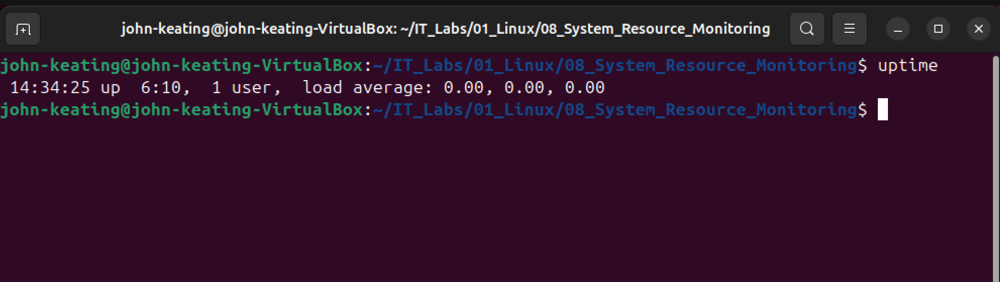
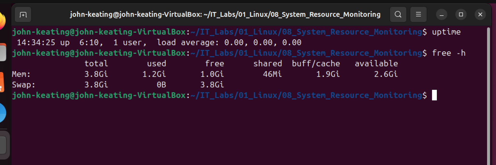
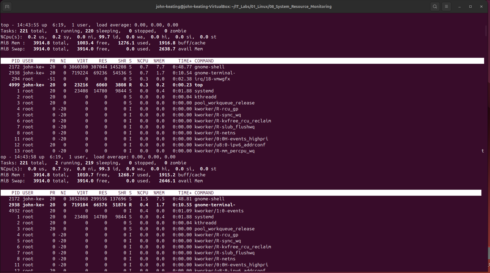
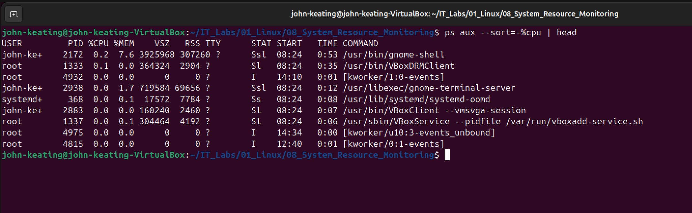

# Linux System Resource Monitoring Lab

## Objective

The purpose of this lab is to learn how Linux administrators monitor system performance using built-in command line tools.

In this lab I monitored:

* System uptime
* Memory usage
* Running processes
* CPU utilization

These tools are commonly used in **System Administration, DevOps, Cloud Engineering, and Cybersecurity troubleshooting.**

---

## Environment

* Ubuntu Linux (VirtualBox VM)
* Bash Terminal
* Windows Host Machine
* Git Bash
* GitHub Lab Repository

---

## Commands Used

| Command                       | Description                                    |
| ----------------------------- | ---------------------------------------------- |
| `uptime`                      | Displays system uptime and load averages       |
| `free -h`                     | Displays memory usage in human readable format |
| `top`                         | Displays a live system resource monitor        |
| `ps aux --sort=-%cpu \| head` | Shows processes using the most CPU             |

---

## Command Breakdown Example

### Viewing Top CPU Processes

Command used:

```
ps aux --sort=-%cpu | head
```

This displays the **top CPU-consuming processes on the system.**

### Breakdown

| Part           | Meaning                           |                                 |
| -------------- | --------------------------------- | ------------------------------- |
| `ps`           | Displays running processes        |                                 |
| `aux`          | Shows all processes on the system |                                 |
| `--sort=-%cpu` | Sorts by highest CPU usage        |                                 |
| `              | `                                 | Sends output to another command |
| `head`         | Shows only the first 10 results   |                                 |

This is something **Linux admins use constantly when troubleshooting slow servers.**

---

## Key Concepts Learned

Linux provides several built-in tools that allow administrators to monitor system performance and troubleshoot problems.

Important monitoring tools include:

* **uptime** – shows system uptime and load averages
* **free** – displays system memory usage
* **top** – provides a live view of CPU, memory, and running processes
* **ps** – displays detailed information about running processes

These tools help administrators:

* Detect performance bottlenecks
* Identify CPU-intensive processes
* Monitor memory usage
* Troubleshoot slow systems

---

## Screenshots

### System Uptime



---

### Memory Usage



---

### Live System Monitor



---

### Top CPU Processes



---

## What I Learned

Through this lab I practiced monitoring Linux system performance using command-line tools.

I learned how to:

* Check system uptime
* View memory usage
* Monitor running processes in real time
* Identify CPU-heavy processes

These monitoring techniques are essential skills for **Linux System Administration, DevOps, Cloud Engineering, and Cybersecurity operations.**

---

## Lab Author

John Keating
Linux & Cloud Engineering Lab Series
