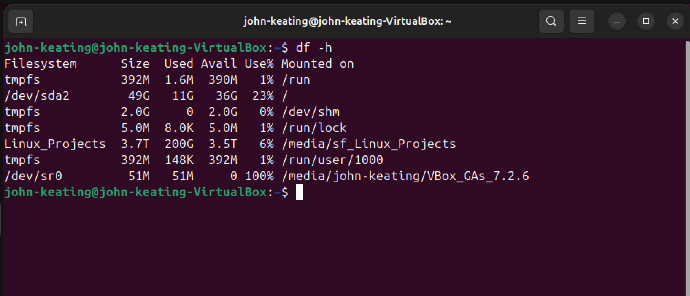
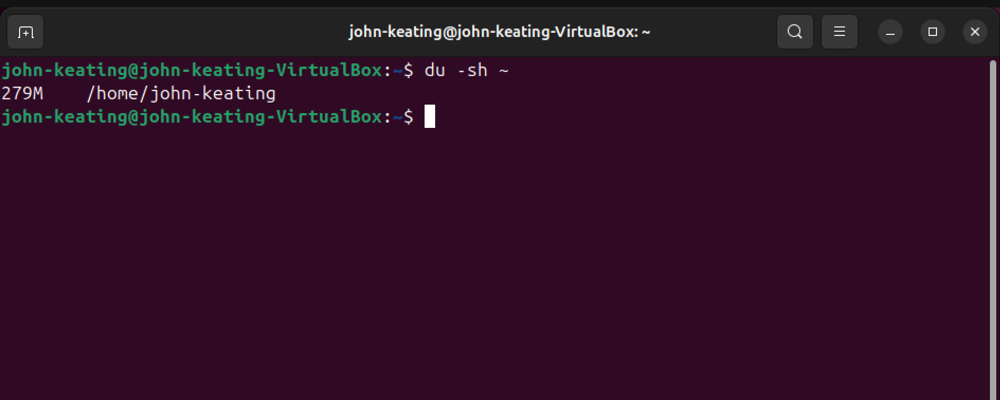
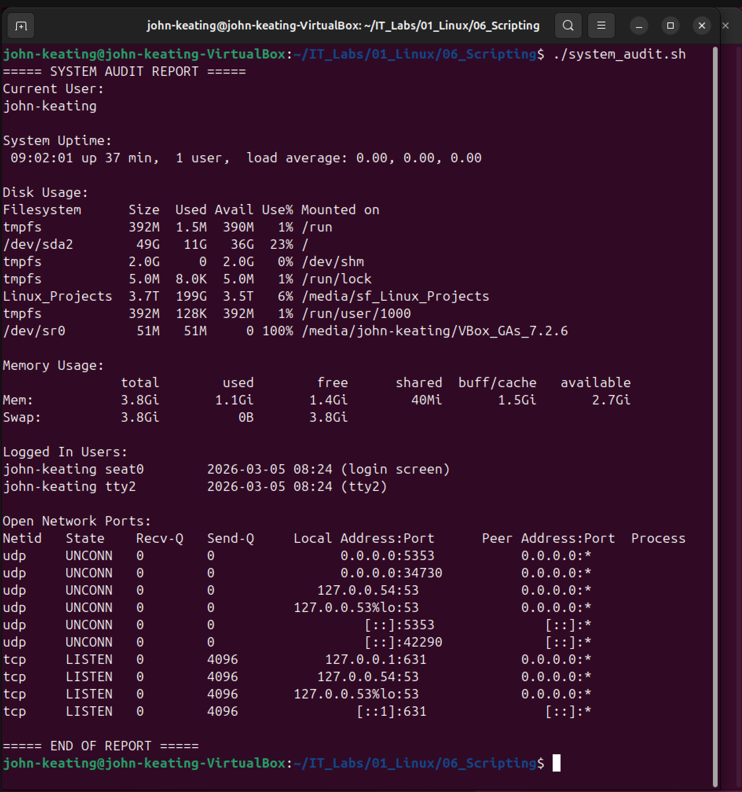
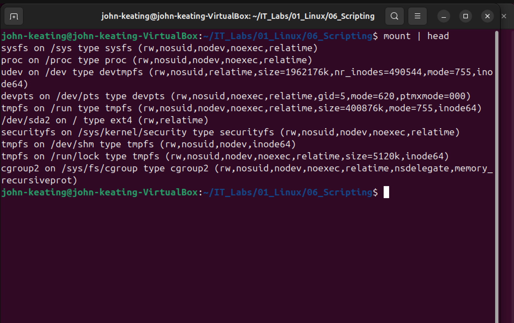

# Linux Fundamentals — Disk Monitoring

## Objective
Demonstrate how Linux administrators monitor disk usage, directory sizes, block devices, and mounted filesystems using built-in command line tools.

---

## Environment

Ubuntu Linux (VirtualBox VM)  
Bash Terminal  
Windows Host Machine  
Git Bash  
GitHub Lab Repository

---

## Commands Used

df -h — Displays filesystem disk usage in human readable format

du -sh ~ — Displays the size of the home directory

lsblk — Lists block devices (disks and partitions)

mount | head — Displays mounted filesystems

---

## What Was Tested

Disk Space Monitoring  
Used df -h to check disk space usage across filesystems.

Directory Size Monitoring  
Used du -sh ~ to check how much space the home directory is using.

Block Device Inspection  
Used lsblk to view the system's disk layout and partitions.

Mounted Filesystem Inspection  
Used mount | head to see the active mounted filesystems.

---

## Key Takeaways

df -h helps administrators quickly see disk space usage.

du -sh helps measure folder sizes.

lsblk shows the structure of disks and partitions.

mount shows which filesystems are currently mounted.

These commands are essential for diagnosing disk space issues on Linux servers.

---

## Visual Evidence

### Disk Usage

### Home Directory Size

### Block Devices

### Mounted Filesystems

