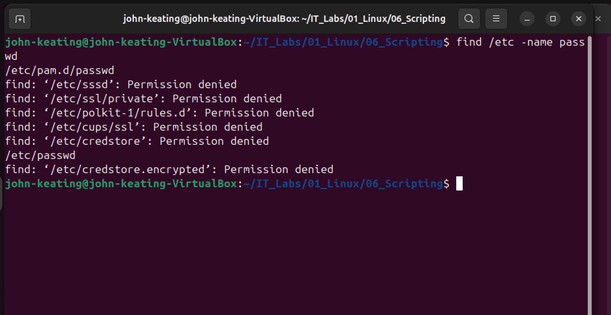
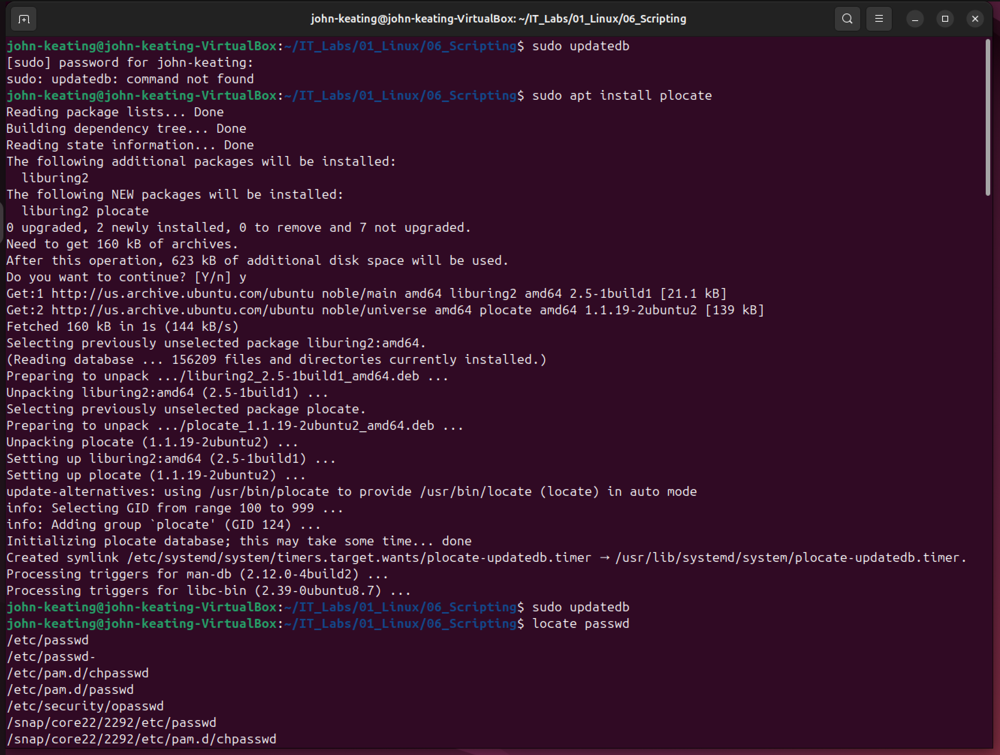
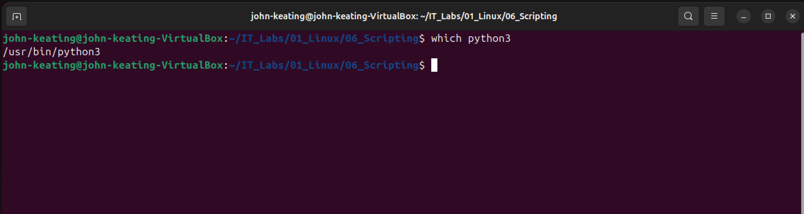
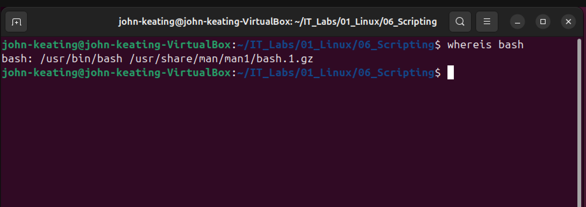

# Linux Fundamentals — File Searching

## Objective

Demonstrate how Linux administrators locate files, commands, and system resources using built-in command line tools.

This lab focuses on identifying where files and executables exist within the Linux filesystem.

---

## Environment

Ubuntu Linux (VirtualBox VM)  
Bash Terminal  
Windows Host Machine  
Git Bash  
GitHub Lab Repository  

---

## Commands Used

find /etc -name passwd  
Searches the /etc directory for files named "passwd".

locate passwd  
Quickly searches the system database for files named "passwd".

which python3  
Displays the location of the python3 executable.

whereis bash  
Shows the binary, source, and manual page locations for bash.

---

## What Was Tested

### File Search with find

Used the find command to search for the passwd file within the /etc directory.

### Database Search with locate

Used locate to quickly search the system for files named passwd after updating the locate database.

### Command Location with which

Used which to determine the exact path of the python3 executable.

### Binary Location with whereis

Used whereis to locate the binary and documentation files related to the bash shell.

---

## Key Takeaways

find allows administrators to perform detailed searches within specific directories.

locate provides very fast search results by using a prebuilt file database.

which helps identify the path of executables used in the terminal.

whereis displays binary and documentation locations for system commands.

These commands are essential for troubleshooting and navigating Linux systems.

---

## Visual Evidence

### Find Command

### Locate Command

### Which Command

### Whereis Command
