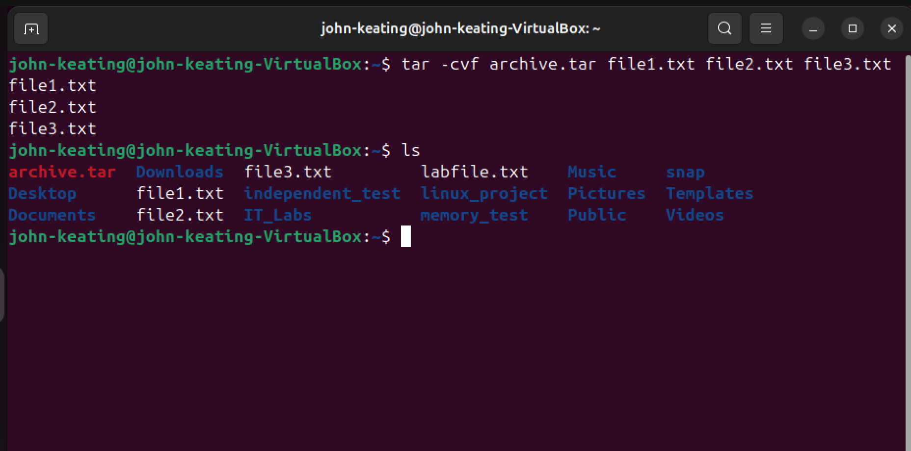
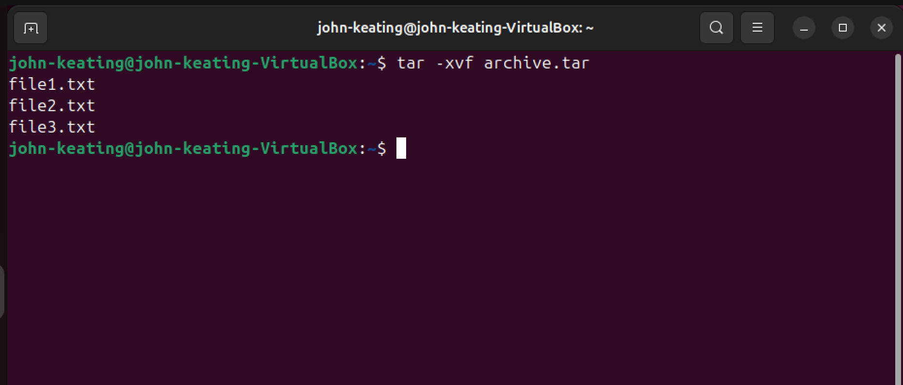
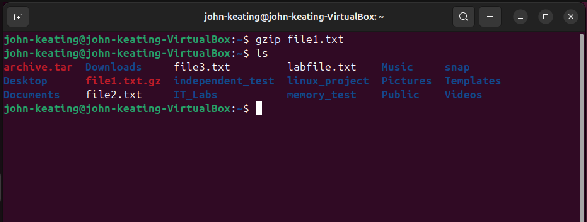
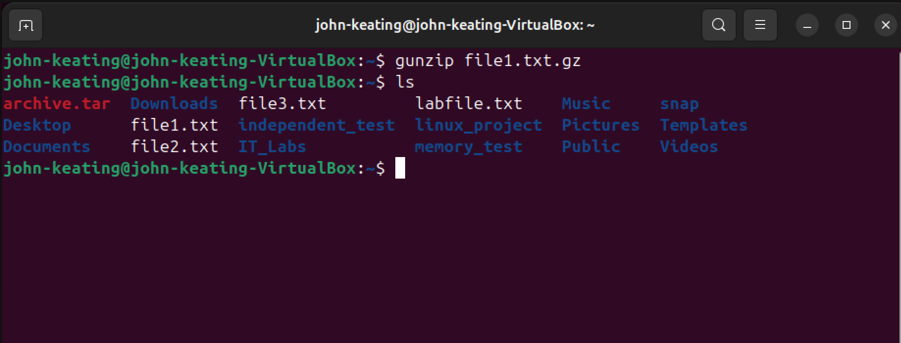
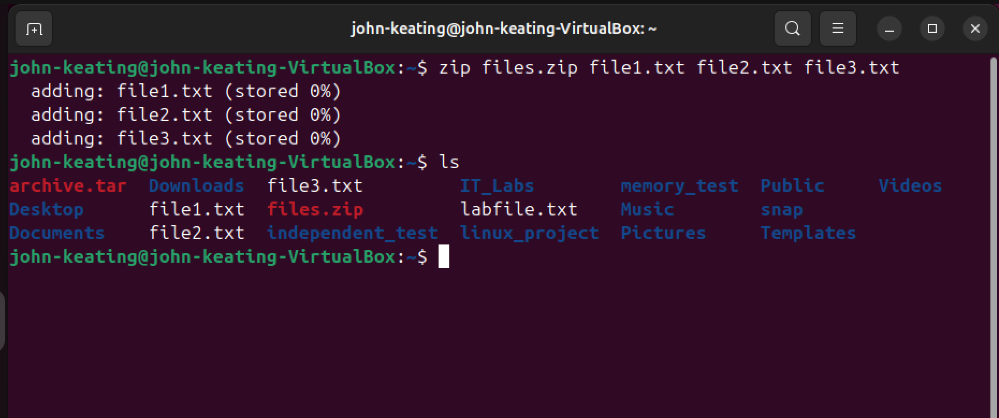
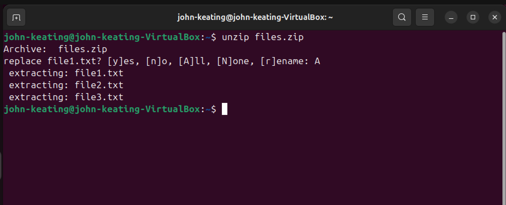

# Linux Fundamentals — Compression & Archives

## Objective

The purpose of this lab is to demonstrate how Linux administrators compress, archive, and extract files using built-in command line utilities.

Compression and archiving are commonly used in system administration for backups, log storage, file transfers, and software packaging.

---

## Environment

Ubuntu Linux (VirtualBox VM)

Bash Terminal

Windows Host Machine

Git Bash

GitHub Lab Repository

---

## Commands Used

tar -cvf archive.tar file1.txt file2.txt file3.txt  
Creates a TAR archive containing multiple files.

tar -xvf archive.tar  
Extracts files from a TAR archive.

gzip file1.txt  
Compresses a file using the gzip algorithm.

gunzip file1.txt.gz  
Decompresses a gzip compressed file.

zip files.zip file1.txt file2.txt file3.txt  
Creates a ZIP archive containing multiple files.

unzip files.zip  
Extracts files from a ZIP archive.

---

## What Was Tested

### Creating a TAR Archive

Used the `tar` command to package multiple files into a single archive file.

### Extracting a TAR Archive

Used the `tar` command with extraction flags to restore files from the archive.

### File Compression with gzip

Compressed a file using the `gzip` utility to reduce file size.

### Decompression with gunzip

Used `gunzip` to restore a compressed file to its original state.

### Creating a ZIP Archive

Used the `zip` command to bundle multiple files into a compressed archive.

### Extracting ZIP Archives

Used `unzip` to extract files from a zip archive.

---

## Key Takeaways

`tar` is commonly used on Linux systems to archive multiple files into a single package.

`gzip` compresses files to reduce storage space and speed up transfers.

`gunzip` restores compressed files back to their original format.

`zip` and `unzip` provide cross-platform compression compatible with Windows and Linux systems.

These tools are essential for backups, log rotation, data transfers, and system administration tasks.

---

## Visual Evidence

### TAR Archive Creation

### TAR Extraction

### Gzip Compression

### Gzip Extraction

### ZIP Archive Creation

### ZIP Extraction

