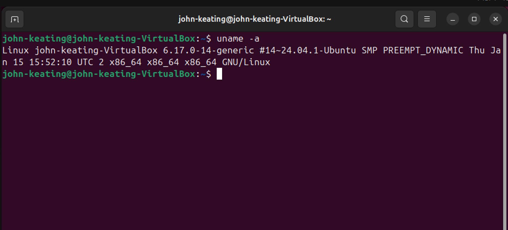
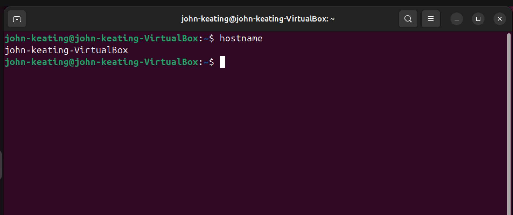
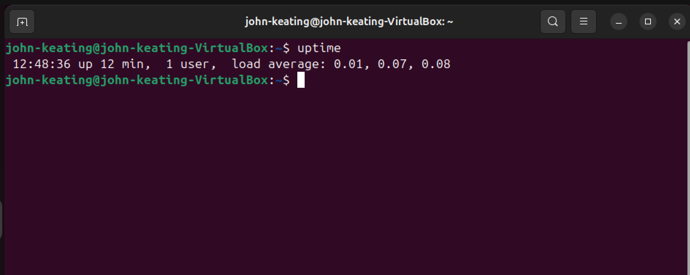
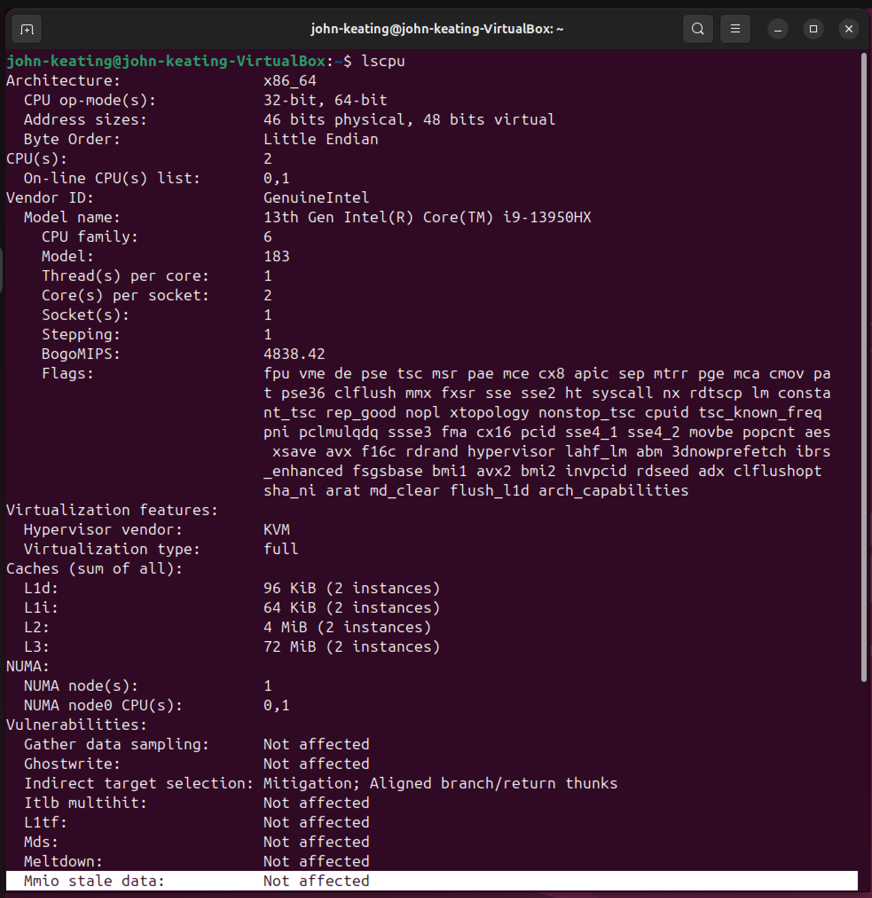
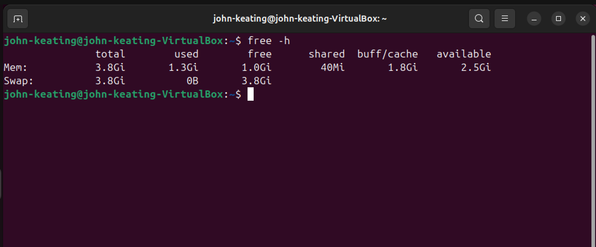
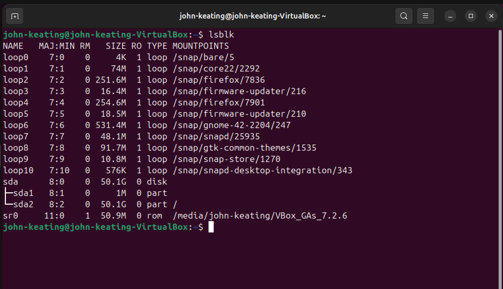
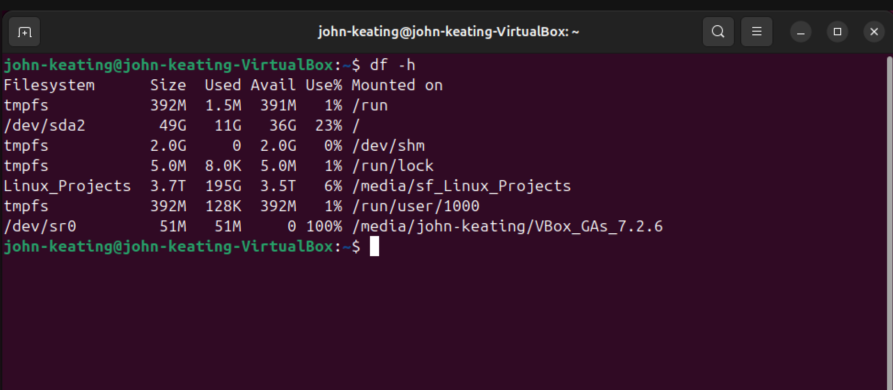
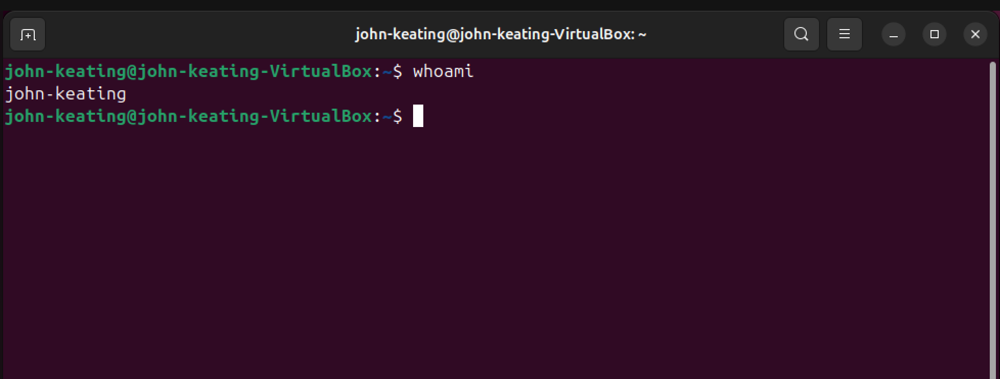

# Linux Fundamentals — System Information

## Objective

The purpose of this lab is to demonstrate how Linux administrators gather system information using built-in command line tools.

These commands help engineers quickly inspect important system details such as:

* Operating system and kernel version
* Hostname
* System uptime and load averages
* CPU architecture and processor information
* Memory usage
* Disk devices and partitions
* Disk space usage
* Current logged-in user

System information commands are commonly used during system troubleshooting, server audits, and infrastructure monitoring.

---

## Environment

* Ubuntu Linux (VirtualBox VM)
* Bash Terminal
* Windows Host Machine
* Git Bash
* GitHub Lab Repository

---

## Commands Used

`uname -a`
Displays detailed system and kernel information.

`hostname`
Shows the system hostname.

`uptime`
Displays system uptime and load averages.

`lscpu`
Displays detailed CPU architecture information.

`free -h`
Shows memory usage in a human-readable format.

`lsblk`
Lists block devices and disk partitions.

`df -h`
Displays disk usage and mounted filesystems.

`whoami`
Displays the current logged-in user.

---

## What Was Tested

### System Identification

Used `uname -a` to identify the Linux kernel version and system architecture.

### Hostname Verification

Used `hostname` to confirm the machine's network hostname.

### System Uptime

Used `uptime` to view how long the system has been running and examine system load averages.

### CPU Information

Used `lscpu` to gather detailed processor information including architecture, cores, and CPU features.

### Memory Usage

Used `free -h` to inspect total, used, and available system memory.

### Disk Devices

Used `lsblk` to view storage devices and partition layout.

### Disk Usage

Used `df -h` to examine filesystem disk space usage.

### Current User

Used `whoami` to confirm the active logged-in user.

---

## Key Takeaways

* Linux provides powerful built-in tools for inspecting system information.
* Administrators frequently use these commands when diagnosing server issues.
* `lscpu`, `free`, and `df` are commonly used during system performance investigations.
* Understanding system information commands is essential for Linux, Cloud, DevOps, and Security roles.

---

# Visual Evidence

## System Information

### Kernel and System Information

### Hostname

### System Uptime

### CPU Information

### Memory Usage

### Disk Devices

### Disk Usage

### Current User

