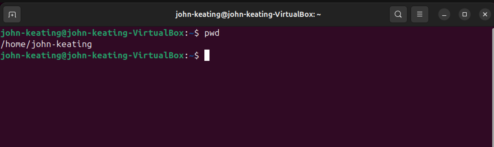
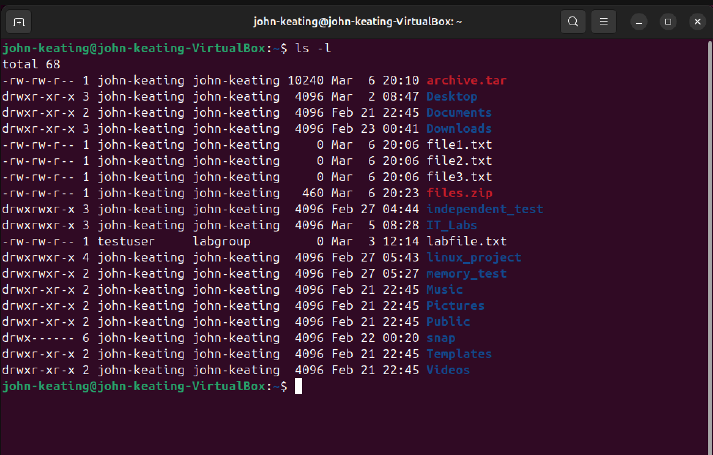
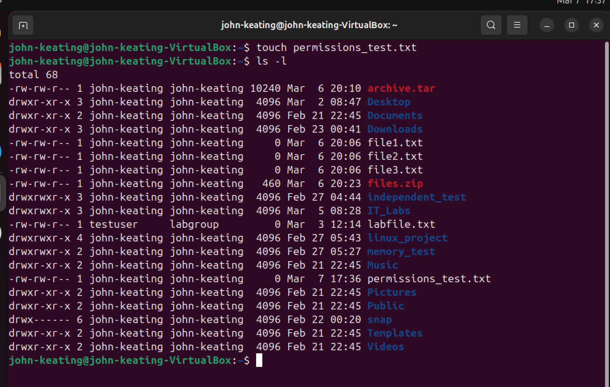
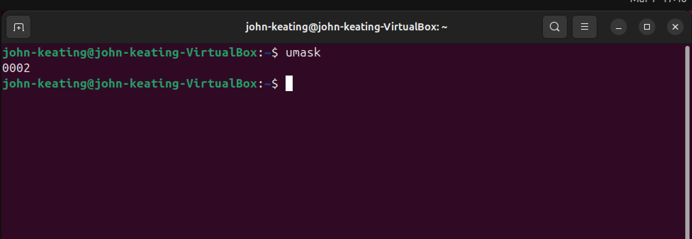
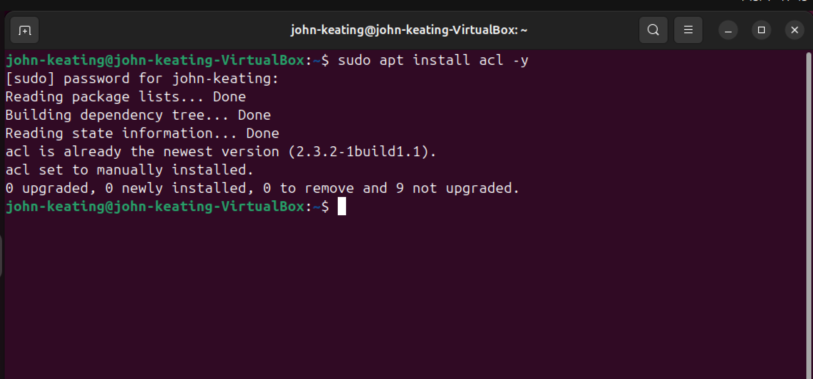
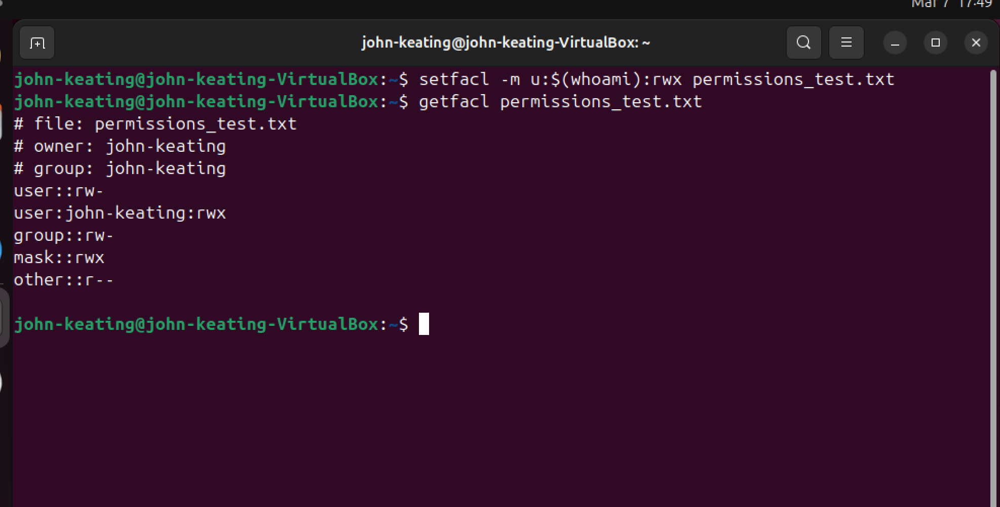

# Linux Fundamentals — Permissions Deep Dive

## Objective

The purpose of this lab is to explore advanced Linux file permission concepts and understand how administrators manage access control beyond basic `chmod` permissions.

In this lab we examined:

* Default file permissions
* The `umask` value
* Installing ACL utilities
* Applying advanced permissions using `setfacl`
* Viewing ACL configurations using `getfacl`

These tools allow administrators to control file access with greater flexibility in multi-user environments.

---

## Environment

* Ubuntu Linux (VirtualBox VM)
* Bash Terminal
* Windows Host Machine
* Git Bash
* GitHub Lab Repository

---

## Commands Used

| Command                | Description                              |
| ---------------------- | ---------------------------------------- |
| `ls -l`                | Displays file permissions in long format |
| `touch`                | Creates an empty file                    |
| `umask`                | Displays default permission mask         |
| `sudo apt install acl` | Installs ACL utilities                   |
| `setfacl`              | Modifies advanced file permissions       |
| `getfacl`              | Displays ACL permission entries          |

---

## What Was Tested

### Viewing File Permissions

Used `ls -l` to examine Linux permission bits including owner, group, and others.

### Default File Creation Permissions

Created a test file using:

```
touch permissions_test.txt
```

and verified default permissions applied by the system.

### Understanding Umask

The command:

```
umask
```

revealed the system's default permission mask which controls the permissions assigned to new files and directories.

### Installing ACL Utilities

Installed ACL support using:

```
sudo apt install acl
```

This enables advanced permission management on Linux systems.

### Applying ACL Permissions

Used the command:

```
setfacl -m u:$(whoami):rwx permissions_test.txt
```

to grant full access permissions to a specific user.

### Viewing ACL Configuration

Verified the applied permissions using:

```
getfacl permissions_test.txt
```

This displayed detailed ACL entries for the file.

---

## Real World Usage

Linux administrators often need more granular permission control than traditional user/group/other permissions provide.

Access Control Lists (ACLs) allow administrators to assign permissions to multiple users or groups on a single file without changing ownership.

ACLs are commonly used in:

* Enterprise Linux environments
* Shared file servers
* DevOps infrastructure
* Multi-user development systems

---

## Key Takeaways

* Linux file permissions control access using owner, group, and others.
* `umask` determines default permission values for new files.
* ACL tools provide advanced permission control.
* `setfacl` and `getfacl` allow administrators to manage complex access rules.
* Understanding Linux permissions is essential for system administration, security, and DevOps environments.

---

## Visual Evidence

### Lab Start



### Viewing Permissions



### Default File Permissions



### Umask Value



### Installing ACL Tools



### ACL Permissions Applied


