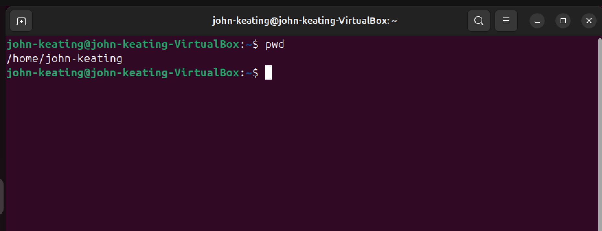
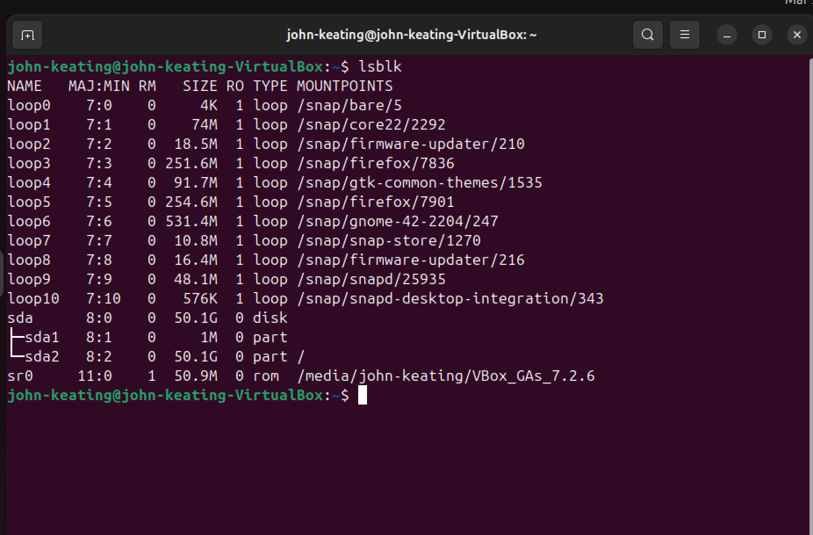
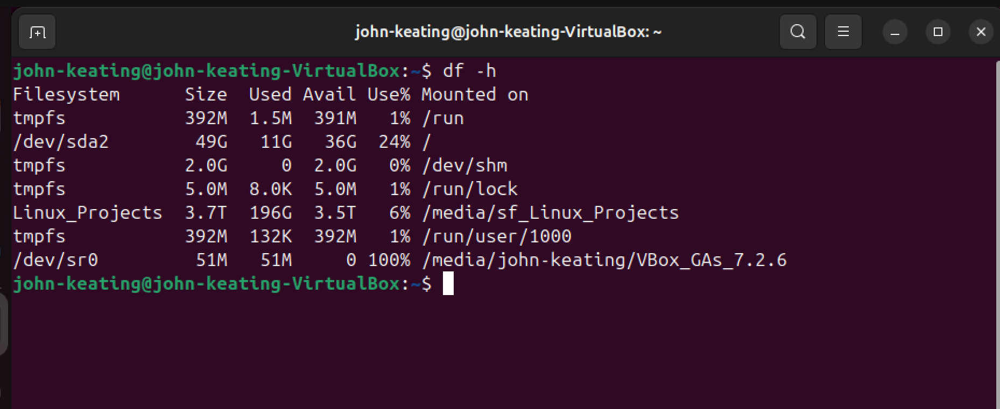
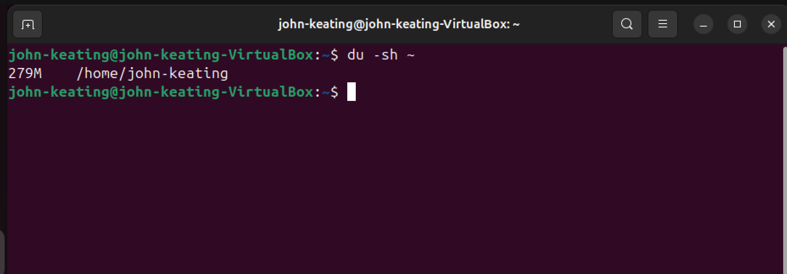
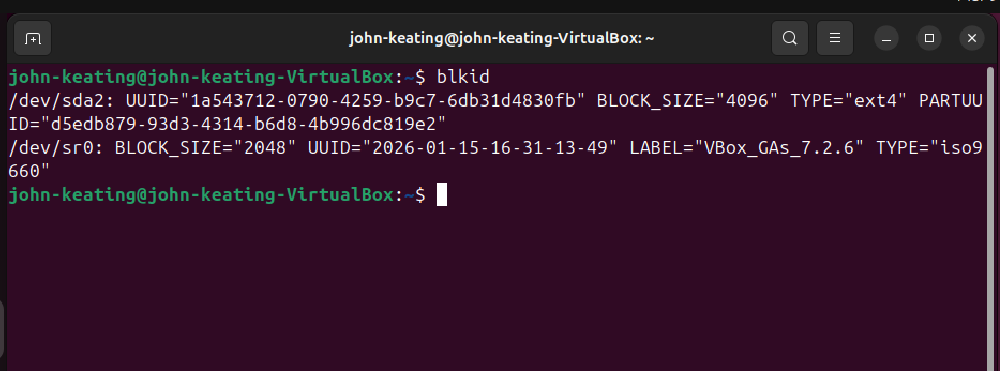

# Linux Fundamentals — Disk Management

## Objective

The purpose of this lab is to learn how Linux administrators inspect storage devices, analyze disk usage, and identify filesystems using common command-line tools.

In this lab we examined:

* Block storage devices
* Mounted filesystems
* Disk usage statistics
* Directory storage consumption
* Filesystem identification

These commands are frequently used in **System Administration, DevOps, Cloud Engineering, and Cybersecurity** when diagnosing storage issues or verifying system configuration.

---

# Environment

* Ubuntu Linux (VirtualBox Virtual Machine)
* Bash Terminal
* Windows Host Machine
* Git Bash
* GitHub Lab Repository

---

# Commands Used

| Command  | Description                                              |
| -------- | -------------------------------------------------------- |
| `lsblk`  | Lists block storage devices such as disks and partitions |
| `df -h`  | Displays filesystem disk usage in human-readable format  |
| `du -sh` | Displays the total disk usage of a directory             |
| `blkid`  | Displays filesystem type and unique disk identifiers     |

---

# Command Breakdown

## lsblk

Command used:

```
lsblk
```

### Command Meaning

| Part  | Meaning                                                     |
| ----- | ----------------------------------------------------------- |
| `ls`  | List                                                        |
| `blk` | Block devices (storage devices such as disks or partitions) |

### What This Command Does

`lsblk` lists all storage devices connected to the system.

It displays information including:

* Disk devices
* Partitions
* Mount points
* Device sizes

System administrators use this command to quickly understand the **structure of disks and partitions** on a Linux system.

---

# Viewing Filesystem Disk Usage

Command used:

```
df -h
```

### Command Meaning

| Part | Meaning   |
| ---- | --------- |
| `df` | Disk Free |

The `df` command shows how much disk space is **used and available** on mounted filesystems.

---

### Flag Breakdown

| Flag | Meaning               |
| ---- | --------------------- |
| `-h` | Human-readable format |

The `-h` flag converts storage sizes into easy-to-read units such as:

* KB
* MB
* GB
* TB

Without this flag, disk sizes are displayed in raw bytes, which can be difficult to interpret.

Example human-readable output:

```
11G used
36G available
```

---

# Checking Directory Disk Usage

Command used:

```
du -sh ~
```

### Command Meaning

| Part | Meaning    |
| ---- | ---------- |
| `du` | Disk Usage |

The `du` command calculates how much storage space a directory consumes.

---

### Flag Breakdown

| Flag | Meaning               |
| ---- | --------------------- |
| `-s` | Summary               |
| `-h` | Human-readable format |

`-s` ensures that the command displays only the **total size of the directory**, rather than listing every file individually.

`-h` displays the result in readable units such as MB or GB.

---

### Symbol Breakdown

| Symbol | Name  | Meaning                                      |
| ------ | ----- | -------------------------------------------- |
| `~`    | Tilde | Represents the current user's home directory |

In Linux, the **tilde (`~`)** is a shortcut that refers to the user's home directory.

Example:

```
/home/john-keating
```

Therefore, the command:

```
du -sh ~
```

means:

> Calculate the total disk space used by the user's home directory.

This shortcut is widely used in Linux to simplify navigation and command execution.

---

# Viewing Filesystem Information

Command used:

```
blkid
```

### Command Meaning

| Part  | Meaning      |
| ----- | ------------ |
| `blk` | Block device |
| `id`  | Identifier   |

The `blkid` command identifies storage devices and displays important filesystem metadata.

It provides information such as:

* Filesystem type (ext4, vfat, iso9660, etc.)
* Disk UUID
* Partition identifiers
* Filesystem labels

---

### What is a UUID?

UUID stands for:

```
Universally Unique Identifier
```

A UUID is a unique identifier assigned to each filesystem.

Linux uses UUIDs to reliably identify disks when:

* Mounting storage devices
* Configuring `/etc/fstab`
* Managing disk partitions

UUIDs are preferred because device names such as `/dev/sda` can sometimes change after a system reboot.

---

# What Was Tested

This lab demonstrated several common methods used by Linux administrators to inspect and monitor disk systems.

The following tasks were performed.

---

### Viewing Block Storage Devices

```
lsblk
```

Displayed the disk and partition layout of the system.

---

### Viewing Filesystem Disk Usage

```
df -h
```

Displayed available disk space on mounted filesystems.

---

### Checking Home Directory Disk Usage

```
du -sh ~
```

Calculated the total disk space used by the user's home directory.

---

### Viewing Filesystem Identifiers

```
blkid
```

Displayed filesystem types and unique identifiers for storage devices.

---

# Key Takeaways

* Linux disks and partitions are represented as **block devices**.
* `lsblk` allows administrators to view disk structures and mount points.
* `df` is used to monitor available disk space across filesystems.
* `du` helps identify directories consuming significant storage.
* `blkid` displays filesystem identifiers and metadata.
* The **tilde (`~`)** is a shortcut representing the user's home directory.
* Command flags such as `-h` and `-s` modify how commands display information.

Understanding these commands is essential for:

* Linux System Administration
* DevOps engineering
* Cloud infrastructure management
* Server troubleshooting

---

# Visual Evidence

### Lab Start



### Block Devices



### Disk Usage



### Home Folder Size



### Filesystem Information



# Linux Command Reference

This section summarizes the Linux commands used in this lab along with their purpose and syntax. Maintaining a command reference helps reinforce understanding and provides a quick lookup for commonly used administrative tools.

---

## lsblk

**Purpose**

Lists block storage devices attached to the system.

Block devices include:

* Hard drives
* Solid state drives (SSD)
* Disk partitions
* Virtual disks

**Command**

```
lsblk
```

**Example Output Shows**

* Device name
* Disk size
* Partition layout
* Mount points

**Common Use Case**

System administrators use `lsblk` to understand how disks and partitions are organized on a Linux machine.

---

## df

**Purpose**

Displays the amount of disk space used and available on mounted filesystems.

**Command**

```
df -h
```

### Flag Breakdown

| Flag | Meaning               |
| ---- | --------------------- |
| `-h` | Human-readable format |

Human-readable format converts disk sizes into units such as:

* KB
* MB
* GB
* TB

**Common Use Case**

Administrators run `df -h` when checking whether a system is running out of disk space.

---

## du

**Purpose**

Calculates the disk usage of files and directories.

**Command**

```
du -sh ~
```

### Flag Breakdown

| Flag | Meaning                          |
| ---- | -------------------------------- |
| `-s` | Summary output (total size only) |
| `-h` | Human-readable format            |

### Symbol Breakdown

| Symbol | Name  | Meaning                                      |
| ------ | ----- | -------------------------------------------- |
| `~`    | Tilde | Represents the current user's home directory |

**Common Use Case**

The `du` command helps identify which directories are consuming the most storage.

Example:

```
du -sh /var/log
```

This calculates how much disk space the log directory uses.

---

## blkid

**Purpose**

Displays filesystem information for storage devices.

**Command**

```
blkid
```

**Information Displayed**

* Filesystem type
* UUID (Universally Unique Identifier)
* Partition labels
* Block size

### Why UUIDs Are Important

Linux uses UUIDs to uniquely identify storage devices when mounting filesystems. This prevents problems if device names change between system boots.

Example:

```
/dev/sda2: UUID="1a543712-0790-4259-b9c7-6db31d4830fb" TYPE="ext4"
```

---

# Why This Matters

Understanding disk management commands is essential for many technical roles including:

* Linux System Administrator
* DevOps Engineer
* Cloud Engineer
* Infrastructure Engineer
* Cybersecurity Analyst

Disk monitoring is a fundamental part of maintaining reliable systems and preventing storage failures.
