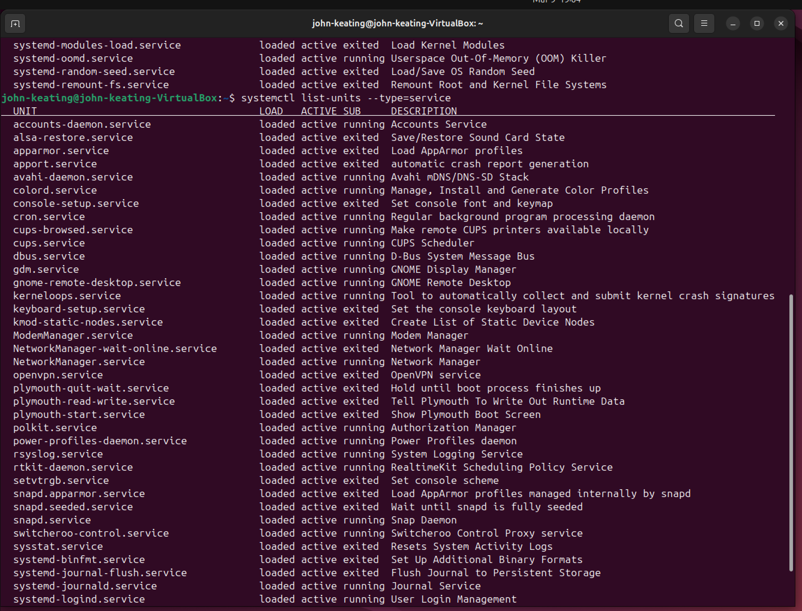
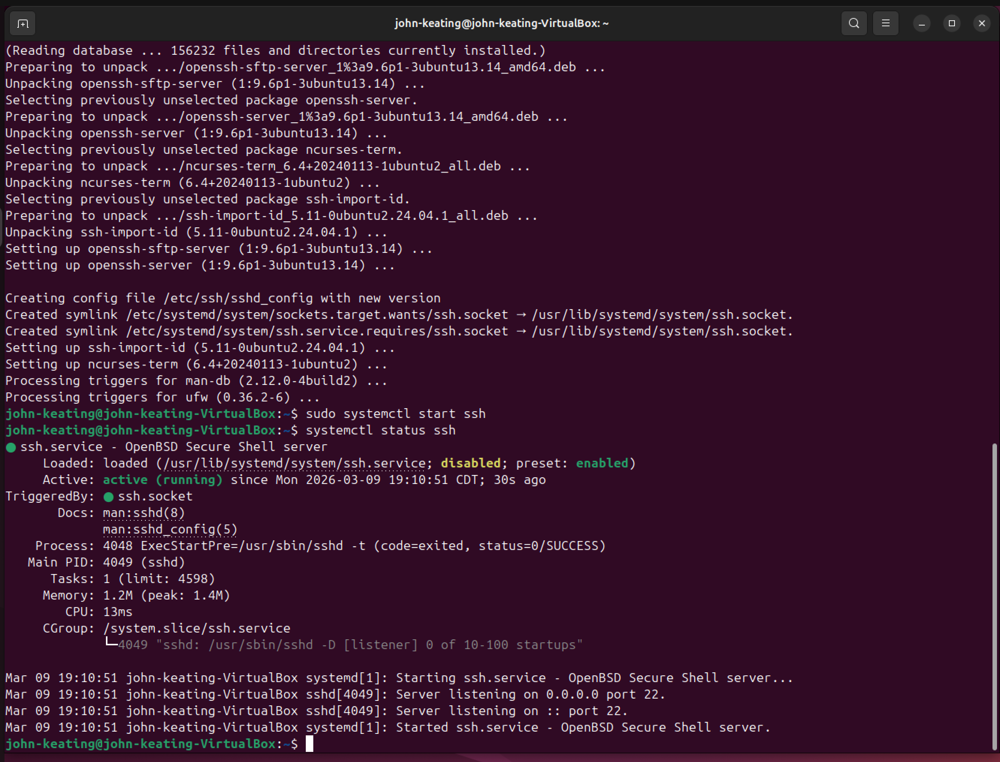
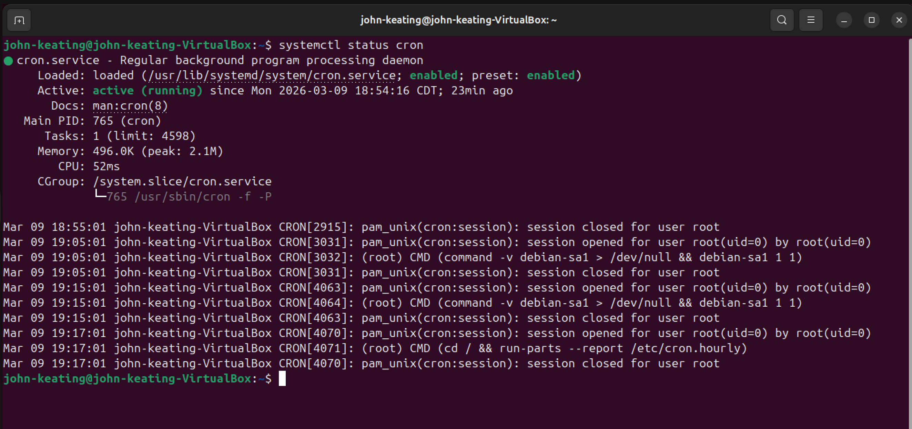
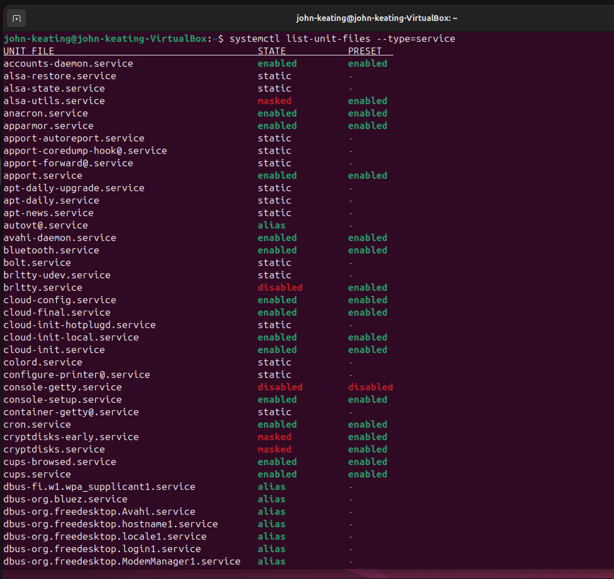
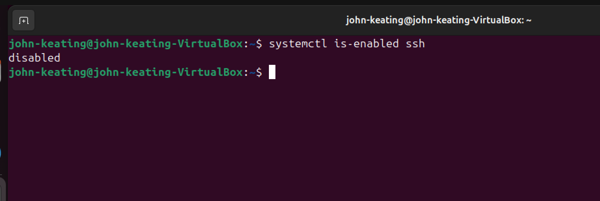
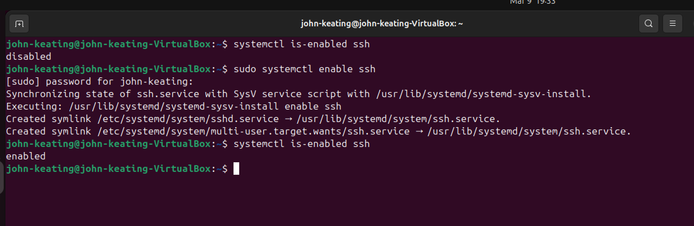

# Linux Lab 15 — Systemd Service Management

## Objective

The purpose of this lab was to learn how Linux administrators manage system services using **systemd** and the **systemctl** command.

In this lab I practiced:

- Listing running services
- Checking the status of a service
- Viewing installed service unit files
- Checking if services start automatically at boot
- Enabling a service to start automatically

These tasks are common responsibilities for **Linux administrators, DevOps engineers, and cloud engineers**.

---

## Environment

- Ubuntu Linux (Virtual Machine)
- Oracle VirtualBox
- Bash Terminal
- Windows Host Machine
- GitHub Lab Repository

---

## Commands Used

| Command | Description |
|-------|-------------|
| systemctl list-units --type=service | Lists currently running services |
| systemctl status ssh | Displays the status of the SSH service |
| systemctl status cron | Displays the status of the cron service |
| systemctl list-unit-files --type=service | Lists installed service unit files |
| systemctl is-enabled ssh | Checks if SSH starts automatically at boot |
| sudo systemctl enable ssh | Enables SSH to start automatically at system boot |

---

## Command Breakdown Example

### Enabling a Service

Command used:

```
sudo systemctl enable ssh
```

Explanation:

| Part | Meaning |
|-----|--------|
| sudo | Runs the command with administrator privileges |
| systemctl | Command used to control systemd services |
| enable | Configures the service to start automatically at boot |
| ssh | The Secure Shell service |

After enabling the service, it was verified with:

```
systemctl is-enabled ssh
```

---

## Visual Evidence

### Running Services


### SSH Service Status


### Cron Service Status


### Installed Service Unit Files


### Service Enabled Check


### SSH Enabled at Boot


---

## Key Concepts Learned

- **systemd** is the service manager used by most modern Linux distributions.
- Services are managed using the **systemctl** command.
- Services can be started, stopped, restarted, or enabled to start at boot.
- Checking service status is an important troubleshooting skill.
- Verifying service startup behavior ensures critical services run automatically.

---

## What I Learned

In this lab I learned how Linux manages system services through **systemd**.  
I practiced using `systemctl` to inspect services, verify their status, and configure them to start automatically during system boot.

Understanding service management is an essential skill for **system administration, cloud infrastructure management, and DevOps engineering**.