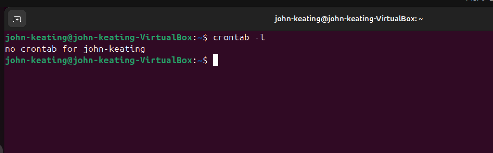
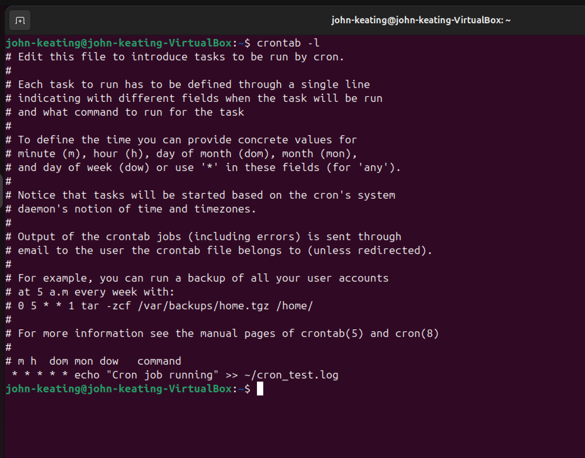
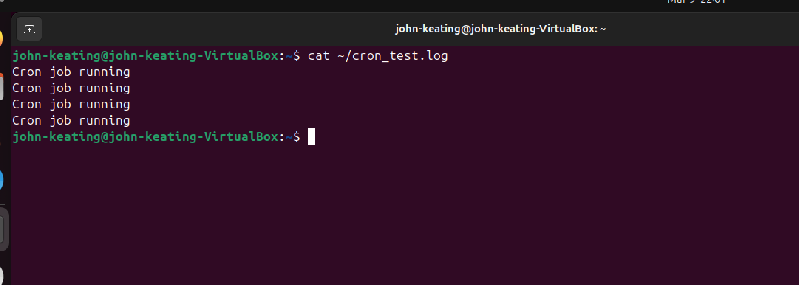
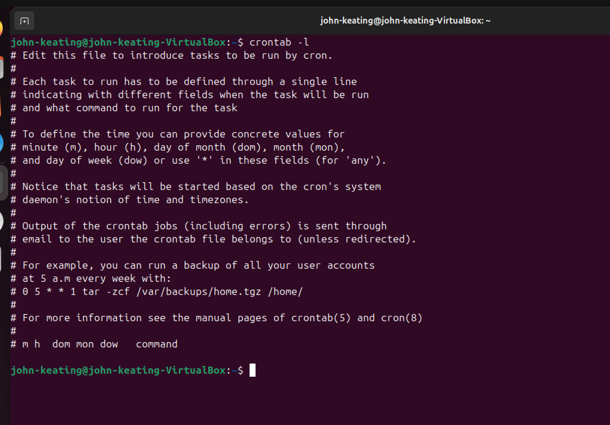

# Linux Cron Jobs and Automation Lab

## Objective

The purpose of this lab is to demonstrate how Linux administrators automate tasks using the **cron scheduling system**.

Cron allows system administrators, DevOps engineers, and cloud engineers to schedule commands or scripts to run automatically at specific times or intervals.

In this lab, a cron job was created to automatically write a message to a log file every minute.

---

## Environment

- Ubuntu Linux (Virtual Machine)
- Oracle VirtualBox
- Bash Terminal
- Windows Host Machine
- GitHub Lab Repository

---

## Commands Used

| Command | Description |
|------|-------------|
| `crontab -l` | Lists the current user's scheduled cron jobs |
| `crontab -e` | Opens the cron table editor to create or modify scheduled tasks |
| `echo` | Prints text output to the terminal |
| `>>` | Appends output to the end of a file |
| `cat` | Displays the contents of a file |

---

## Cron Job Breakdown

The cron job used in this lab:

```
* * * * * echo "Cron job running" >> ~/cron_test.log
```

Cron jobs consist of **five time fields followed by a command**.

| Field | Meaning |
|------|---------|
| `*` | Every minute |
| `*` | Every hour |
| `*` | Every day of the month |
| `*` | Every month |
| `*` | Every day of the week |

Because all fields use `*`, the job runs **every minute**.

---

## Special Symbols Explained

| Symbol | Meaning |
|------|---------|
| `*` | Wildcard meaning "every value" |
| `>>` | Appends output to a file without deleting existing content |
| `~` | Represents the user's home directory |

Example:

```
~/cron_test.log
```

means the file is located in:

```
/home/username/cron_test.log
```

---

## Steps Performed

1. Checked if any cron jobs already existed.
2. Created a new cron job using the crontab editor.
3. Scheduled the job to run every minute.
4. Verified the cron job executed successfully.
5. Confirmed log entries were written to a file.
6. Removed the cron job after testing.

---

## Verification

The cron job was verified by displaying the log file:

```
cat ~/cron_test.log
```

Multiple lines confirmed that the job executed repeatedly.

---

## Screenshots

### Checking Existing Cron Jobs



### Creating Cron Job



### Cron Job Log Output



### Cron Job Removed



---

## Key Takeaways

- Cron is used to automate system tasks.
- Scheduled jobs are stored in the **crontab** file.
- Cron is widely used for:
  - backups
  - log rotation
  - system monitoring
  - maintenance scripts
  - cloud infrastructure automation.

Automation using cron is a foundational skill for **Linux administrators, DevOps engineers, and cloud engineers**.