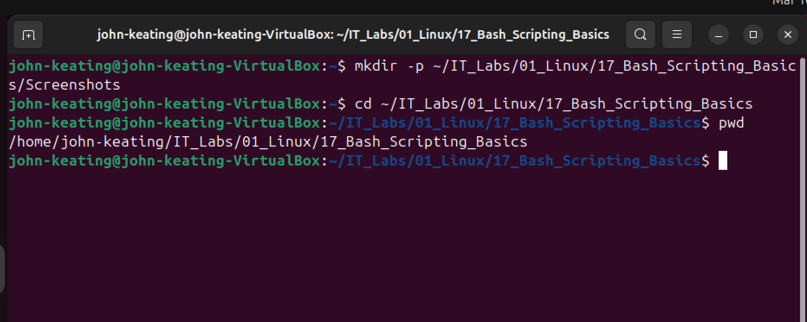
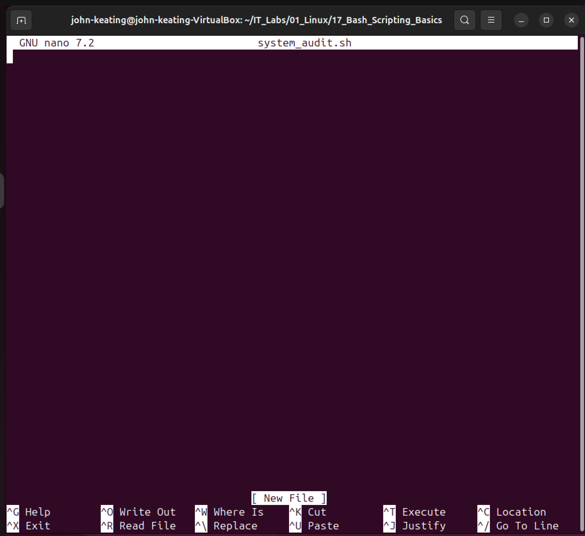
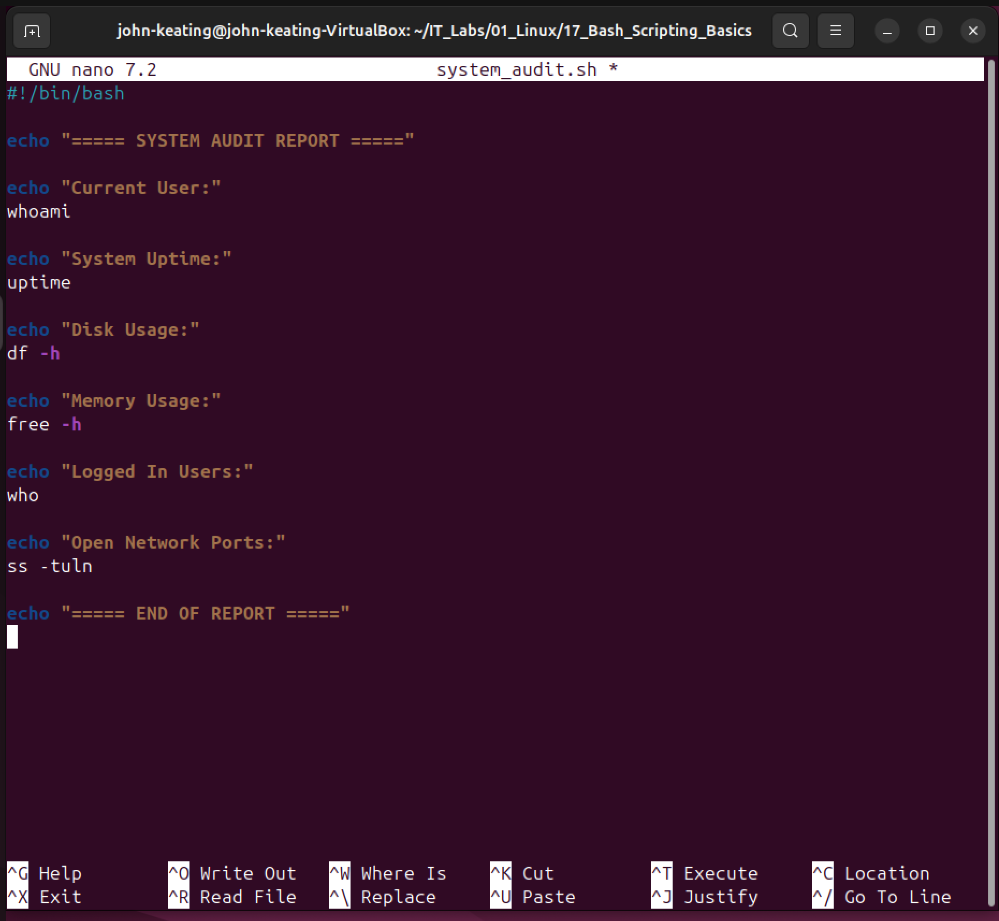
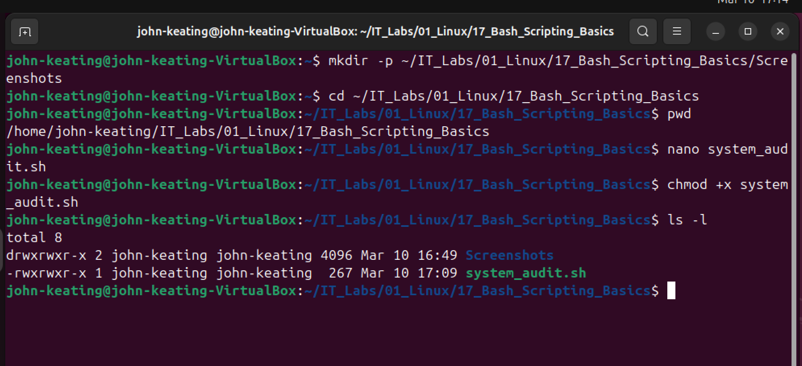
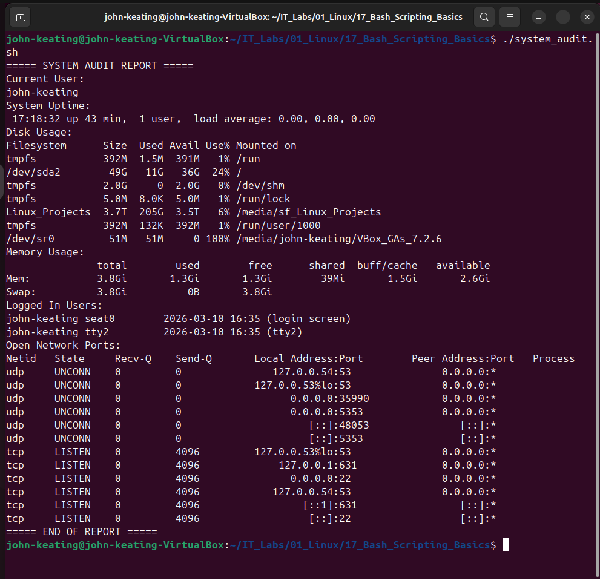

# Bash Scripting Basics Lab

## Objective

The purpose of this lab is to learn the fundamentals of **Bash scripting in Linux**.
Bash scripts allow system administrators, DevOps engineers, and cloud engineers to **automate tasks, collect system information, and perform system audits efficiently**.

In this lab, I created a Bash script that generates a **system audit report** displaying important system information about the machine.

---

## Environment

* Ubuntu Linux (Virtual Machine)
* Oracle VirtualBox
* Bash Terminal
* Nano Text Editor
* Windows Host Machine
* GitHub Lab Repository

---

## Commands Used

| Command    | Description                                            |
| ---------- | ------------------------------------------------------ |
| `nano`     | Command-line text editor used to create and edit files |
| `chmod +x` | Makes a file executable                                |
| `ls -l`    | Lists files with detailed permission information       |
| `whoami`   | Displays the current logged-in user                    |
| `uptime`   | Shows how long the system has been running             |
| `df -h`    | Displays disk usage in human-readable format           |
| `free -h`  | Displays system memory usage                           |
| `who`      | Shows currently logged-in users                        |
| `ss -tuln` | Displays open network ports                            |

---

## Script Created

The Bash script created in this lab generates a **system audit report**.

```
#!/bin/bash

echo "===== SYSTEM AUDIT REPORT ====="

echo "Current User:"
whoami

echo "System Uptime:"
uptime

echo "Disk Usage:"
df -h

echo "Memory Usage:"
free -h

echo "Logged In Users:"
who

echo "Open Network Ports:"
ss -tuln

echo "===== END OF REPORT ====="
```

---

## Script Execution

The script was made executable and then executed from the terminal.

```
chmod +x system_audit.sh
./system_audit.sh
```

---

## Visual Evidence

### Script Directory



### Script Creation



### Script Written



### Script Permissions



### Script Output



---

## Key Concepts Learned

* How Bash scripting automates system tasks
* How to create and edit scripts using Nano
* How to make scripts executable using file permissions
* How to run scripts from the Linux terminal
* How to collect system information using built-in Linux commands

---

## Real-World Relevance

Bash scripting is widely used in:

* Linux System Administration
* DevOps Engineering
* Cloud Engineering
* Cybersecurity Operations
* Infrastructure Automation

Scripts like this are commonly used to **automate system audits, health checks, monitoring tasks, and incident response investigations**.
