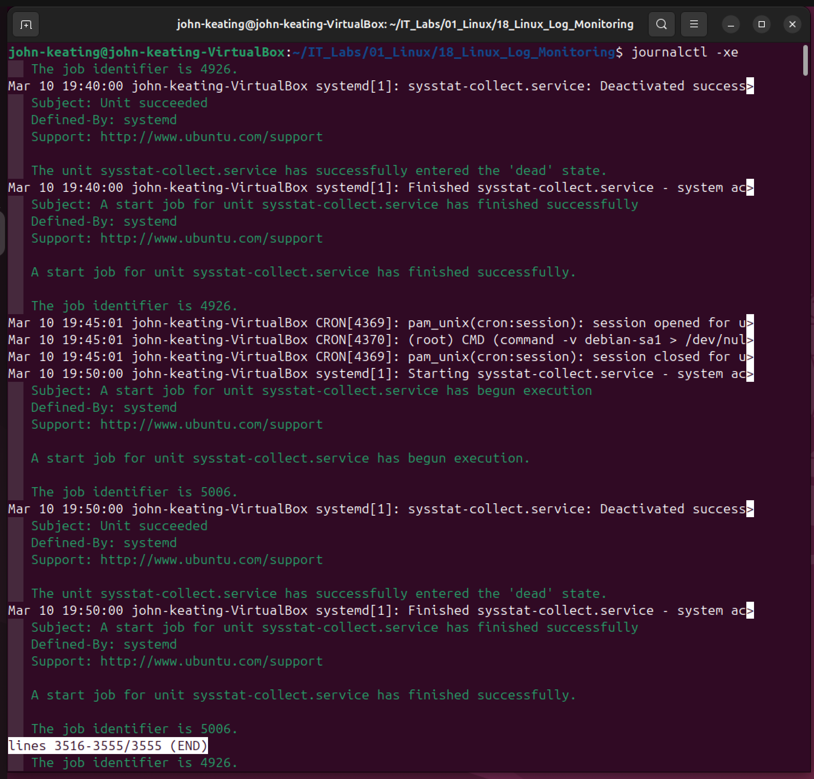
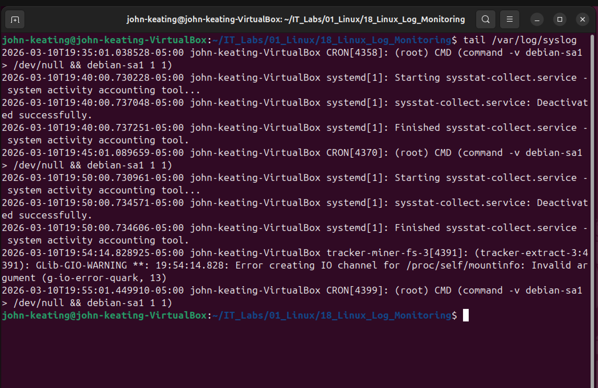
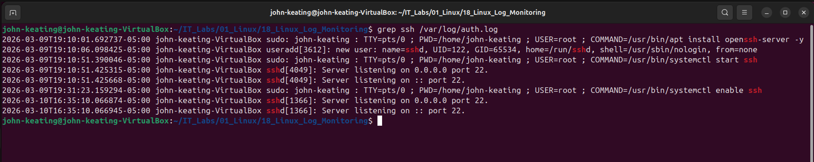
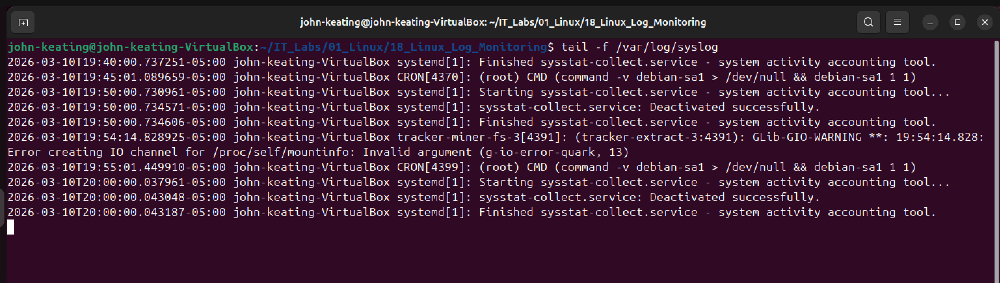

# Linux Log Monitoring Lab

## Objective

The purpose of this lab is to learn how Linux administrators monitor and investigate system logs.

System logs record important operating system activity such as:

- system services starting and stopping
- user logins
- authentication attempts
- scheduled jobs
- system errors

Understanding how to read and monitor logs is an essential skill for Linux administrators, DevOps engineers, cloud engineers, and cybersecurity analysts.

---

## Environment

Ubuntu Linux (Virtual Machine)  
Oracle VirtualBox  
Bash Terminal  
Nano Text Editor  
Windows Host Machine  
GitHub Lab Repository  

---

## Commands Used

| Command | Description |
|-------|-------------|
| `journalctl -xe` | Displays detailed system logs from systemd |
| `tail /var/log/syslog` | Shows the most recent system log entries |
| `grep ssh /var/log/auth.log` | Searches authentication logs for SSH activity |
| `tail -f /var/log/syslog` | Monitors system logs in real time |

---

## Command Breakdown

### journalctl -xe

journalctl is a command used to view logs collected by systemd.

- `-x` shows additional explanations for log entries  
- `-e` jumps to the most recent log entries

This command helps administrators troubleshoot system issues.

---

### tail /var/log/syslog

`tail` displays the last lines of a file.

`/var/log/syslog` is one of the main Linux log files that records:

- system activity
- services
- background processes
- errors

This command allows administrators to quickly see recent system events.

---

### grep ssh /var/log/auth.log

`grep` searches for specific text inside files.

`ssh` is the search keyword.

`/var/log/auth.log` records authentication activity such as:

- login attempts
- SSH access
- sudo commands

This command helps security analysts investigate login activity.

---

### tail -f /var/log/syslog

The `-f` option means **follow**.

This command continuously displays new log entries as they are written to the file.

This allows administrators to monitor system activity in real time.

---

## Visual Evidence

### System Journal Logs

---

### Recent System Logs

---

### SSH Authentication Logs

---

### Real Time Log Monitoring

---

## Key Concepts Learned

- How Linux stores system logs
- How administrators investigate system events
- How to search logs using grep
- How to view authentication activity
- How to monitor logs in real time

---

## Real World Relevance

Log monitoring is used daily by:

- Linux System Administrators
- DevOps Engineers
- Cloud Engineers
- Security Operations Center (SOC) Analysts
- Incident Response Teams

Monitoring logs allows engineers to detect system failures, security threats, and suspicious activity.