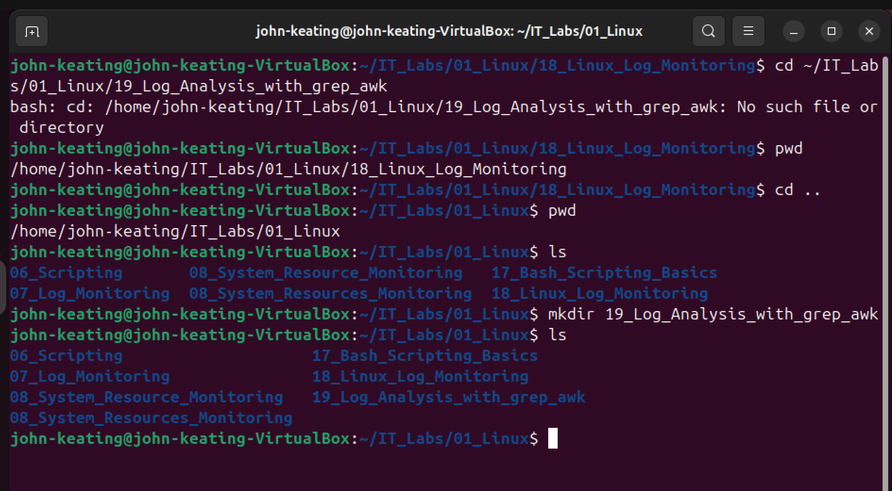
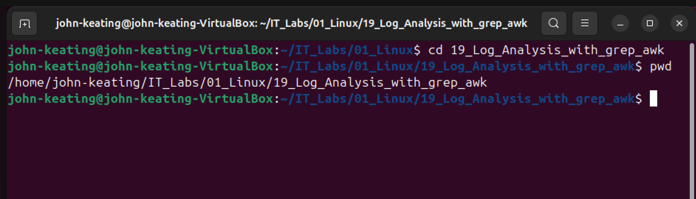
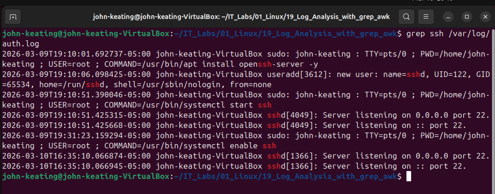
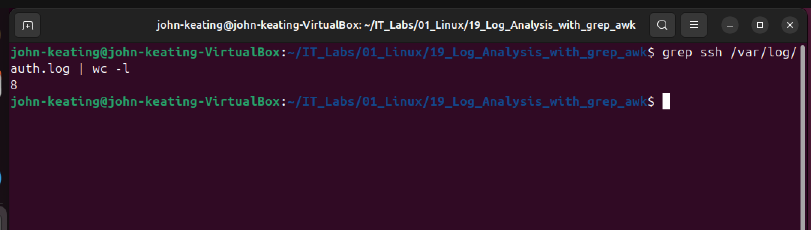
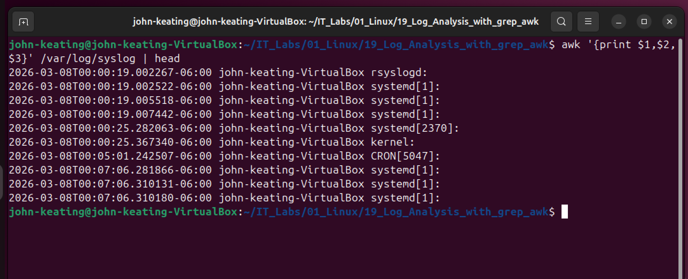
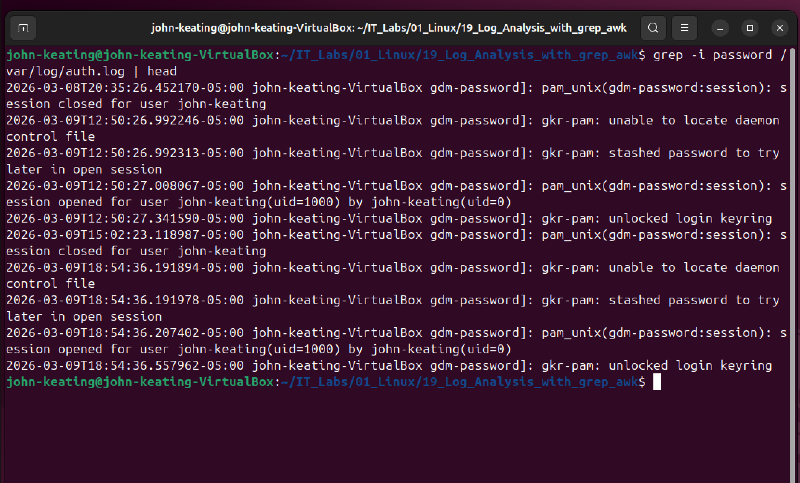

# Linux Log Analysis with grep and awk

## Lab Overview

This lab demonstrates how Linux administrators and security engineers analyze Linux system logs using powerful command-line tools.

Linux systems constantly record system activity inside log files. These logs contain important information about:

- login attempts
- authentication activity
- service operations
- system errors
- background processes

Analyzing logs allows administrators and security engineers to:

- troubleshoot system problems
- monitor system behavior
- detect suspicious activity
- investigate security incidents

Two powerful Linux tools were used in this lab:

- grep — used to search text for specific patterns
- awk — used to extract structured data from log files

These tools are commonly used in:

- Linux System Administration
- DevOps Engineering
- Site Reliability Engineering (SRE)
- Cybersecurity
- Cloud Infrastructure Operations

------------------------------------------------------------

## Lab Environment

Operating System  
Ubuntu Linux (Virtual Machine)

Virtualization Platform  
Oracle VirtualBox

Shell  
Bash Terminal

Log files analyzed in this lab:

/var/log/auth.log  
/var/log/syslog

These files contain authentication activity and system events.

------------------------------------------------------------

# Screenshot Evidence

------------------------------------------------------------

## 1 — Creating the Lab Folder

Command Used:

mkdir 19_Log_Analysis_with_grep_awk

Command Definition

mkdir

Make Directory — creates a new folder in the filesystem.

Command Breakdown

mkdir → create directory command  
19_Log_Analysis_with_grep_awk → name of the new folder

What This Command Does

This command creates a new folder that stores the files used for this lab.

Organizing work into directories is standard practice in Linux system administration and DevOps environments.

------------------------------------------------------------

## 2 — Entering the Lab Directory

Command Used:

cd 19_Log_Analysis_with_grep_awk

Command Definition

cd

Change Directory — moves the terminal into another directory.

Command Breakdown

cd → change directory command  
19_Log_Analysis_with_grep_awk → destination folder

What This Command Does

This command moves the terminal into the lab directory so commands and files can be executed inside the lab folder.

------------------------------------------------------------

## 3 — Searching Authentication Logs for SSH Activity

Command Used:

grep ssh /var/log/auth.log

Command Definition

grep

Global Regular Expression Print — searches text files for lines containing a specific pattern.

Command Breakdown

grep → search command  
ssh → keyword being searched  
/var/log/auth.log → authentication log file

What This Command Does

This command searches the authentication log file for entries related to SSH activity.

Typical SSH log entries include:

- remote login attempts
- successful logins
- failed login attempts
- SSH service events

System administrators use this command to review remote access activity.

------------------------------------------------------------

## 4 — Counting SSH Log Entries

Command Used:
# Linux Log Analysis with grep and awk

## Lab Overview

This lab demonstrates how Linux administrators and security engineers analyze Linux system logs using powerful command-line tools.

Linux systems constantly record system activity inside log files. These logs contain important information about:

- login attempts
- authentication activity
- service operations
- system errors
- background processes

Analyzing logs allows administrators and security engineers to:

- troubleshoot system problems
- monitor system behavior
- detect suspicious activity
- investigate security incidents

Two powerful Linux tools were used in this lab:

- grep — used to search text for specific patterns
- awk — used to extract structured data from log files

These tools are commonly used in:

- Linux System Administration
- DevOps Engineering
- Site Reliability Engineering (SRE)
- Cybersecurity
- Cloud Infrastructure Operations

------------------------------------------------------------

## Lab Environment

Operating System  
Ubuntu Linux (Virtual Machine)

Virtualization Platform  
Oracle VirtualBox

Shell  
Bash Terminal

Log files analyzed in this lab:

/var/log/auth.log  
/var/log/syslog

These files contain authentication activity and system events.

------------------------------------------------------------

# Screenshot Evidence

------------------------------------------------------------

## 1 — Creating the Lab Folder

Command Used:

mkdir 19_Log_Analysis_with_grep_awk

Command Definition

mkdir

Make Directory — creates a new folder in the filesystem.

Command Breakdown

mkdir → create directory command  
19_Log_Analysis_with_grep_awk → name of the new folder

What This Command Does

This command creates a new folder that stores the files used for this lab.

Organizing work into directories is standard practice in Linux system administration and DevOps environments.

------------------------------------------------------------

## 2 — Entering the Lab Directory

Command Used:

cd 19_Log_Analysis_with_grep_awk

Command Definition

cd

Change Directory — moves the terminal into another directory.

Command Breakdown

cd → change directory command  
19_Log_Analysis_with_grep_awk → destination folder

What This Command Does

This command moves the terminal into the lab directory so commands and files can be executed inside the lab folder.

------------------------------------------------------------

## 3 — Searching Authentication Logs for SSH Activity

Command Used:

grep ssh /var/log/auth.log

Command Definition

grep

Global Regular Expression Print — searches text files for lines containing a specific pattern.

Command Breakdown

grep → search command  
ssh → keyword being searched  
/var/log/auth.log → authentication log file

What This Command Does

This command searches the authentication log file for entries related to SSH activity.

Typical SSH log entries include:

- remote login attempts
- successful logins
- failed login attempts

System administrators use this command to review remote access activity.

------------------------------------------------------------

## 4 — Counting SSH Log Entries

Command Used:

grep ssh /var/log/auth.log | wc -l

Command Breakdown

grep ssh → finds SSH related log entries  
| → pipe operator  

wc → word count utility  
-l → counts lines

Symbol Explanation

|  (pipe)

The pipe operator sends the output of one command to another command.

Example:

Command A | Command B

Output from Command A becomes input for Command B.

Command Definition

wc

wc stands for Word Count.

It counts:

- lines
- words
- characters

What This Command Does

1. grep searches the authentication log for SSH entries  
2. the pipe sends the output to wc  
3. wc -l counts how many lines exist

This shows how many SSH related events occurred in the system logs.

Security engineers often use this technique to detect unusual login activity.

------------------------------------------------------------

## 5 — Extracting Timestamp Fields Using awk

Command Used:

awk '{print $1,$2,$3}' /var/log/syslog | head

Command Definition

awk

awk is a powerful Linux text-processing tool used to analyze structured text files.

Command Breakdown

awk → text processing tool  
{print $1,$2,$3} → print the first three columns  
/var/log/syslog → system log file  
| → pipe operator  
head → display first 10 lines

Symbol Explanation

$ (Field Indicator)

In awk the dollar sign represents a column in text.

$1 → first column  
$2 → second column  
$3 → third column

What This Command Does

This command extracts the timestamp columns from the system log file.

Example output

Mar 10 20:30  
Mar 10 20:31  
Mar 10 20:32

Security engineers analyze timestamps to determine when system events occurred.

------------------------------------------------------------

## 6 — Searching Logs for Password Activity

Command Used:

grep -i password /var/log/auth.log | head

Command Breakdown

grep → search command  
-i → ignore case sensitivity  
password → keyword being searched  
/var/log/auth.log → authentication log  
| → pipe operator  
head → show first 10 results

Flag Explanation

-i

The -i flag tells grep to ignore case sensitivity.

Examples that match:

password  
Password  
PASSWORD

What This Command Does

This command searches authentication logs for password related activity.

Examples include:

- password authentication attempts
- login attempts
- credential validation events

Security engineers analyze this data to detect:

- brute force attacks
- unauthorized access attempts
- suspicious login activity

------------------------------------------------------------

# Key Linux Concepts Learned

grep

grep searches text files for specific patterns.

Common uses include:

- searching system logs
- filtering command output
- troubleshooting services

awk

awk extracts structured data from text files.

Common uses include:

- parsing log files
- formatting output
- analyzing structured system data

------------------------------------------------------------

# Linux Log Analysis

Linux systems generate logs that record:

- authentication events
- service activity
- background processes
- system warnings
- security alerts

Log analysis allows administrators to:

- troubleshoot problems
- monitor system behavior
- investigate suspicious activity
- detect security incidents

------------------------------------------------------------

# Lab Summary

In this lab I practiced analyzing Linux log files using commonly used command-line tools.

Skills demonstrated

- searching logs with grep
- counting log entries with wc
- extracting structured fields with awk
- investigating authentication activity

These skills are important for careers in:

- Linux System Administration
- DevOps Engineering
- Site Reliability Engineering
- Cybersecurity
- Cloud Infrastructure Operations
