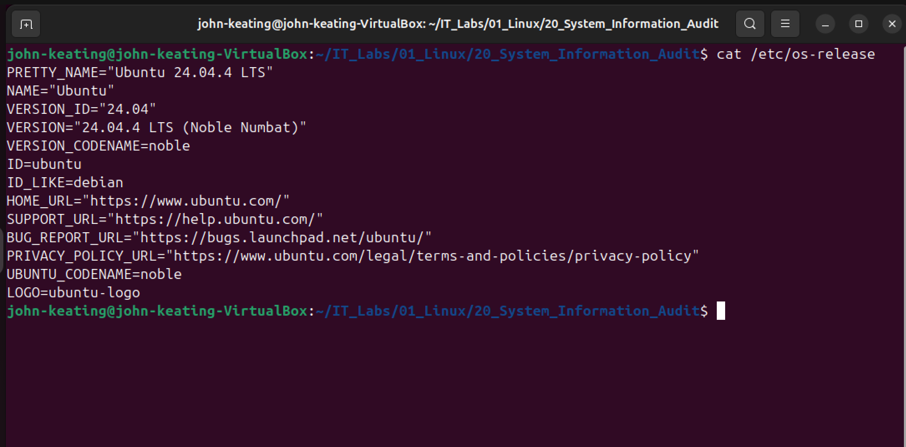
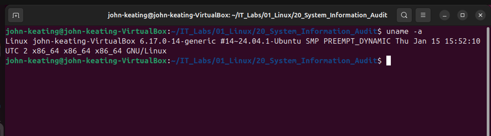
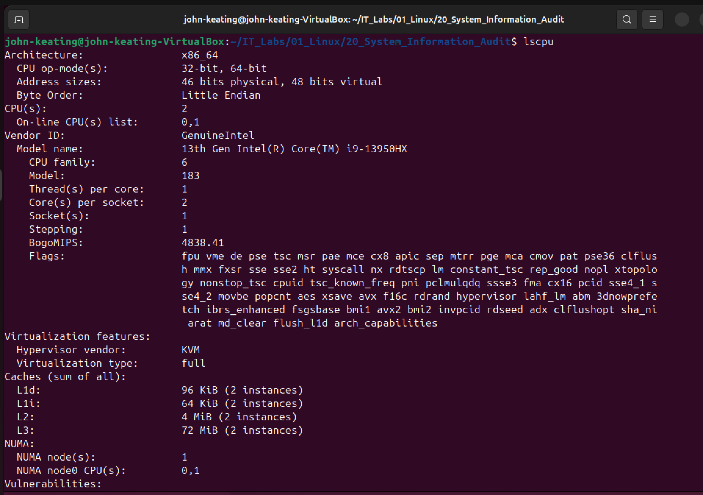
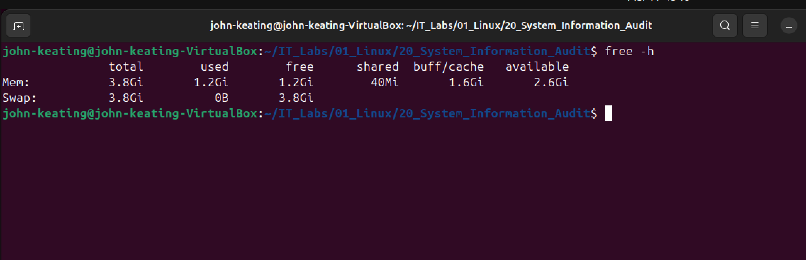
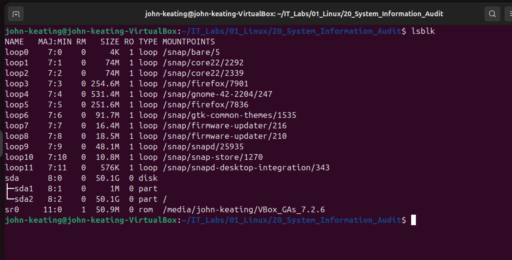
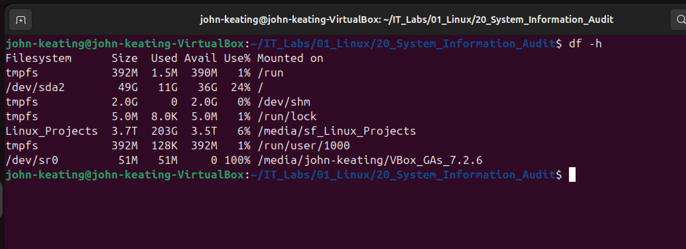
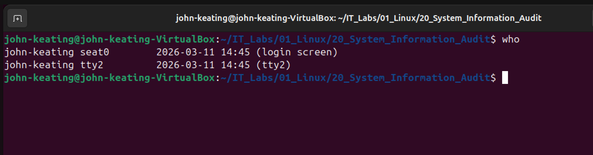
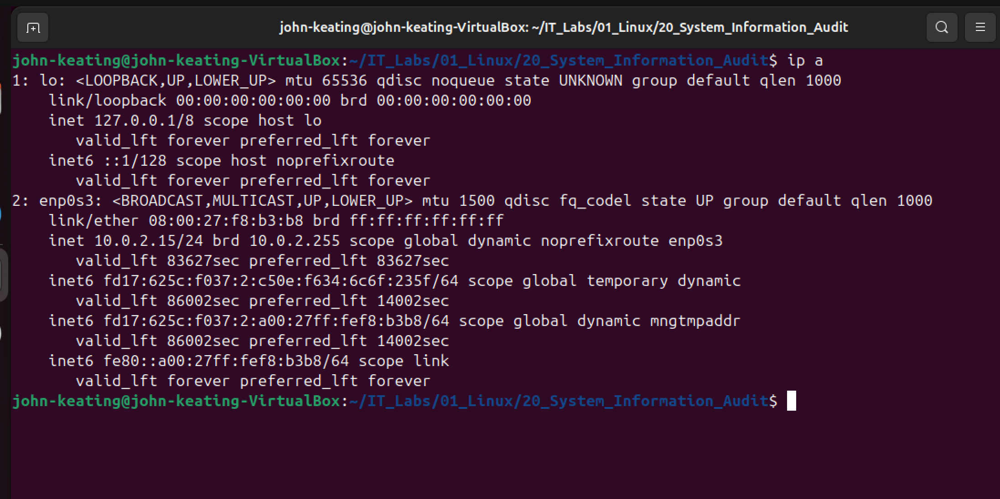
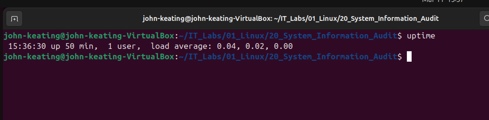

# Linux System Information Audit

## Objective

The goal of this lab is to perform a **basic Linux system audit** using built-in Linux command line tools.

System administrators, DevOps engineers, and cybersecurity analysts frequently gather system information when:

• troubleshooting servers  
• verifying system configuration  
• performing security audits  
• investigating incidents  
• monitoring infrastructure  

In this lab we collect important system information including:

- Operating System details
- Kernel version
- CPU architecture
- Memory usage
- Disk devices
- Disk usage
- Logged in users
- Network interfaces
- System uptime

---

# Environment

Ubuntu Linux (Virtual Machine)  
Oracle VirtualBox  
Bash Terminal  
Windows Host Machine  

---

# Commands Used

| Command | Purpose |
|------|------|
| `cat /etc/os-release` | Displays Linux distribution information |
| `uname -r` | Shows Linux kernel version |
| `lscpu` | Displays CPU architecture and details |
| `free -h` | Shows memory usage |
| `lsblk` | Lists block storage devices |
| `df -h` | Displays disk usage |
| `who` | Shows logged-in users |
| `ip a` | Displays network interfaces |
| `uptime` | Shows system uptime and CPU load |

---

# Command Explanations

---

## cat /etc/os-release

### Command

```
cat /etc/os-release
```

### What it does

Displays detailed information about the installed Linux operating system.

### Command Breakdown

| Part | Meaning |
|-----|--------|
| `cat` | Stands for **concatenate**, used to display file contents |
| `/etc` | System configuration directory |
| `os-release` | File containing OS identification information |

### Why administrators use it

Quickly identify:

- Linux distribution
- Version
- Support information

---

## uname -r

### Command

```
uname -r
```

### What it does

Displays the **Linux kernel version**.

### Command Breakdown

| Part | Meaning |
|-----|--------|
| `uname` | Stands for **Unix Name** |
| `-r` | Shows kernel **release version** |

### Why this matters

The **kernel** manages:

- CPU scheduling
- memory allocation
- hardware devices
- system processes

---

## lscpu

### Command

```
lscpu
```

### What it does

Displays detailed information about the system's **CPU architecture**.

### Information Provided

- CPU model
- number of cores
- architecture
- threads per core
- virtualization support
- CPU cache

This is important for **performance tuning and virtualization planning**.

---

## free -h

### Command

```
free -h
```

### What it does

Displays **system memory usage**.

### Command Breakdown

| Part | Meaning |
|-----|--------|
| `free` | Displays RAM usage |
| `-h` | Human readable format |

### Human Readable Output

Instead of bytes, values appear as:

- MB
- GB
- TB

### Columns Explained

| Column | Meaning |
|------|------|
| total | Total RAM installed |
| used | RAM currently in use |
| free | Unused memory |
| buff/cache | Memory used for disk caching |
| available | Memory available for applications |

---

## lsblk

### Command

```
lsblk
```

### What it does

Lists all **block storage devices**.

Block devices include:

- hard drives
- SSDs
- partitions
- mounted storage

### Output Columns

| Column | Meaning |
|------|------|
| NAME | Device name |
| SIZE | Disk size |
| TYPE | Disk or partition |
| MOUNTPOINT | Where device is mounted |

Example:

```
sda
├─sda1
└─sda2
```

`sda` is the disk  
`sda1` and `sda2` are partitions

---

## df -h

### Command

```
df -h
```

### What it does

Shows **disk usage** for mounted filesystems.

### Command Breakdown

| Part | Meaning |
|-----|--------|
| `df` | Disk filesystem |
| `-h` | Human readable output |

### Columns Explained

| Column | Meaning |
|------|------|
| Filesystem | Disk device |
| Size | Total storage |
| Used | Space currently used |
| Avail | Available storage |
| Use% | Percent of disk used |
| Mounted on | Directory where disk is mounted |

System administrators monitor this to ensure **servers do not run out of disk space**.

---

## who

### Command

```
who
```

### What it does

Displays **users currently logged into the system**.

### Information Provided

- username
- terminal session
- login time
- login source

Used to monitor active sessions on multi-user systems.

---

## ip a

### Command

```
ip a
```

### What it does

Displays **network interface information**.

### Information Provided

- IP addresses
- MAC addresses
- interface status
- network configuration

### Example Interfaces

| Interface | Purpose |
|------|------|
| lo | Loopback interface |
| eth0 | Ethernet device |
| enp0s3 | Virtual machine network adapter |

This command is critical for **network troubleshooting**.

---

## uptime

### Command

```
uptime
```

### What it does

Displays how long the system has been running.

### Example Output

```
15:36:30 up 50 min, 1 user, load average: 0.04, 0.02, 0.00
```

### Fields Explained

| Field | Meaning |
|------|------|
| Current time | System clock |
| up | How long the system has been running |
| users | Number of logged-in users |
| load average | CPU workload over time |

Load averages represent system load over:

- 1 minute
- 5 minutes
- 15 minutes

---

# Visual Evidence

## Operating System Information



---

## Kernel Information



---

## CPU Information



---

## Memory Usage



---

## Disk Devices



---

## Disk Usage



---

## Logged In Users



---

## Network Interfaces



---

## System Uptime



---

# What I Learned

In this lab I learned how to perform a basic Linux system audit using command line tools.

Skills practiced include:

- inspecting operating system information
- identifying kernel versions
- analyzing CPU architecture
- monitoring memory usage
- identifying storage devices
- checking disk utilization
- reviewing logged in users
- inspecting network interfaces
- checking system uptime and load averages

These are **core skills used daily by Linux administrators, DevOps engineers, cloud engineers, and cybersecurity professionals**.