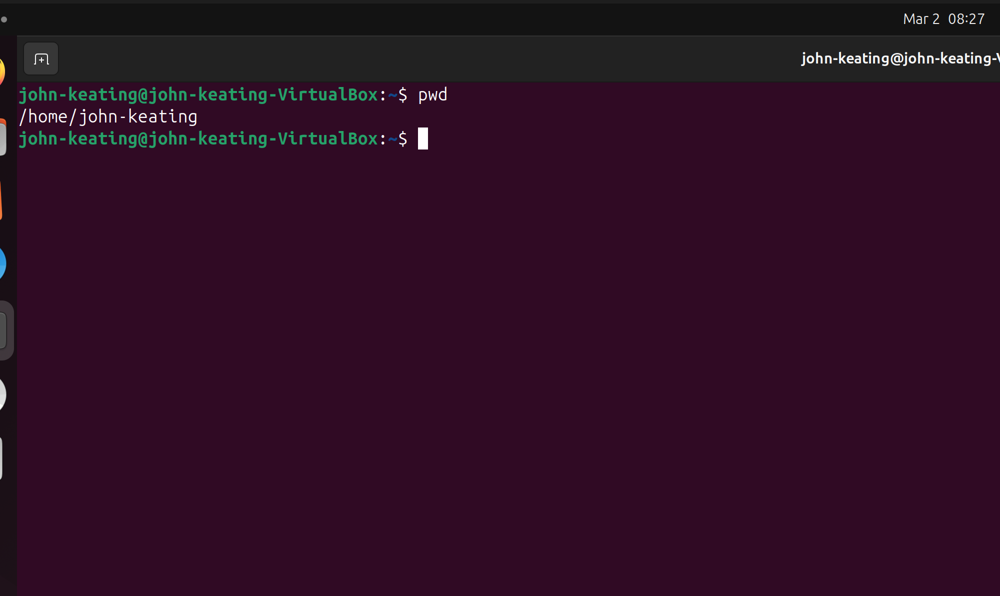
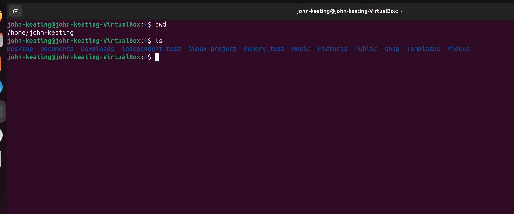
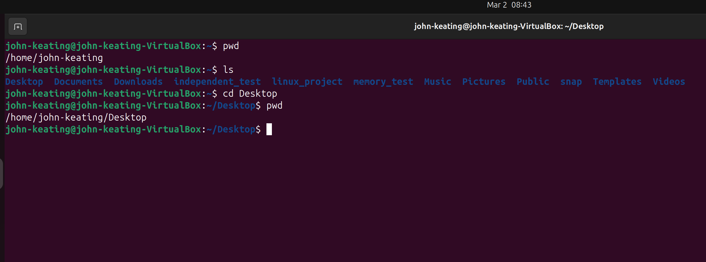
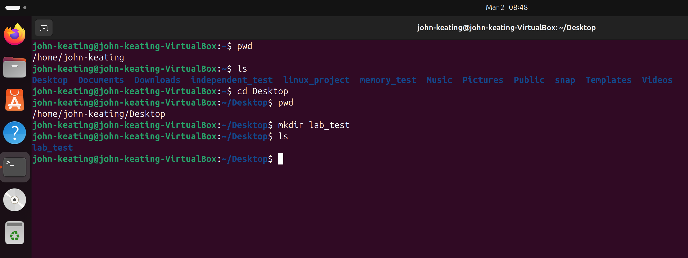
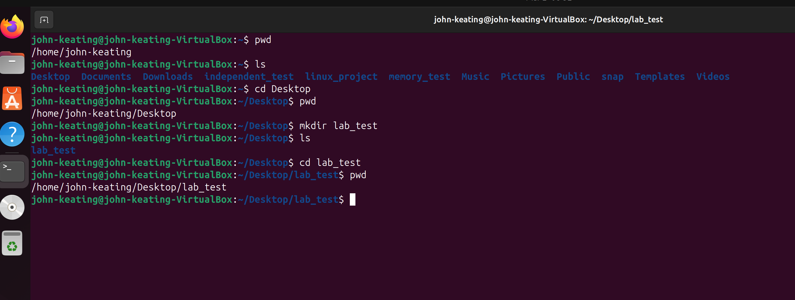
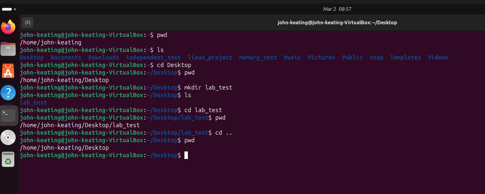
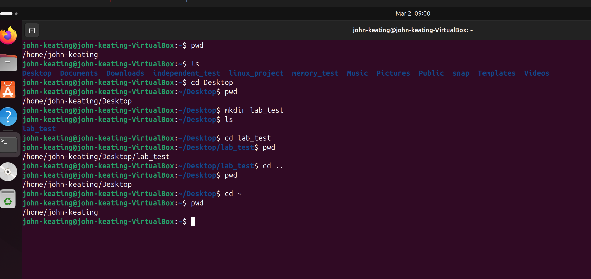
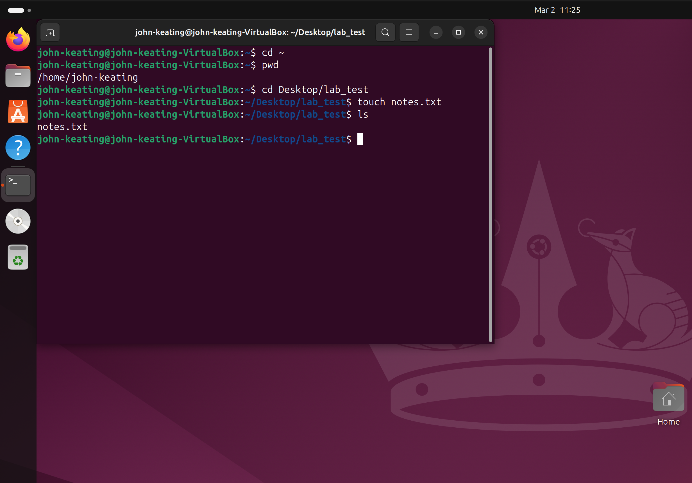
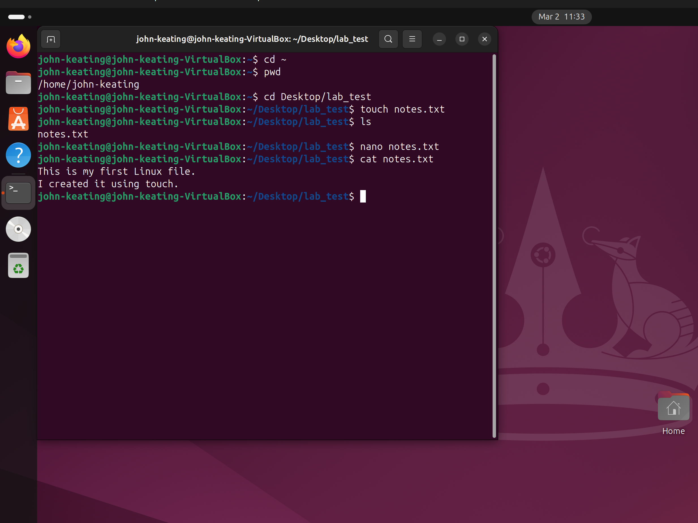

# Lab 01 — Linux Navigation

## Objective

The objective of this lab is to practice and demonstrate core Linux navigation commands used to move through the Linux file system using the command line.

Understanding how to navigate directories and manage files from the terminal is a fundamental skill for System Administration, Cloud Engineering, DevOps, and Cybersecurity.

This lab focuses on learning how to:

- Identify the current working directory
- View files and directories
- Navigate between directories
- Create and remove directories
- Work with files from the command line

---

# Environment

This lab was performed using the following environment:

- **Operating System:** Ubuntu Linux (Virtual Machine)
- **Host System:** Windows
- **Terminal:** Bash / Linux Terminal
- **Version Control:** Git & GitHub
- **Lab Workspace:** Local Linux Lab Environment

---

# Commands Used

| Command | Description |
|------|-------------|
| `pwd` | Prints the full path of the current working directory |
| `ls` | Lists files and directories in the current directory |
| `ls -la` | Lists all files including hidden files with detailed information |
| `cd` | Changes the current working directory |
| `cd ..` | Moves up one directory level |
| `cd ~` | Returns to the user’s home directory |
| `mkdir` | Creates a new directory |
| `rmdir` | Removes an empty directory |
| `touch` | Creates a new empty file |
| `nano` | Opens the Nano text editor |
| `cat` | Displays the contents of a file |

---

# Command Definitions

### `pwd`
Print Working Directory.

This command displays the **absolute path** of the directory you are currently located in.

Example:

```
pwd
```

Output example:

```
/home/user
```

---

### `ls`

Lists files and directories within the current directory.

Example:

```
ls
```

---

### `ls -la`

Lists **all files including hidden files** with detailed information.

Example:

```
ls -la
```

The output shows:

- File permissions
- Number of links
- File owner
- File group
- File size
- Last modified time
- File name

---

### `cd`

Change Directory.

Used to move into another directory.

Example:

```
cd Desktop
```

---

### `cd ..`

Moves **one directory up** in the file system hierarchy.

Example:

```
cd ..
```

---

### `cd ~`

Returns to the **home directory** of the current user.

Example:

```
cd ~
```

---

### `mkdir`

Make Directory.

Creates a new directory.

Example:

```
mkdir lab_test
```

---

### `rmdir`

Remove Directory.

Deletes an **empty directory**.

Example:

```
rmdir lab_test
```

---

### `touch`

Creates a new empty file.

Example:

```
touch notes.txt
```

---

### `nano`

Opens the **Nano text editor**, a simple command-line editor used to create or edit files.

Example:

```
nano notes.txt
```

---

### `cat`

Displays the contents of a file in the terminal.

Example:

```
cat notes.txt
```

---

# Command Flags and Symbols Explained

### `-l`

Long listing format.

Shows detailed file information including permissions, owner, and timestamps.

---

### `-a`

Shows **hidden files**.

Hidden files in Linux begin with a `.`

Example:

```
.bashrc
.profile
```

---

### `..`

Represents the **parent directory** (one level above the current directory).

Example:

```
cd ..
```

---

### `~`

Represents the **home directory** of the current user.

Example:

```
cd ~
```

---

### `.`

Represents the **current directory**.

---

# Lab Workflow

The following workflow demonstrates the navigation steps performed in this lab.

```
pwd
ls
cd Desktop
pwd
mkdir lab_test
cd lab_test
cd ..
cd ~
touch notes.txt
nano notes.txt
cat notes.txt
rmdir lab_test
```

This workflow demonstrates basic file system navigation and file creation within the Linux terminal.

---

# Visual Evidence (Screenshots)

### Step 1 — Display Current Directory



The `pwd` command prints the full path of the current working directory.

---

### Step 2 — List Files in Home Directory



The `ls` command lists all visible files and directories within the current location.

---

### Step 3 — Navigate to Desktop



The `cd` command moves into the Desktop directory.

---

### Step 4 — Create a Test Directory



The `mkdir` command creates a new directory named `lab_test`.

---

### Step 5 — Enter the New Directory



The `cd` command moves into the newly created directory.

---

### Step 6 — Move Back to the Parent Directory



The `cd ..` command moves up one level in the directory structure.

---

### Step 7 — Return to the Home Directory



The `cd ~` command returns to the user’s home directory.

---

### Step 8 — Create a New File



The `touch` command creates a new empty file called `notes.txt`.

---

### Step 9 — Edit and View File Contents



The `nano` editor is used to edit the file, and `cat` displays the contents of the file in the terminal.

---

# Key Linux Concepts Demonstrated

This lab demonstrates several foundational Linux concepts:

- Understanding the Linux hierarchical file system
- Navigating directories using the command line
- Absolute vs relative paths
- Viewing hidden files
- Creating directories and files
- Basic command-line workflow

---

# Real World Relevance

Linux command-line navigation is a core skill required for many technical roles including:

- Linux System Administrator
- Cloud Engineer
- DevOps Engineer
- Security Engineer
- Site Reliability Engineer (SRE)

Many production systems run Linux servers where engineers interact with systems **primarily through the command line**.

Understanding directory navigation is critical when managing servers, deploying applications, troubleshooting systems, or working in cloud environments.

---

# What I Learned

This lab strengthened my understanding of how Linux organizes files and directories within a hierarchical structure.

I learned how to efficiently move through the file system using relative and absolute paths, inspect directory contents, and manage files directly from the terminal.

Mastering these foundational navigation skills is essential for system administration, DevOps workflows, cloud engineering, and security operations.

---

**Lab Completed As Part Of My Structured Cloud Security Engineering Portfolio**

Future labs in this portfolio will continue building advanced skills in:

- Linux system administration
- Networking
- Security hardening
- Cloud infrastructure
- DevOps tooling
