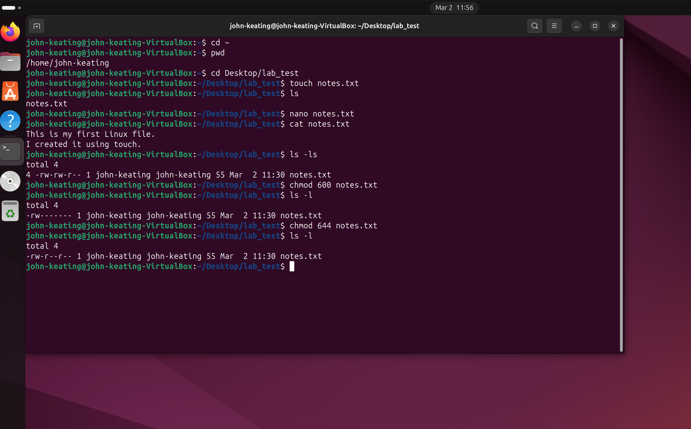
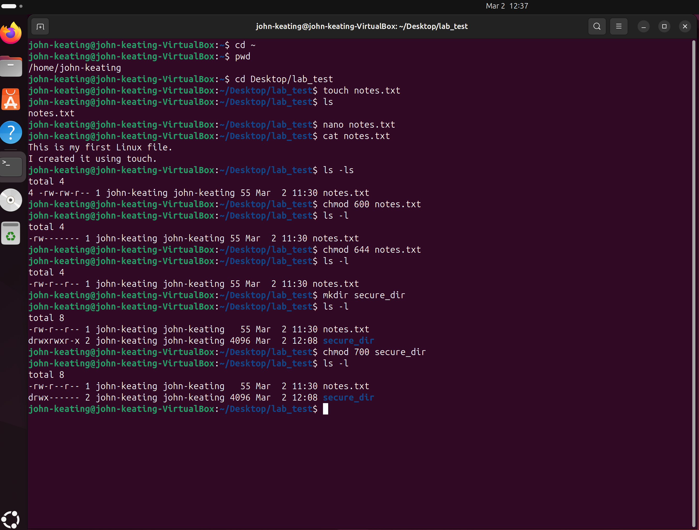
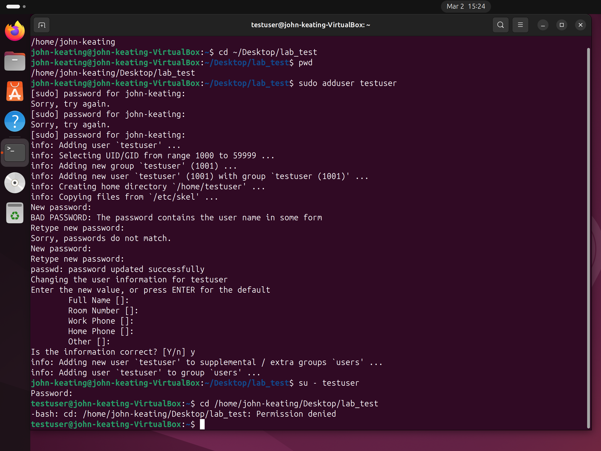
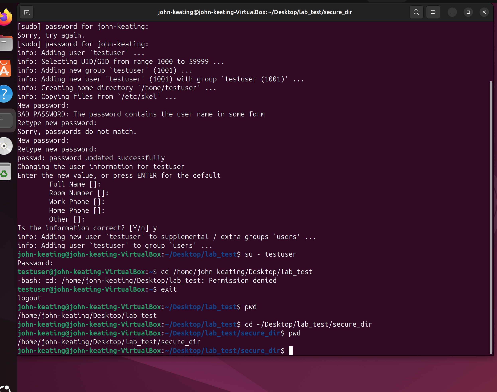

# Lab 02 — Linux File & Directory Permissions

## Objective

The objective of this lab is to demonstrate understanding of Linux file and directory permissions using the `chmod` command and verify real access behavior by testing permissions with a separate user account.

Understanding Linux permissions is essential for protecting sensitive data, securing systems, and controlling access to files and directories in multi-user environments.

This lab focuses on learning how to:

- View file and directory permissions
- Modify permissions using `chmod`
- Understand permission numbers such as `600`, `644`, and `700`
- Validate permission behavior using another user account

---

# Environment

This lab was performed using the following environment:

- **Operating System:** Ubuntu Linux (Virtual Machine)
- **Host System:** Windows
- **Terminal:** Bash / Linux Terminal
- **Version Control:** Git & GitHub
- **Lab Workspace:** Local Linux Lab Environment

---

# Commands Used

| Command | Description |
|------|-------------|
| `ls -l` | Displays file permissions, owner, group, size, and timestamp |
| `ls -ld <directory>` | Displays permissions for a directory |
| `chmod` | Modifies file or directory permissions |
| `su - <user>` | Switches to another user account |
| `whoami` | Displays the currently logged-in user |

---

# Command Definitions

### `ls -l`

Displays detailed file information including:

- File permissions
- Owner
- Group
- File size
- Last modified date
- File name

Example:

```
ls -l
```

Example output:

```
-rw-r--r-- 1 user user 0 Mar 15 notes.txt
```

---

### `ls -ld <directory>`

Displays permissions for a **directory itself**, not the files inside it.

Example:

```
ls -ld secure_folder
```

---

### `chmod`

Change Mode.

Used to modify file or directory permissions.

Example:

```
chmod 600 secrets.txt
```

---

### `su - <user>`

Switch user.

Used to log into another user account to test permission behavior.

Example:

```
su - testuser
```

---

### `whoami`

Displays the username of the currently logged-in user.

Example:

```
whoami
```

---

# Command Flags and Symbols Explained

### `-l`

Long listing format.

Displays detailed file information including permissions and ownership.

---

### `-d`

Displays information about the **directory itself** instead of its contents.

Example:

```
ls -ld directory_name
```

---

### `<user>`

Represents a username used when switching accounts.

Example:

```
su - testuser
```

---

# Permission Number System

Linux permissions use a **numeric representation**.

Each permission type has a number value:

| Permission | Value |
|------|------|
| Read | 4 |
| Write | 2 |
| Execute | 1 |

The numbers are combined to represent permissions.

---

### Example: `600`

```
600
```

Owner: Read + Write  
Group: None  
Others: None

Used for **private or sensitive files**.

---

### Example: `644`

```
644
```

Owner: Read + Write  
Group: Read  
Others: Read

Common for **configuration files and documents**.

---

### Example: `700`

```
700
```

Owner: Full access  
Group: None  
Others: None

Common for **private directories**.

---

# Lab Workflow

The following workflow demonstrates how permissions were tested.

```
ls -l
chmod 600 secrets.txt
chmod 644 secrets.txt
ls -ld secure_directory
chmod 700 secure_directory
su - testuser
whoami
```

This workflow verifies how permissions affect access to files and directories.

---

# Visual Evidence (Screenshots)

### Step 1 — Modify File Permissions



The `chmod` command was used to modify file permissions from `600` to `644`.

---

### Step 2 — Modify Directory Permissions



The directory permissions were set to `700`, restricting access to the owner only.

---

### Step 3 — Permission Denied Test



A secondary user attempted to access the protected directory and was denied access.

---

### Step 4 — Owner Access Verification



The owner account was able to access the directory successfully.

---

# Key Linux Concepts Demonstrated

This lab demonstrates several critical Linux security concepts:

- Understanding Linux file permission structure
- Using numeric permission values
- Restricting access to sensitive files
- Protecting directories from unauthorized access
- Validating permissions with multiple user accounts

---

# Real World Relevance

Linux permissions are a critical security mechanism used to control access in multi-user systems.

These concepts are widely used in:

- Linux System Administration
- Cloud Infrastructure
- DevOps environments
- Cybersecurity operations

Properly configuring permissions helps prevent unauthorized access to sensitive files such as:

- SSH private keys
- Configuration files
- Credentials
- System secrets

---

# What I Learned

This lab strengthened my understanding of how Linux uses permission systems to control access to files and directories.

I learned how to configure secure permission settings, verify access behavior using separate user accounts, and apply common permission standards such as `600`, `644`, and `700`.

Understanding file permissions is a critical skill for maintaining secure Linux systems in real-world environments.

---

**Lab Completed As Part Of My Structured Cloud Security Engineering Portfolio**