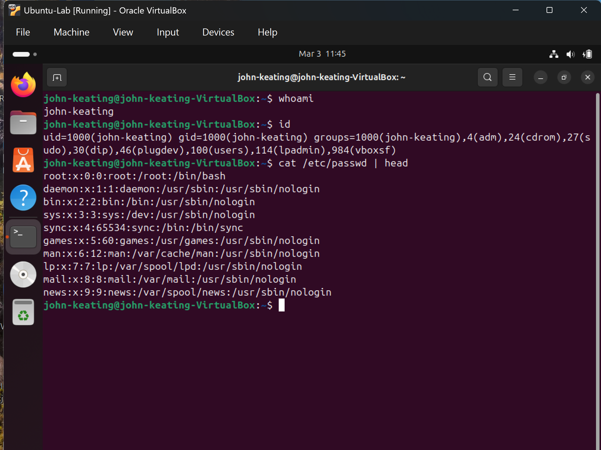
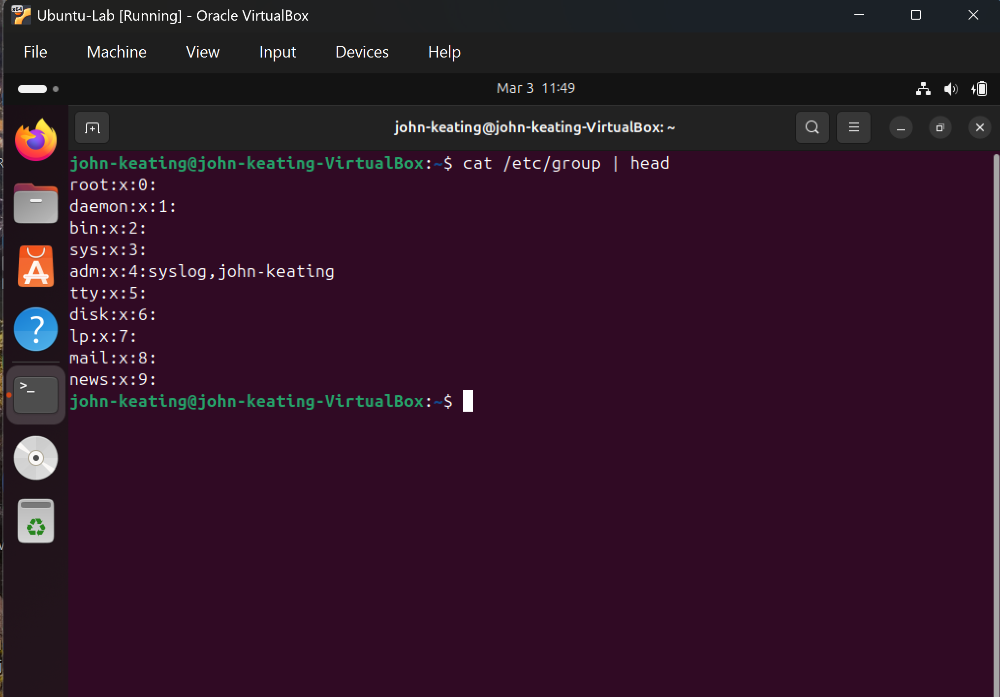
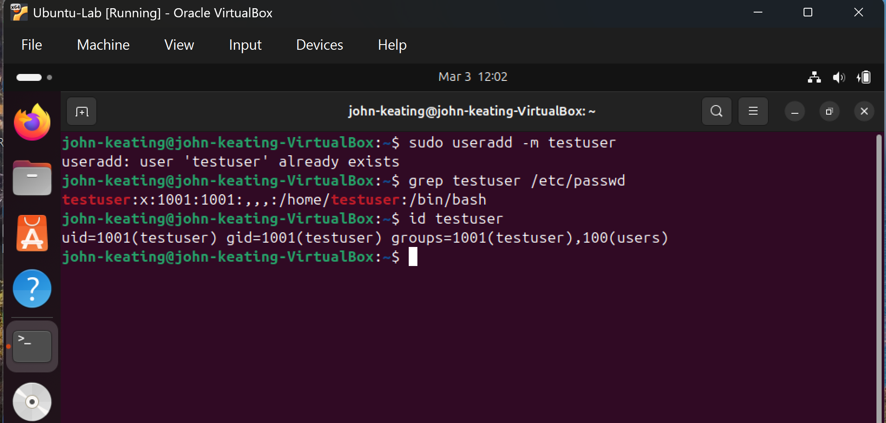
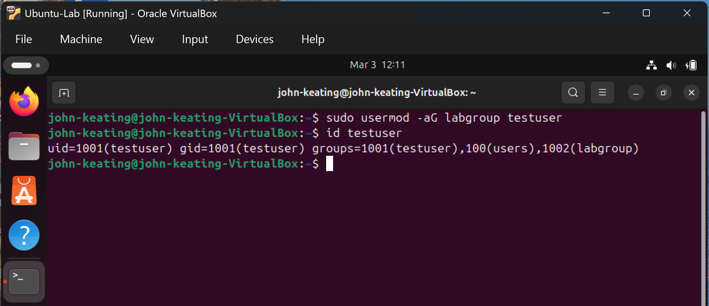
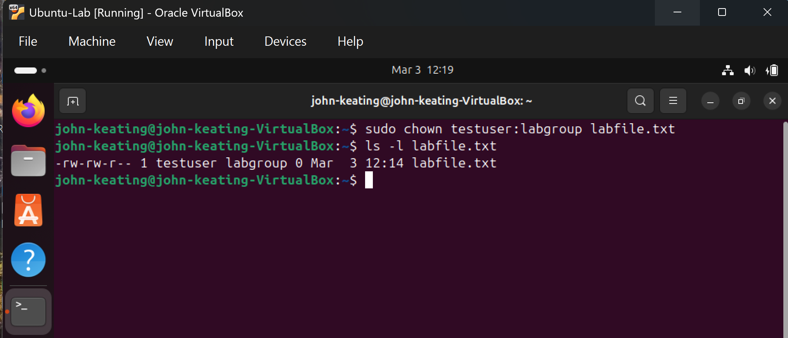
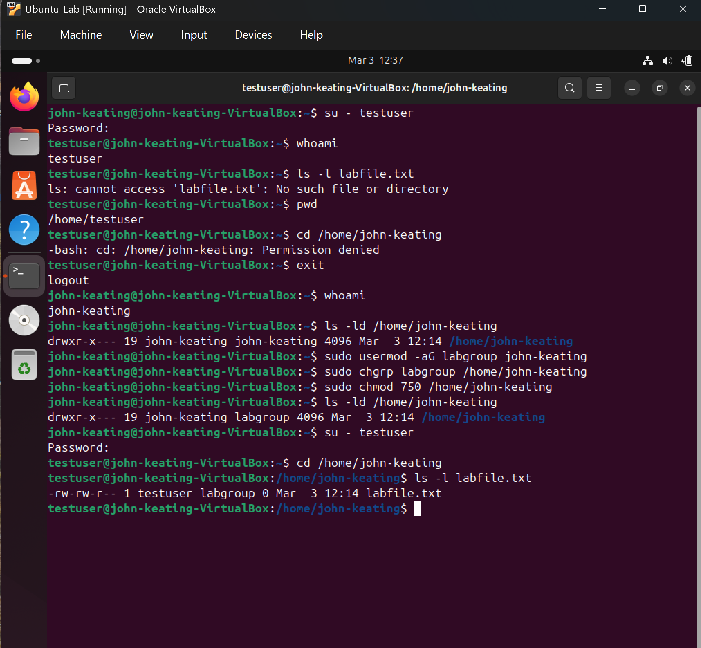

# Linux Fundamentals — Users & Groups

---

# Objective

The objective of this lab is to demonstrate practical understanding of **Linux user and group management**.

In this lab I practiced:

• Creating users  
• Creating groups  
• Adding users to groups  
• Verifying group membership  
• Changing file ownership  
• Testing access behavior in a multi-user environment  

These tasks are fundamental for **Linux System Administration, DevOps, Cloud Engineering, and Cybersecurity environments** where access control must be carefully managed.

---

# Environment

Ubuntu Linux (Virtual Machine)  
Git Bash (Windows Host Machine)  
Local Linux Lab Environment  

---

# Commands Used

| Command | Purpose |
|------|------|
| `whoami` | Displays the current logged-in user |
| `id` | Shows user ID (UID), group ID (GID), and group memberships |
| `cat /etc/passwd` | Displays system user accounts |
| `cat /etc/group` | Displays system group information |
| `groupadd <group>` | Creates a new group |
| `useradd <user>` | Creates a new user account |
| `usermod -aG <group> <user>` | Adds user to a group |
| `groups <user>` | Displays groups a user belongs to |
| `chown <user>:<group> <file>` | Changes file ownership |
| `ls -l` | Displays file permissions, owner, and group |
| `chgrp <group> <file>` | Changes file group ownership |
| `chmod <permissions> <file>` | Changes file permissions |
| `ls -ld <directory>` | Displays directory permissions |
| `su - <user>` | Switches to another user |

---

# Command Definitions

### whoami
Displays the username of the currently logged-in user.

### id
Shows detailed information about a user including:
• UID (User ID)  
• GID (Primary Group ID)  
• Secondary group memberships  

### cat /etc/passwd
Displays all user accounts stored on the Linux system.

Each line represents a user account.

### cat /etc/group
Displays all groups configured on the system.

### groupadd
Creates a new group that users can be assigned to.

### useradd
Creates a new Linux user account.

### usermod
Modifies an existing user account.

### groups
Displays all groups a specific user belongs to.

### chown
Changes the owner and group of a file or directory.

### chgrp
Changes only the **group ownership** of a file or directory.

### chmod
Changes the **permission settings** of files and directories.

### su
Allows switching to another user account to test access permissions.

---

# Command Flags and Symbols Explained

### -a
Append.  
Used with `usermod` so the user is **added to a group without removing existing memberships**.

### -G
Specifies **secondary groups** for a user.

Example:

```
usermod -aG labgroup testuser
```

### :
Separates **user and group** in ownership commands.

Example:

```
chown testuser:labgroup file.txt
```

### -l
Long listing format used with `ls`.

Displays:

• File permissions  
• Owner  
• Group  
• File size  
• Modification date  

### -d
Used with `ls` to show **directory information instead of its contents**.

---

# What Was Tested

## User Creation

• Created a new test user  
• Verified user existence in `/etc/passwd`

---

## Group Management

• Created a new group  
• Added user to the group  
• Verified group membership using `groups`

---

## Ownership Changes

• Created a test file  
• Verified original file ownership  
• Changed ownership using `chown`  
• Verified new ownership using `ls -l`

---

# Key Concepts

• Every file in Linux has an **owner and a group**.  
• Users can belong to **multiple groups**.  
• Group membership affects **file and directory access permissions**.  
• Ownership and permissions work together to control access.  
• Access control is essential for **multi-user Linux systems**.

---

# Visual Evidence

## Current User Identity


Shows the current logged-in user and system user ID information.

---

## Viewing System User Accounts



Displays all user accounts stored in `/etc/passwd`.

---

## Viewing System Groups



Displays all groups configured on the system.

---

## Creating a Group


Shows successful creation of the new group.

---

## Creating a User



Shows creation of the test user account.

---

## Adding User to Group



Shows the user successfully added to the group.

---

## File Ownership Before Change


Displays file ownership before modification.

---

## File Ownership After Change



Shows ownership successfully updated.

---

## Final Access Verification



Confirms the user can access the file based on new ownership and group settings.

---

# Real World Relevance

User and group management is essential for:

• Linux System Administration  
• Cloud Infrastructure Management  
• DevOps Environments  
• Container Platforms  
• Cybersecurity Access Control  

In production environments, administrators use these tools to ensure **users only access the resources they are authorized to use**.

---

# What I Learned

This lab strengthened my understanding of how Linux manages **users, groups, and file ownership** to enforce system security.

I learned that:

• Files always belong to both a **user and a group**.  
• Group membership directly impacts file access permissions.  
• Ownership can be modified using `chown` and `chgrp`.  
• Testing with different users is essential to validate real-world access behavior.

Understanding these concepts is critical for managing **secure multi-user Linux environments used in cloud infrastructure and enterprise systems**.

---
