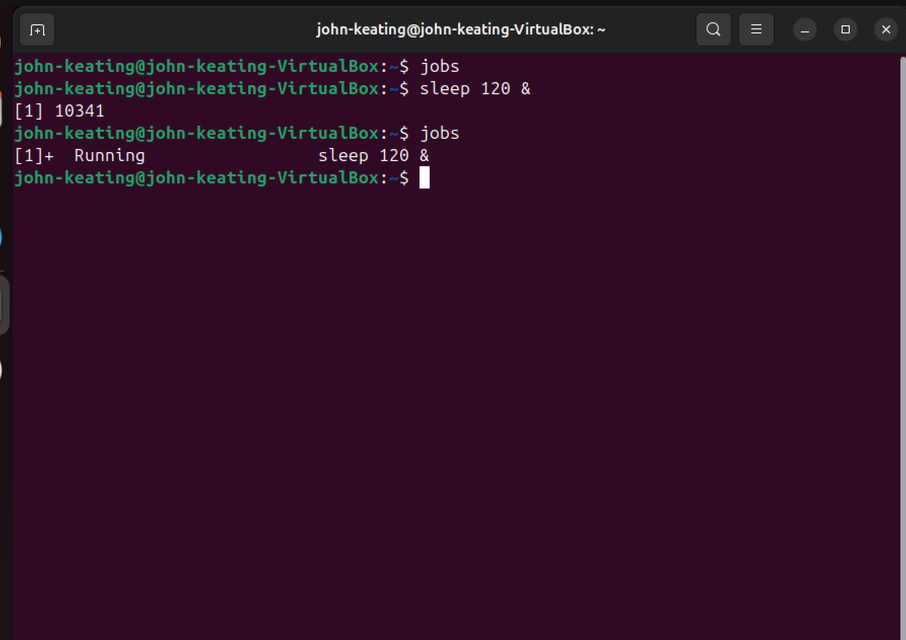
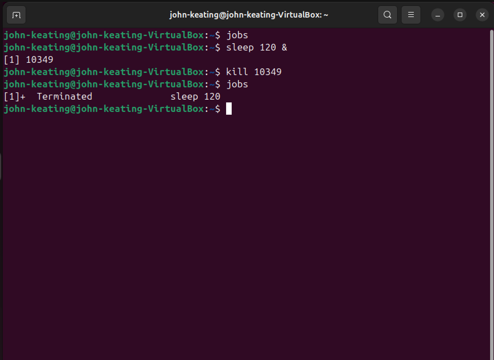

# Linux Processes Lab

---

# Objective

The purpose of this lab is to demonstrate how Linux processes can be monitored, run in the background, and terminated using common system administration commands.

Process management is a fundamental skill used by Linux administrators, DevOps engineers, cloud engineers, and cybersecurity professionals to troubleshoot system performance and control running applications.

---

# Environment

Ubuntu Linux (Virtual Machine)  
Oracle VirtualBox  
Windows 11 Host Machine  
Linux Bash Terminal  

---

# Commands Used

| Command | Description |
|-------|-------------|
| `ps` | Displays a snapshot of currently running processes |
| `ps aux` | Displays all running processes on the system |
| `top` | Displays a live, real-time process monitoring interface |
| `sleep` | Creates a temporary process used for testing |
| `&` | Runs a command in the background |
| `jobs` | Displays background jobs running in the current shell |
| `kill` | Terminates a running process using its Process ID (PID) |

---

# Command Definitions

### ps

Displays a snapshot of active processes associated with the current terminal session.

---

### ps aux

Displays a detailed list of **all running processes on the system**, including:

User running the process  
CPU usage  
Memory usage  
Process ID  
Command being executed  

---

### top

Displays a **real-time interactive view of system processes**, including:

CPU usage  
Memory usage  
Running processes  
System load  

This command is commonly used to diagnose system performance problems.

---

### sleep

Creates a process that simply waits for a specified number of seconds before terminating.

Example used in the lab:

```
sleep 120
```

This command creates a process that runs for **120 seconds**.

---

### & (Background Operator)

The `&` symbol tells the shell to run a command **in the background** instead of the foreground.

Example:

```
sleep 120 &
```

This allows the terminal to remain usable while the process runs.

---

### jobs

Displays all background jobs currently running in the shell session.

Example output:

```
[1]+ Running sleep 120 &
```

---

### kill

Terminates a running process using its **Process ID (PID)**.

Example:

```
kill 1234
```

This sends a termination signal to the process.

---

# Command Flags and Symbols Explained

| Symbol / Flag | Meaning |
|---------------|--------|
| `a` | Shows processes for all users |
| `u` | Displays the user running the process |
| `x` | Shows processes not attached to a terminal |
| `&` | Runs a command in the background |
| `PID` | Process ID number used to identify a running process |

---

# Lab Workflow

### Step 1 — View running processes

Displayed processes associated with the current terminal session.

```
ps
```

---

### Step 2 — View all system processes

Displayed every running process on the system.

```
ps aux
```

---

### Step 3 — Monitor system processes in real time

Opened the real-time system process monitor.

```
top
```

---

### Step 4 — Create a background process

Started a background process for testing.

```
sleep 120 &
```

---

### Step 5 — Verify background job

Confirmed the process was running in the background.

```
jobs
```

---

### Step 6 — Terminate the process

Stopped the background process using its PID.

```
kill PID
```

---

# Visual Evidence

## Screenshot 1 — Basic Process List


Shows the `ps` command displaying active processes in the current terminal session.

---

## Screenshot 2 — All System Processes


Displays the `ps aux` command output showing all processes currently running on the system.

---

## Screenshot 3 — Real-Time Process Monitoring


Shows the `top` command monitoring CPU usage, memory usage, and active processes in real time.

---

## Screenshot 4 — Background Process Creation


Demonstrates starting a background process using the command:

```
sleep 120 &
```

---

## Screenshot 5 — Jobs Command



Displays background processes running in the current shell session using the `jobs` command.

---

## Screenshot 6 — Kill Process



Shows terminating a running process using the `kill` command and its PID.

---

# Key Linux Concepts Demonstrated

Linux processes run in either **foreground or background**.

Each running process is assigned a unique **Process ID (PID)**.

System administrators use process monitoring tools to diagnose system performance and manage running applications.

Background processes allow multiple tasks to run simultaneously.

The `kill` command allows administrators to safely terminate processes when necessary.

---

# Real World Relevance

Process management is used daily by:

Linux System Administrators  
DevOps Engineers  
Cloud Engineers  
Site Reliability Engineers  
Cybersecurity Analysts  

These commands help professionals identify system issues, manage applications, and maintain stable production environments.

---

# What I Learned

This lab demonstrates how Linux manages system processes and how administrators monitor, control, and terminate running tasks using built-in command line tools.