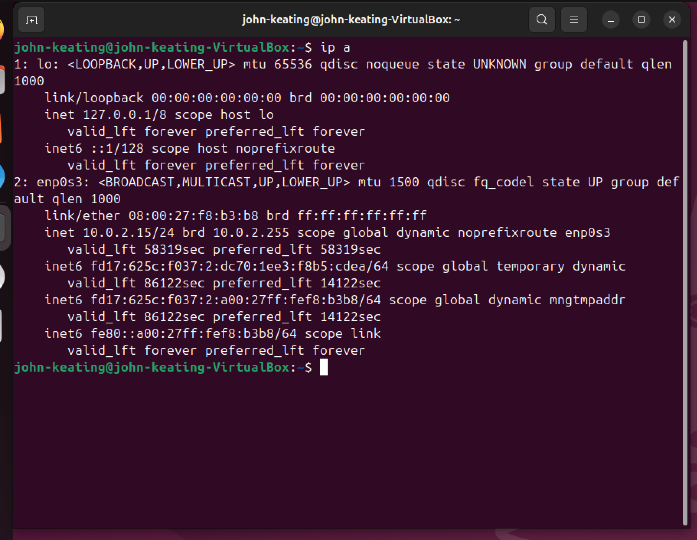
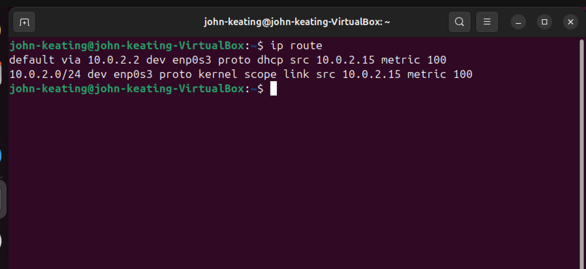
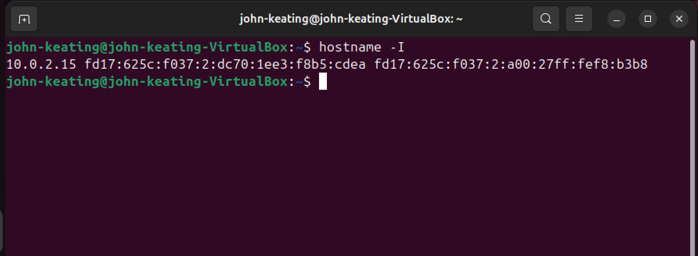

# Linux Networking Lab

---

# Objective

Demonstrate basic Linux networking diagnostics including interface configuration, routing tables, connectivity testing, open ports, and system IP discovery.

This lab focuses on the core commands Linux administrators use to quickly verify whether a system is properly connected to a network.

---

# Environment

- Ubuntu Linux (Virtual Machine)
- Oracle VirtualBox
- Windows 11 Host Machine
- Linux Terminal
- Git Bash
- GitHub Lab Repository

---

# Commands Used

| Command | Description |
|------|------|
| `ip a` | Displays all network interfaces and their assigned IP addresses |
| `ip route` | Displays the system routing table and default gateway |
| `ping -c 4 google.com` | Tests network connectivity and DNS resolution |
| `ss -tuln` | Displays listening network sockets and open ports |
| `hostname -I` | Displays the system IP addresses |

---

# Command Definitions

## ip a

Displays all network interfaces on the system along with their IP addresses, interface status, and network configuration.

This command is used to quickly verify that a system has received an IP address from DHCP or has a correctly configured static IP.

---

## ip route

Displays the system routing table.

The routing table determines where network traffic should be sent when communicating with other systems or networks.

This command also reveals the **default gateway**, which is the router responsible for forwarding traffic outside the local network.

---

## ping -c 4 google.com

Tests network connectivity by sending ICMP echo requests to a remote server.

If replies are received, the system has working network connectivity and DNS resolution.

---

## ss -tuln

Displays open network ports and listening network services.

System administrators use this command to quickly identify which services are currently accepting network connections.

---

## hostname -I

Displays the system's assigned IP address.

This command is useful for quickly identifying the address used to access the system over the network.

---

# Flags and Symbols Explained

| Flag | Meaning |
|------|------|
| `-c` | Specifies the number of ping packets to send |
| `-t` | Displays TCP sockets |
| `-u` | Displays UDP sockets |
| `-l` | Shows listening sockets only |
| `-n` | Displays numeric addresses instead of resolving hostnames |
| `I` | Displays all assigned IP addresses for the system |

---

# What Was Tested

- Verified network interface configuration
- Identified the default gateway
- Confirmed internet connectivity
- Observed listening network ports
- Retrieved the system IP address

---

# Key Networking Concepts

- Network Interfaces
- IP Addressing
- Default Gateway
- DNS Resolution
- Open Ports
- Network Connectivity Testing

---

# Screenshots

---

## Network Interfaces (ip a)

This output displays the available network interfaces on the system along with their assigned IP addresses.  
It confirms that the network interface is active and properly configured.

---

## Routing Table (ip route)

The routing table shows how the system determines where to send outgoing network traffic.  
It identifies the default gateway used to reach external networks.

---

## Internet Connectivity Test (ping)

The ping command verifies that the system can communicate with external hosts.  
Successful replies confirm that both network connectivity and DNS resolution are functioning.

---

## Listening Network Ports (ss -tuln)

This output lists network services currently listening for incoming connections.  
Administrators use this command when troubleshooting services or investigating security exposure.

---

## System IP Address (hostname -I)

This command quickly displays the system's assigned IP address.  
It is often used when connecting to the machine remotely or verifying network configuration.

---

# Real World Relevance

These commands are commonly used by:

- Linux System Administrators
- Cloud Engineers
- DevOps Engineers
- Cybersecurity Analysts
- Network Engineers

They are essential tools for diagnosing networking problems on servers, cloud instances, containers, and virtual machines.

---

# What I Learned

This lab demonstrated how to inspect Linux networking configuration, verify internet connectivity, and identify active network services using common Linux networking commands.

These techniques are critical for troubleshooting servers, diagnosing connectivity issues, and understanding how Linux systems communicate across networks.

---

# Career Path

This lab is part of my hands-on training path toward:

Cloud Security → Cloud Security Analyst → Cloud Security Engineer → Cloud Security Architect → Cloud Security Platforms → Cloud Platforms → Chief Cloud Architect

All labs are part of my professional **IT_Labs GitHub portfolio** demonstrating real-world Linux, networking, security, and cloud engineering skills.

---