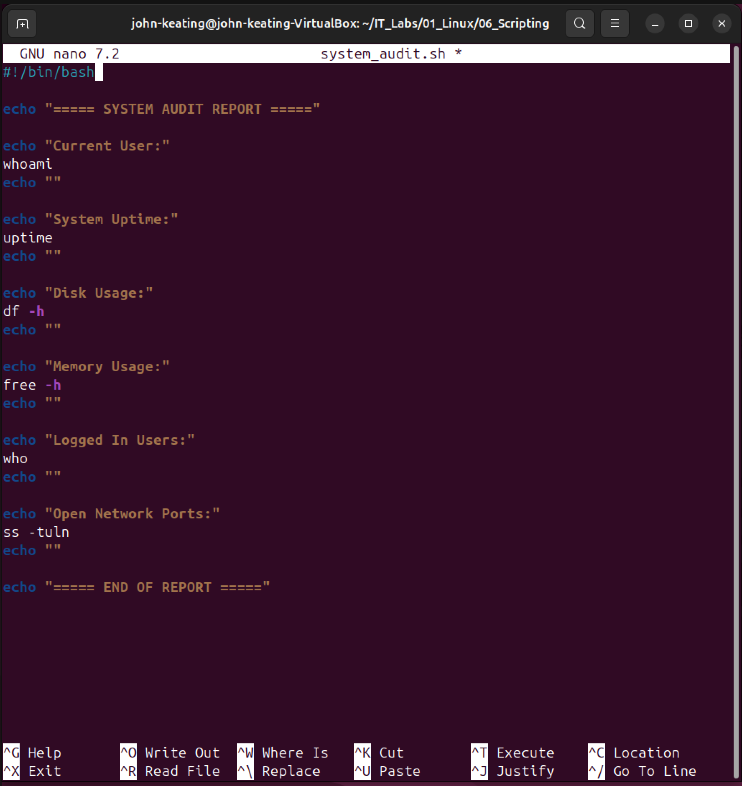
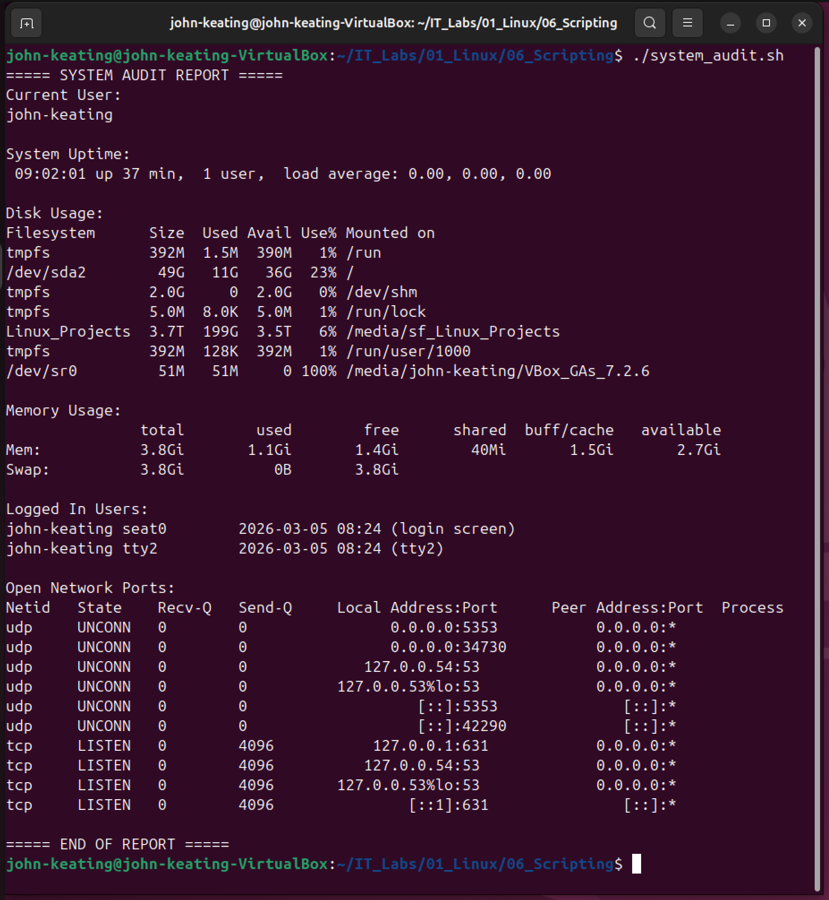

# Linux Bash Scripting Lab

---

# Objective

Create and execute a basic Bash script that collects system information including the current user, system uptime, disk usage, memory usage, logged-in users, and open network ports.

This lab demonstrates how Bash scripting can automate common administrative tasks and generate quick system audit reports.

---

# Environment

- Ubuntu Linux (Virtual Machine)
- Oracle VirtualBox
- Windows 11 Host Machine
- Bash Shell
- VS Code for documentation
- Git & GitHub for version control

---

# Script Created

### system_audit.sh

This script performs a basic system audit by displaying:

- Current logged-in user
- System uptime
- Disk usage
- Memory usage
- Logged-in users
- Open network ports

---

# Commands Used

| Command | Description |
|--------|-------------|
| `nano` | Create and edit the Bash script |
| `chmod +x` | Make the script executable |
| `./scriptname` | Execute the script |
| `whoami` | Display the current user |
| `uptime` | Show system uptime and load averages |
| `df -h` | Display disk usage in human-readable format |
| `free -h` | Show memory usage |
| `who` | Display logged-in users |
| `ss -tuln` | Show listening network ports |

---

# Command Definitions

### nano

A simple terminal text editor used to create and modify files directly from the command line.

---

### chmod +x

Changes file permissions to allow the script to be executed as a program.

`+x` adds execute permission to the file.

---

### ./scriptname

Runs a script located in the current directory.

The `./` indicates the script exists in the current working directory.

---

### whoami

Displays the username of the currently logged-in user.

---

### uptime

Shows how long the system has been running along with the current load averages.

---

### df -h

Displays disk usage for all mounted filesystems.

`-h` displays the output in human-readable format such as GB or MB.

---

### free -h

Displays memory usage including total, used, and available RAM.

`-h` provides human-readable formatting.

---

### who

Lists users currently logged into the system.

---

### ss -tuln

Displays open network ports and listening services.

Flags explained:

| Flag | Meaning |
|-----|--------|
| `-t` | Show TCP sockets |
| `-u` | Show UDP sockets |
| `-l` | Show listening ports |
| `-n` | Display numeric addresses instead of resolving hostnames |

---

# Script Breakdown

The Bash script created in this lab gathers system information by executing several Linux commands automatically.

### `#!/bin/bash`

This is called a **shebang**.

It tells Linux to run the script using the Bash shell interpreter.

---

### echo

Used to print text messages to the terminal to organize the output report.

---

### whoami

Displays the username of the current user.

---

### uptime

Shows system uptime and load averages.

---

### df -h

Displays disk usage statistics in a human-readable format.

---

### free -h

Displays memory usage information.

---

### who

Shows which users are currently logged into the system.

---

### ss -tuln

Displays open network ports and listening services on the machine.

---

# Screenshots

---

## Script Directory Creation

This screenshot shows the creation of the directory used to store the Bash script within the Linux lab environment.

---

## Writing the Bash Script

The Bash script is written using the nano text editor and contains commands that gather system information.

---

## Script Permissions

The `chmod +x` command makes the script executable so it can be run as a program from the terminal.

---

## Script Execution Output

This screenshot displays the output generated by the Bash script showing system information collected automatically.

---

# Key Concepts

- Bash scripting
- Linux automation
- File permissions
- Executable scripts
- System information gathering
- Basic system auditing

---

# Real World Relevance

Bash scripting is widely used by:

- Linux System Administrators
- DevOps Engineers
- Cloud Engineers
- Cybersecurity Analysts
- Platform Engineers

Automation scripts are essential for quickly gathering system information, monitoring servers, and performing routine administrative tasks.

---

# What I Learned

- How to create Bash scripts
- How to make scripts executable using `chmod`
- How to run scripts from the terminal
- How to gather system information using Linux commands
- How to document technical work for GitHub

---

# Career Path

This lab is part of my hands-on training path toward:

Cloud Security → Cloud Security Analyst → Cloud Security Engineer → Cloud Security Architect → Cloud Security Platforms → Cloud Platforms → Chief Cloud Architect

All labs are part of my **IT_Labs GitHub portfolio** demonstrating Linux, networking, security, and cloud engineering skills.