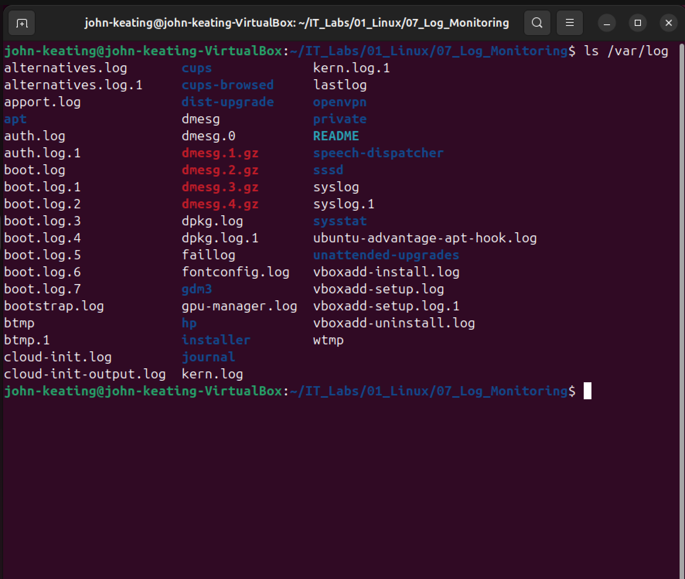
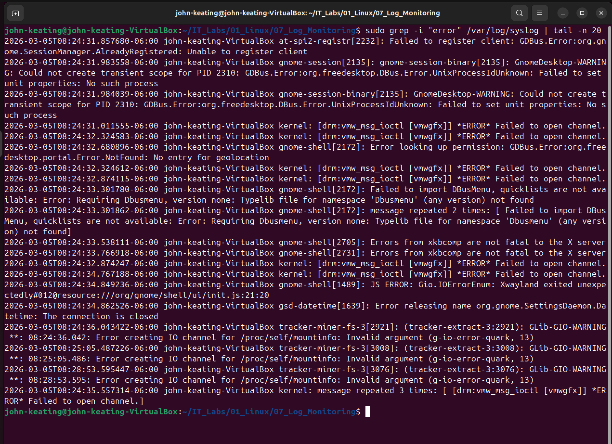

# Linux Log Monitoring Lab

---

# Objective

The objective of this lab is to learn how Linux system logs work and how administrators monitor system activity, troubleshoot problems, and detect errors using log analysis tools.

System logs are critical for troubleshooting system issues, monitoring services, and detecting security incidents.

---

# Environment

- Ubuntu Linux (VirtualBox VM)
- Bash Terminal
- Windows Host Machine
- Git & GitHub for lab documentation

---

# Commands Used

| Command | Description |
|--------|-------------|
| `ls /var/log` | Lists all available Linux system log files |
| `tail -n 30 /var/log/syslog` | Displays the last 30 entries from the system log |
| `grep -i "error" /var/log/syslog` | Searches the log file for error messages |
| `tail -f /var/log/syslog` | Monitors system logs in real time |

---

# Command Definitions

### ls

Lists files and directories in a location.

---

### /var/log

This directory stores most Linux system log files.

System administrators frequently examine these logs to troubleshoot problems or investigate security incidents.

---

### tail

Displays the end portion of a file.

Commonly used for viewing the newest log entries.

---

### -n

Specifies how many lines should be displayed.

Example:

```
tail -n 30
```

Displays the last 30 lines of a file.

---

### grep

Searches text within files.

It is commonly used for filtering logs for specific keywords.

---

### -i

Ignores uppercase and lowercase differences when searching text.

Example:

```
grep -i error
```

This will match:

- error
- ERROR
- Error

---

### tail -f

The `-f` flag tells tail to **follow the file live**.

This allows administrators to monitor logs in real time as events occur.

---

# Command Breakdown Example

## Searching System Logs for Errors

Command used:

```
sudo grep -i "error" /var/log/syslog | tail -n 20
```

Explanation:

| Part | Meaning |
|-----|--------|
| `sudo` | Runs the command with administrator privileges |
| `grep` | Searches text inside files |
| `-i` | Ignores uppercase/lowercase differences |
| `"error"` | Searches for the word "error" |
| `/var/log/syslog` | Main Linux system log file |
| `|` | Sends output to another command |
| `tail -n 20` | Shows the last 20 matching results |

---

# Key Concepts Learned

Linux stores system logs inside the `/var/log` directory.

System administrators use log files to:

- Troubleshoot system problems
- Investigate security incidents
- Monitor system activity
- Identify errors or failed services

Important log analysis tools include:

- `tail` — view recent log entries
- `grep` — search logs for keywords
- `tail -f` — monitor logs live as the system runs

---

# Real World Relevance

Log monitoring is a critical skill used by:

- Linux System Administrators
- DevOps Engineers
- Cloud Engineers
- Security Engineers
- Cybersecurity Analysts

Logs help engineers:

- Diagnose server problems
- Detect system failures
- Investigate cyber attacks
- Monitor production environments

Log analysis is a daily task in real-world cloud and enterprise environments.

---

# Screenshots

---

## Viewing the Linux Log Directory



This screenshot shows the contents of the `/var/log` directory where Linux stores important system log files.

---

## Viewing Recent System Log Entries


The `tail -n 30 /var/log/syslog` command displays the most recent entries from the system log file.

This allows administrators to quickly inspect recent system activity.

---

## Searching Logs for Errors



The `grep -i "error" /var/log/syslog` command searches the log file for error messages.

This helps administrators quickly identify problems occurring on the system.

---

## Monitoring Logs in Real Time


The `tail -f /var/log/syslog` command allows administrators to monitor logs in real time as events occur on the system.

This is commonly used when troubleshooting live system issues.

---

# What I Learned

Through this lab I learned how Linux stores system activity in log files and how administrators analyze those logs to troubleshoot issues.

I practiced:

- Navigating system log directories
- Viewing recent log entries
- Searching logs for error messages
- Monitoring logs in real time

These skills are essential for System Administration, DevOps, Cloud Engineering, and Cybersecurity troubleshooting.

---

# Lab Author

John Keating  
Linux & Cloud Engineering Lab Series