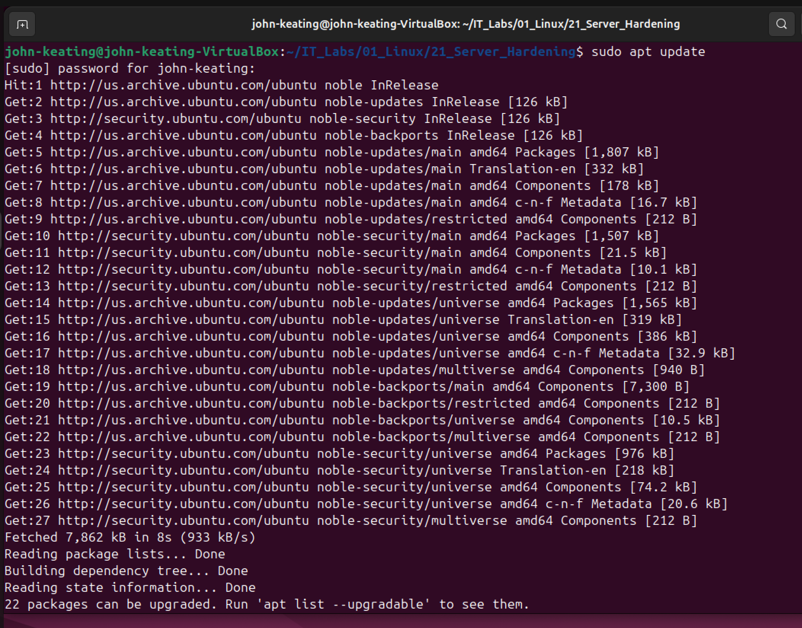
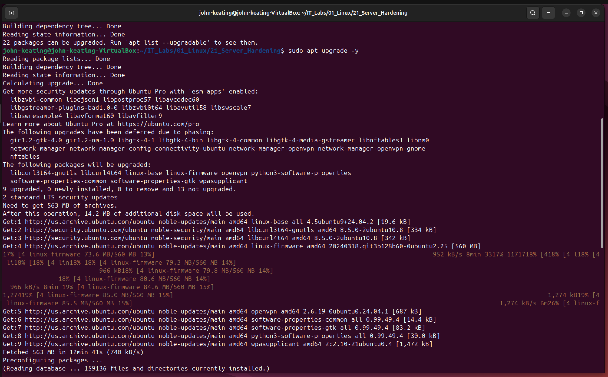
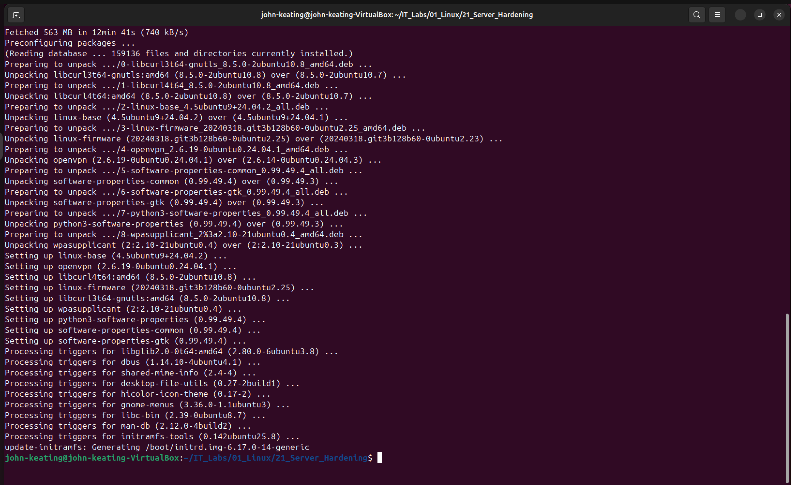
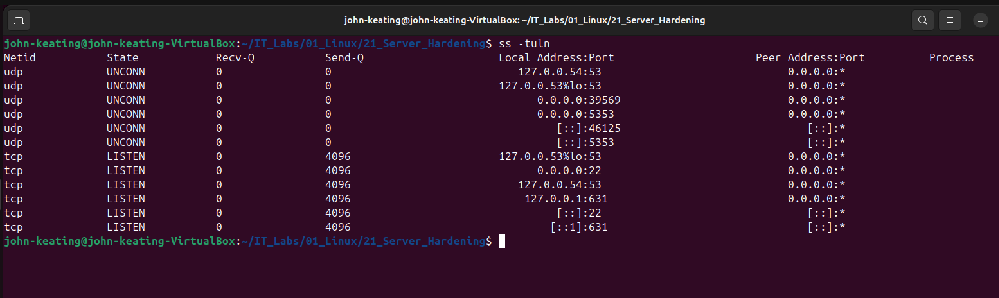
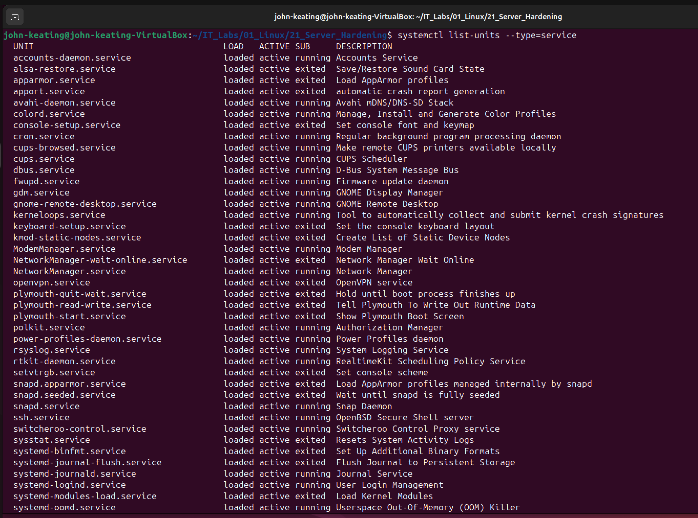
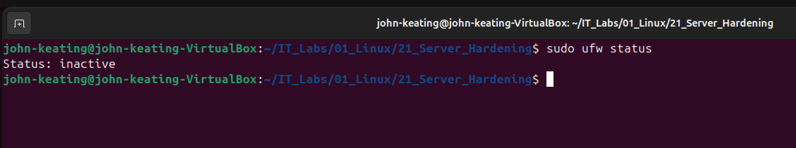

# Linux Server Hardening Lab

## Objective

The purpose of this lab is to demonstrate basic Linux server hardening techniques used by system administrators, DevOps engineers, and security engineers.

In this lab I performed several important security checks including:

* Updating the operating system
* Installing security updates
* Verifying open network ports
* Inspecting running services
* Checking firewall status

These steps help reduce the attack surface of a Linux system and ensure the system is properly maintained.

---

# Environment

* Ubuntu Linux (Virtual Machine)
* Oracle VirtualBox
* Bash Terminal
* Windows Host Machine
* GitHub Lab Repository

---

# Step 1 — Update System Package Lists

Command used:

```
sudo apt update
```

### Command Breakdown

| Part   | Meaning                                             |
| ------ | --------------------------------------------------- |
| sudo   | Runs the command with administrator privileges      |
| apt    | Ubuntu package management tool                      |
| update | Downloads the newest package list from repositories |

### Purpose

Updating package lists ensures the system knows about the latest available software updates and security patches.

---

# Step 2 — Install Security Updates

Command used:

```
sudo apt upgrade -y
```

### Command Breakdown

| Part    | Meaning                                            |
| ------- | -------------------------------------------------- |
| sudo    | Administrator privileges                           |
| apt     | Package manager                                    |
| upgrade | Installs the newest versions of installed packages |
| -y      | Automatically answers "yes" to prompts             |

### Purpose

Installing updates ensures the system receives the latest bug fixes and security patches.

---

# Step 3 — Verify System Upgrade Completion

After the upgrade finishes, the system installs updated packages and configures them automatically.

### Why this matters

Regular system updates help protect Linux systems from vulnerabilities and exploits.

---

# Step 4 — Check Open Network Ports

Command used:

```
ss -tuln
```

### Command Breakdown

| Part | Meaning                                                     |
| ---- | ----------------------------------------------------------- |
| ss   | Displays socket statistics (modern replacement for netstat) |
| -t   | Shows TCP ports                                             |
| -u   | Shows UDP ports                                             |
| -l   | Shows listening ports                                       |
| -n   | Displays numeric addresses instead of resolving hostnames   |

### Purpose

Checking open ports allows administrators to identify services that are listening for network connections.

Unnecessary open ports can increase the attack surface of a server.

---

# Step 5 — Check Running Services

Command used:

```
systemctl list-units --type=service
```

### Command Breakdown

| Part           | Meaning                              |
| -------------- | ------------------------------------ |
| systemctl      | Controls the systemd system manager  |
| list-units     | Displays active units                |
| --type=service | Filters output to show only services |

### Purpose

Inspecting running services helps administrators identify:

* unnecessary services
* misconfigured services
* potential security risks

---

# Step 6 — Check Firewall Status

Command used:

```
sudo ufw status
```

### Command Breakdown

| Part   | Meaning                            |
| ------ | ---------------------------------- |
| sudo   | Run with administrator privileges  |
| ufw    | Uncomplicated Firewall             |
| status | Displays firewall status and rules |

### Result

```
Status: inactive
```

This indicates that the firewall is installed but currently disabled.

In production environments the firewall would normally be enabled to restrict unauthorized network access.

---

# Screenshots

## System Updates



## Security Updates Installing



## System Upgrade Completed



## Open Ports Check



## Running Services



## Firewall Status



---

# Key Security Concepts

### Attack Surface

The attack surface refers to all possible points where an attacker could attempt to gain access to a system.

Reducing unnecessary services and open ports helps minimize this risk.

---

### Patch Management

Regularly updating systems ensures that security vulnerabilities are patched before they can be exploited.

---

### Service Management

Monitoring active services helps administrators ensure only necessary services are running.

---

### Firewall Protection

Firewalls help control incoming and outgoing network traffic based on defined security rules.

---

# What I Learned

During this lab I practiced several key Linux administration tasks including:

* Updating Linux systems
* Installing security patches
* Checking open ports
* Reviewing active services
* Inspecting firewall configuration

These skills are essential for roles such as:

* Linux System Administrator
* DevOps Engineer
* Cloud Engineer
* Cybersecurity Engineer
