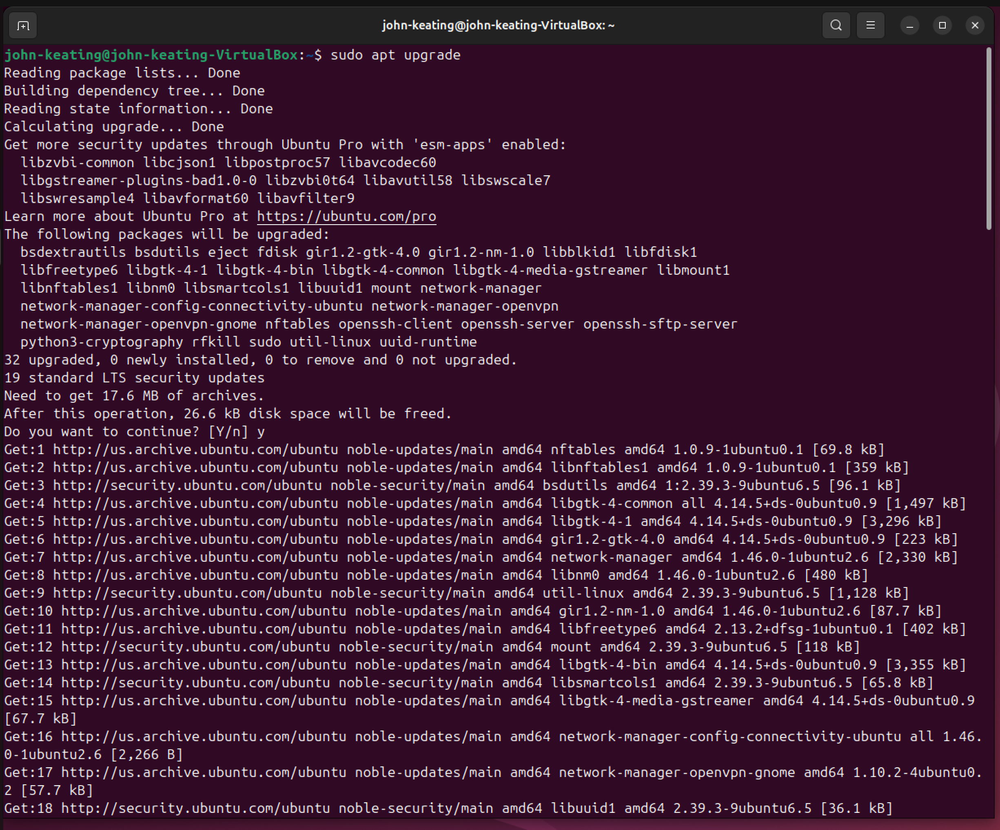
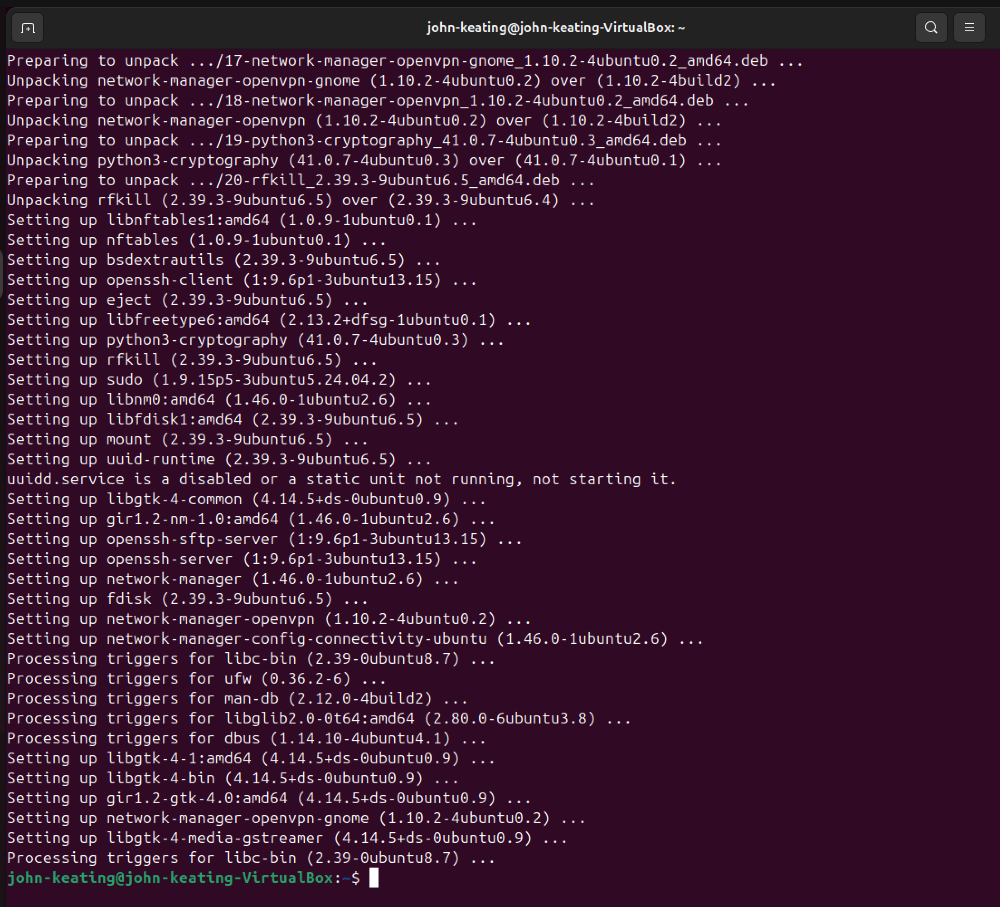
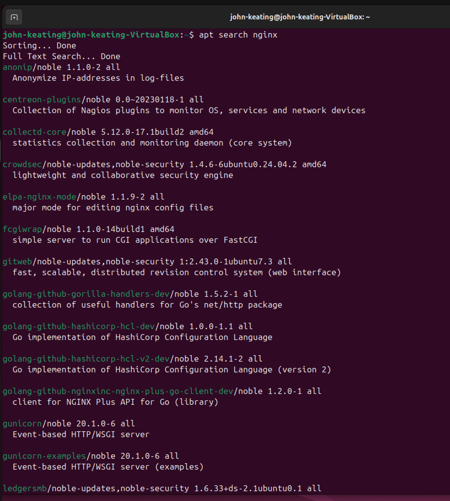
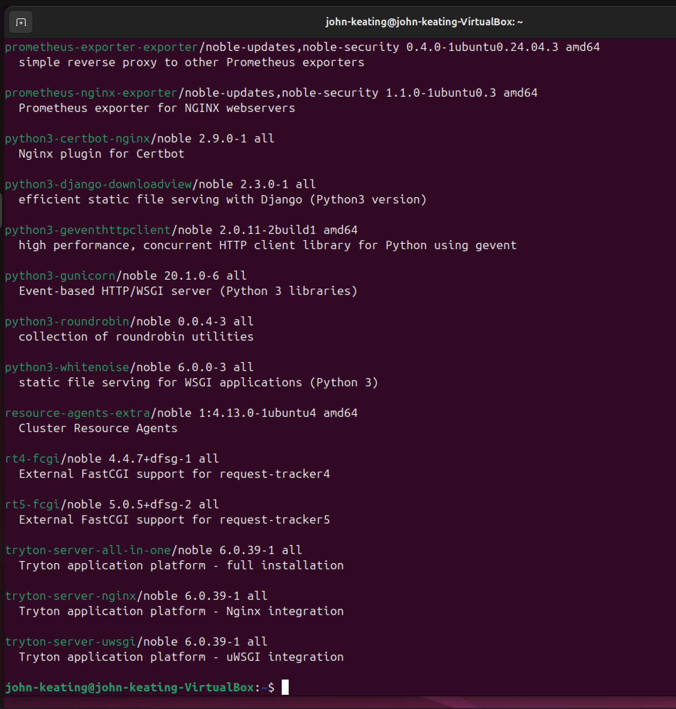
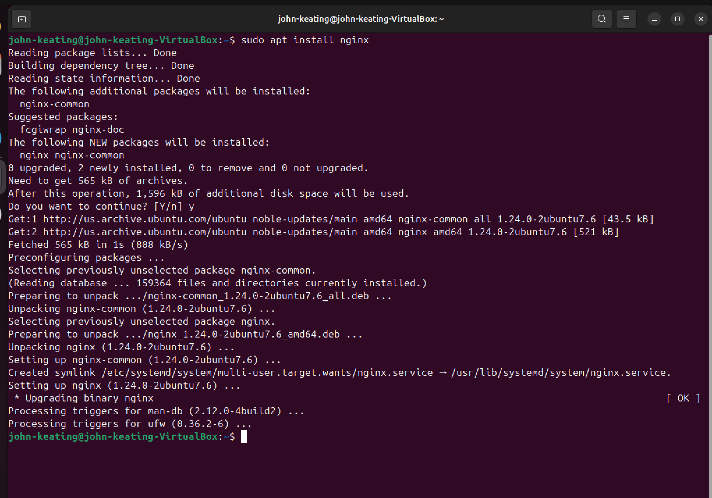
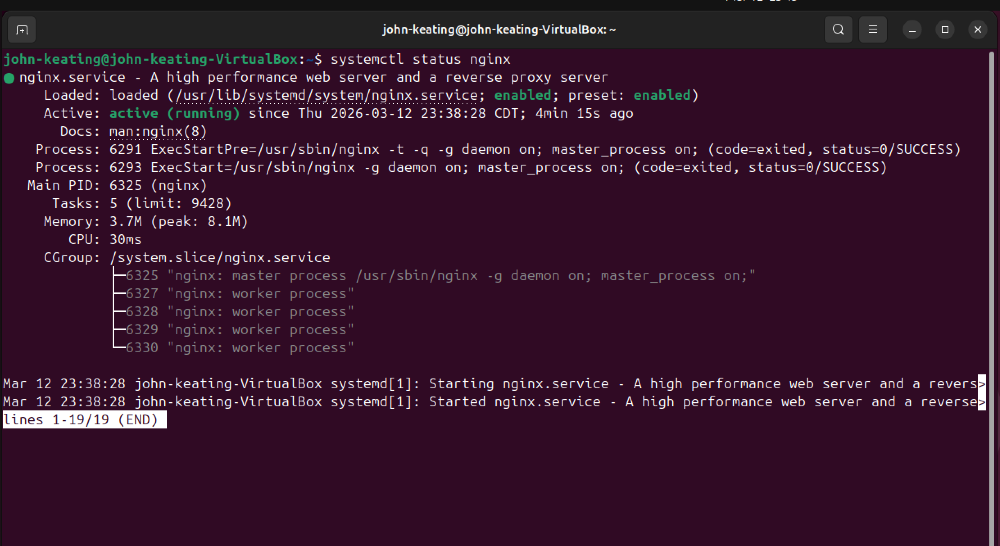
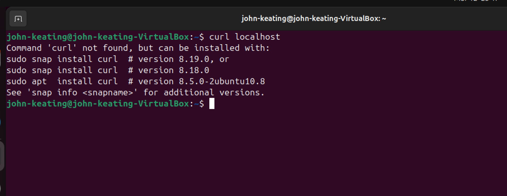
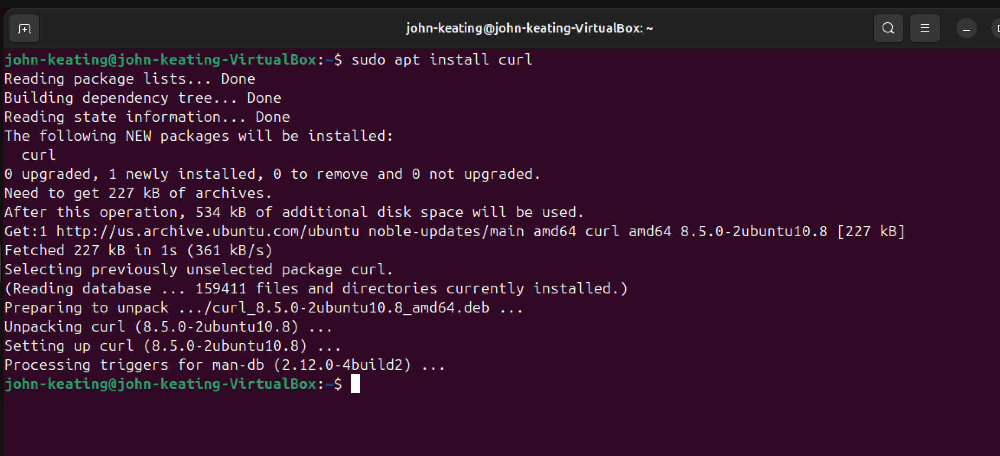
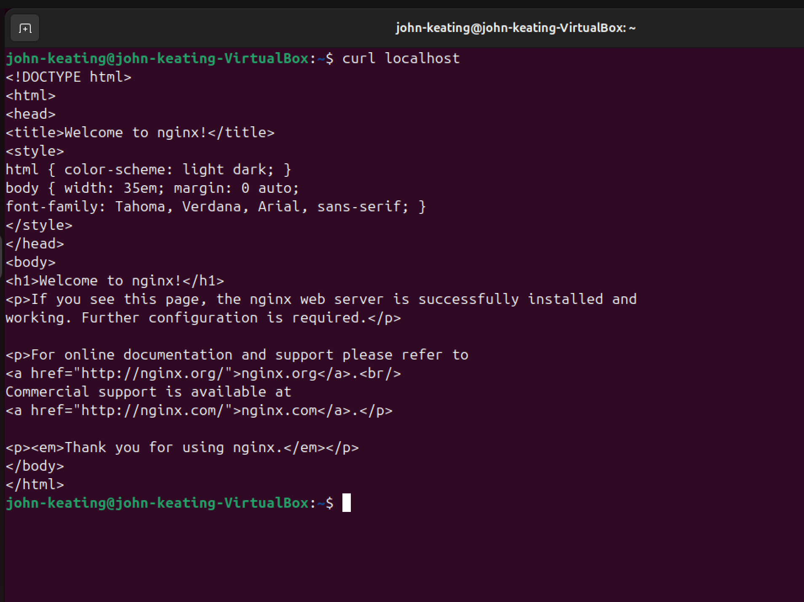
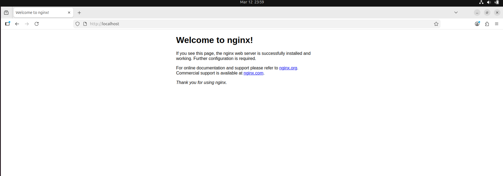

# Linux Fundamentals Lab 22 — Package Management (APT)

## Objective

The purpose of this lab is to understand how Linux administrators install, update, search, and verify software using the **APT package manager** in Ubuntu.

In this lab I practiced:

* Updating package repositories
* Upgrading installed packages
* Searching for software packages
* Installing packages
* Managing system services
* Testing installed software
* Verifying a working web server

These are core Linux administration skills used in **System Administration, Cloud Engineering, DevOps, and Cybersecurity roles.**

---

# Lab Environment

* **Operating System:** Ubuntu Linux (Virtual Machine)
* **Hypervisor:** Oracle VirtualBox
* **Host System:** Windows 11
* **Terminal:** Bash Shell
* **Web Server Installed:** Nginx
* **Networking:** Localhost testing

---

# Commands Used

| Command                  | Description                                                                    |
| ------------------------ | ------------------------------------------------------------------------------ |
| `sudo apt update`        | Updates the local package database with the newest available software versions |
| `sudo apt upgrade`       | Upgrades installed packages to the latest versions                             |
| `apt search nginx`       | Searches the package repository for nginx related packages                     |
| `sudo apt install nginx` | Installs the nginx web server                                                  |
| `systemctl status nginx` | Checks the status of the nginx service                                         |
| `curl localhost`         | Sends a request to the local web server and displays the HTML response         |
| `sudo apt install curl`  | Installs the curl tool used for HTTP requests                                  |

---

# Command Breakdown

## `sudo`

`sudo` stands for **Super User Do**.

It temporarily gives a normal user **administrator privileges** so they can run commands that modify the system.

Example:

```
sudo apt install nginx
```

Without sudo, a regular user cannot install software.

---

## `apt`

`apt` stands for **Advanced Package Tool**.

It is the package management system used by **Debian-based Linux distributions**, including:

* Ubuntu
* Debian
* Kali Linux
* Linux Mint

APT allows administrators to:

* install software
* remove software
* update software
* search repositories

---

## `apt update`

```
sudo apt update
```

This command refreshes the system’s **local package index**.

Linux does not automatically know when new software versions are available.
This command tells the system to **download the newest package lists from the repository servers.**

Think of it like **refreshing an app store catalog**.

---

## `apt upgrade`

```
sudo apt upgrade
```

This command upgrades installed software packages to the **latest available versions**.

It installs security patches, bug fixes, and improvements.

This step is essential for **system security and stability**.

---

## `apt search`

```
apt search nginx
```

This command searches the repository database for packages matching the keyword **nginx**.

Administrators use this command to find:

* available software
* package names
* descriptions of packages

---

## `apt install`

```
sudo apt install nginx
```

This command installs the **nginx web server** package.

APT automatically:

* downloads the package
* installs required dependencies
* configures the software
* registers system services

This makes package management **fast and automated**.

---

## `systemctl`

```
systemctl status nginx
```

`systemctl` is used to control **systemd services**.

Systemd is the service manager used by most modern Linux distributions.

With `systemctl`, administrators can:

* start services
* stop services
* restart services
* enable services at boot
* check service status

The command above confirms that **nginx is running**.

---

## `curl`

```
curl localhost
```

`curl` is a command line tool used to send **HTTP requests**.

It is commonly used to:

* test web servers
* interact with APIs
* download files
* troubleshoot networking

In this lab it sends a request to:

```
localhost
```

which means **the local machine itself**.

The server responded with the HTML code of the nginx welcome page.

---

# Important Symbols Explained

### `$`

```
john-keating@ubuntu:~$
```

The `$` symbol means the command is being run as a **normal user**.

---

### `#`

If you see:

```
root@server:#
```

The `#` symbol means the command is being run as the **root (administrator) user**.

---

### `localhost`

`localhost` is a special hostname that refers to **the local computer**.

Its IP address is:

```
127.0.0.1
```

It allows software to communicate with services running on the same machine.

---

### `/`

The `/` symbol represents the **root directory** of the Linux filesystem.

All files and directories originate from this root.

---

# Screenshots

## Update Package Database


---

## Upgrade Installed Packages





---

## Searching for Software





---

## Installing Nginx Web Server



---

## Verifying Nginx Service



---

## Troubleshooting Missing Tool



---

## Installing Curl



---

## Testing Web Server with Curl



---

## Opening the Web Server in Browser



---

# Key Concepts Learned

This lab demonstrated several essential Linux administration skills:

* Managing software with APT
* Installing and verifying services
* Using systemctl to manage system services
* Testing web servers with curl
* Understanding localhost networking
* Troubleshooting missing packages
* Verifying service functionality in a browser

These are fundamental tasks performed by:

* Linux System Administrators
* DevOps Engineers
* Cloud Engineers
* Cybersecurity Analysts

---

# Conclusion

In this lab I successfully installed and configured the **Nginx web server** using Ubuntu’s APT package manager.

I verified the installation by:

1. Checking the service status with `systemctl`
2. Sending an HTTP request using `curl`
3. Opening the web server in a browser

This lab demonstrates the full lifecycle of **Linux package management and service verification**, which is a critical skill for working with Linux systems in professional environments.
