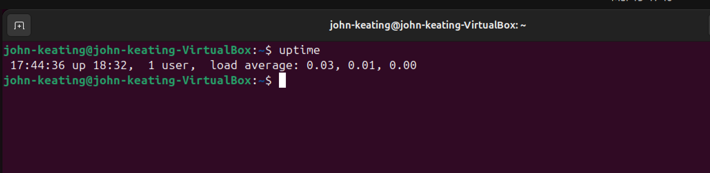
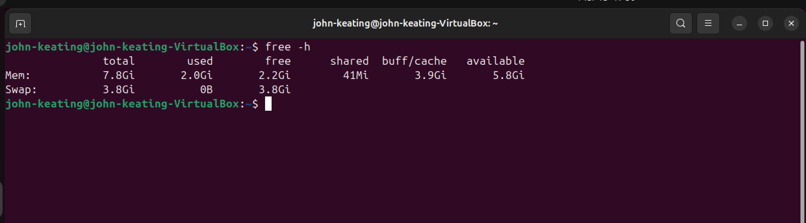
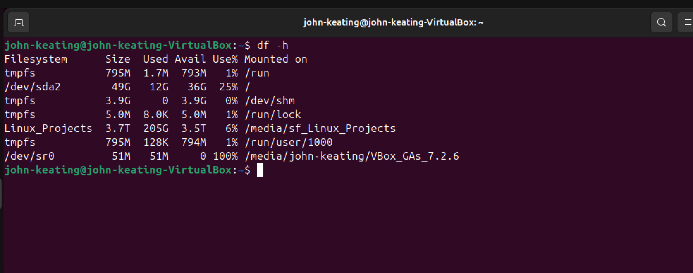
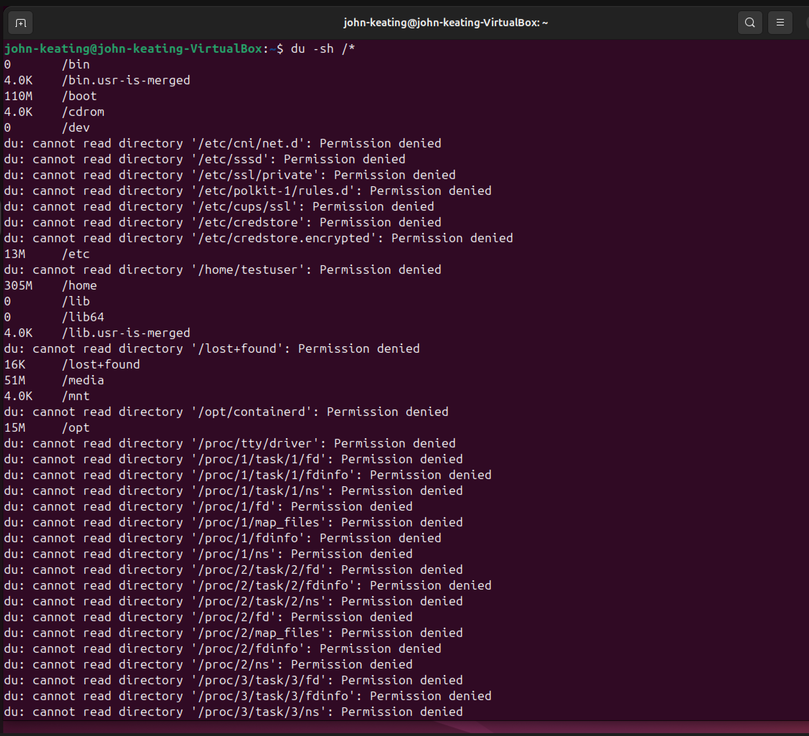
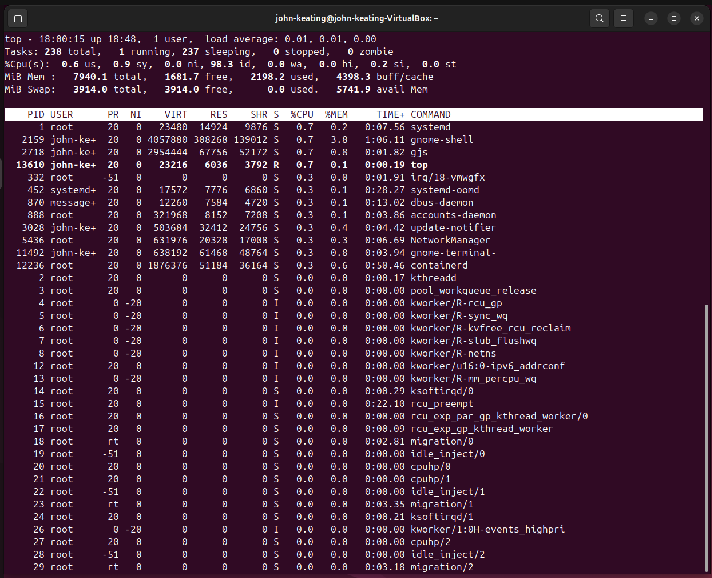
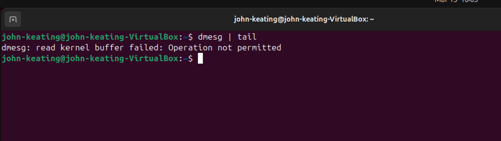
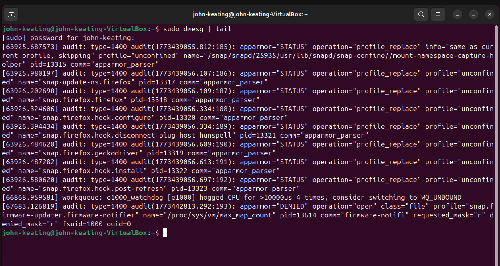
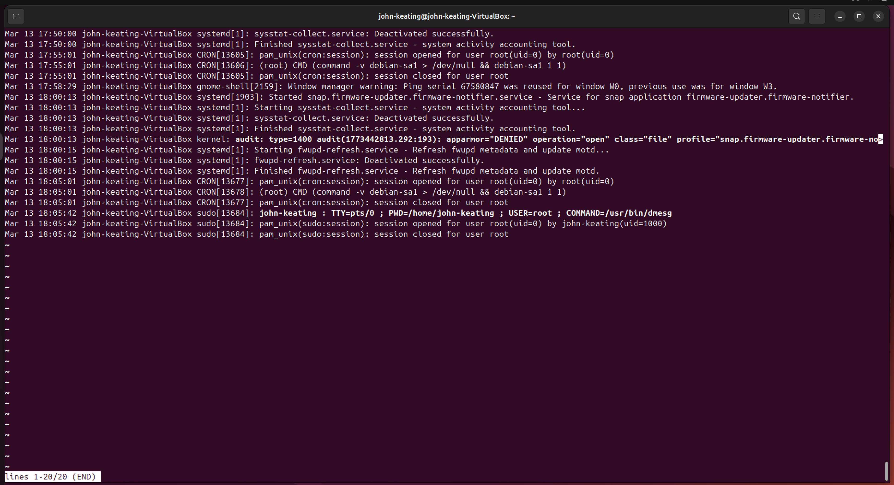

# Linux Lab 24 — System Troubleshooting

## Objective

The objective of this lab is to practice common Linux troubleshooting techniques using built-in system monitoring tools.

In this lab we investigated:

* system uptime
* memory usage
* disk usage
* directory storage usage
* running processes
* kernel logs
* system logs

These commands are commonly used by:

* Linux Administrators
* DevOps Engineers
* Cloud Engineers
* Site Reliability Engineers (SRE)
* Platform Engineers

Understanding these tools is essential for diagnosing system performance issues.

---

# Environment

* Ubuntu Linux (VirtualBox VM)
* Bash Terminal
* Windows Host Machine
* GitHub Lab Repository

---

# Commands Used

| Command      | Description                              |
| ------------ | ---------------------------------------- |
| `uptime`     | Displays system uptime and load averages |
| `free -h`    | Shows system memory usage                |
| `df -h`      | Displays disk space usage                |
| `du -sh /*`  | Shows directory storage usage            |
| `top`        | Displays a live process monitor          |
| `dmesg`      | Shows kernel messages                    |
| `journalctl` | Displays system log entries              |

---

# Command Breakdown

## uptime

Command:

```
uptime
```

Example output:

```
17:44:36 up 18:32, 1 user, load average: 0.03, 0.01, 0.00
```

Meaning:

| Part           | Explanation                                         |
| -------------- | --------------------------------------------------- |
| `17:44:36`     | Current system time                                 |
| `up 18:32`     | System has been running for 18 hours and 32 minutes |
| `1 user`       | Number of logged-in users                           |
| `load average` | System workload over 1, 5, and 15 minutes           |

Load averages measure **CPU demand**.

Lower numbers generally mean the system is under light load.

---

## free -h

Command:

```
free -h
```

Explanation:

| Column     | Meaning                           |
| ---------- | --------------------------------- |
| total      | Total system memory               |
| used       | Memory currently in use           |
| free       | Available unused memory           |
| buff/cache | Memory used for caching           |
| available  | Memory available for applications |

The `-h` flag means **human readable**.

This converts memory values into:

* MB
* GB

instead of raw bytes.

---

## df -h

Command:

```
df -h
```

Displays disk usage.

Columns explained:

| Column     | Meaning                             |
| ---------- | ----------------------------------- |
| Filesystem | Disk partition                      |
| Size       | Total disk size                     |
| Used       | Space currently used                |
| Avail      | Remaining available space           |
| Use%       | Percentage of disk used             |
| Mounted on | Directory where the disk is mounted |

Example mount points:

* `/`
* `/home`
* `/boot`

---

## du -sh /*

Command:

```
du -sh /*
```

Breakdown:

| Part | Meaning                                |
| ---- | -------------------------------------- |
| `du` | Disk usage                             |
| `-s` | Summary output                         |
| `-h` | Human readable format                  |
| `/*` | All directories in the root filesystem |

This command helps identify **which directories use the most disk space**.

Permission denied messages may appear for protected directories.

Example:

```
Permission denied
```

This occurs because some system folders require **root privileges**.

---

## top

Command:

```
top
```

`top` displays a **live system process monitor**.

It shows:

* CPU usage
* memory usage
* running processes
* system load

Important columns:

| Column  | Meaning                  |
| ------- | ------------------------ |
| PID     | Process ID               |
| USER    | User running the process |
| %CPU    | CPU usage                |
| %MEM    | Memory usage             |
| COMMAND | Program name             |

To exit `top` press:

```
q
```

---

## dmesg

Command:

```
dmesg | tail
```

`dmesg` displays **kernel messages**.

Kernel messages include:

* hardware detection
* driver loading
* boot events
* system warnings

Modern Linux systems restrict kernel log access for security.

Example message:

```
Operation not permitted
```

Running the command with elevated privileges fixes this.

Command:

```
sudo dmesg | tail
```

This displays the **latest kernel log entries**.

---

## journalctl

Command:

```
journalctl -n 20
```

Breakdown:

| Part         | Meaning                       |
| ------------ | ----------------------------- |
| `journalctl` | System log viewer             |
| `-n`         | Display number of log entries |
| `20`         | Show the last 20 log lines    |

The system journal records:

* service activity
* authentication events
* system startup logs
* warnings and errors

---

# Screenshots

## System Uptime



Shows system uptime and load averages.

---

## Memory Usage



Displays RAM usage statistics.

---

## Disk Usage



Shows disk space usage for mounted filesystems.

---

## Directory Storage Usage



Displays the storage usage of directories in the root filesystem.

---

## Process Monitor



Shows active processes and system resource usage.

---

## Kernel Log Permission Error



Demonstrates restricted access to kernel logs for non-root users.

---

## Kernel Messages with sudo



Displays recent kernel messages using elevated privileges.

---

## System Logs



Displays recent system logs using `journalctl`.

---

# Key Concepts Learned

This lab demonstrated several important Linux troubleshooting concepts:

* Monitoring system uptime
* Checking memory usage
* Analyzing disk space usage
* Investigating directory storage usage
* Monitoring running processes
* Accessing kernel logs
* Viewing system logs

These tools are essential for diagnosing system performance and stability issues.

---

# Real World Importance

System troubleshooting is a fundamental skill for IT professionals.

Linux administrators use these tools to:

* diagnose performance issues
* detect system failures
* monitor system resources
* investigate system logs
* identify runaway processes
* analyze system activity

These troubleshooting techniques are used daily in:

* cloud infrastructure
* DevOps environments
* data centers
* enterprise Linux systems
* container platforms

---

# Lab Conclusion

In this lab we practiced core Linux troubleshooting commands used to analyze system performance, resource usage, and system logs.

Understanding these commands allows administrators to quickly diagnose system issues and maintain system stability.
