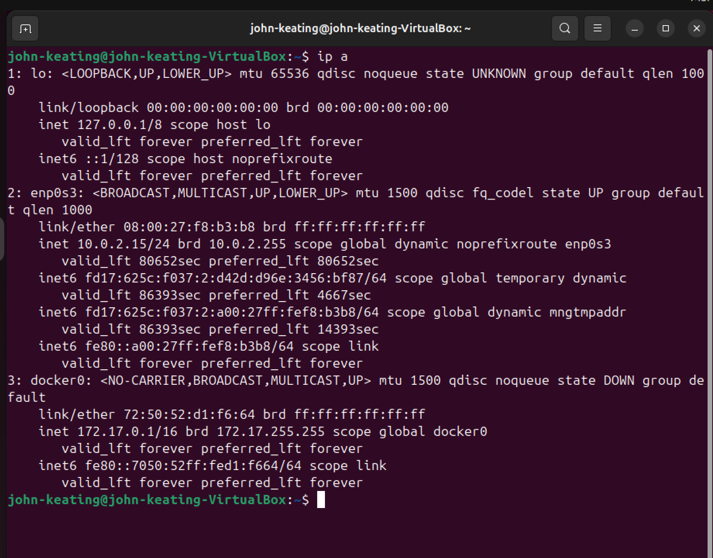
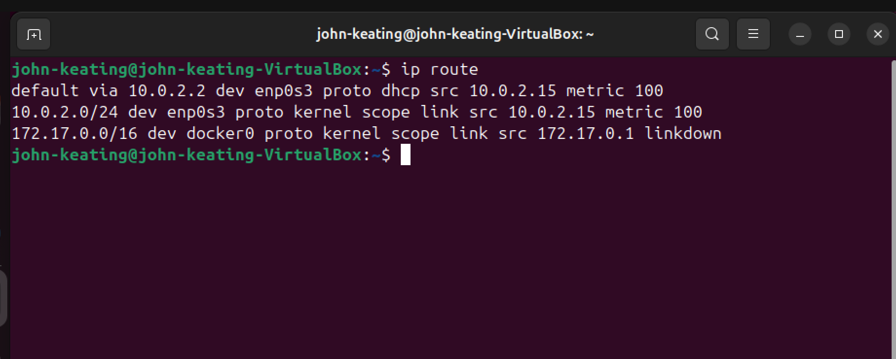
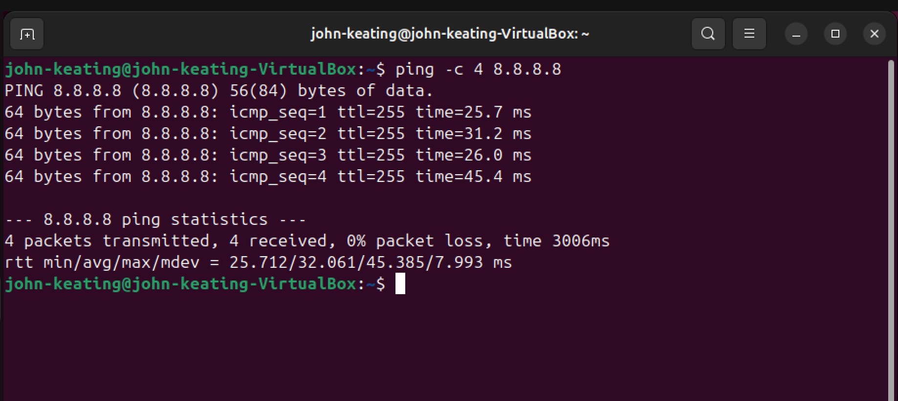
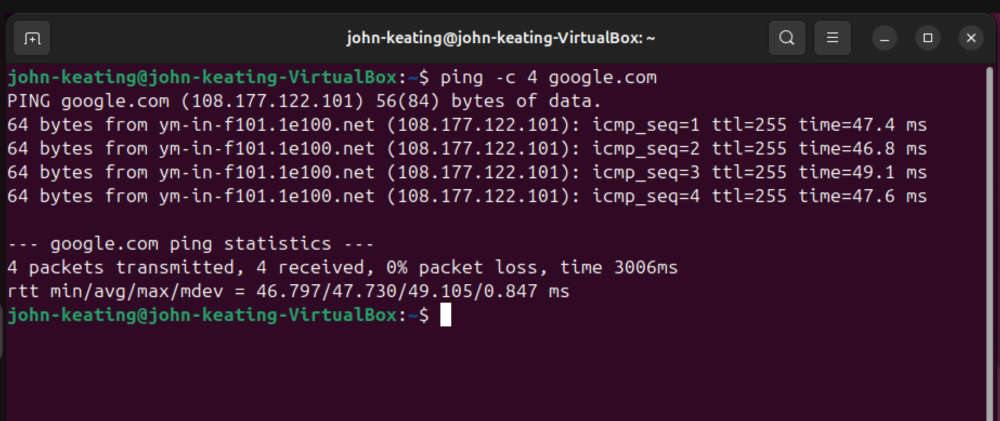
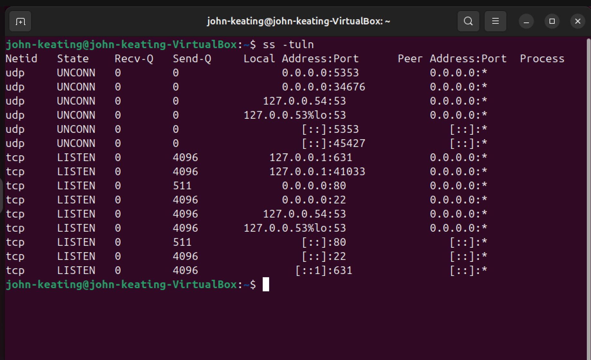
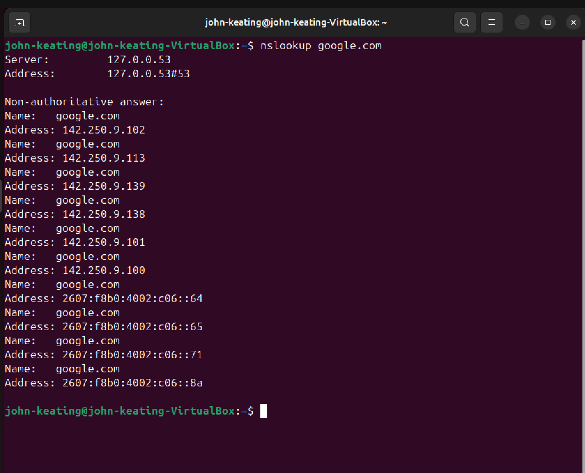

# Linux Lab 25 — Network Troubleshooting

## Objective

The objective of this lab was to practice diagnosing network connectivity issues using common Linux networking tools.

Network troubleshooting is a critical skill for Linux system administrators, DevOps engineers, cloud engineers, and cybersecurity professionals.

In this lab I verified several layers of the networking stack including:

- Network interface configuration
- Routing configuration
- Internet connectivity
- DNS resolution
- Listening network services

By verifying each layer step-by-step, administrators can quickly isolate where a networking problem exists.

---

## Environment

Ubuntu Linux Virtual Machine  
Oracle VirtualBox  
Bash Terminal  
Windows Host Machine  
GitHub Lab Repository

---

## Commands Used

ip a — Displays network interfaces and IP addresses  
ip route — Displays the system routing table  
ping — Tests network connectivity between systems  
ss -tuln — Displays listening network ports and services  
nslookup — Queries DNS servers for domain name resolution  

---

## Step 1 — Check Network Interfaces

Command used:

ip a

### Command Explanation

ip  
The modern Linux networking command used to manage network interfaces, addresses, and routing information.

a  
Short for "address". Displays all network interfaces and their assigned IP addresses.

### What This Command Shows

This command displays:

- Network interface names
- IPv4 addresses
- IPv6 addresses
- MAC addresses
- Interface status

Example interface:

enp0s3

This is the primary network interface used by the virtual machine.

### Important Networking Concepts

Loopback Interface

lo

The loopback interface allows a system to communicate with itself.

Example address:

127.0.0.1

This address always refers to the local machine.

---

## Step 2 — Check Routing Table

Command used:

ip route

### Command Explanation

ip  
Linux networking management command.

route  
Displays the routing table which determines how network packets are sent to other networks.

Example routing entry:

default via 10.0.2.2 dev enp0s3

### Important Terms

Default Gateway

10.0.2.2

The gateway is the device that forwards traffic from the local network to other networks, including the internet.

dev

Indicates the network interface used for the route.

Example:

dev enp0s3

This means traffic exits through the interface enp0s3.

---

## Step 3 — Test Internet Connectivity

Command used:

ping -c 4 8.8.8.8

### Command Explanation

ping

A network utility used to test connectivity between two systems by sending ICMP echo requests.

### Flag Explanation

-c

Specifies how many packets to send.

Example:

-c 4

Send four packets and stop.

### Target Address

8.8.8.8

This is Google’s public DNS server and is commonly used to test internet connectivity.

### What This Test Confirms

- Network interface is working
- Routing configuration is correct
- Internet connectivity exists

---

## Step 4 — Test DNS Resolution

Command used:

ping -c 4 google.com

### Why This Test Is Important

The previous ping test used an IP address.

This test uses a domain name.

For the system to contact a domain name, DNS must translate the name into an IP address.

Example translation:

google.com → 108.177.122.101

If this test succeeds, it confirms:

- DNS resolution is functioning
- Internet connectivity works
- The system can resolve domain names

---

## Step 5 — Check Listening Network Ports

Command used:

ss -tuln

### Command Explanation

ss

Socket statistics command used to inspect network connections and listening ports.

This command replaces the older tool:

netstat

### Flag Explanation

-t  
Show TCP connections

-u  
Show UDP connections

-l  
Show listening services

-n  
Display numeric addresses instead of resolving hostnames

### Example Output

0.0.0.0:22

### Important Networking Concepts

Port

A numbered communication endpoint used by network services.

Common ports include:

22 — SSH remote access  
80 — HTTP web server  
53 — DNS service  
631 — Linux printing service (CUPS)

LISTEN state

Indicates a service waiting for incoming connections.

---

## Step 6 — Query DNS Server

Command used:

nslookup google.com

### Command Explanation

nslookup

Queries DNS servers to retrieve the IP address associated with a domain name.

Example output:

Server: 127.0.0.53

This indicates the system is using Ubuntu's local DNS resolver.

### DNS Server Explanation

127.0.0.53

This address belongs to:

systemd-resolved

Ubuntu's local DNS resolver service.

### Returned Addresses

Multiple IP addresses were returned for google.com.

Large services use multiple servers and load balancing to distribute traffic across their infrastructure.

---

## Screenshots

### Network Interface Information

### Routing Table

### Ping Test to Public DNS

### Ping Domain Name

### Listening Ports

### DNS Lookup

---

## Key Networking Concepts

DNS — Domain Name System

DNS translates human-readable domain names into IP addresses.

Example:

google.com → 142.250.x.x

ICMP — Internet Control Message Protocol

Used by the ping command to test connectivity.

Routing Table

A list of routes that determine how packets leave the system.

Network Ports

Ports allow multiple applications and services to communicate over a network.

---

## What I Learned

In this lab I learned the structured process Linux administrators use to diagnose network connectivity problems.

The troubleshooting workflow involves verifying:

1. Network interfaces
2. Routing configuration
3. Internet connectivity
4. DNS resolution
5. Listening network services

By testing each layer of the networking stack, administrators can quickly determine where connectivity problems originate.

These skills are essential for careers in:

Linux System Administration  
DevOps Engineering  
Cloud Infrastructure  
Cybersecurity Operations
