# Linux User Environment & Shell Configuration Lab

## Objective

The purpose of this lab is to understand how Linux manages **user environments**, **shell configuration files**, and **environment variables**.

In this lab I explored:

* Hidden configuration files
* User shell environment variables
* The system PATH variable
* Bash shell configuration files
* Creating command aliases
* Persisting custom shell settings using `.bashrc`

These concepts are extremely important for **Linux administration, DevOps engineering, cloud infrastructure management, and cybersecurity operations**.

---

# Environment

Operating System:
Ubuntu Linux (Virtual Machine)

Virtualization:
Oracle VirtualBox

Host Machine:
Windows 11

Tools Used:

* Bash Terminal
* GNU Nano text editor
* VS Code
* Git Bash
* GitHub

---

# Commands Used

| Command            | Description                            |
| ------------------ | -------------------------------------- |
| `ls -a`            | Lists all files including hidden files |
| `printenv`         | Displays environment variables         |
| `echo $PATH`       | Displays the PATH variable             |
| `nano ~/.bashrc`   | Opens the Bash configuration file      |
| `alias`            | Creates a shortcut command             |
| `source ~/.bashrc` | Reloads the Bash configuration         |
| `ll`               | Custom alias for `ls -lah`             |

---

# Command Definitions

## ls

`ls` means **list**.

It displays files and directories inside the current folder.

Example:

ls

---

## ls -a

The `-a` flag means **all files**.

This shows **hidden files**, which normally start with a dot (`.`).

Example hidden files:

.bashrc
.profile
.config

These files store **user configuration settings**.

Command used:

ls -a

---

## printenv

`printenv` displays **environment variables** currently loaded in the Linux session.

Environment variables store system information such as:

* user name
* home directory
* shell type
* terminal configuration
* system paths

Command used:

printenv

---

## echo

`echo` prints text or variable values to the terminal.

Example:

echo hello

Output:

hello

In this lab we used echo to display the PATH variable.

Command used:

echo $PATH

---

# Important Symbol Explanation

## $

The `$` symbol tells Linux to **retrieve the value of a variable**.

Example:

echo $PATH

Without `$`, Linux would print the word PATH instead of the value.

---

# PATH Variable

The **PATH variable** tells Linux where to search for executable programs.

Example output:

/usr/local/sbin
/usr/local/bin
/usr/sbin
/usr/bin
/sbin
/bin

When you type a command like:

ls

Linux searches these directories to find the program.

This allows commands to run **without typing the full path**.

---

# nano

`nano` is a simple **terminal text editor** used to edit configuration files.

Command used:

nano ~/.bashrc

This opens the `.bashrc` configuration file.

---

# ~ Symbol

The tilde symbol `~` represents the **current user's home directory**.

Example:

~/Documents

Means:

/home/username/Documents

In this lab:

nano ~/.bashrc

Means:

nano /home/username/.bashrc

---

# .bashrc File

`.bashrc` is a **Bash shell configuration file**.

It runs automatically every time a new terminal session starts.

It is used to configure:

* shell behavior
* environment variables
* aliases
* prompt appearance

This allows users to customize their Linux environment.

---

# alias Command

`alias` creates a **shortcut command**.

Example:

alias ll='ls -lah'

This allows the command:

ll

to run:

ls -lah

---

# ls -lah Breakdown

| Option | Meaning                   |
| ------ | ------------------------- |
| `l`    | Long listing format       |
| `a`    | Show hidden files         |
| `h`    | Human readable file sizes |

Example:

ls -lah

This shows:

* file permissions
* file ownership
* file sizes
* hidden files

---

# source Command

The `source` command reloads a configuration file **without restarting the terminal**.

Command used:

source ~/.bashrc

This forces Bash to re-read the configuration file.

Without this command you would need to **close and reopen the terminal**.

---

## Screenshots

### Screenshot 01 — Home Directory

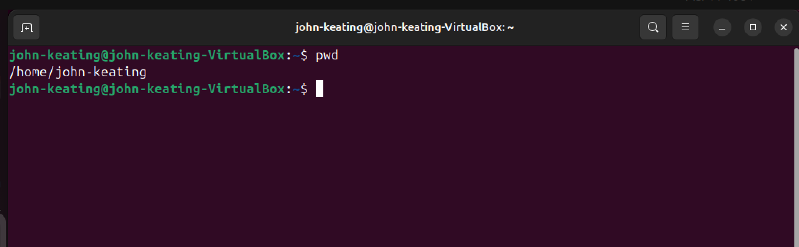

Explanation:  
This screenshot shows the user’s Linux home directory. The home directory is the default working directory for a Linux user account and stores personal files, configuration files, and user-specific data.

---

### Screenshot 02 — Hidden User Files

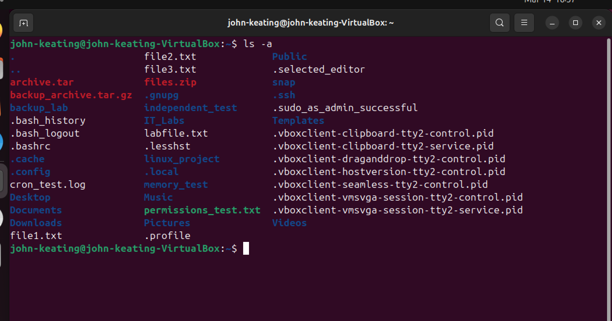

Command Used:  
`ls -a`

Explanation:  
This screenshot shows hidden files in the user's home directory. Files that begin with a dot (`.`) are hidden configuration files in Linux. Examples include `.bashrc`, `.profile`, and `.config`. These files control user environment settings and shell behavior.

---

### Screenshot 03 — Top of .bashrc File

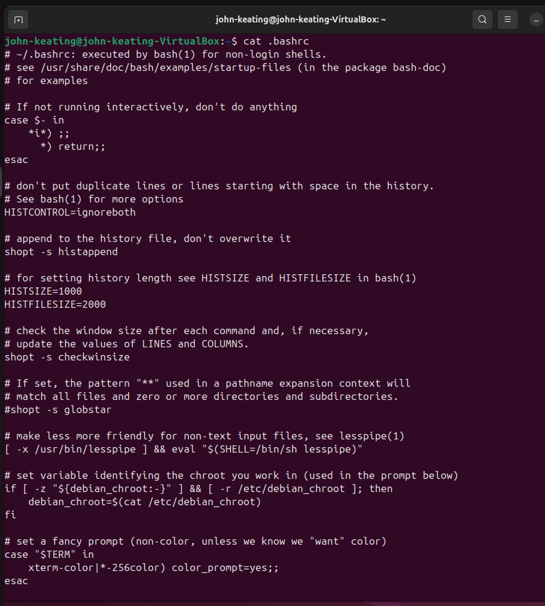

Command Used:  
`nano ~/.bashrc`

Explanation:  
This screenshot shows the top section of the `.bashrc` file opened in the Nano text editor. The `.bashrc` file contains Bash shell configuration settings that run automatically whenever a new terminal session starts.

---

### Screenshot 04 — Bottom of .bashrc File

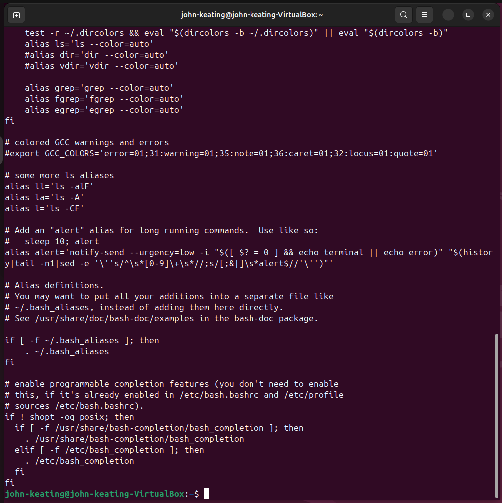

Explanation:  
This screenshot shows the bottom section of the `.bashrc` file. This area is commonly used for user-defined configurations such as aliases, environment variables, and other custom shell settings.

---

### Screenshot 05 — .profile Contents

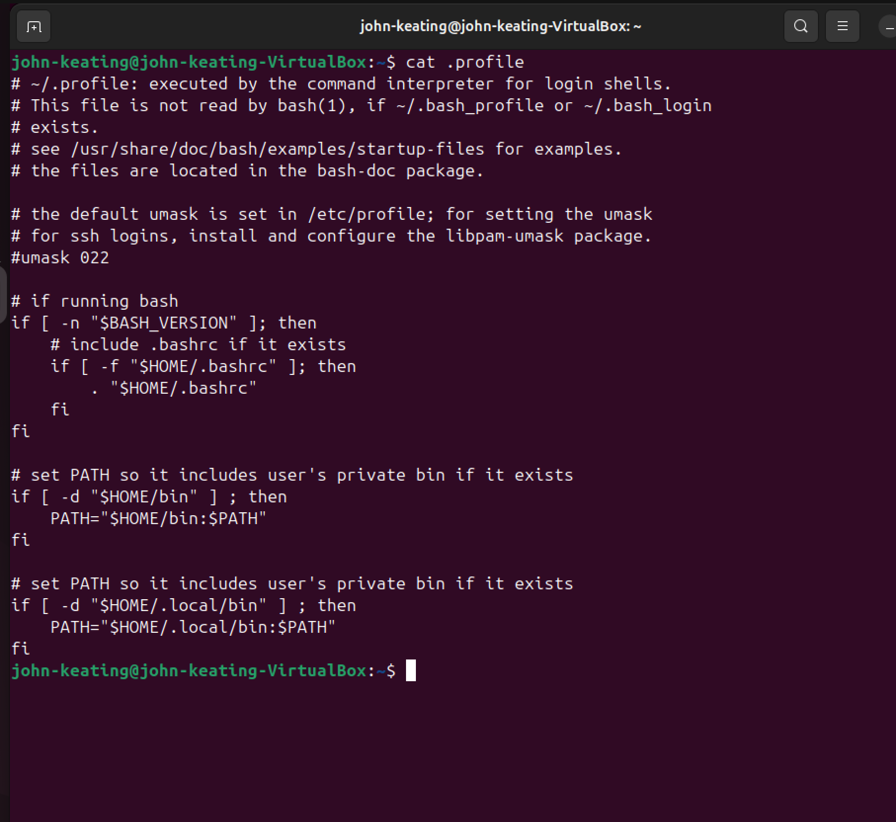

Command Used:  
`nano ~/.profile`

Explanation:  
This screenshot shows the contents of the `.profile` configuration file. The `.profile` file is executed during login and is used to configure environment variables and startup behavior for the user's shell session.

---

### Screenshot 06 — Environment Variables (Top)

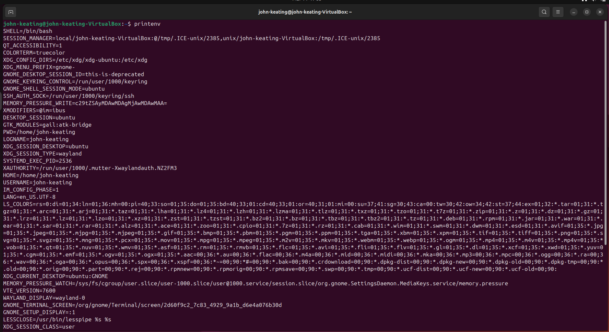

Command Used:  
`printenv`

Explanation:  
This screenshot shows the top portion of environment variables displayed using the `printenv` command. Environment variables store system information such as the current user, shell, home directory, and other session configuration values.

---

### Screenshot 07 — Environment Variables (Bottom)

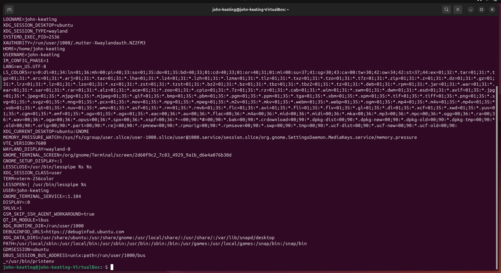

Command Used:  
`printenv`

Explanation:  
This screenshot shows the continuation of environment variables printed by the `printenv` command. These variables help define how programs behave and how the system environment is configured.

---

### Screenshot 08 — PATH Variable

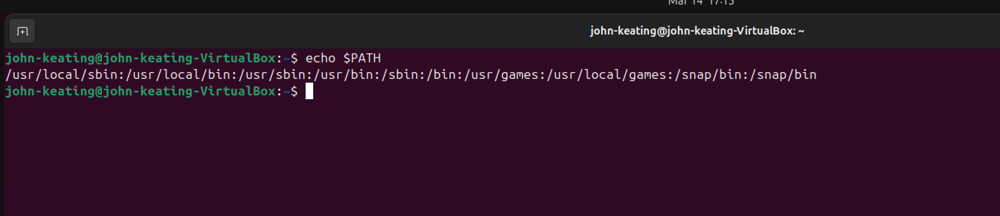

Command Used:  
`echo $PATH`

Explanation:  
This screenshot shows the PATH environment variable. The PATH variable contains a list of directories separated by colons (`:`). When a command is entered in the terminal, Linux searches these directories to locate the executable program.

---

### Screenshot 09 — Alias Test

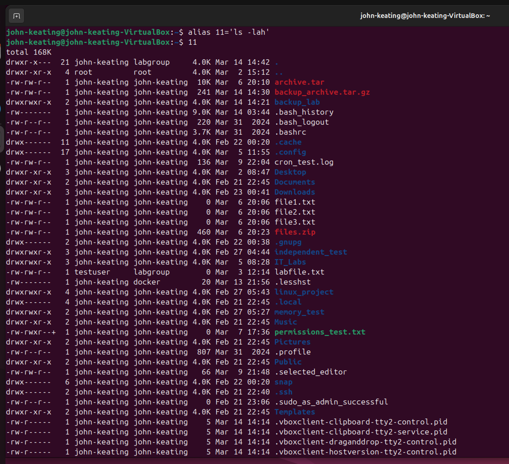

Command Used:  
`alias ll='ls -lah'`

Explanation:  
This screenshot shows the creation and testing of a Bash alias. An alias creates a shortcut command. In this case, the alias `ll` runs the command `ls -lah`, which displays a detailed directory listing including hidden files and human-readable file sizes.

---

### Screenshot 10 — Editing .bashrc (Top)

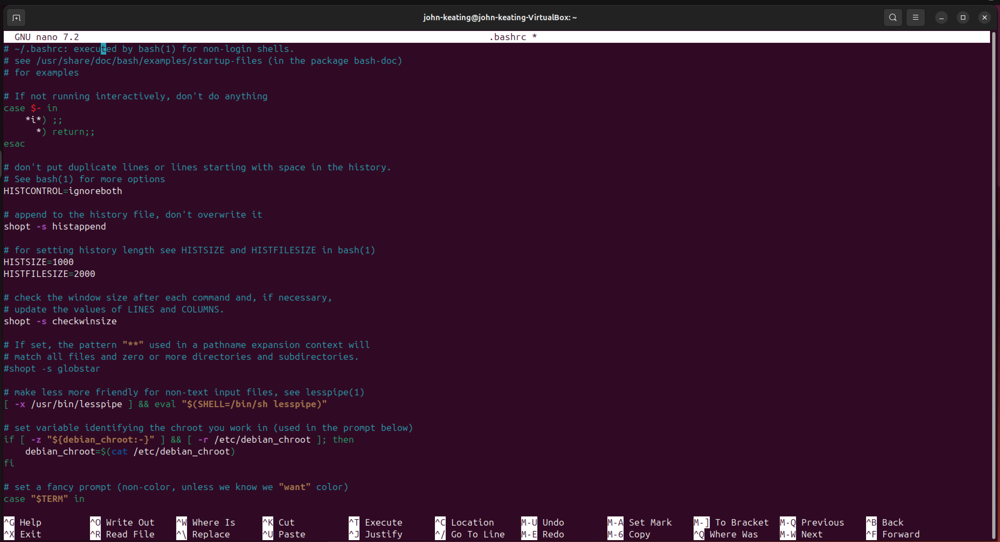

Command Used:  
`nano ~/.bashrc`

Explanation:  
This screenshot shows the `.bashrc` file being edited in the Nano text editor. The alias command was added so the shortcut command will load automatically whenever a new terminal session starts.

---

### Screenshot 11 — Editing .bashrc (Bottom)

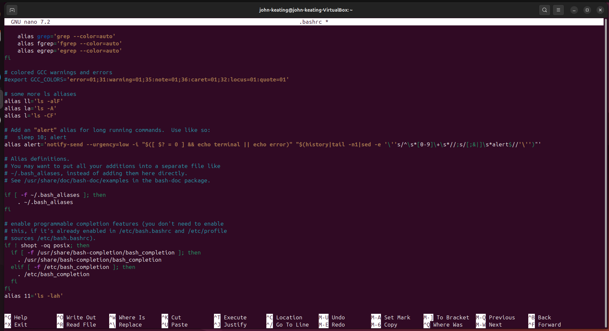

Explanation:  
This screenshot shows the bottom section of the `.bashrc` file where the alias command was added. Saving the alias here makes the command shortcut persistent for the user.

---

### Screenshot 12 — Alias Loaded After Reloading Bash

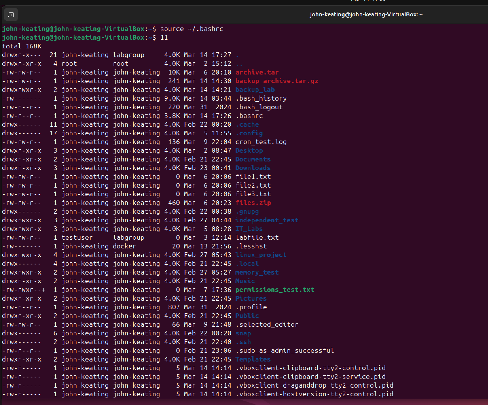

Commands Used:  
`source ~/.bashrc`  
`ll`

Explanation:  
This screenshot shows the Bash configuration being reloaded using `source ~/.bashrc`. After reloading the configuration, the `ll` alias works successfully and displays a detailed directory listing. This confirms the alias was correctly saved in the `.bashrc` configuration file.
---

# Key Concepts Learned

Hidden files store Linux configuration settings.

Environment variables control system behavior and user sessions.

The PATH variable determines where Linux searches for executable programs.

The `.bashrc` file configures the Bash shell environment.

Aliases allow users to create shortcuts for frequently used commands.

The `source` command reloads configuration files without restarting the terminal.

---

# Why This Matters

Understanding shell configuration and environment variables is essential for:

* Linux System Administration
* DevOps Engineering
* Cloud Infrastructure Management
* Cybersecurity Operations

Professionals frequently customize `.bashrc` to improve productivity and automate workflows.

---

# Lab Summary

In this lab I explored the Linux user environment, examined shell configuration files, inspected environment variables, and created a permanent Bash alias using the `.bashrc` configuration file.

This lab demonstrates foundational Linux administration skills used in real-world cloud and DevOps environments.

