# Linux Lab 28 — File System Permissions (ACL)

## Objective

The objective of this lab is to understand how **Access Control Lists (ACLs)** work in Linux and how they extend traditional file permission models.

In this lab I learned how to:

- View standard Linux permissions
- Inspect existing ACL entries
- Add ACL permissions to a user
- Modify ACL permissions
- Remove ACL entries
- Apply ACL permissions to directories
- Configure **default ACLs** for future files

ACLs are commonly used in **enterprise Linux environments** where multiple users require different permission levels on the same file or directory.

---

# Environment

- Ubuntu Linux (Virtual Machine)
- Oracle VirtualBox
- Windows 11 Host Machine
- Bash Terminal
- VS Code
- GitHub Lab Repository

---

# Key Linux Concepts

## Standard Linux Permissions

Linux normally uses **three permission groups**:

| Category | Meaning |
|--------|--------|
| User | File owner |
| Group | Members of the assigned group |
| Other | Everyone else |

Permissions are represented as:

| Symbol | Meaning |
|------|------|
| r | Read |
| w | Write |
| x | Execute |

Example:

```
-rw-rw-r--+
```

Breakdown:

| Section | Meaning |
|------|------|
| - | Regular file |
| rw- | Owner permissions |
| rw- | Group permissions |
| r-- | Other users |
| + | Indicates **ACL permissions exist**

---

# What is an ACL?

An **Access Control List (ACL)** allows administrators to assign permissions to **specific users or groups beyond the traditional permission model**.

Example:

```
user:nobody:rwx
```

This means:

User **nobody** has:

- Read
- Write
- Execute

permissions on the file.

---

# Commands Used

| Command | Description |
|------|------|
| `mkdir` | Creates a new directory |
| `cd` | Changes the current directory |
| `pwd` | Displays the current working directory |
| `touch` | Creates an empty file |
| `ls -l` | Lists files with detailed permissions |
| `getfacl` | Displays Access Control List permissions |
| `setfacl` | Modifies ACL permissions |
| `clear` | Clears the terminal screen |
| `sudo` | Runs a command with administrator privileges |

---

# Command Breakdown

## Creating a Directory

```
mkdir acl_lab
```

| Component | Meaning |
|------|------|
| mkdir | Make directory |
| acl_lab | Name of the new directory |

---

## Viewing File Permissions

```
ls -l
```

| Component | Meaning |
|------|------|
| ls | List directory contents |
| -l | Long format showing permissions, owner, and timestamps |

---

## Viewing ACL Permissions

```
getfacl project.txt
```

| Component | Meaning |
|------|------|
| getfacl | Display ACL permissions |
| project.txt | Target file |

---

## Adding ACL Permissions

```
sudo setfacl -m u:nobody:r project.txt
```

| Component | Meaning |
|------|------|
| sudo | Run with administrator privileges |
| setfacl | Modify ACL permissions |
| -m | Modify ACL entry |
| u | User |
| nobody | Username |
| r | Read permission |
| project.txt | Target file |

---

## Modifying ACL Permissions

```
sudo setfacl -m u:nobody:rw project.txt
```

This updates permissions to allow:

- Read
- Write

---

## Removing ACL Permissions

```
sudo setfacl -x u:nobody project.txt
```

| Component | Meaning |
|------|------|
| -x | Remove ACL entry |
| u:nobody | Target user |

---

## Setting ACL on a Directory

```
sudo setfacl -m u:nobody:rwx .
```

| Component | Meaning |
|------|------|
| . | Current directory |
| rwx | Read Write Execute |

---

## Setting Default ACL

```
sudo setfacl -d -m u:nobody:rwx .
```

| Component | Meaning |
|------|------|
| -d | Default ACL |
| -m | Modify entry |
| u:nobody:rwx | Default permissions for user |

Default ACLs apply permissions to **future files created inside the directory**.

---

# Screenshots

---

## Screenshot 1 — Environment Start

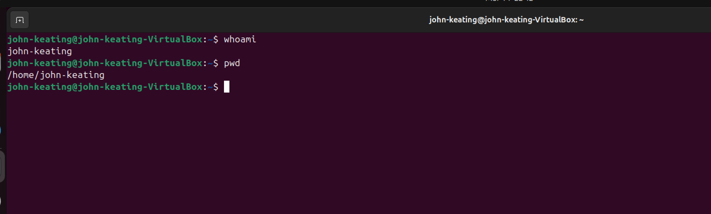

This screenshot shows the starting lab environment in the Ubuntu terminal. The `whoami` command confirms the active logged-in user, and `pwd` confirms the current working directory before beginning the ACL lab.

---

## Screenshot 2 — Installing ACL Tools

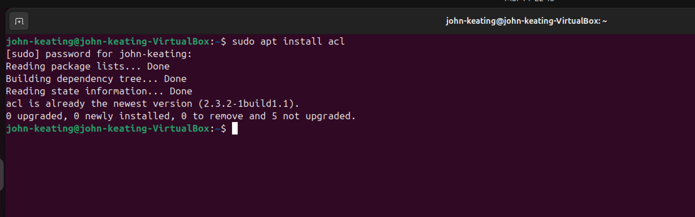

This screenshot confirms that the `acl` package is installed on the system. These tools are required to use `getfacl` and `setfacl` for viewing and modifying Access Control Lists.

---

## Screenshot 3 — Creating the ACL Directory

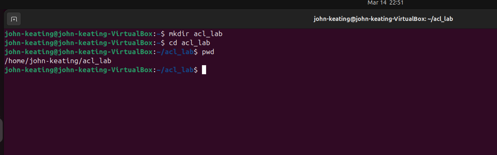

This screenshot shows the creation of the `acl_lab` directory using `mkdir`, then entering it with `cd`. The `pwd` command verifies that the terminal is now inside the correct working directory for the lab.

---

## Screenshot 4 — Creating the Test File

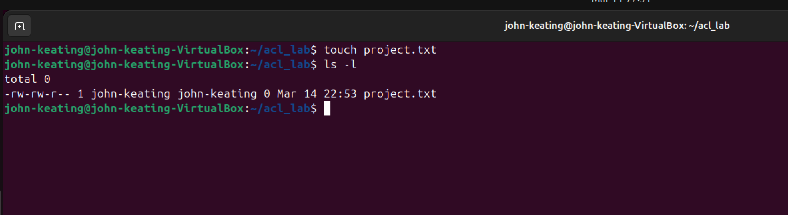

This screenshot shows the creation of the test file `project.txt` using the `touch` command. The `ls -l` command confirms the file exists and displays its standard Linux permissions, ownership, and timestamp.

---

## Screenshot 5 — Viewing ACL Permissions

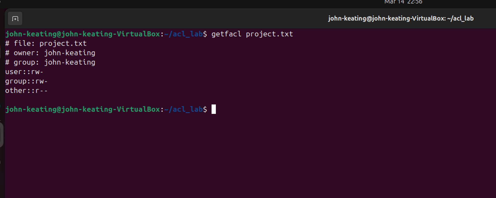

This screenshot shows the output of `getfacl project.txt`. It displays the file owner, group owner, and the default ACL permission entries currently assigned to the file.

---

## Screenshot 6 — Adding ACL Permission

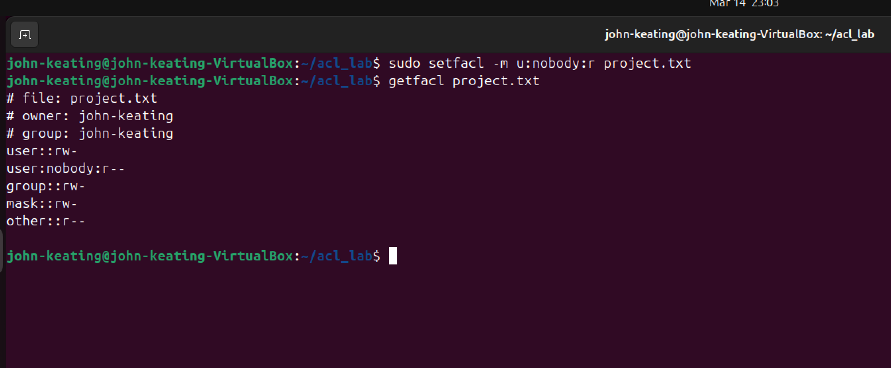

This screenshot shows `setfacl` being used to add a new ACL entry for the user `nobody` with read permission on `project.txt`. The follow-up `getfacl` output confirms that the new ACL entry was successfully added.

---

## Screenshot 7 — Modifying ACL Permissions

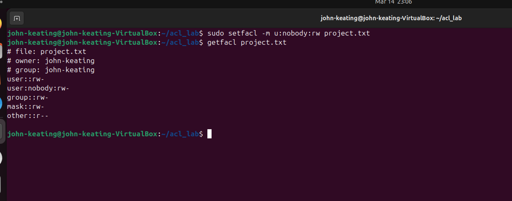

This screenshot shows the ACL entry for user `nobody` being modified from read-only to read and write permissions. The updated `getfacl` output confirms the change.

---

## Screenshot 8 — Removing ACL Permission

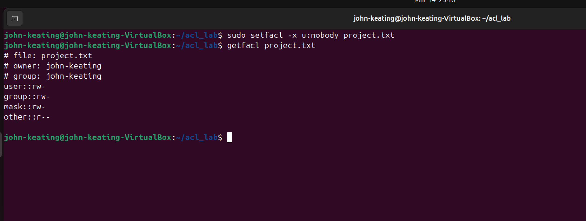

This screenshot shows the ACL entry for user `nobody` being removed from `project.txt` using `setfacl -x`. The `getfacl` output confirms that the entry is no longer present.

---

## Screenshot 9 — Applying ACL to a Directory

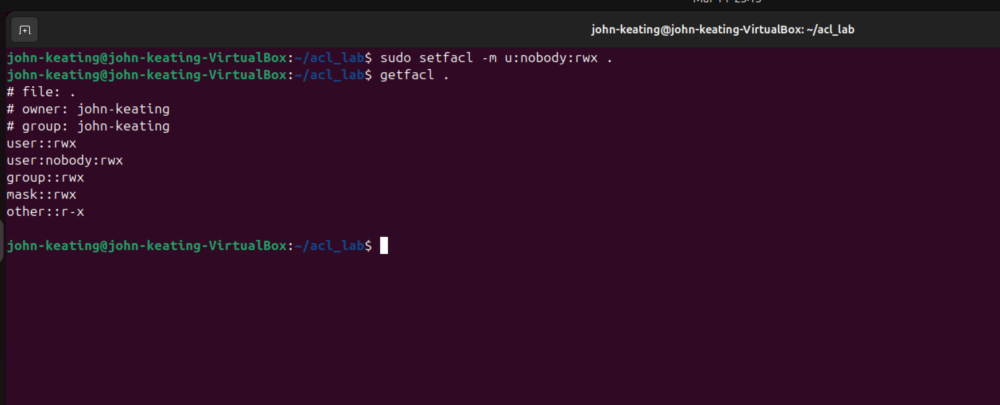

This screenshot shows ACL permissions being applied directly to the current directory using `setfacl`. The `getfacl .` output confirms that user `nobody` now has directory-level ACL permissions.

---

## Screenshot 10 — Setting Default ACL

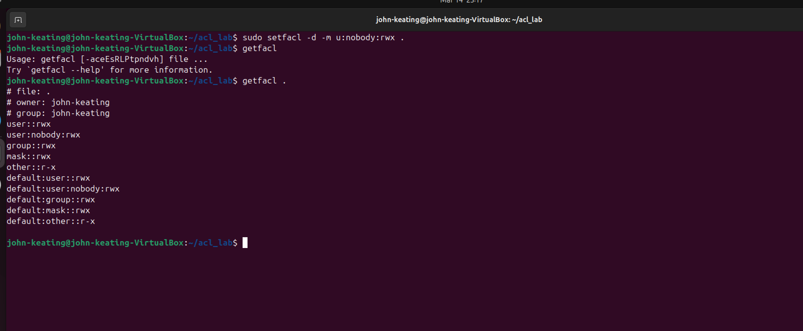

This screenshot shows a default ACL being applied to the directory. Default ACLs automatically affect new files and subdirectories created inside that directory, which is useful in shared Linux environments.

---

## Screenshot 11 — ACL Verification

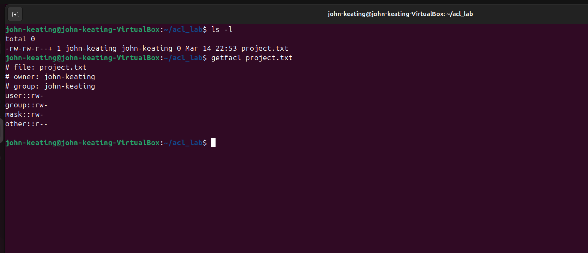

This final verification screenshot shows the file listing and ACL information for `project.txt`. The `+` symbol in the `ls -l` output indicates that extended ACL permissions are present on the file.


---

# What I Learned

This lab demonstrated how **Access Control Lists extend traditional Linux permissions**.

Key takeaways:

- Standard Linux permissions are limited to **owner, group, and others**
- ACLs allow **fine-grained permission control**
- ACLs are widely used in **multi-user enterprise systems**
- The `+` symbol in `ls -l` indicates **extended ACL permissions exist**
- Default ACLs ensure **consistent permissions for new files**

ACL management is an essential skill for:

- Linux System Administrators
- DevOps Engineers
- Cloud Engineers
- Cybersecurity Professionals

---

# Lab Complete

This lab successfully demonstrated:

- Viewing ACL permissions
- Adding ACL entries
- Modifying permissions
- Removing ACL entries
- Applying directory ACLs
- Configuring default ACLs

These skills are part of the **CompTIA Linux+ XK0-006 certification objectives** and are commonly used in professional Linux administration environments.
