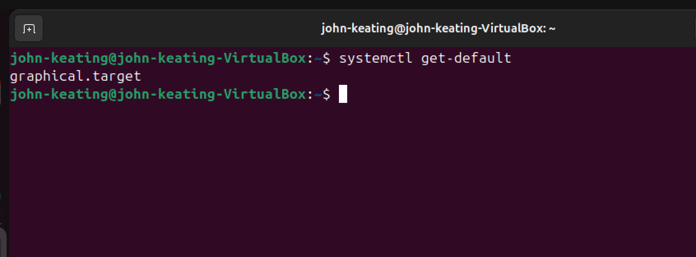
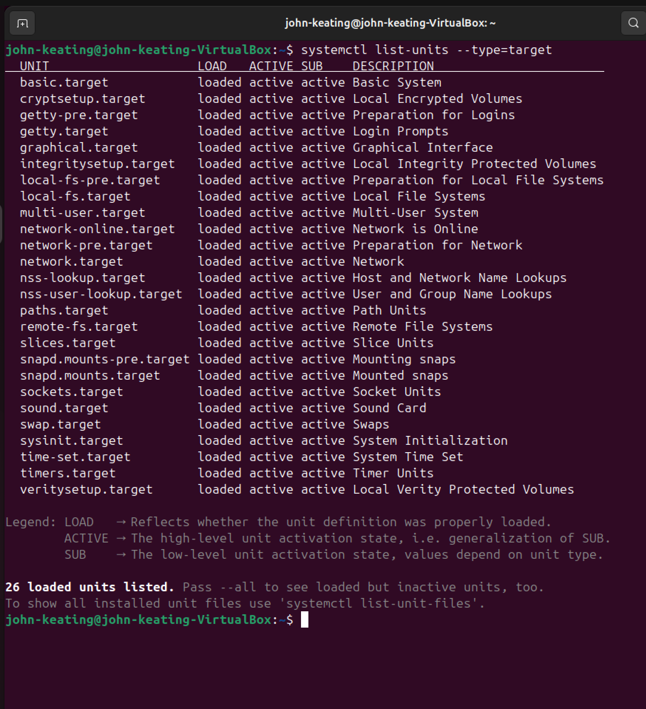
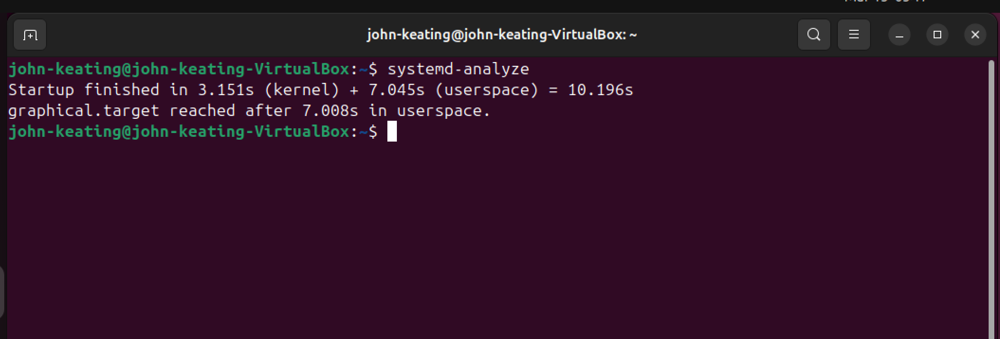
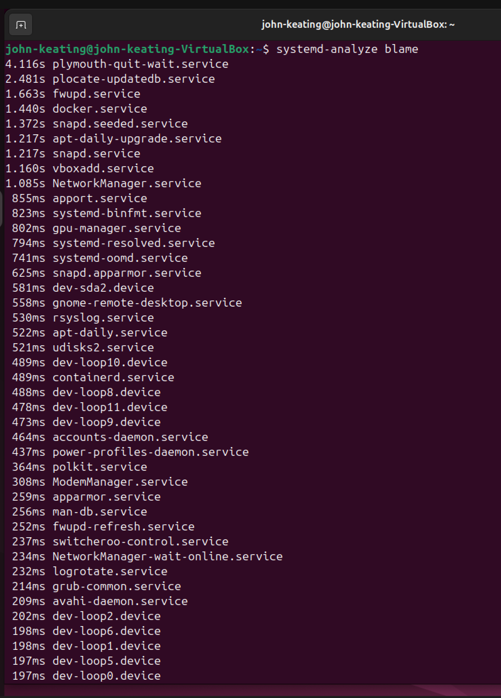
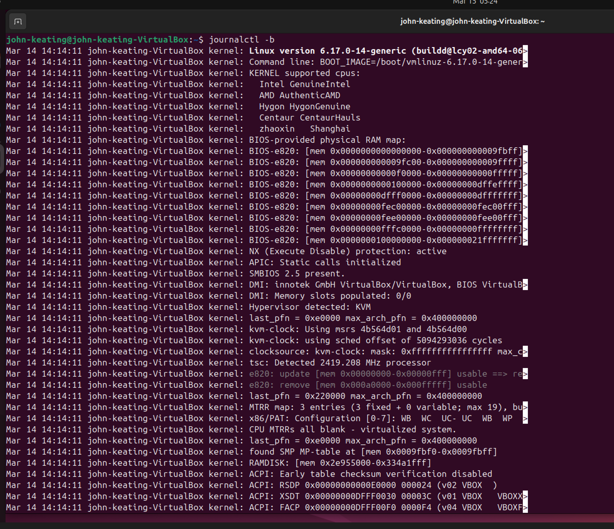
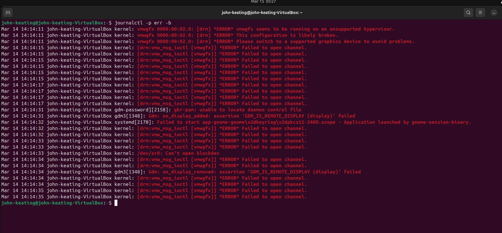
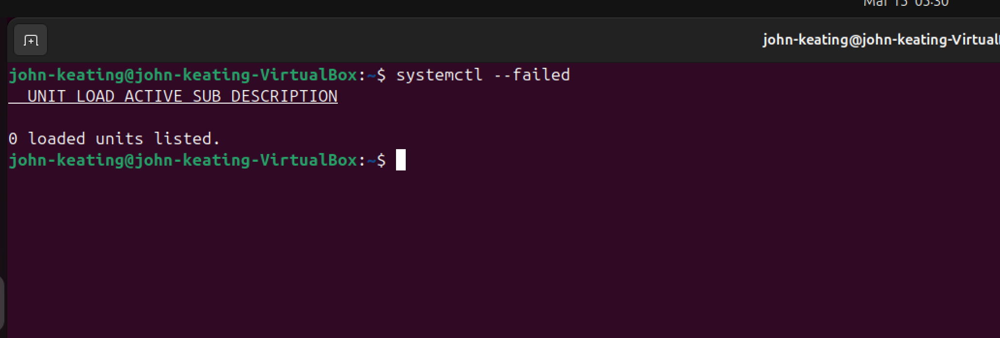
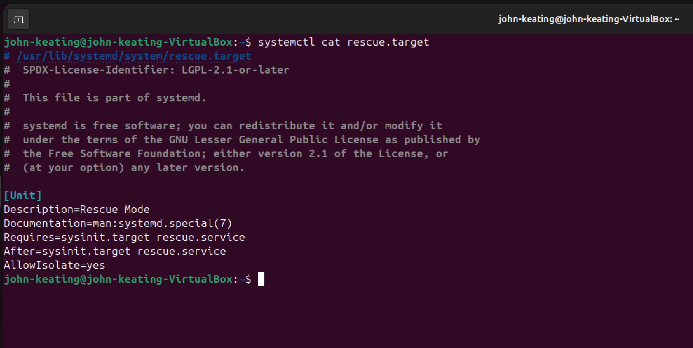
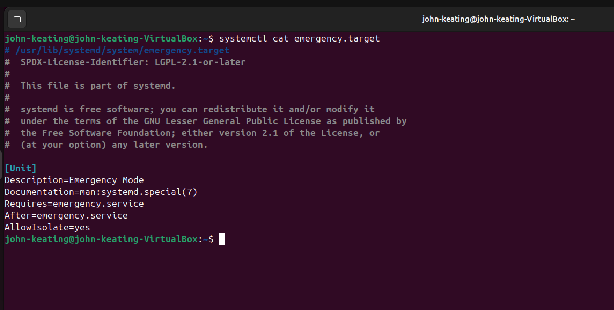
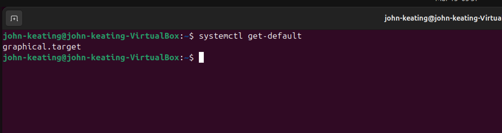

# Linux Lab 29 — System Boot and Recovery

---

## Objective

The purpose of this lab is to understand how Linux boots and how administrators analyze and troubleshoot the boot process using **systemd tools and system logs**.

In this lab the following tasks were performed:

- Identify the system’s default boot target
- View available systemd targets
- Analyze system boot performance
- Identify services that slow system startup
- Review system boot logs
- Filter boot errors
- Check for failed services
- Examine rescue and emergency system targets

These skills are commonly used by **Linux administrators, DevOps engineers, and cloud engineers** when diagnosing system startup problems.

---

# Environment

Operating System  
Ubuntu Linux (Virtual Machine)

Virtualization  
Oracle VirtualBox

Host System  
Windows 11

Shell  
Bash Terminal

Lab Repository  
GitHub Linux Lab Portfolio

---

# Commands Used

| Command | Description |
|------|------|
| `systemctl get-default` | Displays the default system boot target |
| `systemctl list-units --type=target` | Lists active system targets |
| `systemd-analyze` | Displays total system boot time |
| `systemd-analyze blame` | Lists services sorted by startup time |
| `journalctl -b` | Shows logs from the current system boot |
| `journalctl -p err -b` | Shows only error-level logs from current boot |
| `systemctl --failed` | Lists services that failed during boot |
| `systemctl cat rescue.target` | Displays rescue mode configuration |
| `systemctl cat emergency.target` | Displays emergency mode configuration |
| `clear` | Clears the terminal screen |

---

# Command Definitions

### systemctl

`systemctl` is the primary command used to interact with **systemd**, the system and service manager used by most modern Linux distributions.

System administrators use this command to:

- start services
- stop services
- restart services
- check service status
- inspect system targets
- troubleshoot boot issues

---

### systemd-analyze

`systemd-analyze` measures system boot performance.

It calculates:

- kernel startup time
- userspace startup time
- total boot time

Administrators use this tool when diagnosing **slow system boot problems**.

---

### systemd-analyze blame

This command lists services in order of **startup duration**.

The slowest services appear first, allowing administrators to identify:

- services delaying boot
- misconfigured services
- unnecessary startup services

---

### journalctl

`journalctl` is the command used to read logs from the **systemd journal**.

The systemd journal stores logs for:

- kernel messages
- services
- authentication events
- system startup
- system shutdown

---

# Symbol and Flag Breakdown

| Symbol / Flag | Meaning |
|------|------|
| `--type=target` | Filters results to show only systemd targets |
| `-b` | Displays logs from the current system boot |
| `-p` | Filters logs by priority level |
| `err` | Shows only error-level log messages |
| `--failed` | Shows services that failed to start |
| `cat` | Displays the full configuration file of a systemd unit |

---

# Key Concepts

## Systemd

**systemd** is the initialization system used by most modern Linux distributions.

It is responsible for:

- starting system services
- managing system processes
- controlling system boot states
- maintaining system logs

---

## System Targets

Targets represent **system states** in systemd.

Examples include:

| Target | Description |
|------|------|
| `multi-user.target` | Non-graphical multi-user system |
| `graphical.target` | System booted with graphical interface |
| `rescue.target` | Single-user recovery environment |
| `emergency.target` | Minimal system recovery mode |

Targets replaced the traditional **Linux runlevels** used in older systems.

---

## Rescue Mode

Rescue mode provides a **single-user environment**.

Characteristics:

- minimal services
- root shell access
- used for repairing system problems

---

## Emergency Mode

Emergency mode is the most minimal Linux environment.

Characteristics:

- only the root filesystem is mounted
- very few services run
- used for critical recovery situations

---

## Boot Logs

Boot logs provide detailed information about system startup.

Administrators analyze boot logs to identify:

- driver errors
- service failures
- hardware detection problems
- configuration errors

---

# What Was Tested

This lab verified the following system behaviors:

- The system boots into the correct default target
- Boot performance can be analyzed
- Slow boot services can be identified
- Boot logs can be reviewed
- Boot errors can be filtered
- Failed services can be detected
- Rescue mode configuration can be examined
- Emergency mode configuration can be examined

---

# Screenshots

---

## Screenshot 1 — Checking Default Boot Target

The `systemctl get-default` command displays the system's default boot target.

The system is configured to boot into **graphical.target**, which means the system starts a graphical desktop environment during startup.

---

## Screenshot 2 — Listing System Targets

The `systemctl list-units --type=target` command lists all active system targets.

Targets represent different system states that Linux can boot into.

---

## Screenshot 3 — Boot Time Analysis

The `systemd-analyze` command displays how long the system takes to boot.

The output shows the time spent in:

- kernel initialization
- userspace startup

---

## Screenshot 4 — Boot Service Performance

The `systemd-analyze blame` command lists services sorted by startup time.

This helps identify services that delay system boot.

---

## Screenshot 5 — Viewing Boot Logs

The `journalctl -b` command displays logs from the current boot session.

These logs include system initialization messages and service startup events.

---

## Screenshot 6 — Viewing Boot Errors

The `journalctl -p err -b` command filters logs to show only **error messages**.

This helps administrators quickly locate problems during system startup.

---

## Screenshot 7 — Checking Failed Services

The `systemctl --failed` command checks if any services failed during startup.

In this system no services failed, indicating a healthy boot process.

---

## Screenshot 8 — Rescue Target Configuration

The `systemctl cat rescue.target` command displays the configuration for **rescue mode**, which provides a single-user environment used for troubleshooting.

---

## Screenshot 9 — Emergency Target Configuration

The `systemctl cat emergency.target` command displays the configuration for **emergency mode**, a minimal recovery environment used during severe system failures.

---

## Screenshot 10 — Verifying Boot Target

Running `systemctl get-default` again confirms that the system still boots into **graphical.target**.

---

# What I Learned

This lab demonstrated how Linux administrators analyze and troubleshoot the boot process using systemd tools.

Key skills learned include:

- inspecting system boot targets
- analyzing system startup performance
- identifying slow startup services
- reviewing system boot logs
- filtering error-level logs
- verifying system health after startup
- examining system recovery configurations

These techniques are essential for **Linux administration, DevOps engineering, and cloud infrastructure management**.

---