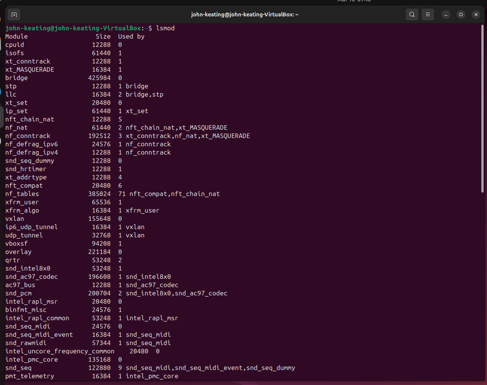
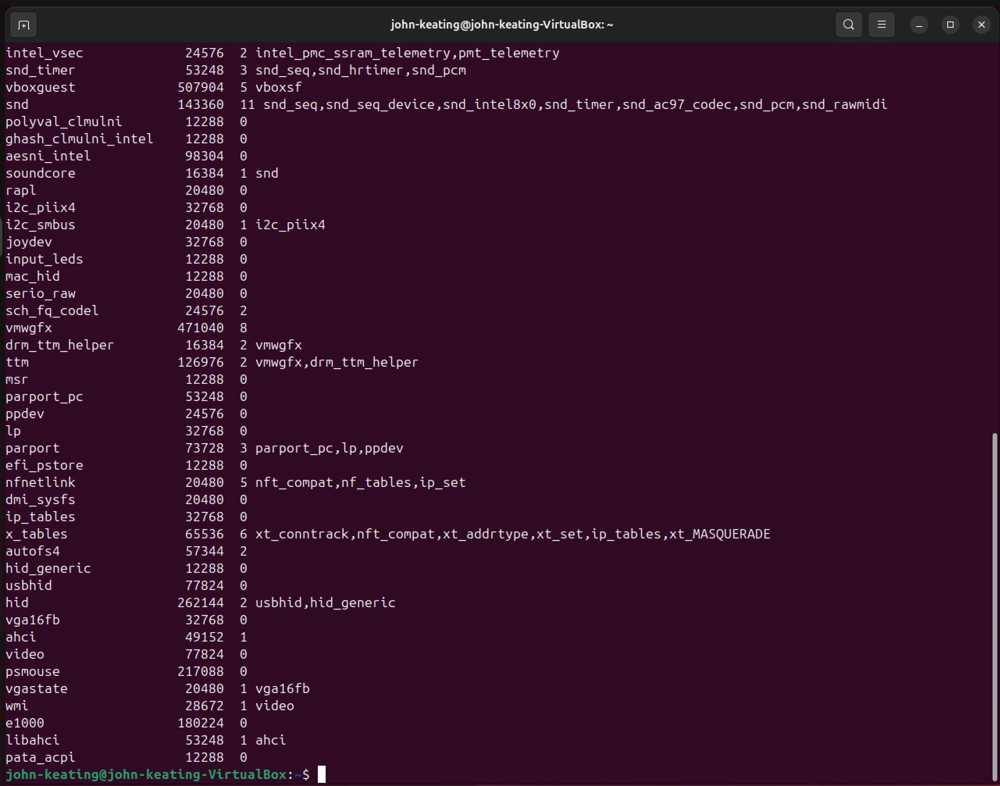
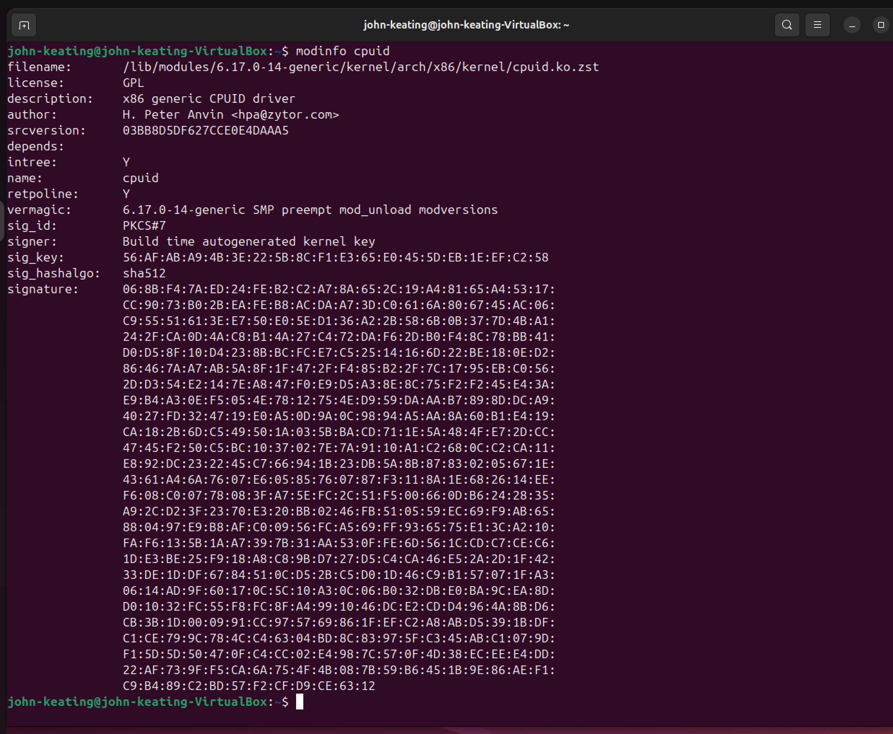
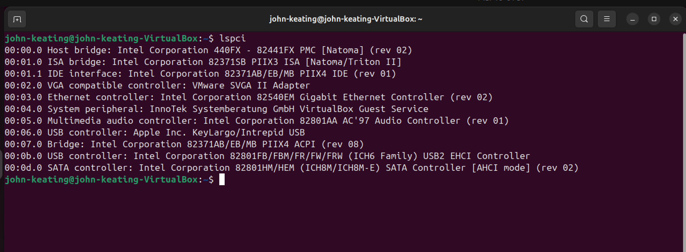
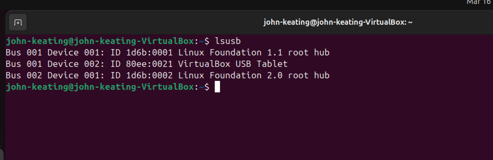
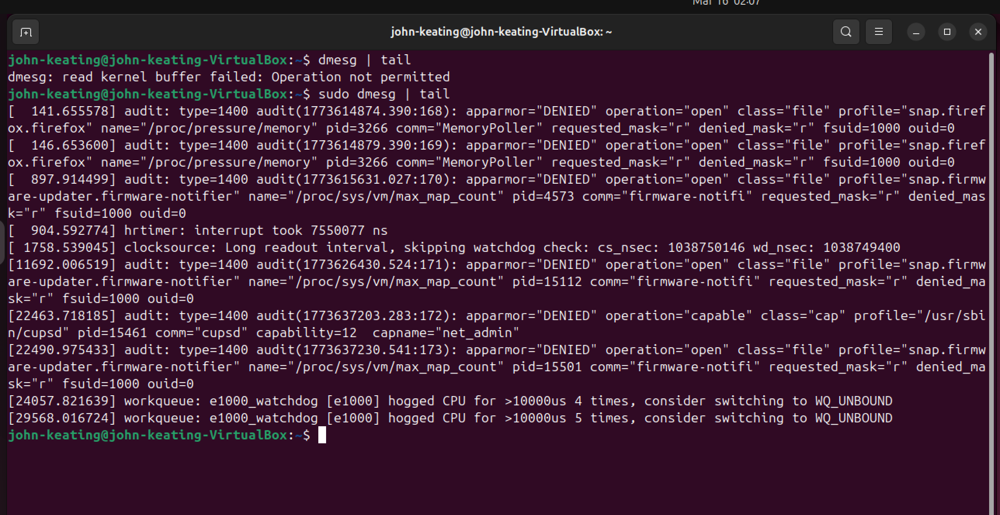

# Linux Lab 30 — Kernel Modules and Device Management

---

# Objective

The objective of this lab is to understand how Linux administrators inspect kernel modules, analyze hardware devices, and read kernel system logs using built-in Linux commands.

The Linux kernel is the central component of the operating system responsible for managing hardware resources and coordinating communication between hardware and software. Kernel modules extend the kernel's functionality by allowing additional features and drivers to be dynamically loaded or unloaded without requiring a system reboot.

In this lab I practiced:

- Viewing currently loaded kernel modules
- Inspecting kernel module metadata
- Detecting PCI hardware devices
- Detecting USB devices
- Viewing kernel log messages
- Loading a kernel module into the running kernel
- Verifying that a module was successfully loaded

These tasks simulate real Linux system administration activities used in cloud environments, DevOps engineering, infrastructure engineering, and cybersecurity operations.

---

# Environment

This lab was performed in the following environment:

- Ubuntu Linux Virtual Machine
- Oracle VirtualBox
- Bash Terminal
- Windows Host Machine
- Git Bash
- GitHub Lab Repository

The virtual machine simulates a real Linux server environment where administrators interact with the operating system through the command line interface.

---

# Commands Used

| Command | Description |
|--------|-------------|
| `lsmod` | Displays all currently loaded kernel modules |
| `lsmod \| head` | Displays the first few loaded modules |
| `modinfo cpuid` | Displays detailed information about the cpuid module |
| `lspci` | Lists PCI hardware devices detected by the system |
| `lsusb` | Lists USB devices connected to the system |
| `dmesg \| tail` | Displays the most recent kernel log messages |
| `sudo modprobe loop` | Loads the loop kernel module |
| `lsmod \| grep loop` | Searches for the loop module in the module list |

---

# Detailed Command Definitions

## lsmod

`lsmod` stands for **list modules**.

This command displays all currently loaded kernel modules running in the Linux kernel.

The output includes:

- Module name
- Memory size used by the module
- Number of processes or modules currently using the module

System administrators use this command to confirm whether drivers or kernel features are active.

Example:

```
lsmod
```

---

## modinfo

`modinfo` displays detailed metadata about a kernel module.

Example used in this lab:

```
modinfo cpuid
```

This command displays:

- module description
- author information
- license type
- module dependencies
- kernel compatibility
- module file location

Administrators use this command to understand how a module works before loading it.

---

## lspci

`lspci` stands for **list PCI devices**.

PCI (Peripheral Component Interconnect) is the hardware bus used to connect internal components to a computer's motherboard.

The command lists devices such as:

- network cards
- graphics cards
- storage controllers
- audio controllers
- virtualization hardware

Administrators often use this command when troubleshooting hardware detection issues.

---

## lsusb

`lsusb` stands for **list USB devices**.

This command displays USB devices connected to the system such as:

- keyboards
- mice
- webcams
- USB drives
- virtual USB hardware

It helps administrators confirm whether USB devices are properly recognized by the operating system.

---

## dmesg

`dmesg` displays kernel messages stored in the **kernel ring buffer**.

These messages include:

- hardware detection
- driver initialization
- kernel events
- system boot messages
- hardware errors

Administrators frequently inspect `dmesg` logs when diagnosing hardware or driver problems.

---

## modprobe

`modprobe` loads or unloads kernel modules.

Unlike lower-level tools, `modprobe` automatically resolves module dependencies and loads required modules.

Example:

```
sudo modprobe loop
```

This loads the **loop device module**, which allows files to be mounted as virtual block devices.

---

## grep

`grep` searches command output for specific text patterns.

Example:

```
lsmod | grep loop
```

This searches the output of `lsmod` for the word **loop**.

---

# Symbol and Operator Explanations

| Symbol | Meaning |
|------|------|
| `|` | Pipe operator that sends the output of one command into another command |
| `head` | Displays the first lines of command output |
| `tail` | Displays the last lines of command output |
| `grep` | Searches command output for matching text |
| `sudo` | Executes a command with administrator (root) privileges |

---

# Workflow

The following steps were performed during this lab:

1. Viewed all loaded kernel modules using `lsmod`
2. Displayed only the first portion of modules using `lsmod | head`
3. Examined detailed information about the `cpuid` kernel module using `modinfo cpuid`
4. Listed PCI hardware devices using `lspci`
5. Listed USB hardware devices using `lsusb`
6. Viewed recent kernel system messages using `dmesg | tail`
7. Loaded the loop kernel module using `sudo modprobe loop`
8. Verified the loop module was loaded using `lsmod | grep loop`

---

# Visual Evidence

## Screenshot 1 — Loaded Kernel Modules (Top)



This screenshot shows the `lsmod` command displaying the first portion of currently loaded Linux kernel modules. The output lists module names along with their memory size and usage counts.

---

## Screenshot 2 — Loaded Kernel Modules (Bottom)



This screenshot shows the remaining portion of the kernel module list. It confirms that multiple modules are active and supporting different hardware drivers and kernel subsystems.

---

## Screenshot 3 — First Modules Using Pipe


This screenshot shows the command:

```
lsmod | head
```

The pipe operator (`|`) sends the output of `lsmod` to the `head` command, which limits the output to the first few lines.

---

## Screenshot 4 — Kernel Module Metadata



This screenshot shows the `modinfo cpuid` command displaying metadata about the cpuid kernel module including the module description, author information, and module location.

---

## Screenshot 5 — PCI Hardware Devices



This screenshot shows the `lspci` command listing PCI devices detected by the Linux kernel. These devices represent internal hardware such as network adapters and storage controllers.

---

## Screenshot 6 — USB Hardware Devices



This screenshot shows the `lsusb` command displaying USB devices connected to the system. In a virtual machine environment, this typically includes virtual USB input devices and root hubs.

---

## Screenshot 7 — Kernel Log Messages



This screenshot shows the command:

```
dmesg | tail
```

This command displays the most recent kernel messages stored in the kernel ring buffer.

---

## Screenshot 8 — Loading Kernel Module


This screenshot shows the command:

```
sudo modprobe loop
```

This command loads the loop kernel module into the Linux kernel.

---

## Screenshot 9 — Verifying Loaded Module


This screenshot shows the command:

```
lsmod | grep loop
```

This confirms that the loop module was successfully loaded and is currently active in the kernel.

---

# Key Concepts

## Linux Kernel

The kernel is the core component of the Linux operating system responsible for managing hardware resources and coordinating interactions between hardware and software.

---

## Kernel Modules

Kernel modules are pieces of code that can be dynamically loaded or unloaded into the kernel to extend functionality without restarting the system.

---

## Hardware Enumeration

Commands like `lspci` and `lsusb` allow administrators to inspect hardware devices detected by the system.

---

## Kernel Logging

The Linux kernel records system events and hardware messages in the kernel ring buffer, which can be viewed using the `dmesg` command.

---

# Real-World Relevance

These commands are commonly used by:

- Linux System Administrators
- Cloud Engineers
- DevOps Engineers
- Cybersecurity Analysts
- Infrastructure Engineers

They are used to troubleshoot:

- hardware driver issues
- device detection failures
- kernel errors
- system startup problems
- hardware compatibility issues

For example, when a network interface card fails to initialize, administrators often inspect kernel logs and verify that the correct driver module is loaded.

---

# What I Learned

In this lab I learned how to inspect Linux kernel modules, identify system hardware devices, and analyze kernel log messages using common Linux administration commands.

I also learned how Linux dynamically loads kernel modules using `modprobe`, and how administrators verify module activity using `lsmod`.

These skills are essential for troubleshooting Linux servers, diagnosing hardware issues, and managing systems in real-world production environments.

