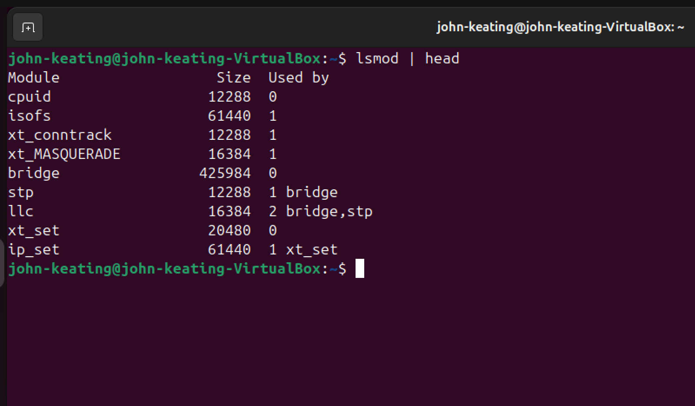
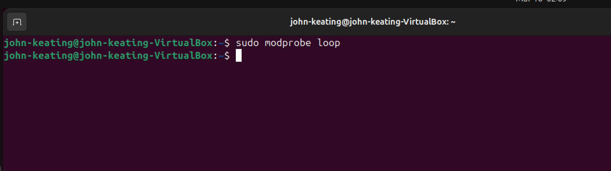
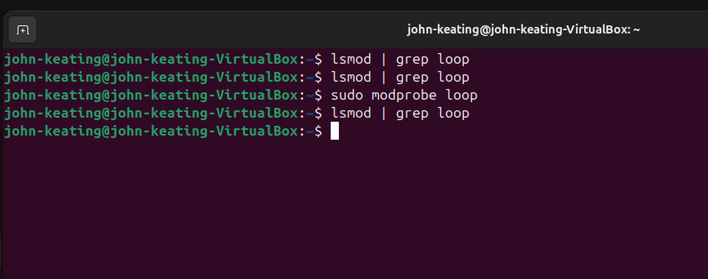

# Linux Lab 30 — Kernel Modules and Device Management

---

# Objective

The purpose of this lab is to learn how Linux administrators inspect kernel modules, hardware devices, and kernel logs using built-in Linux commands.

Kernel modules are pieces of code that extend the functionality of the Linux kernel without requiring a system reboot. System administrators use these tools to troubleshoot hardware issues, monitor device drivers, and manage kernel components.

In this lab I practiced:

- Viewing loaded kernel modules
- Inspecting PCI hardware devices
- Viewing USB devices
- Reading kernel messages
- Loading a kernel module using modprobe
- Verifying loaded kernel modules

These commands are commonly used in Linux system administration, DevOps engineering, cloud infrastructure management, and cybersecurity troubleshooting.

---

# Environment

- Ubuntu Linux Virtual Machine
- Oracle VirtualBox
- Bash Terminal
- Windows Host Machine
- Git Bash
- GitHub Lab Repository

---

# Commands Used

| Command | Description |
|------|------|
| `lsmod` | Displays currently loaded Linux kernel modules |
| `lsmod \| head` | Displays the first few loaded kernel modules |
| `lspci` | Displays PCI hardware devices connected to the system |
| `lsusb` | Displays USB devices connected to the system |
| `dmesg` | Displays kernel system messages |
| `dmesg \| tail` | Displays the most recent kernel messages |
| `sudo modprobe loop` | Loads the loop kernel module |
| `lsmod \| grep loop` | Searches for the loop module in the loaded module list |

---

# Command Definitions

### lsmod

Displays all currently loaded Linux kernel modules.  
This helps administrators understand which drivers and kernel extensions are active on the system.

---

### lspci

Lists PCI devices connected to the computer. PCI devices include network cards, graphics adapters, storage controllers, and other internal hardware components.

---

### lsusb

Lists USB devices connected to the system, such as keyboards, mice, webcams, USB drives, and virtual USB devices.

---

### dmesg

Displays kernel ring buffer messages. These messages contain important information about hardware initialization, device drivers, and system events.

---

### modprobe

Loads or unloads Linux kernel modules. It automatically resolves dependencies and loads any required modules.

---

### grep

Searches text output for specific words or patterns.

---

# Symbol and Flag Explanations

| Symbol | Meaning |
|------|------|
| `\|` | Sends the output of one command into another command |
| `head` | Displays the first lines of command output |
| `tail` | Displays the last lines of command output |
| `grep` | Searches for matching text within command output |
| `sudo` | Runs a command with administrator (root) privileges |

---

# Workflow

1. Viewed all loaded kernel modules using `lsmod`
2. Displayed the top portion of loaded modules using `lsmod | head`
3. Inspected PCI hardware devices using `lspci`
4. Viewed connected USB devices using `lsusb`
5. Attempted to read kernel messages using `dmesg | tail`
6. Used elevated privileges with `sudo dmesg | tail`
7. Loaded the loop kernel module using `sudo modprobe loop`
8. Verified the module loaded using `lsmod | grep loop`

---

# Visual Evidence

### Screenshot 1

This screenshot shows the `lsmod` command displaying the top portion of currently loaded Linux kernel modules.

---

### Screenshot 2

This screenshot shows the remaining portion of the kernel module list confirming multiple modules are active.

---

### Screenshot 3

This screenshot shows the `lsmod | head` command displaying only the first few loaded kernel modules.

---

### Screenshot 4

This screenshot shows the `lspci` command listing PCI hardware devices detected by the system.

---

### Screenshot 5

This screenshot shows the `lsusb` command listing USB devices connected to the system.

---

### Screenshot 6

This screenshot shows the permission error that occurs when attempting to read kernel logs without administrative privileges.

---

### Screenshot 7

This screenshot shows `sudo dmesg | tail` successfully displaying the most recent kernel log messages.

---

### Screenshot 8

This screenshot shows the `sudo modprobe loop` command loading the loop kernel module.

---

### Screenshot 9

This screenshot shows `lsmod | grep loop` verifying that the loop kernel module has been successfully loaded.

---

# Key Concepts

### Kernel

The kernel is the core component of the Linux operating system that manages hardware resources and communication between software and hardware.

---

### Kernel Modules

Kernel modules are pieces of code that can be dynamically loaded or unloaded into the Linux kernel to add functionality such as device drivers or filesystem support.

---

### Hardware Enumeration

Linux tools like `lspci` and `lsusb` allow administrators to view hardware components connected to the system.

---

### Kernel Logging

The `dmesg` command displays messages generated by the Linux kernel during system startup and hardware events.

---

# Real-World Relevance

These commands are commonly used by:

- Linux System Administrators
- Cloud Engineers
- DevOps Engineers
- Cybersecurity Analysts
- Infrastructure Engineers

They help professionals troubleshoot:

- hardware driver issues
- device detection problems
- kernel errors
- system boot problems
- hardware compatibility issues

For example, if a network card or storage controller is not working properly, engineers often inspect kernel logs and loaded modules using these tools.

---

# What I Learned

In this lab I learned how to inspect Linux kernel modules, identify system hardware, and read kernel log messages using common Linux administration commands.

I also learned how Linux dynamically loads kernel modules using `modprobe`, and how administrators verify modules using `lsmod`.

These skills are important for troubleshooting hardware drivers and diagnosing system issues in Linux environments.