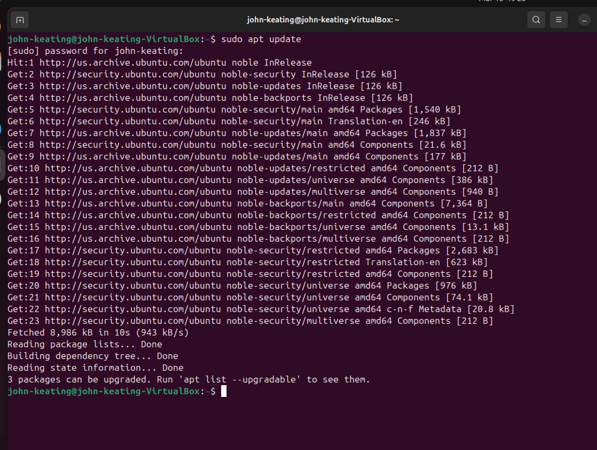
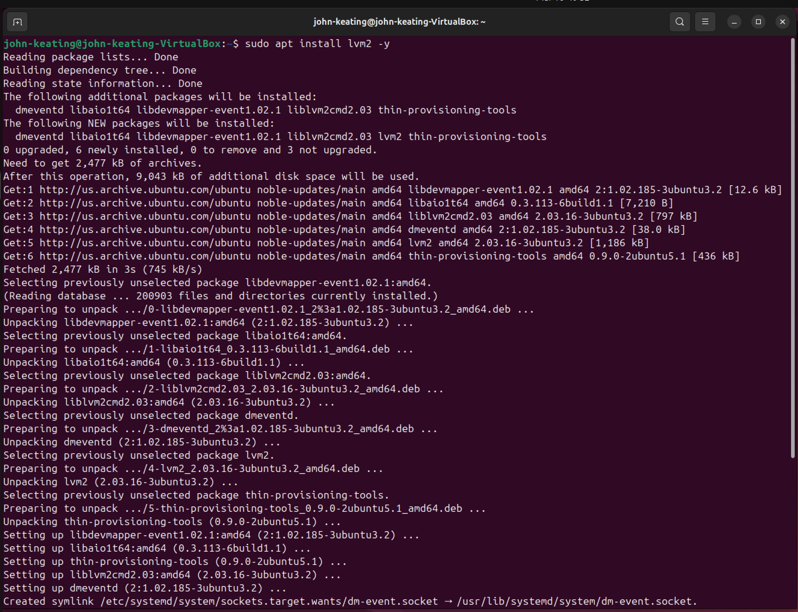
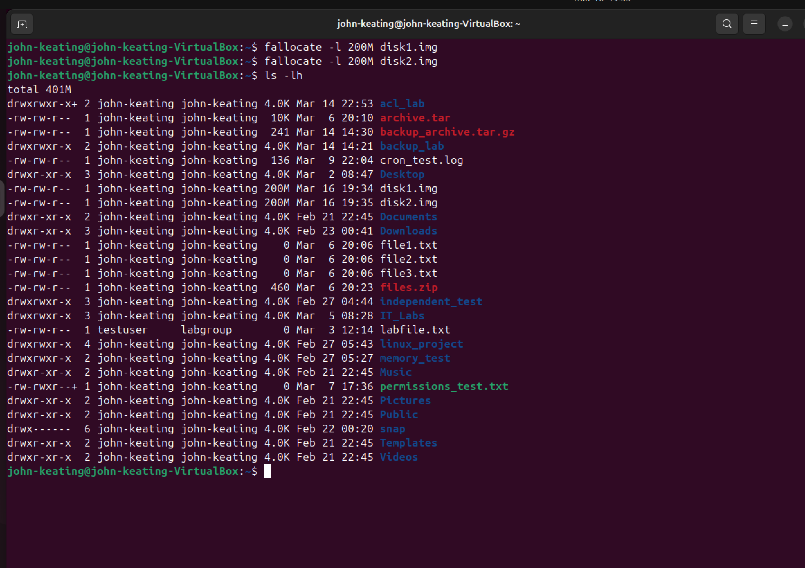
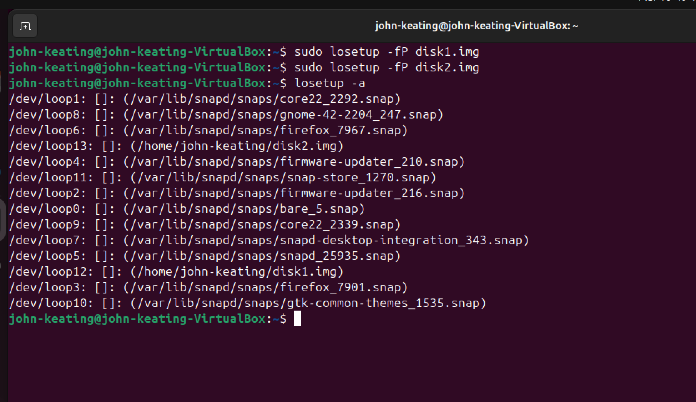
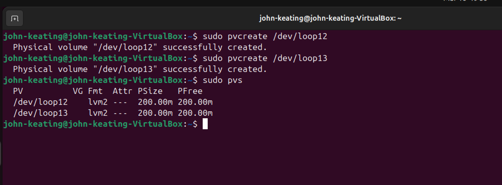
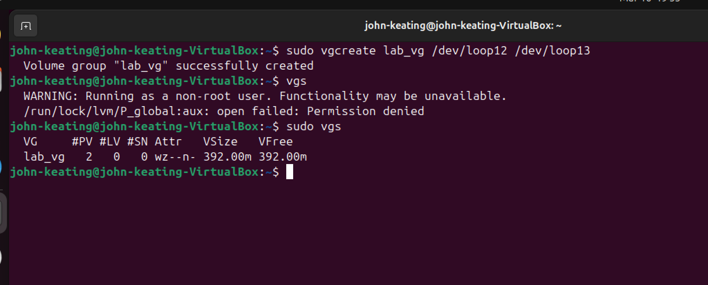
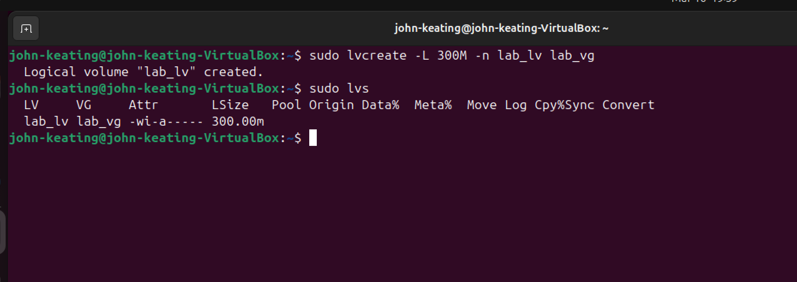
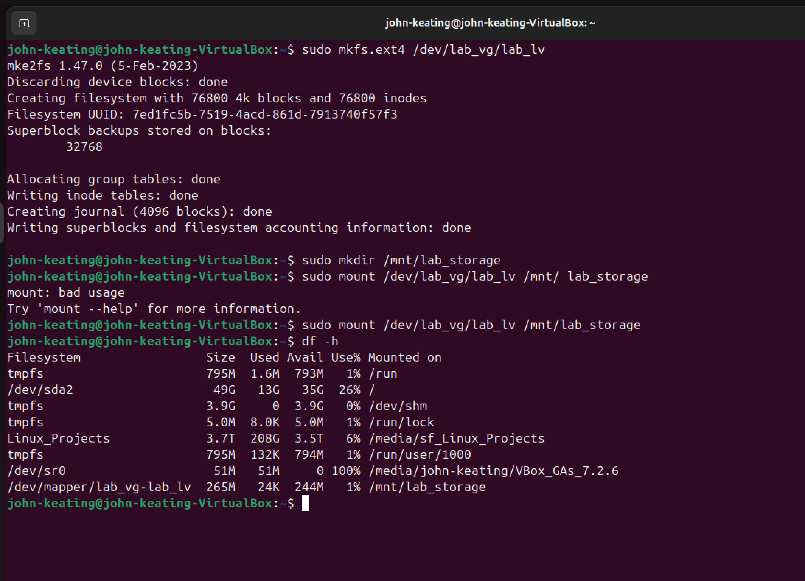

# Linux+ Lab 31 — Advanced Storage (LVM, RAID, and Performance)

---

## 📌 Objective

The purpose of this lab is to demonstrate how Linux administrators configure and manage storage using Logical Volume Manager (LVM).

In this lab, we:

- Created virtual disks
- Converted them into block devices
- Initialized Physical Volumes (PV)
- Created a Volume Group (VG)
- Created a Logical Volume (LV)
- Formatted the filesystem
- Mounted the storage for use

This simulates real-world enterprise storage provisioning used in cloud platforms, data centers, and Kubernetes environments.

---

## 🖥️ Environment

- Ubuntu Linux (VirtualBox VM)
- Bash Terminal
- Windows Host Machine
- Git Bash
- Local IT_Labs GitHub Repository

---

## 💻 Commands Used

| Command | Description |
|--------|------------|
| `sudo apt update` | Updates package lists |
| `sudo apt install lvm2 -y` | Installs LVM tools |
| `fallocate -l 200M disk1.img` | Creates a 200MB disk file |
| `fallocate -l 200M disk2.img` | Creates a second disk file |
| `ls -lh` | Lists files with sizes |
| `losetup -fP disk1.img` | Attaches disk1 as loop device |
| `losetup -fP disk2.img` | Attaches disk2 as loop device |
| `losetup -a` | Displays loop devices |
| `pvcreate /dev/loop12` | Creates Physical Volume |
| `pvcreate /dev/loop13` | Creates Physical Volume |
| `pvs` | Displays PV info |
| `vgcreate lab_vg /dev/loop12 /dev/loop13` | Creates Volume Group |
| `vgs` | Displays VG info |
| `lvcreate -L 300M -n lab_lv lab_vg` | Creates Logical Volume |
| `lvs` | Displays LV info |
| `mkfs.ext4 /dev/lab_vg/lab_lv` | Formats filesystem |
| `mkdir /mnt/lab_storage` | Creates mount directory |
| `mount /dev/lab_vg/lab_lv /mnt/lab_storage` | Mounts storage |
| `df -h` | Verifies mounted storage |

---

## 🔍 Command Breakdown Example

### Creating a Logical Volume

```bash
sudo lvcreate -L 300M -n lab_lv lab_vg
```

| Part | Meaning |
|------|--------|
| `sudo` | Run command as administrator |
| `lvcreate` | Create logical volume |
| `-L 300M` | Set size to 300MB |
| `-n lab_lv` | Name the logical volume |
| `lab_vg` | Volume group used |

---

## ⚙️ Workflow

1. Install LVM tools  
2. Create virtual disk files  
3. Attach files as loop devices  
4. Initialize Physical Volumes (PV)  
5. Create Volume Group (VG)  
6. Create Logical Volume (LV)  
7. Format the filesystem  
8. Create mount point  
9. Mount storage  
10. Verify mount  

---

## 📸 Screenshots & Explanations

---

### Screenshot 1 — LVM Installation Started


This screenshot shows the installation of LVM tools using the `sudo apt install lvm2 -y` command. This step prepares the system for logical volume management by installing the required packages.

---

### Screenshot 2 — LVM Installation Completed


This confirms that the LVM2 package was successfully installed. The system is now ready to create and manage logical volumes.

---

### Screenshot 3 — Virtual Disk Files Created


This shows the creation of disk image files (`disk1.img` and `disk2.img`) using the `fallocate` command. These files simulate physical disks for the lab.

---

### Screenshot 4 — Loop Devices Created


This displays loop devices (`/dev/loop12`, `/dev/loop13`) mapped to the disk image files using `losetup`. These act as virtual block devices.

---

### Screenshot 5 — Physical Volumes Created


This shows successful initialization of Physical Volumes using the `pvcreate` command. These are the foundation for building LVM storage.

---

### Screenshot 6 — Volume Group Created


This confirms the creation of the Volume Group (`lab_vg`) using `vgcreate`, combining multiple physical volumes into one storage pool.

---

### Screenshot 7 — Logical Volume Created


This shows the Logical Volume (`lab_lv`) created from the volume group using `lvcreate`. This is the usable storage layer.

---

### Screenshot 8 — Filesystem Mounted


This verifies that the logical volume was formatted and mounted to `/mnt/lab_storage`, and confirmed using `df -h`. The storage is now active and usable.
---

## 🧠 Key Concepts

- **Physical Volume (PV):** A disk or device prepared for LVM  
- **Volume Group (VG):** Combined storage pool from PVs  
- **Logical Volume (LV):** Flexible storage carved from VG  
- **Filesystem:** Structure used to store data (ext4)  
- **Mounting:** Making storage accessible to the OS  

---

## 🌍 Real-World Relevance

This lab reflects real-world systems used in:

- Cloud platforms (Azure, AWS)  
- Kubernetes persistent storage  
- Enterprise storage systems  
- DevOps environments  
- Virtual machines and containers  

---

## 🎯 Real-World Insight / Interview Answer

If asked:

👉 “Why are there so many loop devices?”

Answer:

> “Those are snap package mounts — I focused on the loop devices mapped to my disk images for LVM setup.”

---

## 🧠 Troubleshooting

An error occurred due to incorrect mount syntax:

```bash
sudo mount /dev/lab_vg/lab_lv /mnt/ lab_storage
```

The issue was caused by an extra space splitting the path.

Correct command:

```bash
sudo mount /dev/lab_vg/lab_lv /mnt/lab_storage
```

Verification:

```bash
df -h
```

---

## 🧾 What I Learned

- How to simulate disks using files  
- How loop devices work in Linux  
- How to configure LVM step-by-step  
- How to troubleshoot command errors  
- How enterprise storage systems are built  

---

## 🚀 Summary

This lab demonstrates the full lifecycle of storage in Linux:

Disk → Loop Device → Physical Volume → Volume Group → Logical Volume → Filesystem → Mount

This process is essential for:

- Cloud Engineering  
- DevOps  
- System Administration  
- Cybersecurity infrastructure  

---
