# Linux Virtualization Lab — KVM & Libvirt Setup and Verification

---

## Objective

The purpose of this lab is to install, configure, and verify Linux virtualization using KVM (Kernel-based Virtual Machine) and libvirt.

In this lab, I validated:
- Virtualization support on the system
- Installation of KVM and libvirt packages
- Status and behavior of the libvirt service
- Virtual network configuration
- System network interfaces related to virtualization

This lab simulates real-world system administration tasks used in:
- Cloud Engineering
- DevOps
- Virtualization Engineering
- Cybersecurity Infrastructure

---

## Environment

- Ubuntu Linux (VirtualBox VM)
- Oracle VirtualBox (Host Virtualization)
- Bash Terminal
- Windows Host Machine
- Git Bash
- GitHub Lab Repository

---

## Commands Used

| Command | Description |
|--------|------------|
| `egrep -c '(vmx|svm)' /proc/cpuinfo` | Checks CPU virtualization support |
| `lsmod \| grep kvm` | Checks if KVM kernel modules are loaded |
| `sudo apt install qemu-kvm libvirt-daemon-system libvirt-clients bridge-utils -y` | Installs virtualization packages |
| `systemctl status libvirtd` | Checks libvirt service status |
| `sudo systemctl start libvirtd` | Starts libvirt service |
| `virsh list --all` | Lists all virtual machines |
| `sudo virsh net-list --all` | Lists all virtual networks |
| `ip a` | Displays all network interfaces |
| `sudo virsh net-info default` | Displays detailed network information |

---

## Command Breakdown and Symbol Explanations

### 1. Check CPU Virtualization Support

```bash
egrep -c '(vmx|svm)' /proc/cpuinfo
```

- `egrep` → Extended grep for pattern searching  
- `-c` → Counts matching lines  
- `(vmx|svm)` → CPU virtualization flags  
  - `vmx` = Intel virtualization  
  - `svm` = AMD virtualization  
- `/proc/cpuinfo` → File containing CPU details  

---

### 2. Check KVM Modules

```bash
lsmod | grep kvm
```

- `lsmod` → Lists loaded kernel modules  
- `|` → Pipe (passes output to next command)  
- `grep` → Filters output  
- `kvm` → Kernel Virtual Machine module  

---

### 3. Install Virtualization Packages

```bash
sudo apt install qemu-kvm libvirt-daemon-system libvirt-clients bridge-utils -y
```

- `sudo` → Run as administrator  
- `apt install` → Install packages  
- `qemu-kvm` → Virtual machine hypervisor  
- `libvirt-daemon-system` → Virtualization service  
- `libvirt-clients` → CLI tools  
- `bridge-utils` → Network bridging tools  
- `-y` → Auto-confirm installation  

---

### 4. Check Service Status

```bash
systemctl status libvirtd
```

- `systemctl` → Service manager  
- `status` → Shows service state  
- `libvirtd` → Virtualization daemon  

---

### 5. Start Service

```bash
sudo systemctl start libvirtd
```

Starts the virtualization service.

---

### 6. List Virtual Machines

```bash
virsh list --all
```

- `virsh` → Virtualization shell  
- `list --all` → Shows all VMs (running + stopped)

---

### 7. List Networks

```bash
sudo virsh net-list --all
```

Displays virtual networks managed by libvirt.

---

### 8. View Network Interfaces

```bash
ip a
```

- `ip` → Network configuration tool  
- `a` → Shows all interfaces  

---

### 9. View Network Details

```bash
sudo virsh net-info default
```

Displays detailed information about the default virtual network.

---

## Lab Workflow

1. Verified CPU virtualization support  
2. Checked for KVM kernel modules  
3. Installed virtualization packages  
4. Verified libvirt service status  
5. Started libvirt service  
6. Checked virtual machines  
7. Verified virtual networks  
8. Inspected system network interfaces  
9. Reviewed detailed network configuration  

---

## Screenshots and Explanations

### Screenshot 01 — System Update
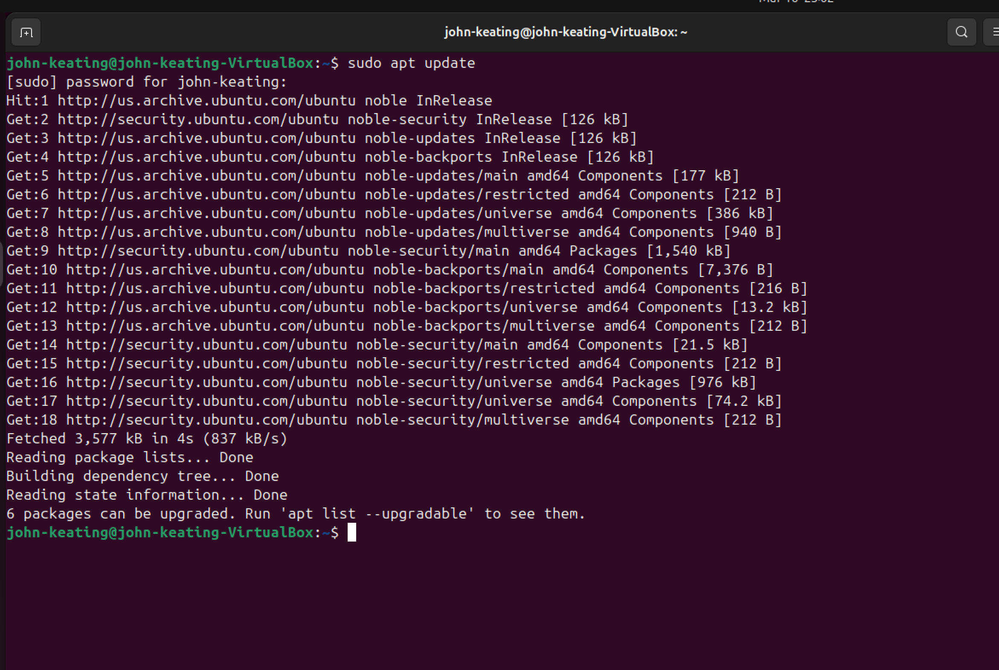

**Explanation:**  
This screenshot shows the system update process using `apt update` and `apt upgrade`. This ensures all packages are up to date before installing virtualization components, which is a best practice in Linux system administration.

---

### Screenshot 02 — KVM Installation Start
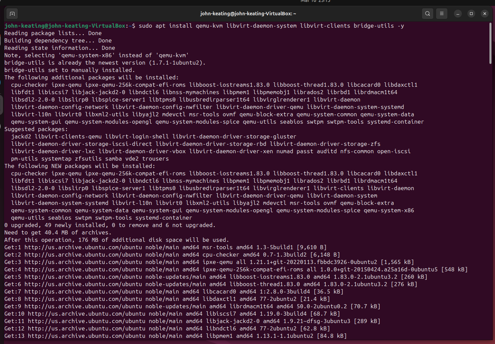

**Explanation:**  
This screenshot shows the beginning of the installation of virtualization packages including KVM, QEMU, libvirt, and related tools. These packages provide the foundation for managing virtual machines in Linux.

---

### Screenshot 03 — KVM Installation Complete
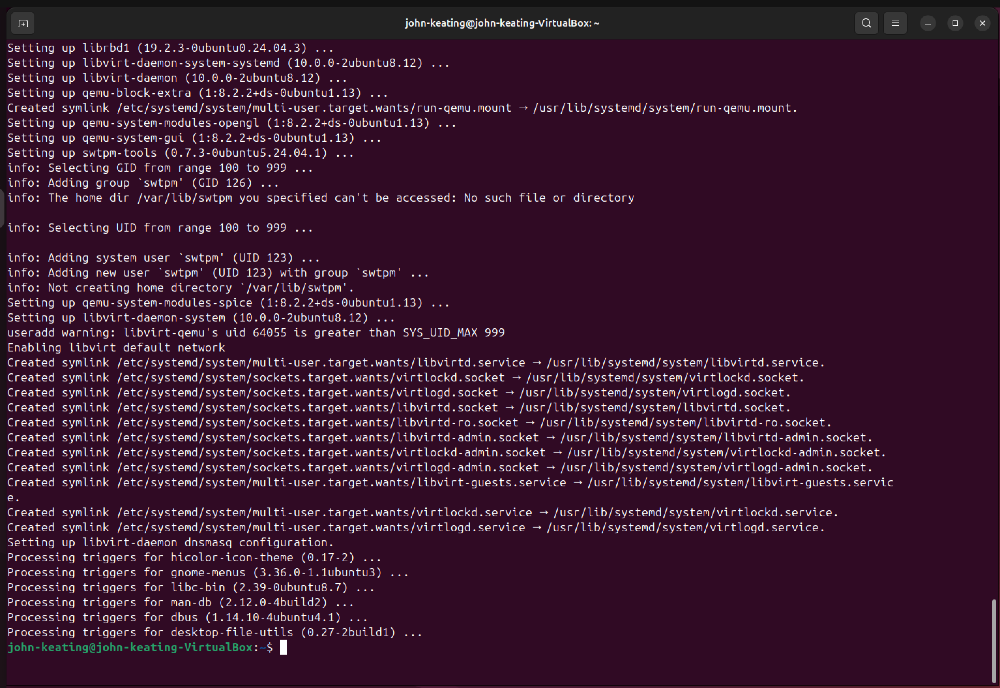

**Explanation:**  
This screenshot confirms that all required virtualization packages were successfully installed. The system is now equipped with the tools needed to support virtualization.

---

### Screenshot 04 — Virtualization Check Failed
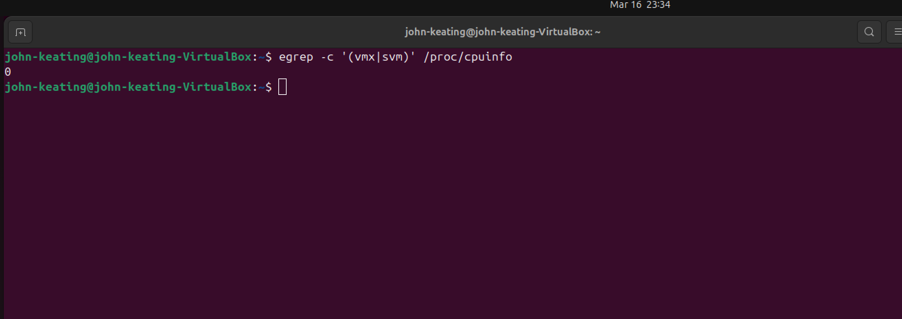

**Explanation:**  
This screenshot shows the command:

```bash
egrep -c '(vmx|svm)' /proc/cpuinfo
```

The output returned `0`, meaning CPU virtualization extensions are not available. This occurs because the lab is running inside VirtualBox without nested virtualization enabled.

---

### Screenshot 05 — KVM Modules Check
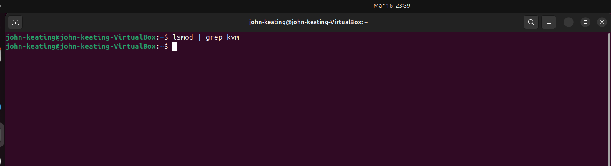

**Explanation:**  
This screenshot shows the command:

```bash
lsmod | grep kvm
```

No output indicates that KVM kernel modules are not loaded. This is expected because hardware virtualization support is not exposed inside the VirtualBox environment.

---

### Screenshot 06 — Libvirt Service Status
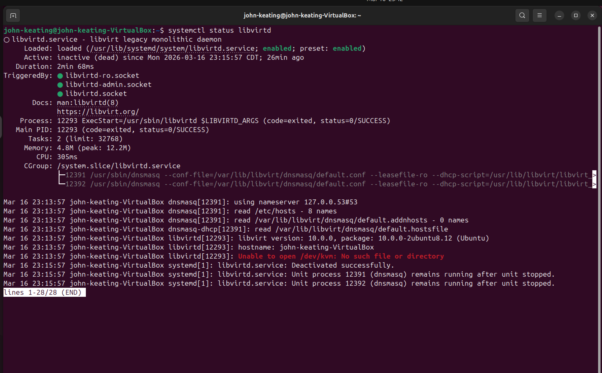

**Explanation:**  
This screenshot displays the status of the `libvirtd` service before it is started. It confirms the service is installed but not yet active.

---

### Screenshot 07 — Libvirt Service Running
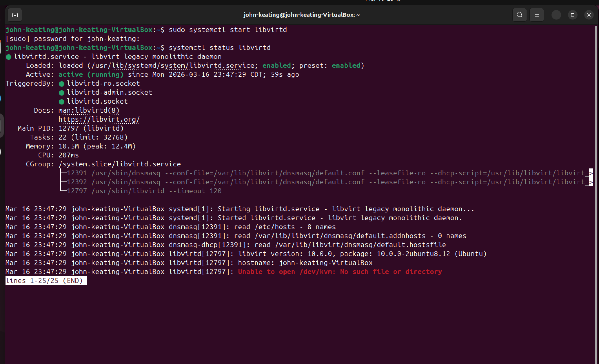

**Explanation:**  
This screenshot confirms the `libvirtd` service has been successfully started and is actively running. This service is responsible for managing virtual machines and virtual networks.

---

### Screenshot 08 — Virsh List All
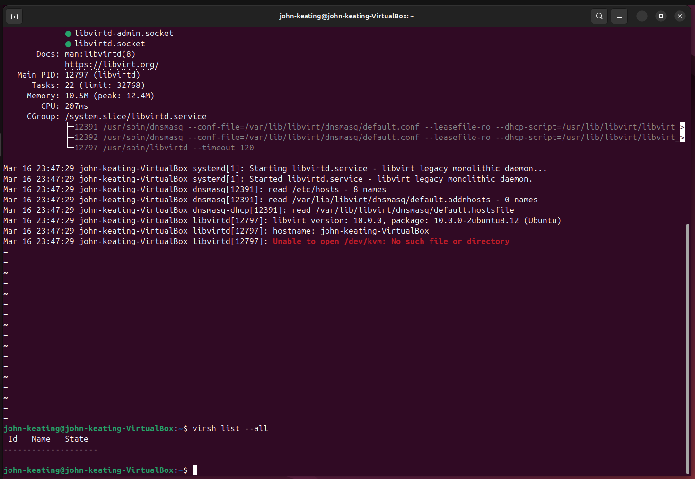

**Explanation:**  
This screenshot shows the output of:

```bash
virsh list --all
```

No virtual machines are listed, confirming that the virtualization environment is set up but no VMs have been created yet.

---

### Screenshot 09 — Libvirt Network List
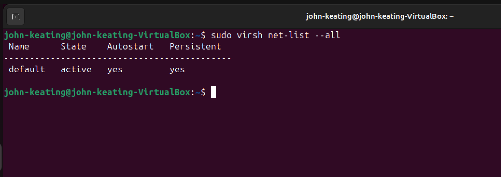

**Explanation:**  
This screenshot shows the output of:

```bash
sudo virsh net-list --all
```

It confirms that the default virtual network is:
- Active  
- Persistent  
- Configured to autostart  

This verifies that libvirt networking is correctly configured.

---

### Screenshot 10 — Network Interfaces
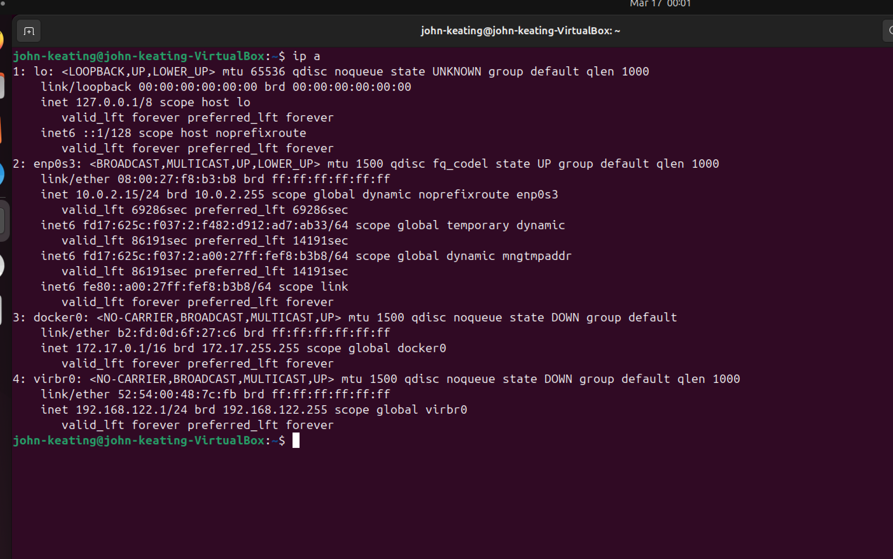

**Explanation:**  
This screenshot displays system network interfaces using `ip a`. It includes:
- `enp0s3` → Main VirtualBox NAT network  
- `virbr0` → Libvirt virtual bridge network  
- `docker0` → Docker network interface  
- `lo` → Loopback interface  

This demonstrates a multi-layered networking environment similar to real-world systems.

---

### Screenshot 11 — Libvirt Network Details
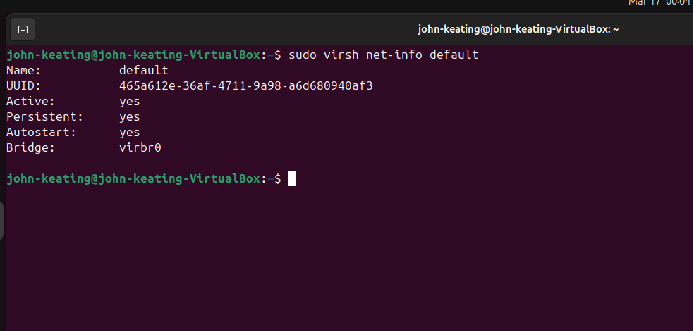

**Explanation:**  
This screenshot shows detailed information about the default libvirt network using:

```bash
sudo virsh net-info default
```

It confirms:
- Network is active  
- Persistent configuration is enabled  
- Autostart is enabled  
- Bridge interface is `virbr0`  

This validates that the virtualization network is fully operational.

---

---

## Key Concepts

- KVM provides hardware-level virtualization
- Libvirt manages virtual machines and networks
- Virtual bridges enable VM networking
- NAT networking allows VMs to access external networks
- Kernel modules are required for virtualization support

---

## Real-World Relevance

This lab directly applies to:
- Cloud infrastructure (Azure, AWS, GCP)
- Virtual machine provisioning
- DevOps environments
- Cybersecurity labs and sandboxes

These skills are used by:
- Cloud Engineers
- DevOps Engineers
- System Administrators
- Security Engineers

---

## What I Learned

- How to install and verify a virtualization stack
- How to manage services using systemctl
- How to inspect virtualization environments using virsh
- How Linux networking integrates with virtualization
- How to diagnose missing virtualization support

---

## Professional Notes (Interview-Level)

### Virtualization Limitation

“KVM modules were not loaded because virtualization extensions were not exposed to the guest OS due to running inside VirtualBox without nested virtualization.”

---

### Loop Device Explanation

“Most loop devices are snap package mounts. Focus should be on loop devices mapped to disk images when working with LVM.”

---

## Final Result

Successfully installed and validated a Linux virtualization environment using KVM and libvirt, including service management, networking configuration, and system-level verification.

---
