# Linux Lab 33 — SSH, DNS, and Network Services

---

## Objective

The objective of this lab is to install, configure, verify, and test core Linux networking services including SSH, DNS resolution, and network connectivity.

This lab demonstrates real-world system administration tasks used in cloud engineering, DevOps, and cybersecurity environments.

---

## Environment

- Ubuntu Linux (VirtualBox VM)
- Bash Terminal
- OpenSSH Server
- DNS Utilities (nslookup, dig)
- Networking Tools (ping, ss, ip)

---

## Commands Used and Definitions

### Package Management

sudo apt update  
- Updates package lists from configured repositories  
- sudo = run command as superuser (root)  
- apt = Advanced Package Tool  
- update = refresh available package lists  

sudo apt install openssh-server dnsutils net-tools -y  
- Installs required networking tools  
- -y = automatically confirms installation prompts  

---

### SSH (Secure Shell)

systemctl status ssh  
- Checks SSH service status  
- systemctl = system service manager  

ssh localhost  
- Connects to the same machine via SSH  
- localhost = 127.0.0.1 (loopback address)  

exit  
- Closes SSH session  

---

### Networking Commands

ip a  
- Displays network interfaces and assigned IP addresses  

hostname  
- Displays system hostname  

hostname -I  
- Displays all assigned IP addresses  

---

### DNS Tools

nslookup google.com  
- Queries DNS server for domain resolution  

dig google.com  
- Advanced DNS lookup tool providing detailed query results  

---

### Connectivity Testing

ping -c 4 google.com  
- Sends 4 ICMP packets to test network connectivity  
- -c = count (number of packets)  

---

### Port and Service Inspection

ss -tulnp  
- Displays listening ports and services  

---

## Symbols and Flags Explained

- -c → count (number of packets)
- -t → TCP protocol
- -u → UDP protocol
- -l → listening ports only
- -n → numeric output (no DNS resolution)
- -p → show process using port
- : → separates IP and port
- 127.0.0.1 → loopback (local machine)
- 0.0.0.0 → all IPv4 interfaces
- [::] → all IPv6 interfaces

---

## Screenshots and Explanations

### Screenshot 01 — System Update  
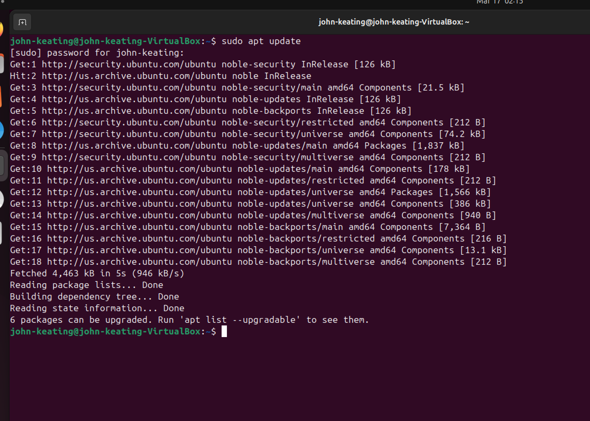  
Shows successful update of package lists from Ubuntu repositories.

---

### Screenshot 02 — Package Installation  
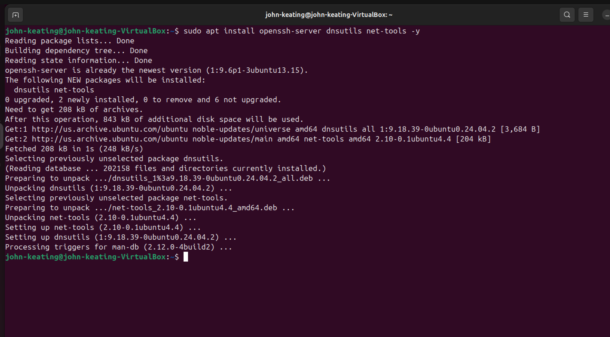  
Confirms installation of OpenSSH Server, DNS utilities, and networking tools.

---

### Screenshot 03 — SSH Service Status  
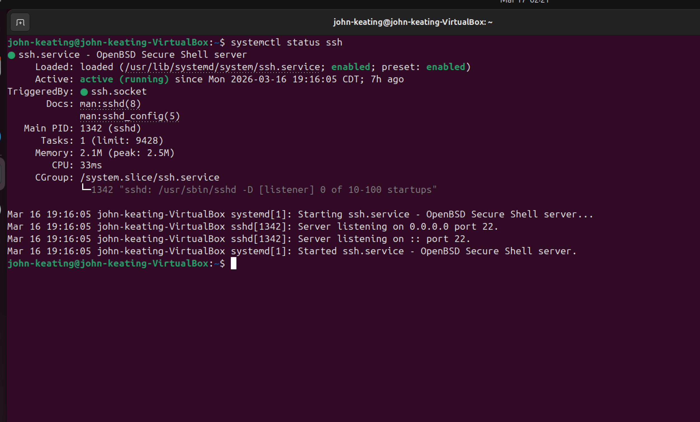  
Shows SSH is active (running), enabled at startup, and listening on port 22.

---

### Screenshot 04 — IP Address Configuration  
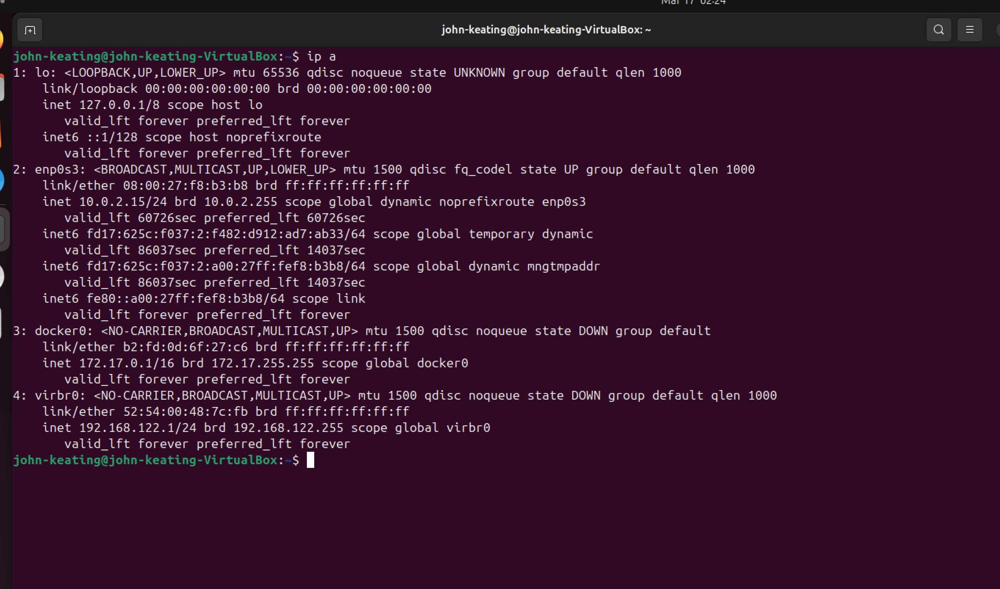  
Displays multiple network interfaces including NAT (VirtualBox), Docker, and virtual network adapters. Demonstrates a layered virtual networking environment.

---

### Screenshot 05 — SSH Local Connection  
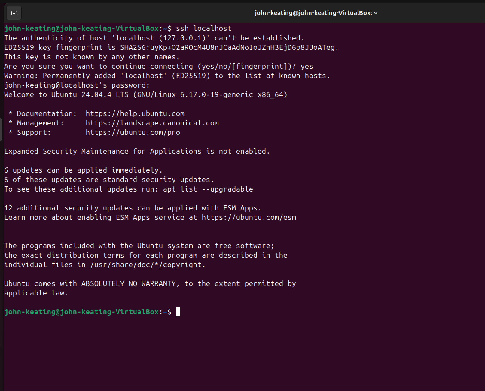  
Successful SSH login to localhost, confirming authentication and service functionality.

---

### Screenshot 06 — Exit SSH Session  
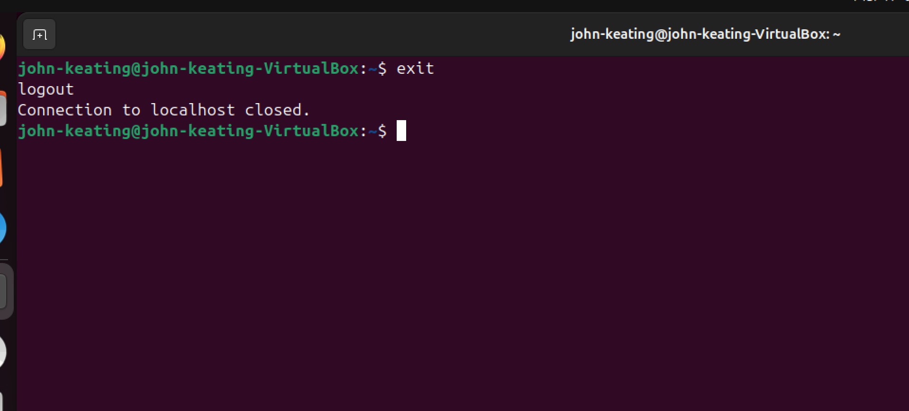  
Shows clean termination of SSH session.

---

### Screenshot 07 — nslookup Google  
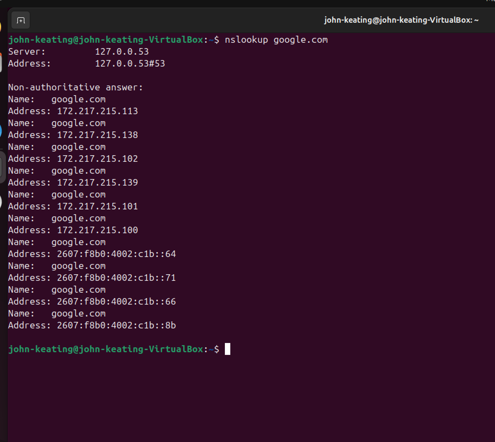  
DNS query resolving google.com to multiple IP addresses (load balancing).

---

### Screenshot 08 — dig Google  
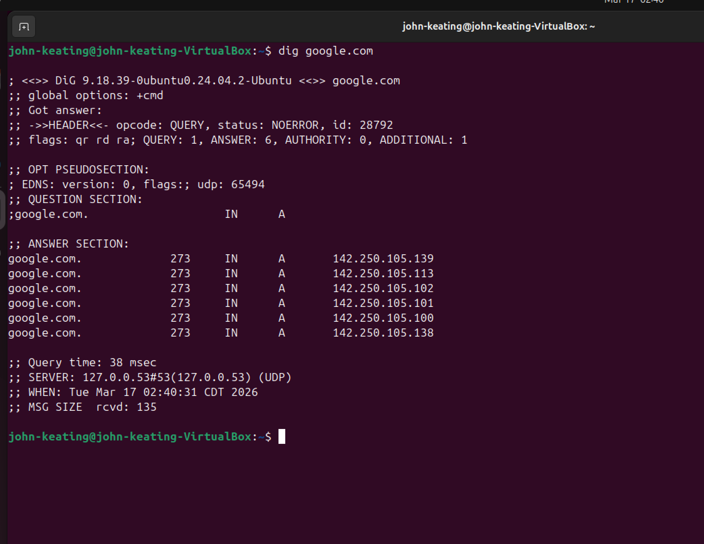  
Detailed DNS response including query time, server used, and record types.

---

### Screenshot 09 — ping Google  
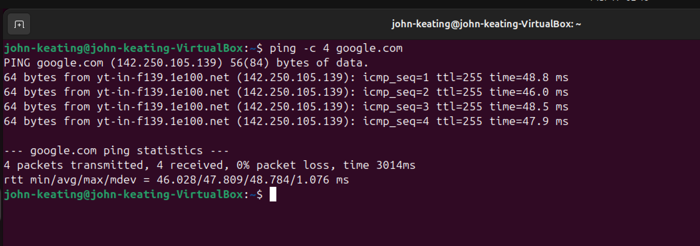  
Confirms connectivity with 0% packet loss and stable latency.

---

### Screenshot 10 — Open Ports (ss)  
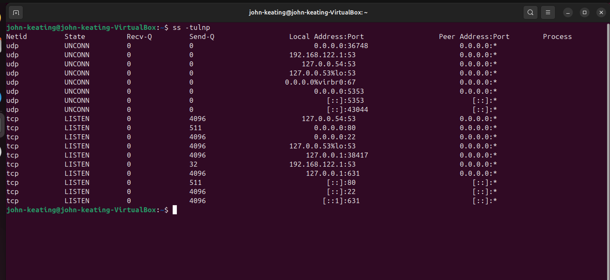  
Displays listening ports including SSH (port 22) and DNS services.

---

### Screenshot 11 — Hostname and IP  
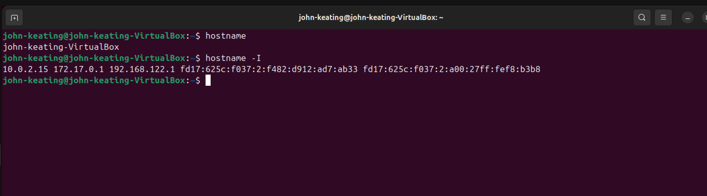  
Shows system hostname and assigned IP addresses across interfaces.

---

## Key Concepts

- SSH enables secure remote access  
- DNS translates domain names into IP addresses  
- ICMP (ping) verifies network connectivity  
- Ports represent services running on a system  
- Virtual networking simulates real-world cloud environments  

---

## Real-World / Interview Explanations

SSH Verification  
“I verified that the SSH service was running and accessible by connecting locally using SSH, confirming authentication and service availability.”

DNS Analysis  
“DNS resolution was successful using both nslookup and dig. Multiple A records were returned, indicating load balancing, and queries were handled by the local systemd-resolved service.”

Network Connectivity  
“I validated network connectivity using ping, confirming 0% packet loss and stable latency, indicating a healthy network connection.”

Port and Service Inspection  
“I used the ss command to inspect listening ports and verified that SSH was actively listening on port 22 across all interfaces. I also identified local DNS resolution services and virtual networking interfaces, confirming proper system and virtualization network configuration.”

Virtualization Insight  
“KVM modules were not loaded because virtualization extensions were not exposed to the guest OS due to running inside VirtualBox without nested virtualization.”

Loop Device Explanation  
“Those are snap package mounts — I focused on the loop devices mapped to my disk images for LVM setup.”

---

## What I Learned

- How to install and configure SSH  
- How to verify services using systemctl  
- How DNS resolution works using nslookup and dig  
- How to test connectivity using ping  
- How to inspect open ports using ss  
- How virtualization creates layered networking environments  
- How to explain system behavior like a professional engineer  

---

## Real-World Relevance

These skills are used in:

- Cloud Engineering (AWS, Azure)  
- DevOps and Infrastructure Automation  
- Cybersecurity and Network Analysis  
- System Administration  

This lab simulates real-world troubleshooting and validation tasks performed by engineers daily.

---