# Linux Lab 34 — LDAP, Kerberos, and SSSD Basics / SSSD Troubleshooting Lab

---

## Objective

The purpose of this lab was to install foundational identity and authentication components used in enterprise Linux environments, then troubleshoot and repair a failed SSSD service configuration.

This lab focused on:

- Installing SSSD, LDAP utilities, and Kerberos user tools
- Understanding Kerberos realm setup prompts
- Reviewing SSSD service behavior
- Verifying access to `/etc/sssd/`
- Creating and editing `/etc/sssd/sssd.conf`
- Securing the SSSD configuration file with proper permissions
- Restarting and troubleshooting the SSSD service
- Reading `systemctl` and `journalctl` output to identify the root cause
- Correcting the invalid provider configuration
- Successfully restoring the SSSD service to an active running state

This lab demonstrates a real Linux troubleshooting workflow that system administrators, cloud engineers, and security engineers use when authentication and identity services fail.

---

## Environment

- Ubuntu Linux (VirtualBox VM)
- Bash Terminal
- Nano text editor
- SSSD (System Security Services Daemon)
- LDAP utilities
- Kerberos user tools
- systemd service manager

---

## Commands Used and Full Definitions

### 1) Update package lists

```bash
sudo apt update
```

**Definition:**  
Updates the local package index from Ubuntu repositories so the system knows what software versions are available to install or upgrade.

**Command breakdown:**

- `sudo` = run the command with elevated root privileges
- `apt` = Advanced Package Tool, used to manage software packages
- `update` = refresh the package list from configured repositories

**Why it matters:**  
Before installing software, administrators update package lists to make sure the system is aware of the latest available packages.

---

### 2) Install SSSD, LDAP tools, and Kerberos user tools

```bash
sudo apt install sssd ldap-utils krb5-user -y
```

**Definition:**  
Installs the required identity and authentication tools used in the lab.

**Command breakdown:**

- `sudo` = run as administrator
- `apt` = package manager
- `install` = install the named packages
- `sssd` = System Security Services Daemon
- `ldap-utils` = LDAP client utilities
- `krb5-user` = Kerberos user tools
- `-y` = automatically answer yes to prompts

**Packages explained:**

- `sssd` = provides centralized identity, authentication, and access control support
- `ldap-utils` = includes commands used to query LDAP services
- `krb5-user` = includes Kerberos client utilities used for authentication-related tasks

**Why it matters:**  
These packages are commonly used in enterprise Linux environments that integrate with centralized identity services.

---

### 3) Check SSSD service status

```bash
systemctl status sssd
```

**Definition:**  
Displays the current state of the SSSD service, including whether it is running, failed, inactive, enabled, and recent log messages.

**Command breakdown:**

- `systemctl` = command used to control and inspect systemd services
- `status` = show detailed information about a service
- `sssd` = the service being checked

**Why it matters:**  
This is one of the first commands administrators run when a service is not behaving correctly.

---

### 4) List the SSSD directory without elevated privileges

```bash
ls /etc/sssd/
```

**Definition:**  
Attempts to list the contents of the `/etc/sssd/` configuration directory.

**Command breakdown:**

- `ls` = list files and directories
- `/etc/sssd/` = the SSSD configuration directory

**Why it matters:**  
This showed that normal user access was denied, which demonstrates that identity configuration directories are protected.

---

### 5) List the SSSD directory with elevated privileges

```bash
sudo ls /etc/sssd/
```

**Definition:**  
Lists the contents of the `/etc/sssd/` directory with administrative privileges.

**Command breakdown:**

- `sudo` = run as administrator
- `ls` = list directory contents
- `/etc/sssd/` = target directory

**Why it matters:**  
This confirmed that the directory existed and allowed inspection of protected system files.

---

### 6) List detailed permissions on the SSSD directory

```bash
sudo ls -l /etc/sssd/
```

**Definition:**  
Displays detailed information about the files and folders inside `/etc/sssd/`, including ownership and permissions.

**Command breakdown:**

- `sudo` = elevated privileges
- `ls` = list contents
- `-l` = long listing format
- `/etc/sssd/` = target directory

**What `-l` shows:**

- file type
- permissions
- hard link count
- owner
- group
- size
- modified date
- file name

**Why it matters:**  
This helps verify whether the config file exists and whether permissions are appropriate.

---

### 7) Check whether the SSSD configuration file exists

```bash
sudo ls /etc/sssd/sssd.conf
```

**Definition:**  
Checks whether the main SSSD configuration file exists.

**Command breakdown:**

- `sudo` = elevated privileges
- `ls` = list the file
- `/etc/sssd/sssd.conf` = full path to the config file

**Why it matters:**  
This confirmed whether the file needed to be created manually.

---

### 8) Edit or create the SSSD configuration file

```bash
sudo nano /etc/sssd/sssd.conf
```

**Definition:**  
Opens the SSSD configuration file in the Nano text editor. If the file does not exist, Nano creates it when saved.

**Command breakdown:**

- `sudo` = elevated privileges
- `nano` = terminal text editor
- `/etc/sssd/sssd.conf` = file to open

**Why it matters:**  
This is where the actual SSSD configuration was created and corrected.

---

### 9) Secure the SSSD configuration file

```bash
sudo chmod 600 /etc/sssd/sssd.conf
```

**Definition:**  
Sets the SSSD config file permissions so only the file owner can read and write it.

**Command breakdown:**

- `sudo` = elevated privileges
- `chmod` = change file permissions
- `600` = permission mode
- `/etc/sssd/sssd.conf` = target file

**What `600` means:**

- owner = read and write
- group = no permissions
- others = no permissions

**Why it matters:**  
SSSD requires secure permissions on its configuration file. This is a security best practice because auth-related configuration may contain sensitive information.

---

### 10) Restart the SSSD service

```bash
sudo systemctl restart sssd
```

**Definition:**  
Stops and starts the SSSD service again so it reloads the configuration file.

**Command breakdown:**

- `sudo` = elevated privileges
- `systemctl` = service manager
- `restart` = stop then start the service
- `sssd` = service name

**Why it matters:**  
Any config change usually requires a service restart to take effect.

---

### 11) View detailed journal logs for SSSD

```bash
sudo journalctl -xeu sssd.service
```

**Definition:**  
Shows detailed log entries for the SSSD service in the systemd journal.

**Command breakdown:**

- `sudo` = elevated privileges
- `journalctl` = query systemd logs
- `-x` = include extra explanatory help text when available
- `-e` = jump to the end of the journal
- `-u` = filter by service unit
- `sssd.service` = the specific service being investigated

**Why it matters:**  
This is one of the most important troubleshooting commands in Linux. It helps identify why a service failed.

---

## Nano Editor Keys Used

### Save file
```text
Ctrl + O
```

**Definition:**  
Writes the file to disk.

---

### Confirm file name
```text
Enter
```

**Definition:**  
Confirms the save operation.

---

### Exit Nano
```text
Ctrl + X
```

**Definition:**  
Exits the Nano editor.

---

## Symbols, Flags, and Permission Characters Explained

### In package commands

- `-y` = automatically answer yes to package prompts

---

### In `ls -l` output

Example:
```text
-rw------- 1 root root 126 Mar 17 21:47 /etc/sssd/sssd.conf
```

**Breakdown:**

- `-` = regular file
- `rw-------` = permissions
- `1` = hard link count
- `root` = file owner
- `root` = file group
- `126` = file size in bytes
- `Mar 17 21:47` = last modified date and time
- `/etc/sssd/sssd.conf` = file path

### Permission symbols

- `r` = read
- `w` = write
- `x` = execute
- `-` = no permission in that slot

### `rw-------` breakdown

- first `rw-` = owner can read and write
- second `---` = group has no access
- third `---` = others have no access

This equals numeric mode `600`.

---

### In `systemctl status` output

Common fields:

- `Loaded:` = whether systemd recognizes the service unit file
- `Active:` = current service state
- `Main PID:` = process ID of the main running process
- `Tasks:` = number of tasks/threads
- `Memory:` = memory usage
- `CPU:` = CPU time consumed
- `CGroup:` = control group for the service

---

### In `journalctl` output

Common phrases:

- `code=exited` = the process ended normally from systemd’s perspective, but not necessarily successfully
- `status=1/FAILURE` = the service process exited with failure status
- `Failed with result 'exit-code'` = systemd considers the service startup unsuccessful
- `Could not restart critical service [LOCAL]` = SSSD could not start an essential configured domain/backend

---

### In SSSD config

```ini
[sssd]
```
Defines global SSSD service settings.

```ini
[domain/LOCAL]
```
Defines the settings for a specific SSSD domain named `LOCAL`.

---

### SSSD provider keywords

- `id_provider` = determines where identity information comes from
- `auth_provider` = determines where authentication comes from
- `access_provider` = determines how access control decisions are made

---

## Full Troubleshooting Workflow

### Step 1 — Update package lists
The lab began by updating the package index with:

```bash
sudo apt update
```

This ensured the system had current repository information before installing required tools.

---

### Step 2 — Install required packages
Next, the lab installed:

```bash
sudo apt install sssd ldap-utils krb5-user -y
```

This introduced the core tools needed for identity and authentication testing.

During package installation, a Kerberos prompt appeared requesting a default realm. This is normal because Kerberos often expects a default authentication domain in enterprise environments.

---

### Step 3 — Check the SSSD service
The service status was reviewed using:

```bash
systemctl status sssd
```

This showed that the SSSD service existed but was not yet functioning as intended for the lab.

---

### Step 4 — Attempt to inspect the SSSD configuration directory as a normal user
The command:

```bash
ls /etc/sssd/
```

returned a permission denied message.

This was important because it demonstrated that authentication configuration paths are protected from normal users.

---

### Step 5 — Inspect the SSSD directory with root privileges
Using:

```bash
sudo ls /etc/sssd/
```

and later:

```bash
sudo ls -l /etc/sssd/
```

allowed inspection of the protected directory and confirmed what files or folders were present.

---

### Step 6 — Check whether `sssd.conf` existed
The lab checked for the main config file directly:

```bash
sudo ls /etc/sssd/sssd.conf
```

When the config file did not exist in the expected state, the next step was to create it manually.

---

### Step 7 — Create and edit `/etc/sssd/sssd.conf`
The file was created with Nano:

```bash
sudo nano /etc/sssd/sssd.conf
```

An initial configuration was entered. During troubleshooting, multiple versions were tested while attempting to get the service running.

---

### Step 8 — Secure the file permissions
The config file permissions were set using:

```bash
sudo chmod 600 /etc/sssd/sssd.conf
```

This was required because SSSD expects its main configuration file to be protected. If the permissions are too open, SSSD may refuse to start.

---

### Step 9 — Restart SSSD and observe failure
The service was restarted using:

```bash
sudo systemctl restart sssd
```

At this point, the service failed.

This was a key part of the lab because it created a real troubleshooting scenario rather than a perfect install.

---

### Step 10 — Inspect service status after failure
The service status was reviewed again:

```bash
systemctl status sssd
```

This confirmed that the service was in a failed state and that deeper log inspection was required.

---

### Step 11 — Review the configuration manually
The config file was opened again in Nano and reviewed.

This was where the invalid provider values were examined and compared against expected SSSD behavior.

The earlier nonworking configuration attempted unsupported provider settings for the lab’s actual environment, which caused SSSD to fail.

---

### Step 12 — Review logs using journalctl
Detailed logs were gathered with:

```bash
sudo journalctl -xeu sssd.service
```

This was the most important diagnostic step.

The log message:

```text
Could not restart critical service [LOCAL]
```

showed that the configured domain backend named `LOCAL` could not start correctly.

This pointed directly to a domain/provider configuration issue rather than a permission or package-installation issue.

---

### Step 13 — Correct the SSSD configuration
After reviewing the logs and earlier config attempts, the broken domain config was replaced with the final working configuration:

```ini
[sssd]
services = nss, pam
config_file_version = 2
domains = LOCAL

[domain/LOCAL]
id_provider = files
auth_provider = files
access_provider = permit
```

**Why this worked:**

- `id_provider = files` tells SSSD to use the local system files for identity information
- `auth_provider = files` tells SSSD to use local file-based authentication sources for the lab
- `access_provider = permit` allows access decisions to succeed for this basic test environment

This corrected the invalid provider setup that had previously prevented the `LOCAL` domain from starting.

---

### Step 14 — Reapply secure permissions
Even after editing the config, secure permissions were re-applied:

```bash
sudo chmod 600 /etc/sssd/sssd.conf
```

This ensured the file remained protected and compatible with SSSD security expectations.

---

### Step 15 — Restart SSSD again
With the corrected configuration in place, the service was restarted:

```bash
sudo systemctl restart sssd
```

This time, the service successfully started.

---

### Step 16 — Verify SSSD is active and running
Finally, the lab verified the corrected service state:

```bash
systemctl status sssd
```

The final output showed:

```text
Active: active (running)
```

This confirmed that the service was fully restored.

---

## Screenshots & Explanations

---

### Screenshot 1 — System Update
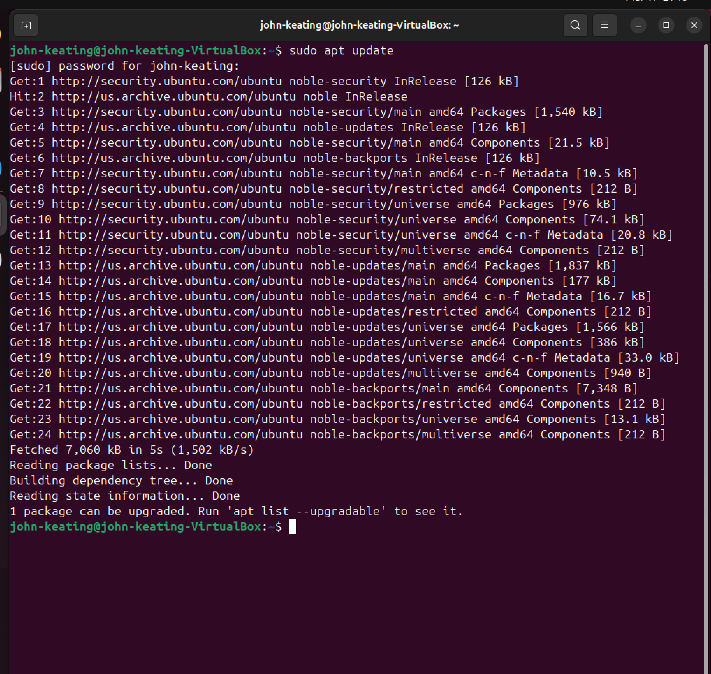

This screenshot shows the system packages being updated. This ensures the system is fully patched and ready for installing authentication services.

---

### Screenshot 2 — Kerberos Realm Prompt


This screenshot shows the Kerberos configuration prompt during installation. This step defines the authentication realm used by the system.

---

### Screenshot 3 — SSSD, LDAP, Kerberos Installed
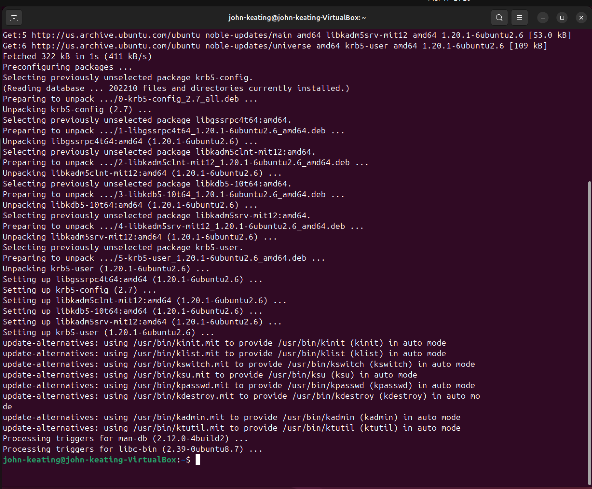

This screenshot confirms that SSSD, LDAP, and Kerberos packages were successfully installed.

---

### Screenshot 4 — SSSD Service Status
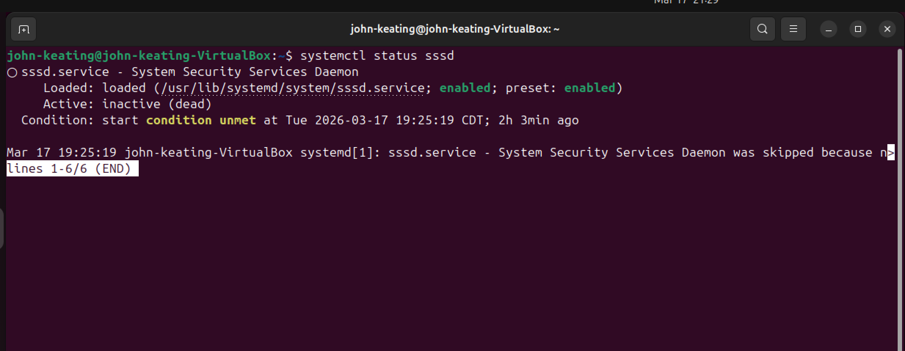

This screenshot shows the SSSD service status. Initially verifying service behavior is critical before configuration.

---

### Screenshot 5 — Permission Denied Error
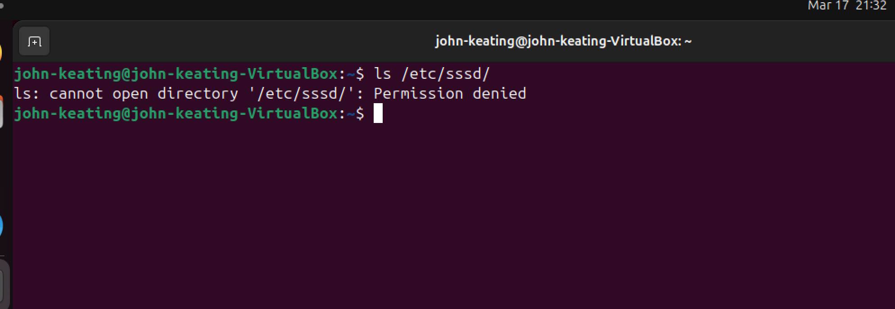

This screenshot shows a permission denied error when attempting to edit the SSSD config file. This highlights the need for elevated privileges.

---

### Screenshot 6 — Editing Config with sudo
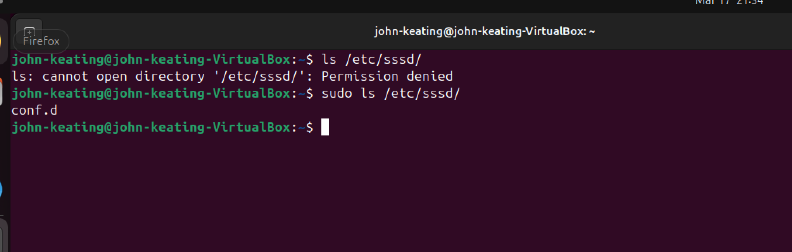

This screenshot shows using sudo to properly edit the configuration file with administrative privileges.

---

### Screenshot 7 — Config Permissions Set
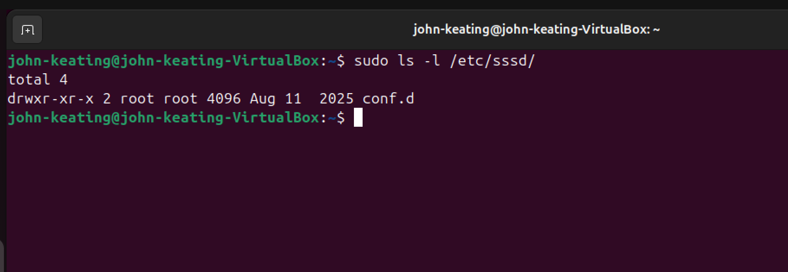

This screenshot shows the configuration file permissions being reviewed or modified.

---

### Screenshot 8 — Config Validation
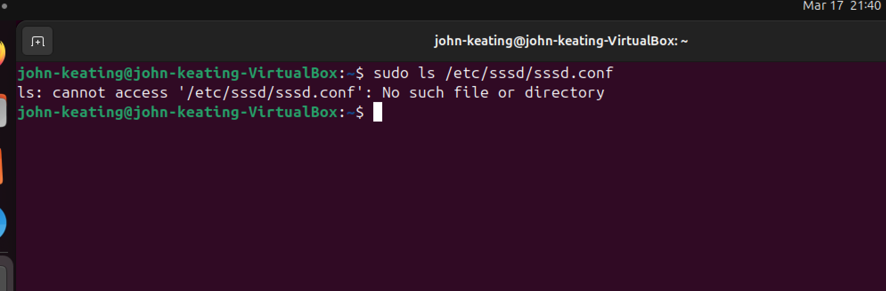

This screenshot shows verification of the SSSD configuration file before proceeding.

---

### Screenshot 9 — Config File Created
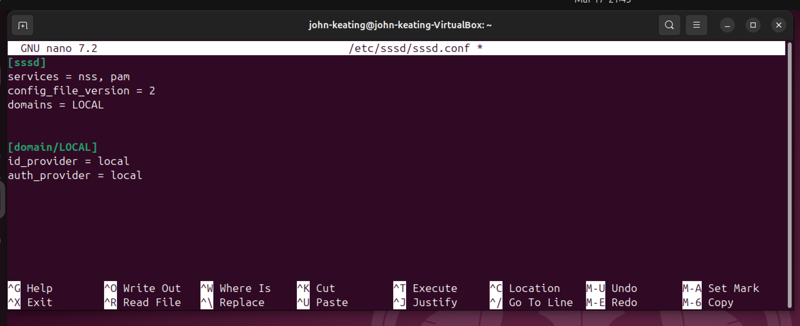

This screenshot shows the initial creation of the SSSD configuration file inside Nano.

---

### Screenshot 10 — Permissions Secured
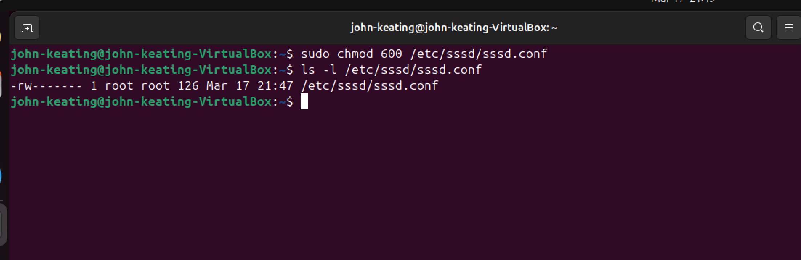

This screenshot shows the config file permissions set to 600:
- Owner: read/write
- Others: no access

This is critical for authentication security.

---

### Screenshot 11 — Service Restart Failed
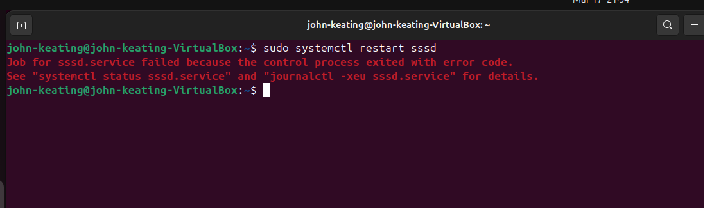

This screenshot shows the SSSD service failing to restart after configuration.

---

### Screenshot 12 — Status Error Details
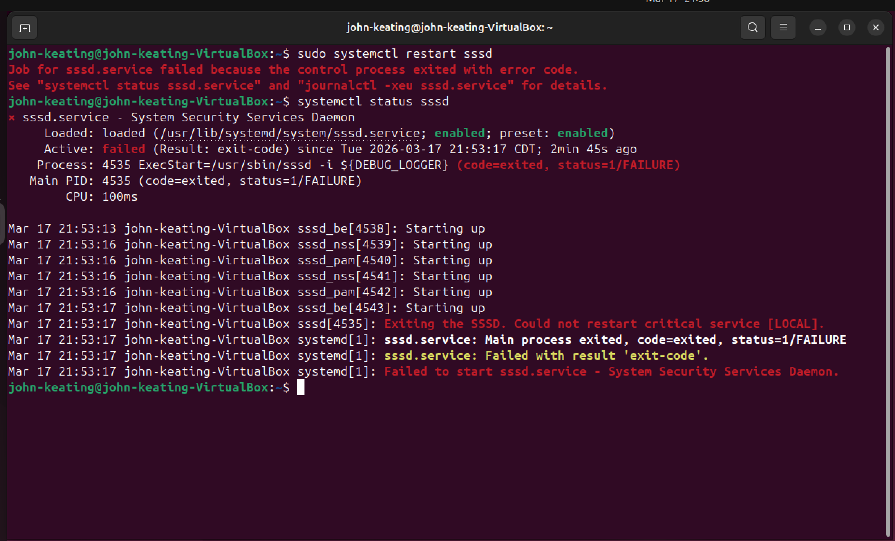

This screenshot shows detailed failure output from the service, providing clues for troubleshooting.

---

### Screenshot 13 — Config Fixed
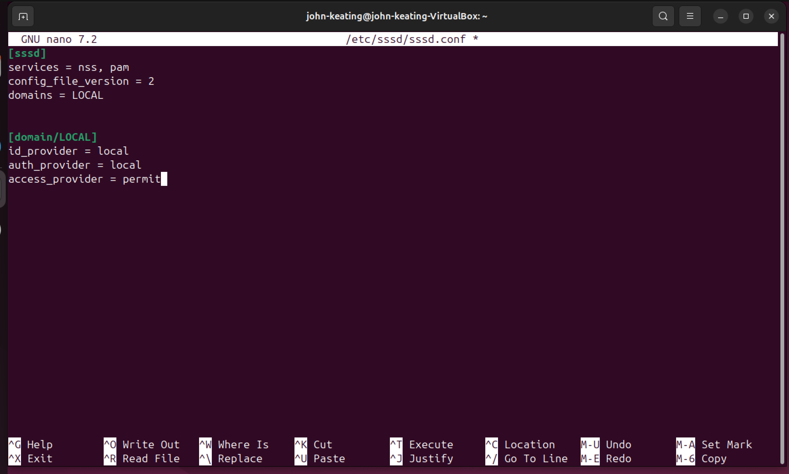

This screenshot shows the corrected configuration file after identifying errors.

---

### Screenshot 14 — Restart Still Failing
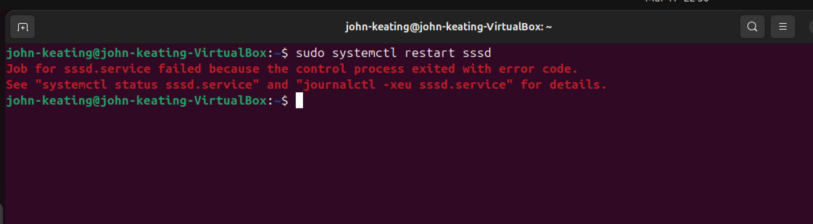

This screenshot shows that the service still failed after the first fix attempt, requiring deeper troubleshooting.

---

### Screenshot 15 — Service Still Failed
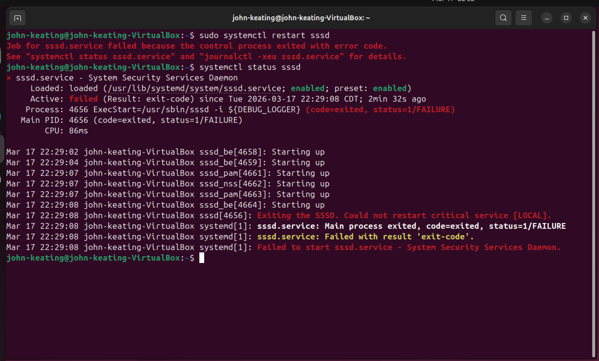

This screenshot confirms the service is still not running properly.

---

### Screenshot 16 — Config Review
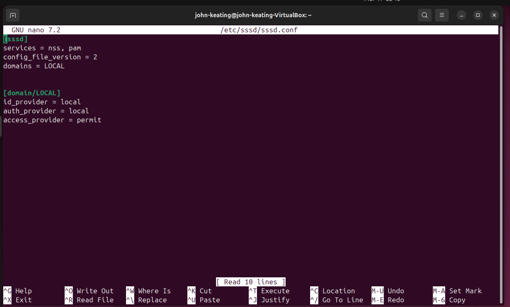

This screenshot shows a detailed review of the configuration file to identify remaining issues.

---

### Screenshot 17 — Journal Error Logs
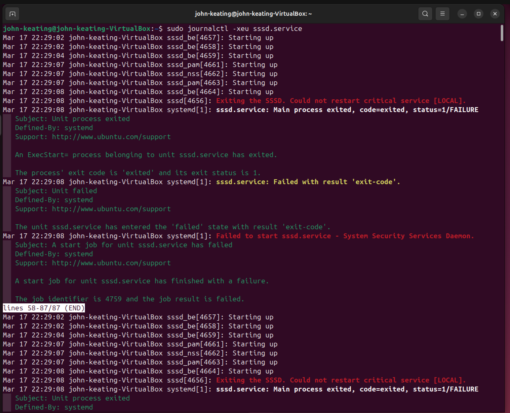

This screenshot shows journal logs revealing the root cause:
"Could not restart critical service [LOCAL]"

This indicates a provider misconfiguration.

---

### Screenshot 18 — Service Running Successfully
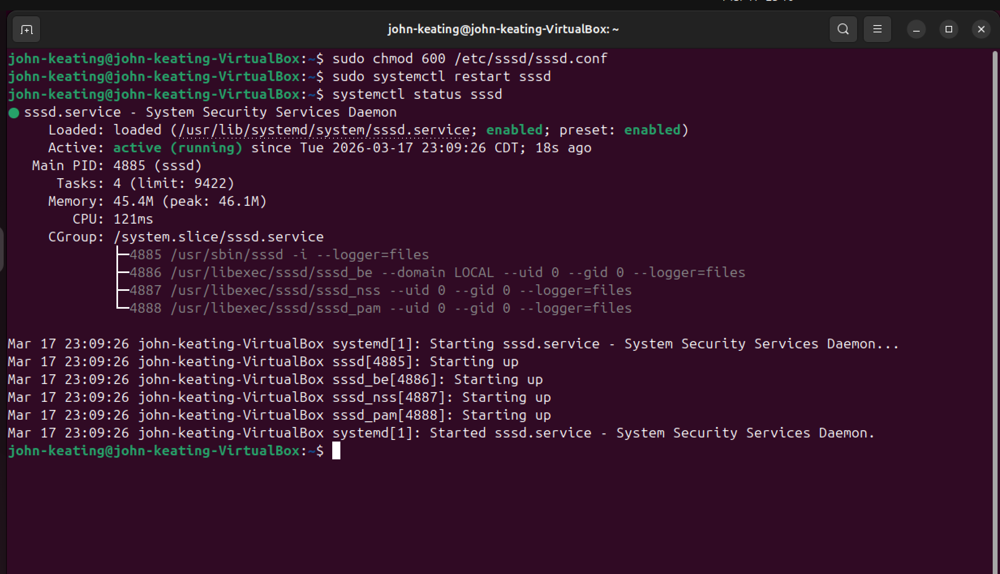

This screenshot confirms the SSSD service is now running successfully after fixing the configuration.

---

---

## Root Cause Analysis

The service failure was caused by an invalid SSSD domain/provider configuration.

The logs showed that the critical service for the configured domain `LOCAL` could not restart. That indicated the domain configuration was not valid for the environment.

After reviewing the config and comparing the failure pattern, the incorrect provider configuration was replaced with a working file-based configuration:

```ini
id_provider = files
auth_provider = files
access_provider = permit
```

This allowed the `LOCAL` domain to initialize correctly and brought the SSSD service back online.

---

## Key Concepts

- SSSD provides identity and authentication integration for Linux systems
- Protected system configuration directories often require root access
- Services must be restarted after configuration changes
- File permissions can prevent security-sensitive services from starting
- `systemctl` shows service state and recent related logs
- `journalctl` provides detailed service failure analysis
- Re-checking configuration after a failed restart is a standard troubleshooting practice
- Reading logs before making more changes is a professional engineering habit

---

## What I Learned

- How to install and prepare identity/authentication tools on Linux
- How to work with the SSSD configuration file
- How to secure authentication-related files with proper permissions
- How to troubleshoot failed Linux services step by step
- How to use `systemctl` and `journalctl` together during service troubleshooting
- How to identify invalid provider settings in an SSSD configuration
- How to correct the config and restore a failed service
- How to document failure, diagnosis, correction, and recovery like a real engineer

---

## Real-World / Interview Explanations

### SSSD Troubleshooting Explanation
“I troubleshot an SSSD service failure by reviewing the configuration file, checking service status with systemctl, analyzing detailed logs with journalctl, identifying an invalid provider configuration, correcting the SSSD domain settings, securing the configuration file permissions, and successfully restoring the service to an active running state.”

---

### Permission Security Explanation
“Authentication-related configuration files must be protected with strict permissions. I used chmod 600 on sssd.conf so that only root could read and write the file, which aligns with Linux security best practices for identity services.”

---

### Troubleshooting Mindset Explanation
“When the service failed, I did not guess. I verified the failure with systemctl, reviewed the logs with journalctl, traced the issue to the configured LOCAL domain, corrected the provider configuration, and validated the fix by restarting the service and confirming it returned to active running status.”

---

## Real-World Relevance

This lab reflects real work performed in:

- Linux system administration
- Identity and access management support
- Cloud engineering
- Security operations
- Enterprise authentication troubleshooting

In real environments, engineers regularly troubleshoot services that fail because of:
- invalid configs
- incorrect permissions
- broken provider settings
- incomplete identity integration

This lab demonstrates the practical ability to move from failure to diagnosis to resolution.

---

## Conclusion

This lab began as a basic identity services setup and became a full troubleshooting exercise.

By the end of the lab, I had:

- Installed the required identity/authentication packages
- Reviewed protected Linux auth configuration paths
- Created and edited the main SSSD configuration file
- Applied secure file permissions
- Diagnosed repeated service failures
- Used `systemctl` and `journalctl` to identify the root cause
- Corrected the invalid provider configuration
- Successfully restored the SSSD service to active running status

This lab demonstrates not just Linux configuration, but real troubleshooting discipline and service recovery skills.
