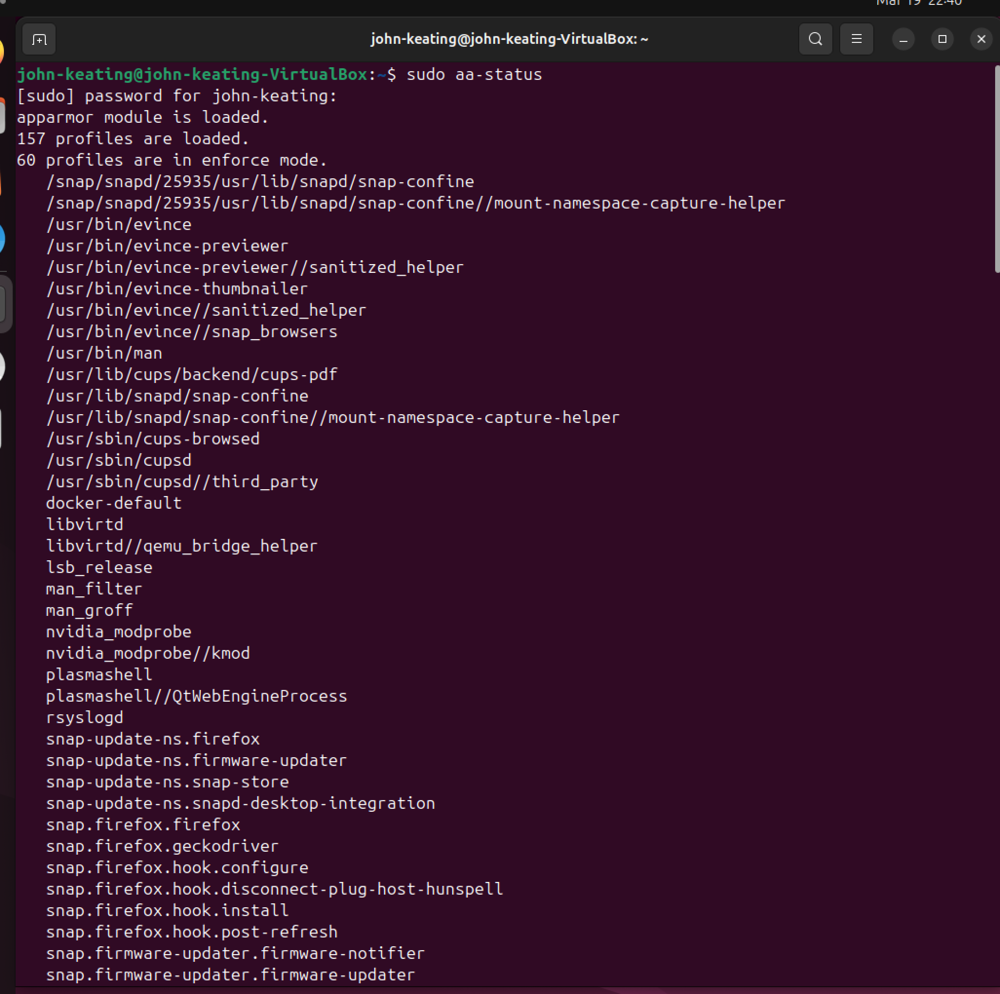
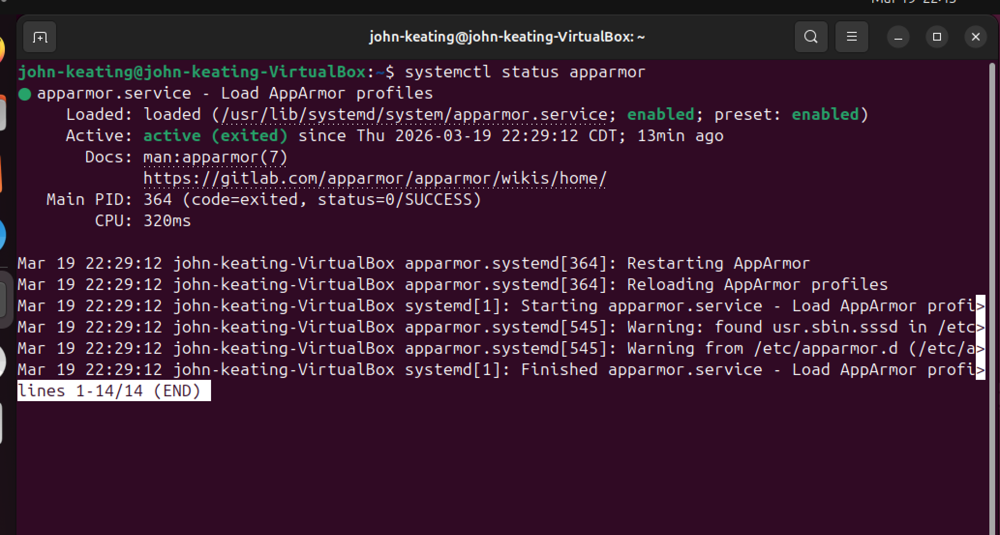
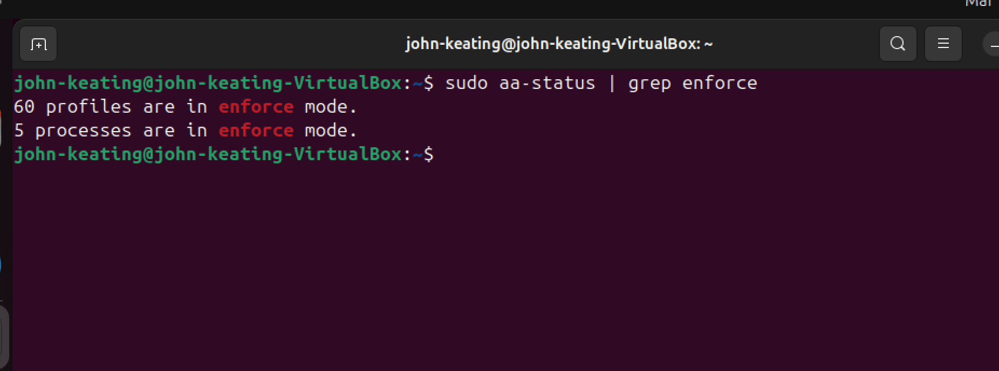
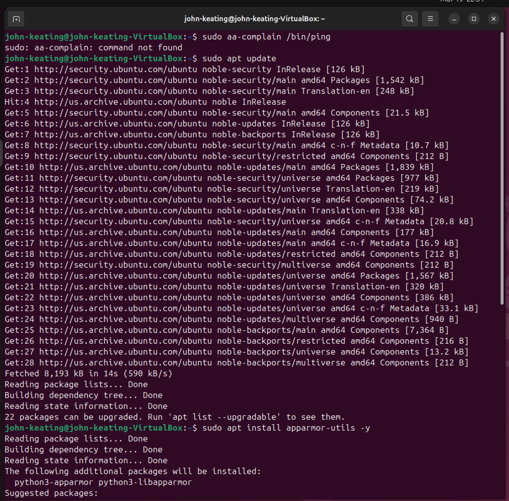
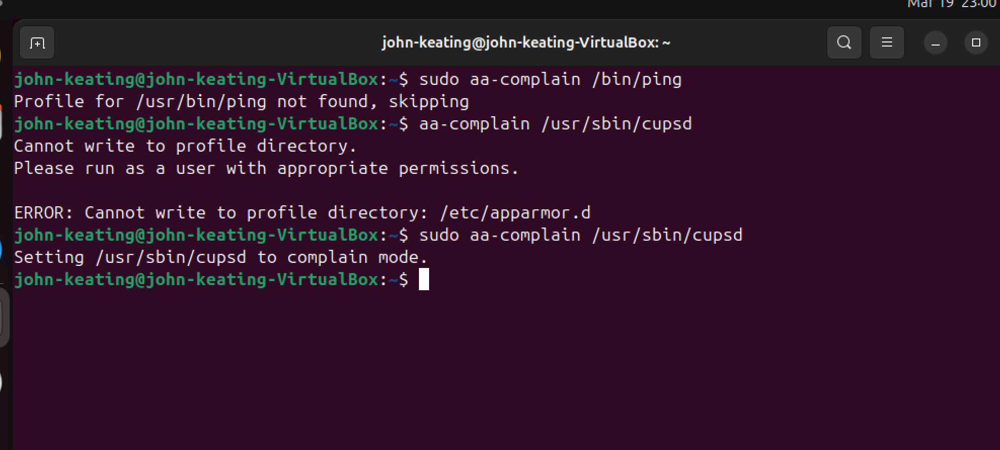
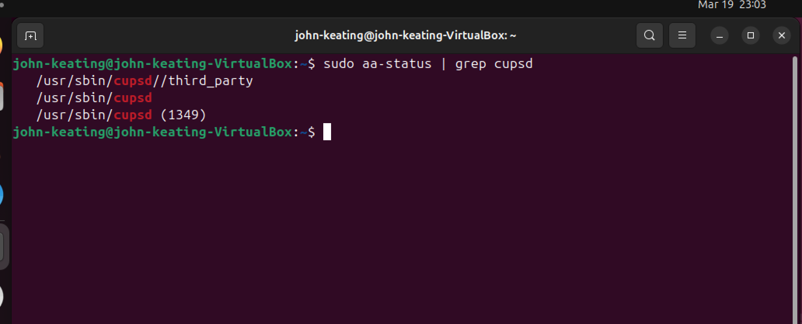
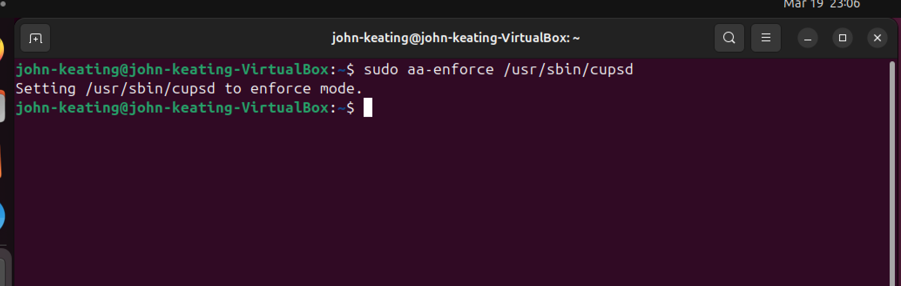

# Linux Security Lab — AppArmor (SELinux Alternative)

## Objective
The purpose of this lab is to understand and manage Linux security using AppArmor. This includes checking AppArmor status, identifying active profiles, switching profiles between complain and enforce modes, and troubleshooting real-world permission and configuration issues.

---

## Environment
- Ubuntu Linux (VirtualBox VM)
- Bash Terminal
- Windows Host Machine
- Git Bash
- AppArmor Security Framework

---

## Commands Used
| Command | Description |
|--------|-------------|
| aa-status | Displays AppArmor status and loaded profiles |
| grep | Filters output for specific keywords |
| systemctl status apparmor | Checks AppArmor service status |
| aa-complain | Sets profile to complain mode (logs only) |
| aa-enforce | Sets profile to enforce mode (actively blocks) |
| apt update | Updates package list |
| apt install apparmor-utils -y | Installs AppArmor utilities |
| clear | Clears terminal screen |

---

## Command Definitions (Beginner Friendly)
- sudo → Runs command as administrator (root user)
- aa-status → Shows what AppArmor is protecting
- grep → Searches for specific words in output
- aa-complain → Allows activity but logs it (monitor mode)
- aa-enforce → Blocks unauthorized activity (secure mode)
- apt → Linux package manager
- -y → Automatically says “yes” to prompts

---

## Symbol & Syntax Breakdown
| Symbol | Meaning |
|--------|--------|
| \| | Pipe — sends output from one command to another |
| / | Root directory path separator |
| -y | Automatic yes for installations |
| (PID) | Process ID — identifies running process |

---

## Screenshots & Explanations

### Screenshot 01 — AppArmor Status Check

**Command:**
`sudo aa-status`

**Explanation:**
Displays all loaded AppArmor profiles and their current enforcement state. Confirms that AppArmor is installed, active, and monitoring system processes.

**Professional Explanation:**
This command is used to validate that AppArmor is operational on the system. It provides visibility into active security profiles and whether they are enforcing or in complain mode, which is critical for verifying host-based security controls.

---

### Screenshot 02 — AppArmor Service Status

**Command:**
`systemctl status apparmor`

**Explanation:**
Shows the current status of the AppArmor service, confirming that it is running and enabled at the system level.

**Professional Explanation:**
This verifies that the AppArmor daemon is actively running and managed by systemd. Ensuring the service is active is essential because profiles cannot be enforced if the service is stopped.

---

### Screenshot 03 — Enforced Profiles

**Command:**
`sudo aa-status | grep enforce`

**Explanation:**
Filters the AppArmor output to display only profiles currently in enforce mode.

**Professional Explanation:**
This allows quick identification of which services are actively protected. Profiles in enforce mode are actively blocking unauthorized actions, making this a key validation step in security auditing.

---

### Screenshot 04 — Full Profile List

**Command:**
`sudo aa-status`

**Explanation:**
Displays the complete list of AppArmor profiles loaded on the system, including system services and snap packages.

**Professional Explanation:**
Reviewing the full profile list provides visibility into system coverage. This helps identify which applications are protected and which may require additional hardening through profile creation or tuning.

---

### Screenshot 05 — Complain Mode (Troubleshooting Included)

**Commands:**
`sudo aa-complain /bin/ping`
`aa-complain /usr/sbin/cupsd`
`sudo aa-complain /usr/sbin/cupsd`

**Explanation:**

* First attempt failed because `/bin/ping` does not have an AppArmor profile
* Second attempt failed due to missing sudo (permission denied)
* Final attempt succeeded with elevated privileges

**Professional Explanation:**
This step demonstrates real-world troubleshooting. Attempting to modify a binary without a profile results in no action, while insufficient permissions cause failure. Elevating privileges with sudo allows successful modification of the `cupsd` profile into complain mode, enabling monitoring without enforcement.

---

### Screenshot 06 — Verification

**Command:**
`sudo aa-status | grep cupsd`

**Explanation:**
Confirms that the `cupsd` service is running and its AppArmor profile is being tracked.

**Professional Explanation:**
This verification step ensures that the profile change was applied successfully. Filtering output confirms the service is active and that AppArmor is monitoring it, which is essential for validating configuration changes.

---

### Screenshot 07 — Enforce Mode

**Command:**
`sudo aa-enforce /usr/sbin/cupsd`

**Explanation:**
Switches the AppArmor profile back to enforce mode, restoring active protection.

**Professional Explanation:**
Re-enabling enforce mode ensures that AppArmor resumes blocking unauthorized actions instead of just logging them. This demonstrates the ability to toggle between monitoring and enforcement, a key skill in system hardening and security operations.

---

## Key Concepts
- AppArmor is a Mandatory Access Control (MAC) system
- Profiles define allowed behavior for programs
- Complain mode logs activity without blocking
- Enforce mode actively blocks unauthorized actions
- Not all binaries have profiles
- Root privileges are required for security modifications

---

## Real-World Relevance
This lab demonstrates real-world Linux security administration skills including:
- System hardening
- Security monitoring vs enforcement
- Troubleshooting permission issues
- Managing service-level protection

Used in:
- Cloud Security
- DevOps
- System Administration
- Cybersecurity Operations

---

## What I Learned
- How to verify AppArmor is running
- How to identify active security profiles
- How to switch between complain and enforce modes
- How to troubleshoot missing profiles and permission issues
- How Linux security frameworks protect services

---

## Final Summary
In this lab, I completed a full AppArmor security workflow by verifying system status, identifying enforced profiles, troubleshooting errors, modifying profile modes, and validating changes. This demonstrates hands-on experience with Linux security controls and real-world system administration practices.
