# Linux Firewalls (UFW, iptables, nftables)

---

📸 Screenshot 1 — UFW Initial Status

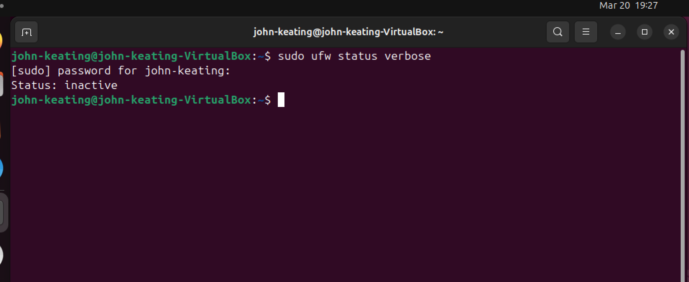

Explanation:
This output shows that the UFW firewall is currently inactive. This is the default state on many Ubuntu systems, meaning no firewall rules are being enforced yet.

---

📸 Screenshot 2 — UFW Application Profiles

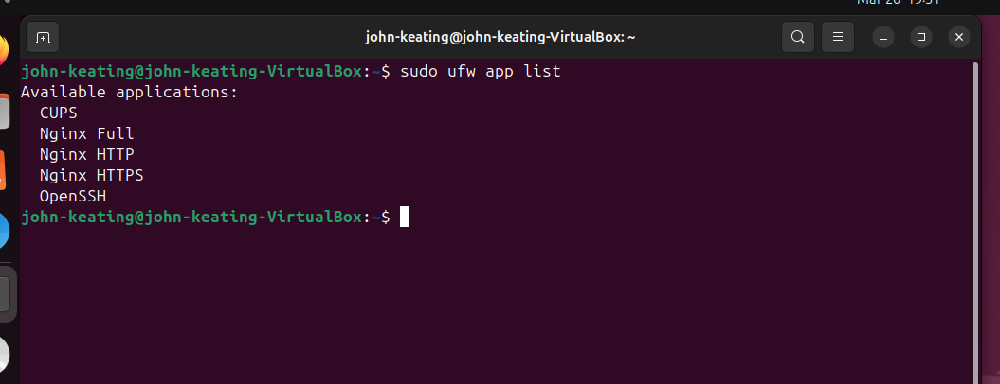

Explanation:
This output lists available UFW application profiles such as OpenSSH and Nginx. These profiles simplify firewall configuration by allowing predefined rules for common services instead of manually specifying ports.

---

📸 Screenshot 3 — Default Firewall Policies

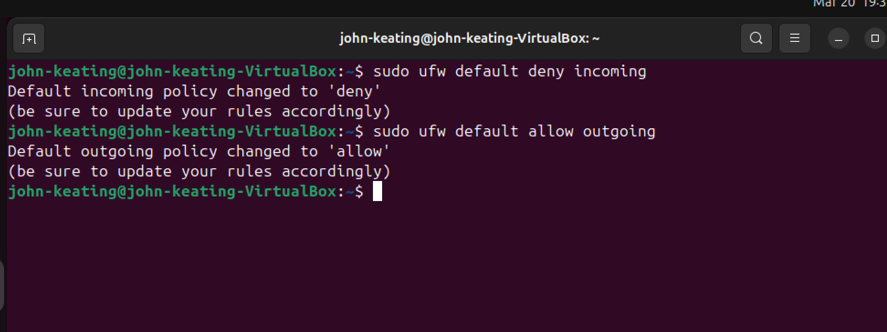

Explanation:
This output confirms that the default firewall policies were set to deny all incoming traffic and allow all outgoing traffic. This is a standard security baseline used to block unauthorized access while permitting normal system communication.

---

📸 Screenshot 4 — Allow SSH

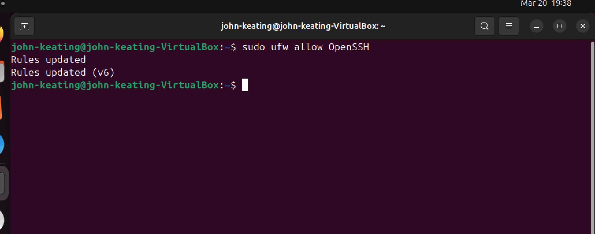

Explanation:
This step allows incoming SSH connections (port 22). This is a critical step in real-world environments to prevent locking yourself out when enabling the firewall.

---

📸 Screenshot 5 — Firewall Enabled

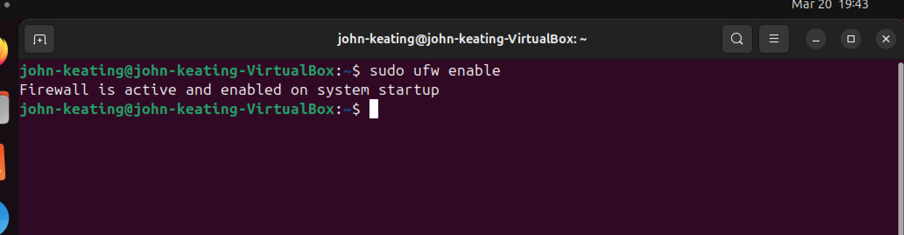

Explanation:
This output confirms that the firewall is now active and enabled on system startup. All configured rules are now being enforced by the system.

---

📸 Screenshot 6 — Firewall Status (Numbered)

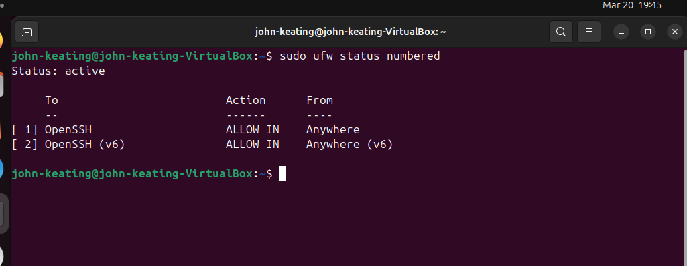

Explanation:
This output displays active firewall rules with numbering. Rule numbering allows administrators to easily manage, modify, or delete specific firewall rules.

---

📸 Screenshot 7 — Allow HTTP (Port 80)

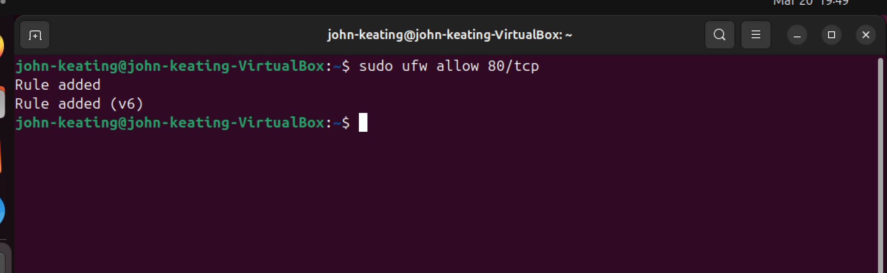

Explanation:
This command allows incoming traffic on port 80 (HTTP), simulating a web server environment. This is commonly used for hosting websites and web applications.

---

📸 Screenshot 8 — Deny Telnet (Port 23)

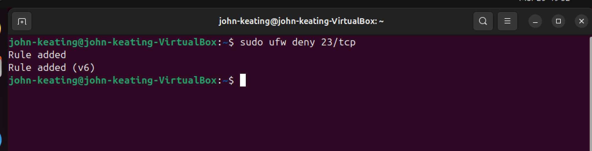

Explanation:
This step blocks incoming Telnet traffic on port 23. Telnet is an outdated and insecure protocol, so blocking it demonstrates good security practices.

---

📸 Screenshot 9 — Firewall Rules Review

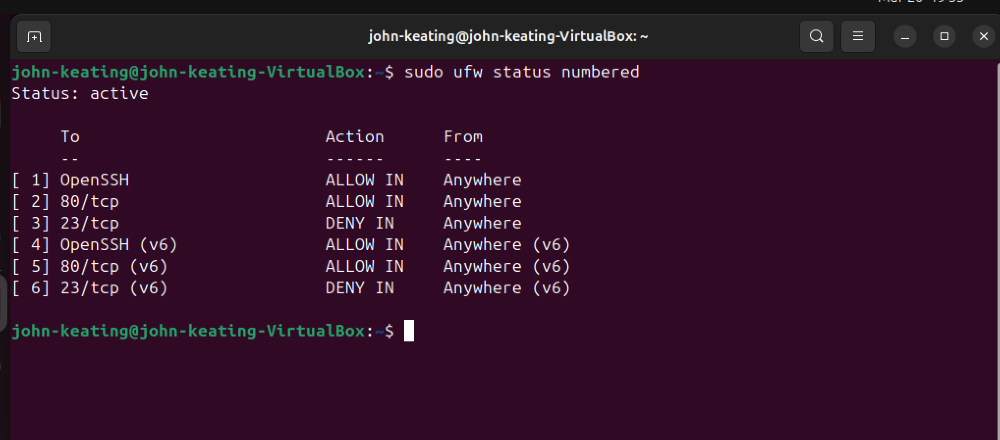

Explanation:
This output shows all configured firewall rules, including allowed SSH and HTTP traffic and denied Telnet traffic. This confirms that the firewall is enforcing the intended security policies.

---

📸 Screenshot 10 — nftables Ruleset

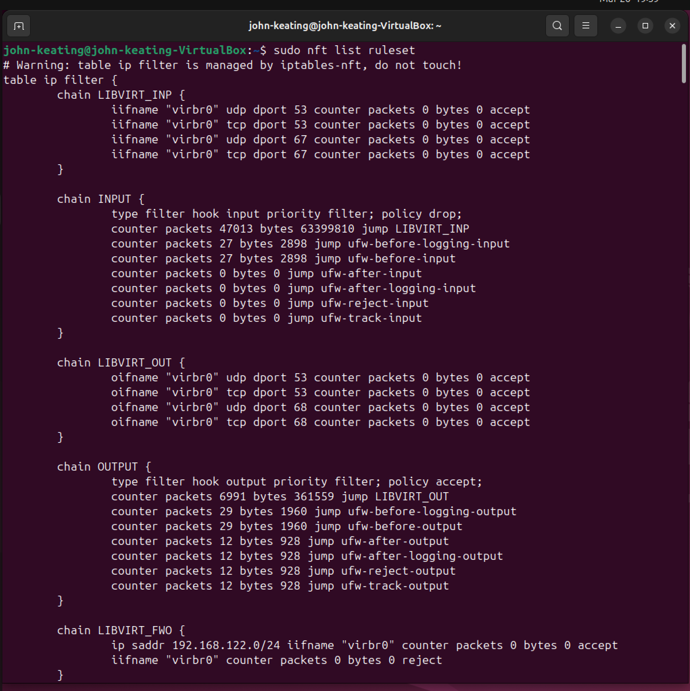

Explanation:
This output shows the nftables ruleset managed by UFW. It includes INPUT and OUTPUT chains with policy enforcement, packet counters, and integration with virtualization networking (libvirt). UFW acts as a frontend while nftables enforces the actual firewall rules at the kernel level.

---

📸 Screenshot 11 — iptables Rules

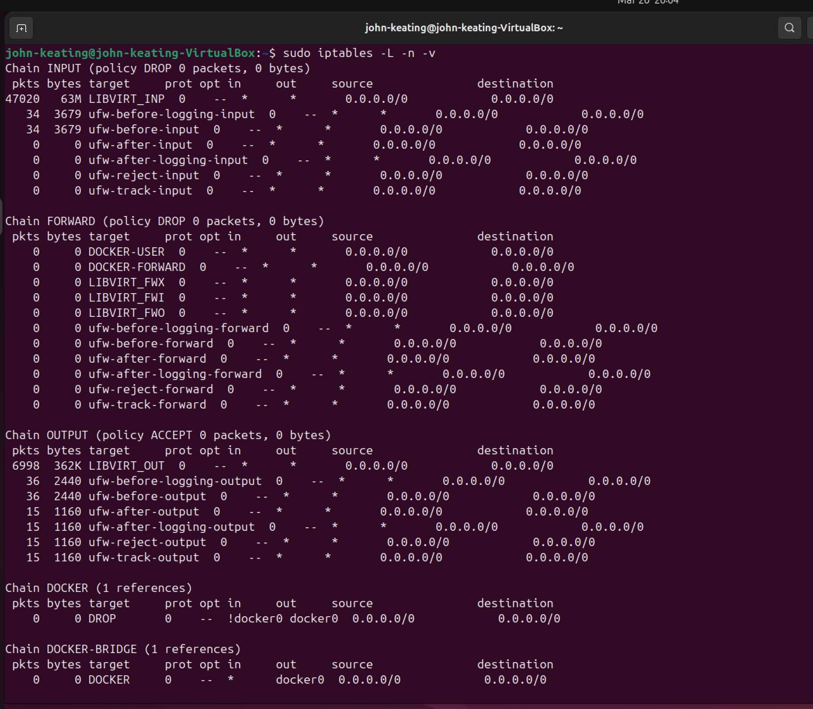

Explanation:
This output shows the iptables ruleset, including INPUT, FORWARD, and OUTPUT chains with packet and byte counters. It reflects how UFW rules are translated into iptables chains, along with integration from Docker and libvirt networking. This demonstrates how higher-level firewall tools rely on lower-level packet filtering frameworks in the Linux kernel.

---

📸 Screenshot 12 — iptables Backend Check

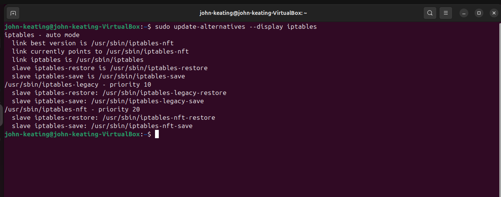

Explanation:
This output shows that the system is using the iptables-nft backend, where traditional iptables commands are mapped to the modern nftables framework. It highlights how Linux maintains compatibility with legacy tools while leveraging the newer nftables packet filtering system.

---

## 🧰 Commands Used (Definitions)

* `sudo` → Runs commands with administrator (root) privileges
* `ufw` → Uncomplicated Firewall tool used to manage firewall rules
* `status` → Displays current firewall state
* `verbose` → Shows detailed output
* `app list` → Lists predefined firewall profiles
* `default deny incoming` → Blocks all incoming traffic by default
* `default allow outgoing` → Allows all outgoing traffic
* `allow` → Permits traffic through firewall
* `deny` → Blocks traffic
* `enable` → Activates firewall
* `status numbered` → Shows rules with numbers for management
* `nft list ruleset` → Displays nftables configuration
* `iptables -L -n -v` → Lists firewall rules with detailed information
* `update-alternatives --display iptables` → Shows which backend iptables is using

---

## 🔍 Command Breakdown (Symbols & Flags)

### Example:

`sudo ufw allow 80/tcp`

* `80` → Port number (HTTP traffic)
* `/tcp` → Protocol (Transmission Control Protocol)

---

### Example:

`sudo iptables -L -n -v`

* `-L` → List rules
* `-n` → Show numeric values (no DNS lookup)
* `-v` → Verbose (packet + byte counters)

---

### Example:

`sudo ufw status numbered`

* `numbered` → Adds rule numbers for easier management

---

## 🧠 Important Concepts

* **Port** → A communication endpoint (e.g., 22 = SSH, 80 = HTTP)
* **Protocol** → Method of communication (TCP = reliable, UDP = fast)
* **INPUT chain** → Incoming traffic rules
* **OUTPUT chain** → Outgoing traffic rules
* **FORWARD chain** → Traffic passing through system
* **Policy DROP** → Blocks traffic by default
* **Policy ACCEPT** → Allows traffic by default

---

## ⚠️ Important Notes

* Always allow SSH before enabling firewall to avoid lockout
* Blocking unused ports reduces attack surface
* UFW is a frontend → nftables/iptables enforce rules
* Modern Linux uses **nftables backend (iptables-nft)**

---

🧠 Key Takeaways

* UFW provides a simplified interface for managing firewall rules
* Default deny/allow policies are critical for baseline security
* Allowing SSH before enabling the firewall prevents lockout
* Ports can be explicitly allowed or denied for security control
* nftables is the modern Linux firewall framework
* iptables is still widely used and often backed by nftables
* Firewall management is a core skill in Linux, Cloud, and Cybersecurity roles

---

🌍 Real-World Relevance

This lab demonstrates how system administrators and cloud engineers secure Linux systems by controlling network traffic. These skills are essential for roles in:

* Cloud Security
* DevOps
* System Administration
* Cybersecurity Operations

Understanding how UFW, iptables, and nftables interact provides deeper insight into how Linux enforces network security at both high and low levels.

---

✅ What I Learned

* How to configure and enable a Linux firewall using UFW
* How to allow and deny specific network ports
* How to verify firewall rules and policies
* How UFW interacts with nftables and iptables
* How modern Linux systems maintain compatibility with legacy firewall tools
* How firewall configurations apply to real-world infrastructure and security practices

---
