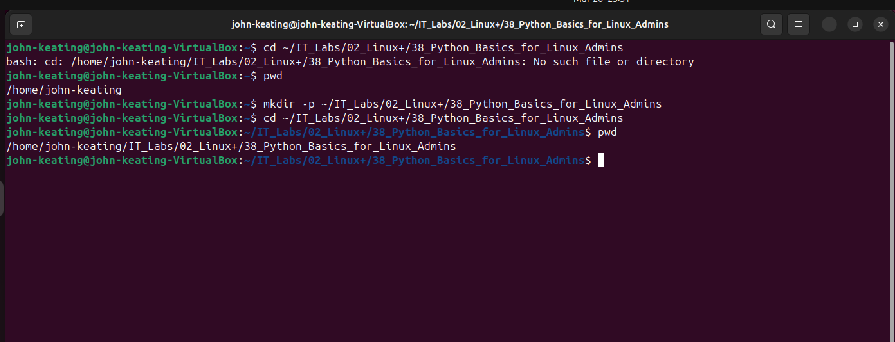
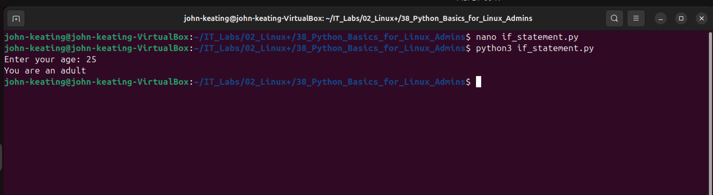
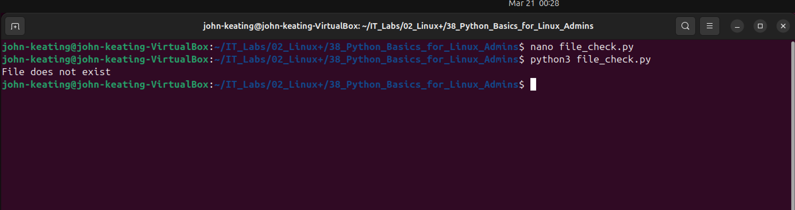
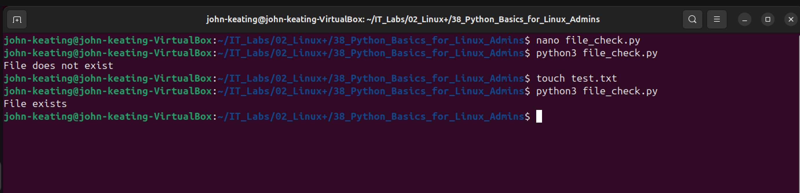

# Linux+ Lab 38 — Python Basics for Linux Administrators

---

## Objective

The purpose of this lab is to introduce Python scripting fundamentals within a Linux environment.  
This lab demonstrates how Python can be used for automation, input handling, conditional logic, loops, and file system interaction.

---

## Environment

- Ubuntu Linux (VirtualBox VM)
- Bash Terminal
- Python 3
- Windows Host Machine
- GitHub Repository (IT_Labs)

---

## Commands Used

| Command | Description |
|--------|------------|
| `python3 --version` | Verify Python installation |
| `nano <file>.py` | Create/edit Python scripts |
| `python3 <file>.py` | Run Python scripts |
| `mkdir -p` | Create directory structure |
| `cd` | Navigate directories |
| `pwd` | Show current directory |
| `touch` | Create empty file |

---

## Command Breakdown Example

### Running a Python Script

```bash
python3 hello.py
```

| Part | Meaning |
|------|--------|
| `python3` | Python interpreter |
| `hello.py` | Script file being executed |

---

## Screenshots and Explanations

### Screenshot 01 — Directory Setup


Created the lab directory structure inside the Linux VM to ensure scripts run in the correct environment.

---

### Screenshot 02 — Python Installation Check


Verified Python 3 is installed and available for scripting.

---

### Screenshot 03 — Hello World Script


Created and executed a basic Python script to confirm the environment is working.

---

### Screenshot 04 — Variables Script


Defined variables (name and role) and printed them, demonstrating basic data handling.

---

### Screenshot 05 — User Input Script


Used `input()` to capture user input and display dynamic output.

---

### Screenshot 06 — If Statement Script


Implemented conditional logic to determine if the user is an adult based on input.

---

### Screenshot 07 — Loop Script


Used a loop to repeat actions, demonstrating iteration and automation.

---

### Screenshot 08 — File Does Not Exist


Script checked for a file and correctly identified that it does not exist.

---

### Screenshot 09 — File Exists


After creating the file, the script confirmed its existence, demonstrating file system awareness.

---

## Key Concepts

- Python scripting for automation
- Variables and data handling
- User input (`input()`)
- Conditional logic (`if/else`)
- Loops (`for`)
- File existence checks
- Linux + Python integration

---

## Interview-Level Explanations

### File Existence Check

If asked:

👉 “Why would you check if a file exists in a script?”

Answer:

“To prevent errors and control program flow. In automation and system administration, scripts often depend on files such as logs, configs, or backups. Checking for existence ensures the script behaves safely and predictably.”

---

### Linux vs Windows Filesystem (IMPORTANT)

If asked:

👉 “Why did you create the directory again in Linux?”

Answer:

“Because my lab execution environment is the Linux VM, and it operates independently from the Windows host filesystem. I ensured the directory exists within the Linux environment before running scripts.”

---

## Real-World Relevance

This lab simulates real tasks performed by:

- Linux System Administrators
- DevOps Engineers
- Cloud Engineers
- Security Analysts

Python is commonly used for:

- Automation scripts
- Log analysis
- File monitoring
- System health checks
- Cloud infrastructure scripting

---

## What I Learned

- How to write and execute Python scripts in Linux
- How to use Python for automation tasks
- How to handle user input and logic
- How to safely interact with the file system
- How Linux and scripting work together in real environments

---
