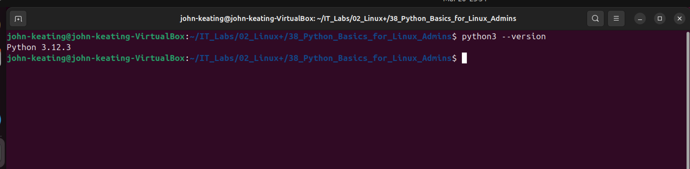
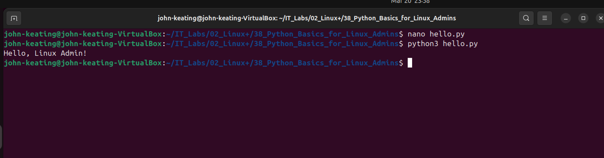
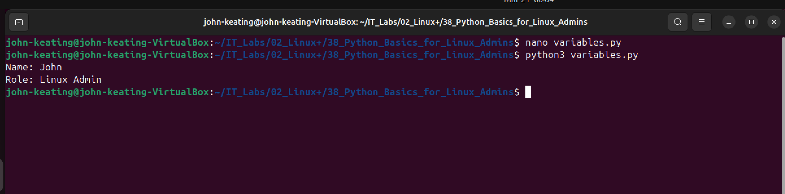
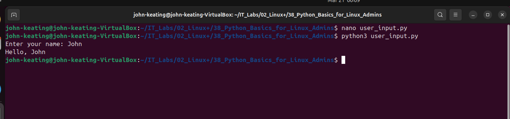
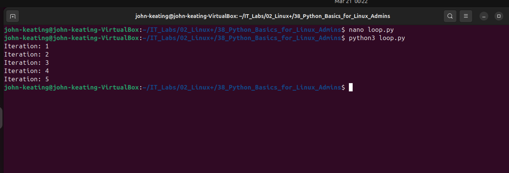

# Linux+ Lab 38 — Python Basics for Linux Administrators

---

## Objective

The purpose of this lab is to introduce Python scripting fundamentals within a Linux environment.  
This lab demonstrates how Python can be used for automation, input handling, conditional logic, loops, and file system interaction.

---

## Environment

- Ubuntu Linux (VirtualBox VM)
- Bash Terminal
- Python 3
- Windows Host Machine
- GitHub Repository (IT_Labs)

---
## Commands Used (With Definitions)

These commands were used to build, test, and validate Python scripts within a Linux environment.

---

### `python3 --version`
Checks if Python is installed and displays the installed version.

👉 Used to verify the system is ready to run Python scripts.

👉 Example:
```bash
python3 --version
```

---

### `nano <file>.py`
Opens the Nano text editor to create or edit a Python script directly in the terminal.

👉 Example:
```bash
nano hello.py
```

👉 Common Nano controls:
- `CTRL + O` → Save file  
- `CTRL + X` → Exit editor  

---

### `python3 <file>.py`
Executes a Python script using the Python 3 interpreter.

👉 Example:
```bash
python3 hello.py
```

👉 This runs the code written inside the file.

---

### `mkdir -p <directory>`
Creates a directory (folder). The `-p` flag ensures all parent directories are created if they do not already exist.

👉 Example:
```bash
mkdir -p ~/IT_Labs/02_Linux+/38_Python_Basics_for_Linux_Admins
```

👉 Without `-p`, the command would fail if part of the path is missing.

---

### `cd <directory>`
Changes the current working directory.

👉 Example:
```bash
cd ~/IT_Labs/02_Linux+/38_Python_Basics_for_Linux_Admins
```

👉 Used to navigate into the correct lab folder before running scripts.

---

### `pwd`
Prints the current working directory path.

👉 Example:
```bash
pwd
```

👉 Confirms you are operating in the correct directory.

---

### `touch <file>`
Creates an empty file.

👉 Example:
```bash
touch test.txt
```

👉 Common use:
- Simulate files for scripts
- Create placeholder files

---

### `git add .`
Stages all modified and new files in the current directory for commit.

👉 The `.` means “add everything in this folder.”

---

### `git commit -m "message"`
Creates a snapshot of staged changes with a descriptive message.

👉 Example:
```bash
git commit -m "Completed Lab 38 Python scripts and documentation"
```

👉 This records your work in version control history.

---

### `git push`
Uploads committed changes to the remote GitHub repository.

👉 Sends your work from your local machine to GitHub.

---

### `git pull origin main --rebase`
Fetches the latest changes from the remote repository and reapplies your local commits on top.

👉 Prevents merge conflicts and keeps commit history clean.

👉 Used when:
- GitHub has updates your local machine doesn’t have
- You see errors like “rejected (fetch first)”

---

## Command Breakdown Example (Detailed)

### Running a Python Script

```bash
python3 hello.py
```

### Breakdown

| Part | Meaning |
|------|--------|
| `python3` | Calls the Python 3 interpreter installed on the system |
| `hello.py` | The script file being executed |

---

### What Happens Internally

1. The system locates the `python3` interpreter in the system PATH  
2. Python reads the file `hello.py`  
3. The script is interpreted line-by-line  
4. Output is printed to the terminal  

---

### Why This Matters (Interview-Level)

If asked:

👉 “How does running a Python script work in Linux?”

Answer:

> “The Python interpreter executes the script by reading it line-by-line. It does not compile the code like traditional languages. This allows quick execution and is ideal for automation tasks in Linux environments.”

---

### Additional Example — Directory Creation

```bash
mkdir -p ~/IT_Labs/02_Linux+/38_Python_Basics_for_Linux_Admins
```

### Breakdown

| Part | Meaning |
|------|--------|
| `mkdir` | Command to create directories |
| `-p` | Creates parent directories if they do not exist |
| `~/IT_Labs/...` | Target directory path |

---

### Symbol Explanation

| Symbol | Meaning |
|--------|--------|
| `~` | Home directory (e.g., `/home/username`) |
| `/` | Directory separator |
| `+` | Literal character in folder name (valid in Linux) |

---

### Why This Matters (Interview-Level)

If asked:

👉 “Why use `-p` with mkdir?”

Answer:

> “The `-p` flag ensures that the full directory path is created without errors, even if intermediate directories do not exist. This is important for automation scripts where directory structures must be created reliably.”

---

## Python Script Breakdown (Engineer-Level)

---

### Script 1 — hello.py

```python
print("Hello, Linux Admin!")
```

### Breakdown

| Line | Explanation |
|------|------------|
| `print()` | Built-in Python function used to output text to the terminal |
| `"Hello, Linux Admin!"` | String (text data) passed into the function |

### What This Demonstrates

- Basic Python syntax  
- Standard output to terminal  
- Script execution flow  

---

### Script 2 — variables.py

```python
name = "John"
role = "Linux Admin"

print("Name:", name)
print("Role:", role)
```

### Breakdown

| Concept | Explanation |
|--------|------------|
| `name = "John"` | Variable assignment (stores string data) |
| `role = "Linux Admin"` | Another variable storing role |
| `print("Name:", name)` | Outputs label + variable value |
| `print("Role:", role)` | Displays second variable |

### What This Demonstrates

- Variable storage  
- Data labeling  
- Output formatting  

---

### Script 3 — user_input.py

```python
name = input("Enter your name: ")
print("Hello,", name)
```

### Breakdown

| Concept | Explanation |
|--------|------------|
| `input()` | Waits for user input from keyboard |
| `"Enter your name:"` | Prompt displayed to user |
| `name =` | Stores input into variable |
| `print()` | Outputs dynamic result |

### What This Demonstrates

- User interaction  
- Runtime input handling  
- Dynamic output  

---

### Script 4 — if_statement.py

```python
age = int(input("Enter your age: "))

if age >= 18:
    print("You are an adult")
else:
    print("You are a minor")
```

### Breakdown

| Concept | Explanation |
|--------|------------|
| `int()` | Converts input (string) into integer |
| `if` | Conditional logic check |
| `>=` | Comparison operator |
| `else` | Alternative execution path |

### What This Demonstrates

- Decision-making logic  
- Type conversion  
- Conditional execution  

---

### Script 5 — loop.py

```python
for i in range(1, 6):
    print("Iteration:", i)
```

### Breakdown

| Concept | Explanation |
|--------|------------|
| `for` | Loop construct |
| `range(1, 6)` | Generates numbers 1 through 5 |
| `i` | Loop variable |
| `print()` | Outputs each iteration |

### What This Demonstrates

- Iteration  
- Repetitive execution  
- Controlled loops  

---

### Script 6 — file_check.py

```python
import os

if os.path.exists("test.txt"):
    print("File exists")
else:
    print("File does not exist")
```

### Breakdown

| Concept | Explanation |
|--------|------------|
| `import os` | Imports OS module for system interaction |
| `os.path.exists()` | Checks file existence |
| `if/else` | Controls program flow |
| `"test.txt"` | Target file being checked |

### What This Demonstrates

- File system interaction  
- Safe scripting practices  
- Error prevention logic  

---

### Why This Matters (Interview-Level)

If asked:

👉 “Why would you check if a file exists in a script?”

Answer:

> “To prevent errors and control program flow. In automation and system administration, scripts often depend on files such as logs, configs, or backups. Checking for existence ensures the script behaves safely and predictably.”

---

### Additional Interview Insight

If asked:

👉 “Why did you create the directory again in Linux?”

Answer:

> “Because my lab execution environment is the Linux VM, and it operates independently from the Windows host filesystem. I ensured the directory exists within the Linux environment before running scripts.”


---

## Screenshots and Explanations

### Screenshot 01 — Directory Setup


Created the lab directory structure inside the Linux VM to ensure scripts run in the correct environment.

---

### Screenshot 02 — Python Installation Check


Verified Python 3 is installed and available for scripting.

---

### Screenshot 03 — Hello World Script


Created and executed a basic Python script to confirm the environment is working.

---

### Screenshot 04 — Variables Script


Defined variables (name and role) and printed them, demonstrating basic data handling.

---

### Screenshot 05 — User Input Script


Used `input()` to capture user input and display dynamic output.

---

### Screenshot 06 — If Statement Script


Implemented conditional logic to determine if the user is an adult based on input.

---

### Screenshot 07 — Loop Script


Used a loop to repeat actions, demonstrating iteration and automation.

---

### Screenshot 08 — File Does Not Exist


Script checked for a file and correctly identified that it does not exist.

---

### Screenshot 09 — File Exists


After creating the file, the script confirmed its existence, demonstrating file system awareness.

---

## Key Concepts

- Python scripting for automation
- Variables and data handling
- User input (`input()`)
- Conditional logic (`if/else`)
- Loops (`for`)
- File existence checks
- Linux + Python integration

---

## Interview-Level Explanations

### File Existence Check

If asked:

👉 “Why would you check if a file exists in a script?”

Answer:

“To prevent errors and control program flow. In automation and system administration, scripts often depend on files such as logs, configs, or backups. Checking for existence ensures the script behaves safely and predictably.”

---

### Linux vs Windows Filesystem (IMPORTANT)

If asked:

👉 “Why did you create the directory again in Linux?”

Answer:

“Because my lab execution environment is the Linux VM, and it operates independently from the Windows host filesystem. I ensured the directory exists within the Linux environment before running scripts.”

---

## Real-World Relevance

This lab simulates real tasks performed by:

- Linux System Administrators
- DevOps Engineers
- Cloud Engineers
- Security Analysts

Python is commonly used for:

- Automation scripts
- Log analysis
- File monitoring
- System health checks
- Cloud infrastructure scripting

---

## What I Learned

- How to write and execute Python scripts in Linux
- How to use Python for automation tasks
- How to handle user input and logic
- How to safely interact with the file system
- How Linux and scripting work together in real environments

---
