# Lab 39 - Git for Linux Administrators

---

## 📌 Objective

The purpose of this lab was to learn how Linux administrators use Git for version control.

In this lab, I:
- Initialized a Git repository
- Configured Git identity
- Created and tracked files
- Staged changes
- Committed updates
- Modified files
- Reviewed commit history

This lab demonstrates a complete Git workflow used in real-world DevOps, cloud, and system administration environments.

---

## 🖥️ Environment

- Ubuntu Linux (Virtual Machine)
- Oracle VirtualBox
- Bash Terminal
- Windows Host Machine
- GitHub Repository
- Git version 2.43.0

---

## 🧰 Commands Used (With Definitions)

---

### 📁 Directory Setup

```bash
mkdir -p ~/IT_Labs/02_Linux+/39_Git_for_Linux_Administrators/Screenshots
```
Creates the full directory structure, including parent folders if they do not already exist.

```bash
cd ~/IT_Labs/02_Linux+/39_Git_for_Linux_Administrators
```
Changes into the lab directory.

```bash
pwd
```
Displays the current working directory to confirm correct location.

---

### ⚙️ Git Installation & Configuration

```bash
git --version
```
Displays the installed Git version to confirm availability.

```bash
git config --global user.name "John Keating"
```
Sets the global Git username used for commit authorship.

```bash
git config --global user.email "your_email@example.com"
```
Sets the global Git email address used for commit tracking.

```bash
git config --list
```
Displays all current Git configuration settings.

---

### 🗂️ Repository Initialization

```bash
git init
```
Initializes a new Git repository and creates the hidden `.git` directory for version tracking.

```bash
touch README.md
```
Creates an empty README.md file.

---

### 📊 File Tracking & Status

```bash
git status
```
Shows the current repository state, including untracked, staged, and modified files.

```bash
git add README.md
```
Stages the README.md file for commit.

```bash
git commit -m "Initial commit - added README"
```
Creates the first commit and stores a snapshot of the repository.

```bash
git log --oneline
```
Displays commit history in a compact, single-line format.

---

### 📄 Working with Files

```bash
echo "Git Lab File" > file1.txt
```
Creates `file1.txt` and writes content to it (overwrites existing content if the file exists).

```bash
git add file1.txt
```
Stages file1.txt for commit.

```bash
git commit -m "Added file1.txt"
```
Commits the new file to the repository.

```bash
echo "Adding more content" >> file1.txt
```
Appends additional content to file1.txt without overwriting existing data.

---

### 🔍 Reviewing Changes

```bash
git diff
```
Displays line-by-line differences between the working directory and the last commit.

```bash
git add file1.txt
```
Stages modified changes.

```bash
git commit -m "Updated file1.txt with more content"
```
Commits updated changes to the repository.

---

### 🧹 Terminal Management

```bash
clear
```
Clears the terminal screen to improve readability during the lab.
---

## 🔍 Command Breakdown Examples

### git init

```bash
git init
```

- `git` → Calls Git program  
- `init` → Initializes a repository  

Creates a hidden `.git` directory and enables version control.

---

### git add file1.txt

```bash
git add file1.txt
```

- `git` → Calls Git  
- `add` → Stages file  
- `file1.txt` → Target file  

Moves file from working directory to staging area.

---

### git commit -m "message"

```bash
git commit -m "Added file1.txt"
```

- `git` → Calls Git  
- `commit` → Saves snapshot  
- `-m` → Message flag  
- `"message"` → Commit description  

Creates a permanent snapshot with metadata and history tracking.

---

### git diff

```bash
git diff
```

Compares current file changes with last committed version.

Shows exactly what changed before committing.

---

## 🧩 Symbols and Syntax Explained

| Symbol | Meaning |
|------|--------|
| `~` | Home directory |
| `/` | Directory separator |
| `+` | Literal character in folder name |
| `.` | Current directory |
| `.git` | Hidden Git repository data |
| `README.md` | Markdown file |
| `-p` | Create parent directories |
| `--global` | Apply setting globally |
| `--list` | Show settings |
| `--version` | Show program version |
| `--oneline` | Compact log view |
| `-m` | Commit message flag |
| `>` | Overwrite file output |
| `>>` | Append to file |
| `" "` | Wrap text with spaces |
| `HEAD` | Current commit pointer |
| `master/main` | Current branch |
| `100644` | Standard file permission in Git |

---

## 🔄 Git Workflow Demonstrated

1. Create directory  
2. Initialize repository  
3. Configure Git identity  
4. Create README file  
5. Check status  
6. Stage file  
7. Commit changes  
8. View history  
9. Create new file  
10. Stage new file  
11. Commit new file  
12. Modify file  
13. View changes  
14. Stage modifications  
15. Commit updates  
16. Review final history  

---

## 📸 Screenshots and Explanations

### Screenshot 01 — Directory Setup
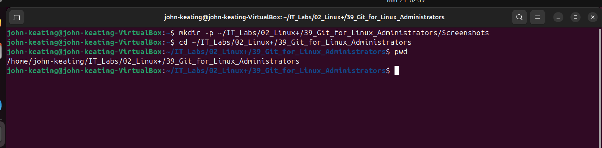

Created the lab directory and verified the working path using `pwd`. This confirms correct navigation within the Linux filesystem and ensures all commands are executed in the intended directory.

---

### Screenshot 02 — Git Version
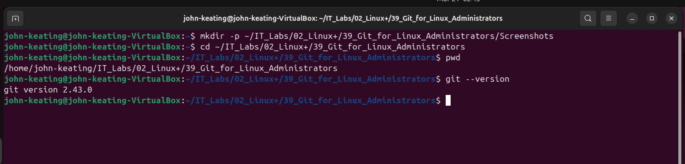

Verified Git is installed and accessible. This confirms the system is ready for version control operations and avoids issues later in the workflow.

---

### Screenshot 03 — Git Config
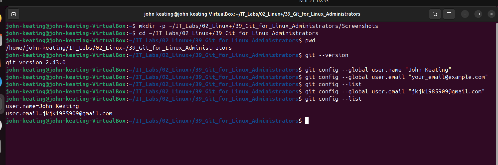

Configured global username and email. These values are embedded into commits and are critical for tracking authorship in collaborative environments.

---

### Screenshot 04 — Git Init
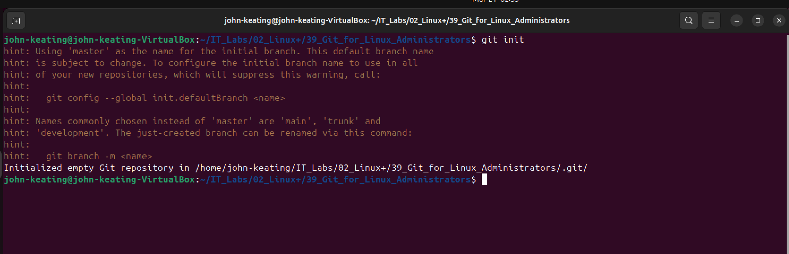

Initialized a new Git repository. This created the hidden `.git` directory, which stores all version control metadata and enables Git tracking.

---

### Screenshot 05 — Create README
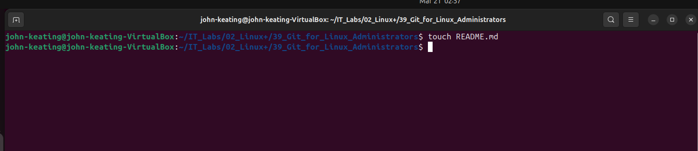

Created the `README.md` file. This file serves as documentation for the repository and is typically the first file tracked in any project.

---

### Screenshot 06 — Git Status (Untracked)
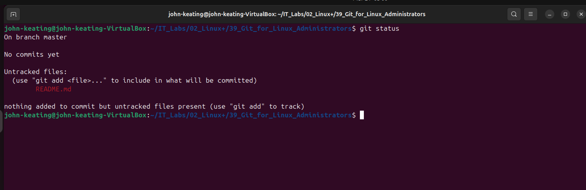

Verified that `README.md` appears as untracked. Git recognizes the file exists but is not yet tracking it.

---

### Screenshot 07 — Git Add README
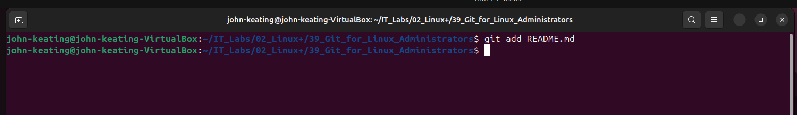

Staged `README.md`. This moves the file from the working directory into the staging area, preparing it for commit.

---

### Screenshot 08 — Git Status (Staged)
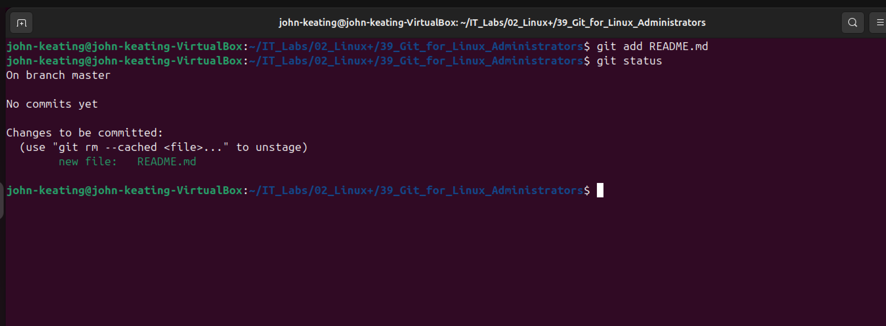

Confirmed that `README.md` is staged and ready to be committed.

---

### Screenshot 09 — First Commit
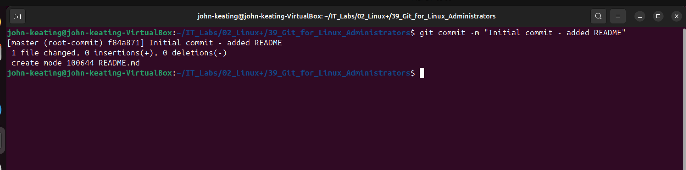

Created the initial commit. This establishes the first snapshot in the repository’s history.

---

### Screenshot 10 — Git Log
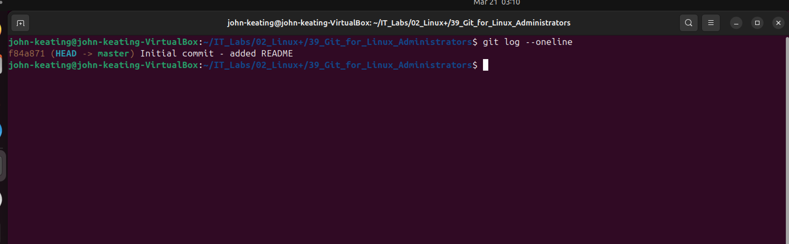

Displayed commit history using `git log --oneline`, showing commit hashes and messages in a compact format.

---

### Screenshot 11 — Create file1.txt
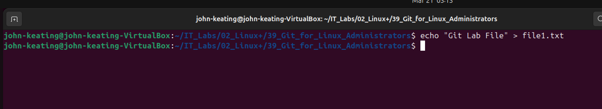

Created a new file (`file1.txt`) and added initial content using the `echo` command.

---

### Screenshot 12 — Git Status New File
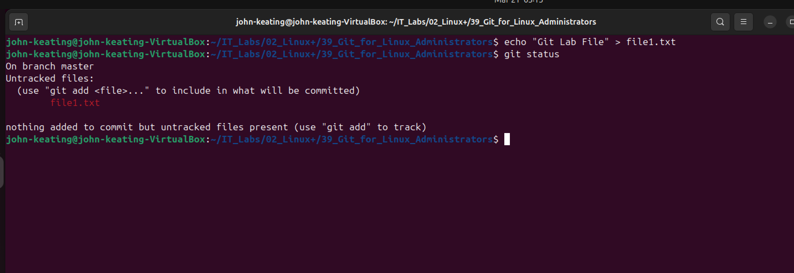

Verified that `file1.txt` appears as an untracked file.

---

### Screenshot 13 — Git Add file1.txt
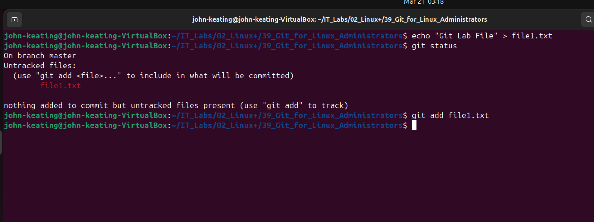

Staged `file1.txt`, preparing it to be committed.

---

### Screenshot 14 — Git Status After Add
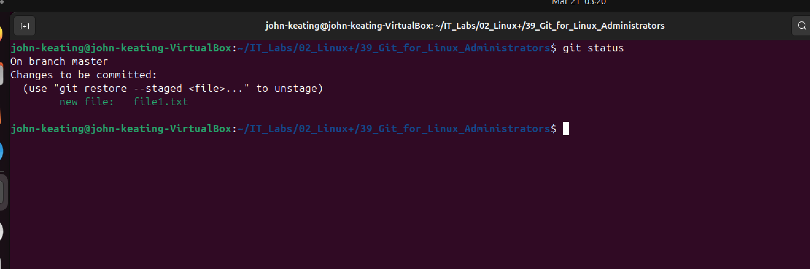

Confirmed that `file1.txt` is staged and ready for commit.

---

### Screenshot 15 — Commit file1.txt
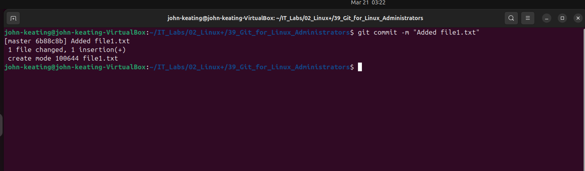

Committed `file1.txt`, creating a new snapshot in the repository.

---

### Screenshot 16 — Git Log (Two Commits)
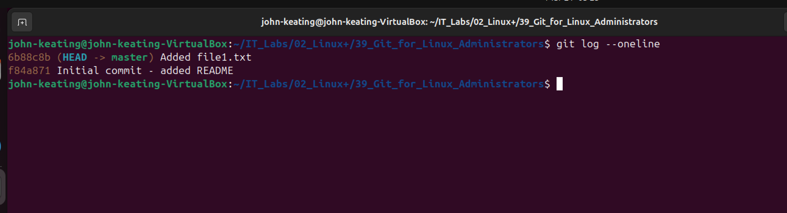

Verified that the repository now contains multiple commits, showing version history progression.

---

### Screenshot 17 — Modify File
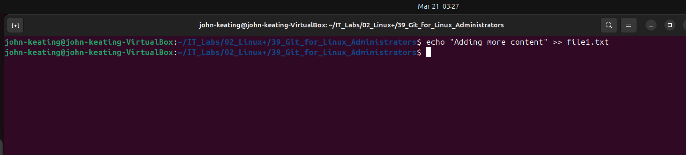

Modified `file1.txt` by appending new content using `>>`, demonstrating file updates.

---

### Screenshot 18 — Git Status Modified File
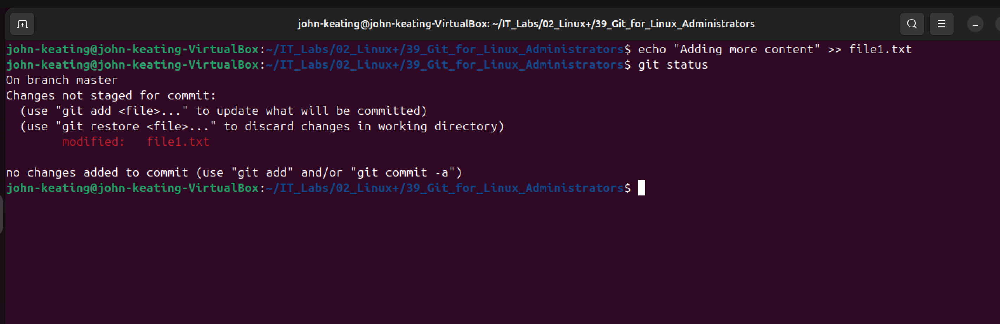

Detected that `file1.txt` is modified but not yet staged.

---

### Screenshot 19 — Git Diff Output
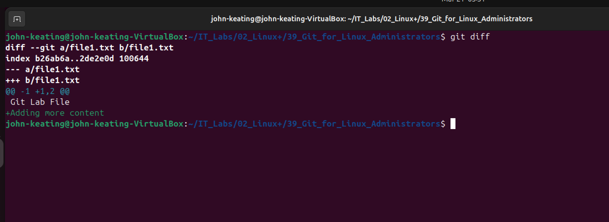

Displayed exact line-by-line changes using `git diff`. This is critical for reviewing changes before committing.

---

### Screenshot 20 — Git Add Modified File
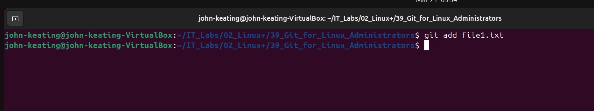

Staged the modified version of `file1.txt`.

---

### Screenshot 21 — Commit Updated File
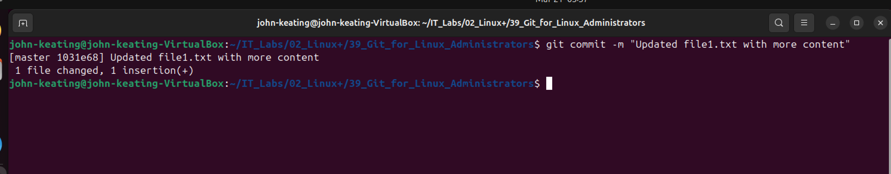

Committed the updated file, adding another version snapshot to history.

---

### Screenshot 22 — Final Git Log
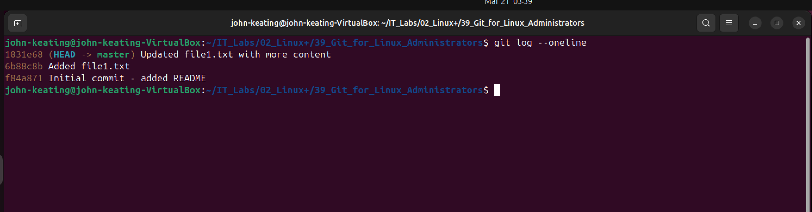

Verified the complete commit history, confirming all changes were successfully tracked and recorded.

---

## 📊 Results

Successfully completed a full Git workflow including:
- Repository initialization
- File tracking
- Staging changes
- Committing updates
- Modifying files
- Reviewing commit history

---

## 🧠 Key Concepts

- Repository → Git-managed directory  
- Working Directory → Active files  
- Staging Area → Prepared changes  
- Commit → Snapshot of changes  
- Tracked File → File under Git control  
- Untracked File → New file not yet staged  
- Modified File → Changed after commit  
- Diff → Change comparison  
- History → Timeline of commits  

---

## 🎯 What I Learned

I learned how Git tracks changes through staging and commits, how to manage file versions, and how to inspect changes before committing.

I also learned the importance of separating:
- Working directory changes  
- Staged changes  
- Committed history  

---

## 🌍 Real-World Relevance

Git is used in:
- DevOps
- Cloud Engineering
- System Administration
- Automation
- Security Operations

It enables:
- Version tracking
- Auditing
- Rollbacks
- Team collaboration

---

## 🧑‍💼 Interview-Level Explanation

“This lab demonstrates version control using Git, including repository initialization, staging changes, committing updates, tracking file modifications, and reviewing commit history. The workflow reflects real-world DevOps and system administration practices.”

---

## 🧾 Interview Notes

**Why create directories in Linux VM:**  
The Linux VM has its own filesystem separate from Windows, so directories must be created inside the Linux environment.

**Why use git status:**  
Provides real-time visibility into file states and prevents committing unintended changes.

**Why use git diff:**  
Allows reviewing exact changes before committing, ensuring accuracy and preventing errors.

---

## ✅ Final Status

Lab Completed Successfully
