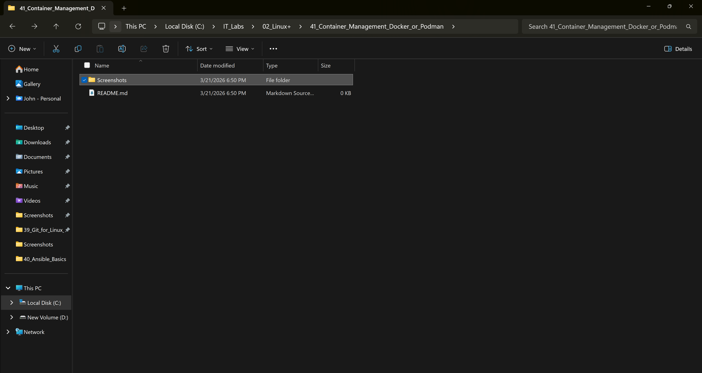
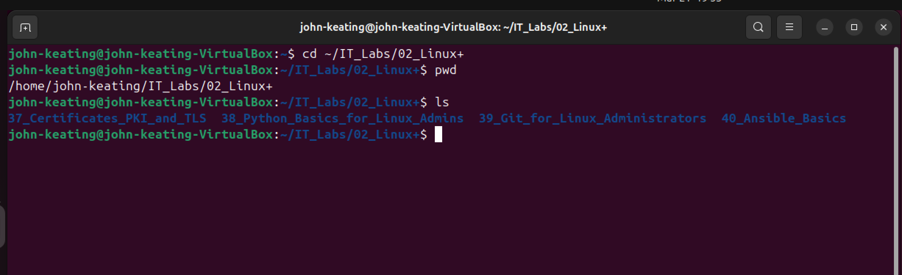
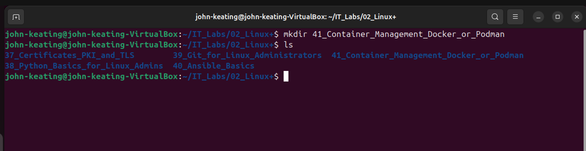
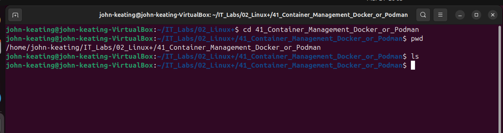
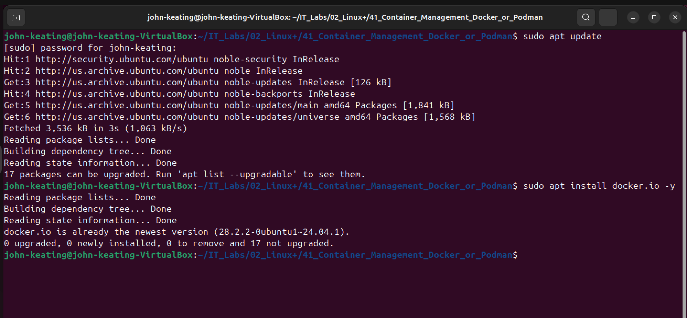
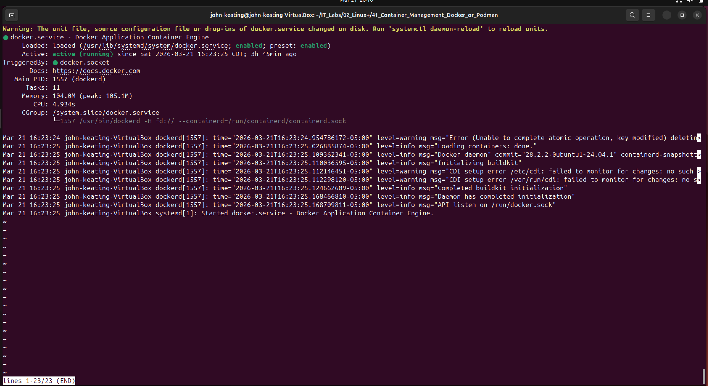
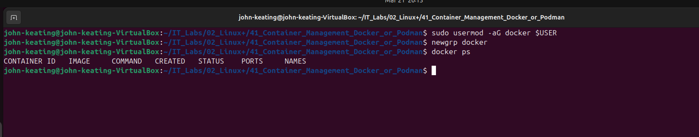
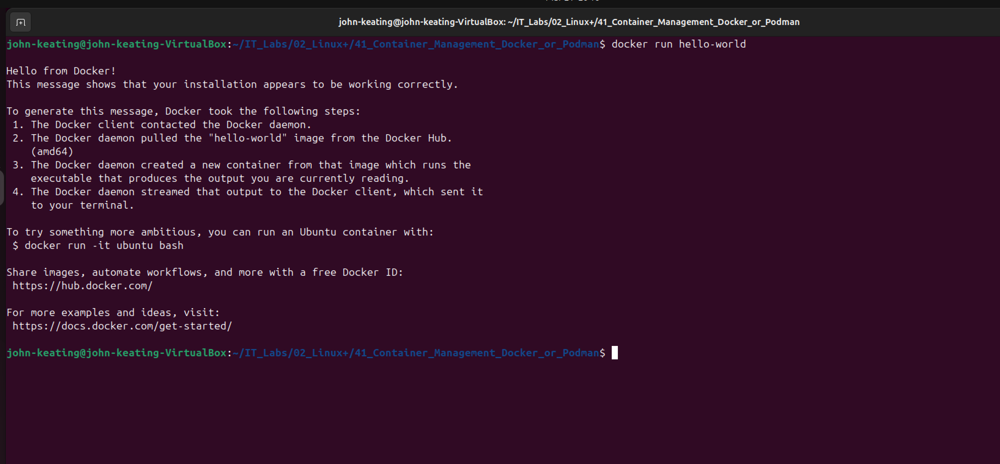
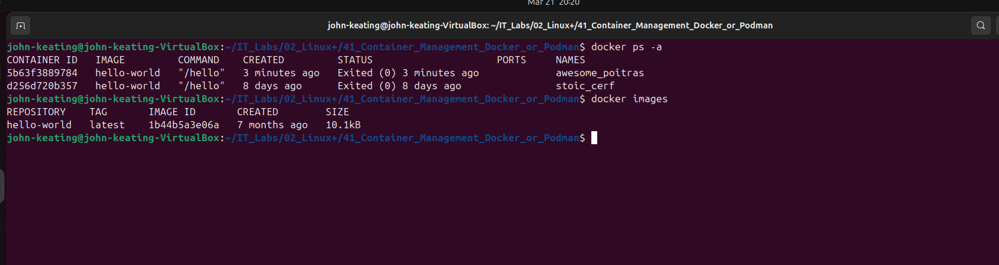
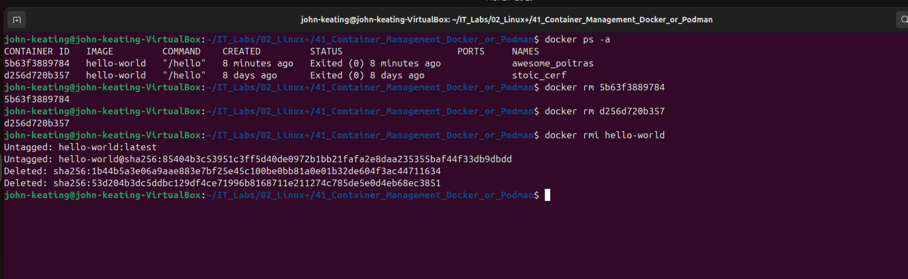

# Linux+ Lab 41 — Container Management (Docker)

---

## Objective

The purpose of this lab is to learn how to install, configure, and manage containers using Docker in a Linux environment.

In this lab, I performed:
- Docker installation and verification
- Running a container
- Managing containers and images
- Cleaning up resources

This lab demonstrates foundational containerization skills used in DevOps, Cloud Engineering, and Cybersecurity.

---

## Environment

- Ubuntu Linux (VirtualBox VM)
- Bash Terminal
- Windows Host Machine
- Docker (docker.io package)
- GitHub Lab Repository

---

## Commands Used

| Command | Description |
|--------|-------------|
| `sudo apt update` | Updates package lists from repositories |
| `sudo apt install docker.io -y` | Installs Docker without prompts |
| `docker --version` | Displays Docker version |
| `systemctl status docker` | Checks Docker service status |
| `sudo usermod -aG docker $USER` | Adds user to Docker group |
| `newgrp docker` | Applies new group permissions |
| `docker run hello-world` | Runs a test container |
| `docker ps -a` | Lists all containers |
| `docker images` | Lists Docker images |
| `docker rm <id>` | Removes a container |
| `docker rmi <image>` | Removes an image |

---

## Command Breakdown

### Example:
```bash
docker rm 5b63f3898784
```

| Part | Meaning |
|------|--------|
| `docker` | Container management tool |
| `rm` | Remove container |
| `5b63f3898784` | Container ID |

---

### Example:
```bash
sudo usermod -aG docker $USER
```

| Part | Meaning |
|------|--------|
| `sudo` | Run as root |
| `usermod` | Modify user account |
| `-aG` | Append to group |
| `docker` | Target group |
| `$USER` | Current user |

---

## Workflow / Steps

1. Created lab directory in Windows and Linux
2. Navigated to lab directory in Linux
3. Installed Docker using apt package manager
4. Verified Docker installation and service status
5. Configured Docker permissions for non-root usage
6. Ran first container using `hello-world`
7. Listed containers and images
8. Removed containers and images for cleanup

---

## Screenshots

---

### 01_directory_setup.png


This screenshot shows the Windows lab folder structure for the Container Management lab. It includes the Screenshots directory and README.md file. This demonstrates proper lab organization, ensuring all documentation and visual evidence are structured in a professional and reproducible format for GitHub.

---

### 02_navigate_to_lab_directory.png


This screenshot displays navigation to the Linux lab directory using the `cd` command. The `pwd` command confirms the current working directory, and `ls` verifies the presence of existing lab folders. This step ensures the user is operating in the correct directory before performing lab tasks.

---

### 03_create_lab_directory.png


This screenshot shows the creation of the lab directory using the `mkdir` command. The directory is named according to the structured lab naming convention. The `ls` command verifies that the directory was successfully created, demonstrating proper filesystem management in Linux.

---

### 04_enter_lab_directory.png


This screenshot shows entering the newly created lab directory using the `cd` command. The `pwd` output confirms the correct path, and the empty `ls` output verifies a clean working directory. This ensures a controlled environment for lab execution.

---

### 05_install_docker.png


This screenshot shows updating package lists using `sudo apt update` followed by installing Docker using `sudo apt install docker.io`. The output confirms successful installation and package management operations, demonstrating how Linux administrators install container runtime software.

---

### 06_verify_docker_installation.png


This screenshot displays verification of Docker installation using `docker --version` and `systemctl status docker`. The “active (running)” status confirms that the Docker daemon is operational. This step ensures the container engine is properly installed and running.

---

### 07_fix_docker_permissions.png


This screenshot shows adding the current user to the Docker group using `usermod -aG docker $USER` and applying the change with `newgrp docker`. The `docker ps` command runs successfully without sudo, confirming proper permission configuration for non-root Docker usage.

---

### 08_run_first_container.png


This screenshot shows running the `hello-world` container using `docker run hello-world`. The output confirms that Docker successfully pulled the image, created a container, and executed it. This validates that the Docker engine is fully functional.

---

### 09_list_containers_and_images.png


This screenshot displays `docker ps -a` and `docker images`. It shows all containers (including exited ones) and locally stored images. This demonstrates how administrators inspect container lifecycle states and manage image repositories.

---

### 10_remove_container_and_image.png


This screenshot shows removing containers using `docker rm` followed by removing the image using `docker rmi hello-world`. The output confirms successful cleanup. This demonstrates proper container and image lifecycle management, which is critical in production environments to conserve system resources.

---
---

## Key Concepts

- Containerization
- Docker Engine
- Docker Images vs Containers
- Container Lifecycle Management
- Linux Package Management
- User and Group Permissions
- Systemd Service Management

---

## Real-World Relevance

Docker is widely used in:
- Cloud platforms (Azure, AWS, GCP)
- DevOps pipelines (CI/CD)
- Microservices architecture
- Application deployment
- Security isolation environments

Understanding Docker is essential for roles such as:
- Cloud Engineer
- DevOps Engineer
- Site Reliability Engineer (SRE)
- Cybersecurity Analyst

---

## What I Learned

- How to install and configure Docker in Linux
- How to run and verify containers
- The difference between images and containers
- How to manage container lifecycle (create, list, remove)
- How to configure permissions for Docker usage
- How containerization works in real-world environments
