# Linux+ Lab 43 – Container Storage (Docker Volumes)

---

## Objective

The purpose of this lab is to understand how Docker volumes provide persistent storage and how data can be shared between containers.

In this lab, I demonstrated:

- Creating Docker volumes
- Writing data inside a container
- Persisting data beyond container lifecycle
- Sharing data across multiple containers
- Cleaning up containers and volumes

This is a critical concept in DevOps, Cloud Engineering, and containerized application design.

---

## Environment

- Ubuntu Linux (VirtualBox VM)
- Docker Engine
- Bash Terminal
- Windows Host Machine
- GitHub Repository

---

## Commands Used

| Command | Description |
|--------|-------------|
| docker volume create my_volume | Creates a new Docker volume |
| docker volume ls | Lists all Docker volumes |
| docker volume inspect my_volume | Displays detailed information about the volume |
| docker run -it --name storage_test -v my_volume:/data ubuntu bash | Runs a container and mounts a volume |
| echo "text" > file | Writes text to a file |
| cat file | Displays file contents |
| docker rm container_name | Removes a container |
| docker ps -a | Lists all containers |
| docker volume rm my_volume | Removes a Docker volume |

---

## Command Breakdown (Important)

### docker run Command

```bash
docker run -it --name storage_test -v my_volume:/data ubuntu bash
```

| Part | Meaning |
|------|--------|
| docker run | Starts a new container |
| -it | Interactive terminal (keyboard + screen access) |
| --name storage_test | Assigns a custom name to the container |
| -v my_volume:/data | Mounts Docker volume to container directory |
| ubuntu | Image used to create container |
| bash | Opens bash shell inside container |

---

## Symbol Definitions

| Symbol | Meaning |
|--------|--------|
| - | Flag indicator (modifies command behavior) |
| -- | Long-form flag (more readable version of flags) |
| : | Maps volume to container path |
| > | Redirects output to a file (overwrites) |
| / | Root directory path indicator |
| "" | Wraps text string for commands |
| ~ | Home directory of current user |
| $ | Regular user prompt |
| # | Root user prompt |

---

## Screenshots

---

### Screenshot 01 – Enter Lab Directory
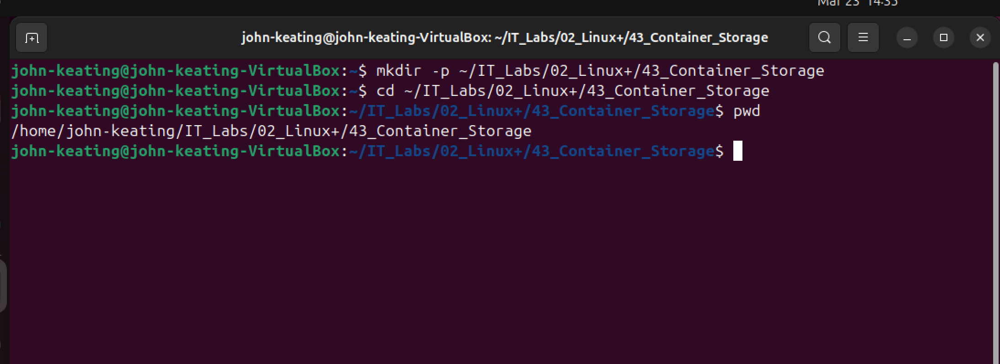

This screenshot shows navigating into the lab directory `43_Container_Storage`. This step ensures that all commands, files, and screenshots are organized within the correct project structure. Maintaining a structured directory layout is important in real-world environments because it improves workflow organization, version control clarity, and collaboration efficiency.

---

### Screenshot 02 – List Docker Volumes
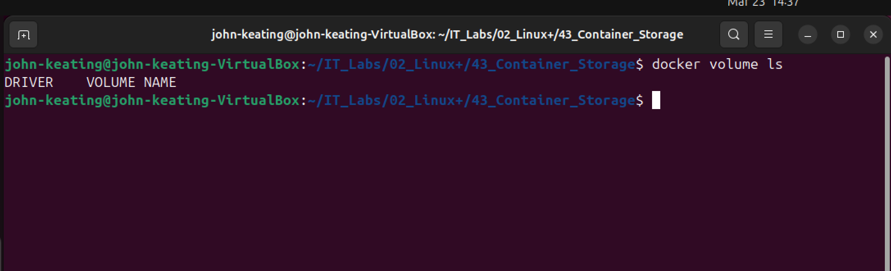

This output displays all existing Docker volumes on the system. At this stage, it confirms whether any volumes already exist before creating a new one. This is an important verification step because it provides visibility into current storage resources and prevents conflicts or confusion when managing multiple volumes in production environments.

---

### Screenshot 03 – Create Docker Volume
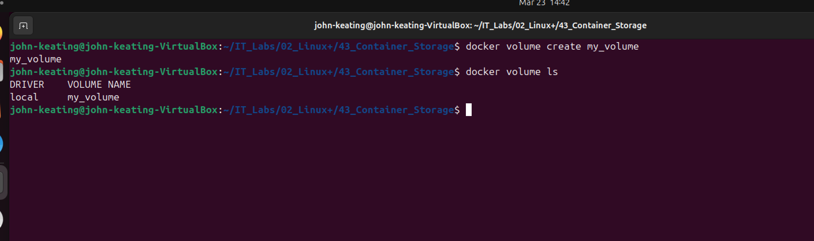

This screenshot shows the successful creation of a Docker volume named `my_volume`. Docker volumes are designed to store persistent data outside of containers. This means that even if a container is deleted, the data stored in the volume will remain intact. This is critical for real-world applications such as databases, logs, and application state storage.

---

### Screenshot 04 – Inspect Docker Volume
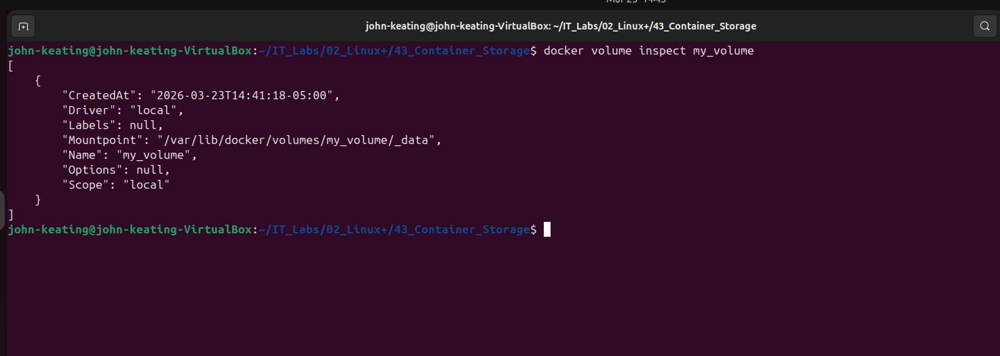

This output shows detailed metadata about the Docker volume, including its mount point on the host system. This confirms where Docker physically stores the volume data. Understanding this is important for troubleshooting, backups, and system-level storage management in enterprise environments.

---

### Screenshot 05 – Write Data to Volume
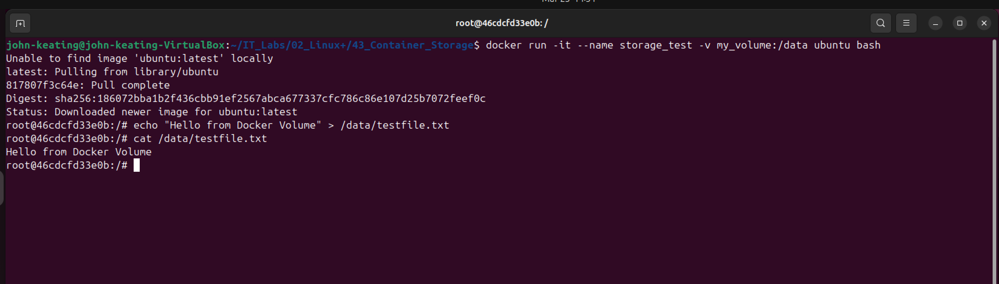

This screenshot shows data being written to `/data/testfile.txt` inside the container. The `/data` directory is mapped to the Docker volume, meaning the data is not stored inside the container itself but in the persistent volume. This demonstrates how applications can write data that survives container lifecycle events.

---

### Screenshot 06 – Exit Container
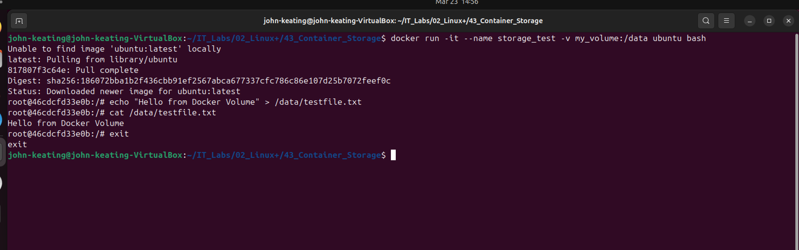

This screenshot shows exiting the running container after writing data to the volume. Exiting the container simulates a container shutdown event. The key concept here is that while the container stops, the Docker volume remains unaffected. This separation between container lifecycle and storage is fundamental to Docker's architecture.

---

### Screenshot 07 – Remove Original Container
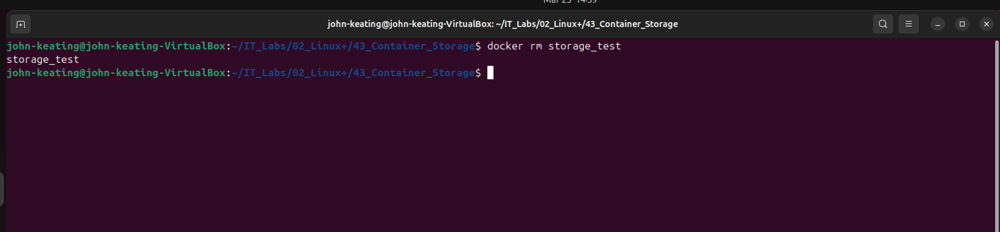

This screenshot shows the removal of the original container. This step is critical because it demonstrates that containers are disposable. Even after deleting the container, the data stored in the Docker volume is preserved. This behavior is essential for stateless container design patterns used in modern cloud-native applications.

---

### Screenshot 08 – Start New Container
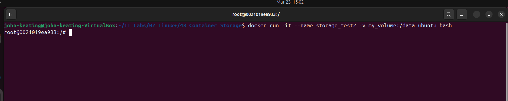

This screenshot shows a new container being created and started using the same Docker volume. This demonstrates how volumes can be reused across multiple containers. This is a key feature in microservices architectures where multiple services may need access to shared persistent data.

---

### Screenshot 09 – Verify Volume Persistence


This screenshot confirms that the data written in the previous container still exists after the original container was removed. This proves that Docker volumes persist independently of containers. This concept is critical for maintaining application data across deployments, updates, and container restarts.

---

### Screenshot 10 – Write Data (Container One)
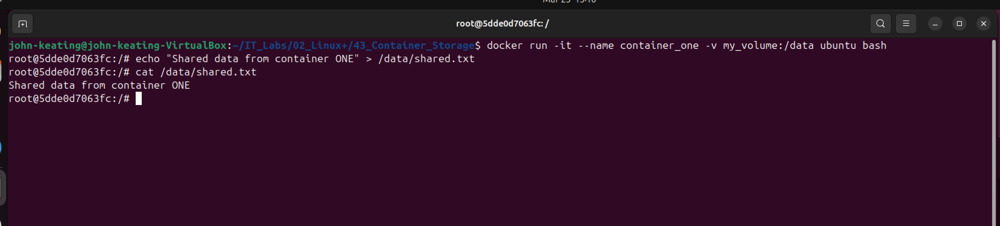

This screenshot shows data being written from the first container into the shared Docker volume. This demonstrates that containers can actively modify shared storage. This is important for workflows where one service writes data that another service will later consume.

---

### Screenshot 11 – Start Second Container
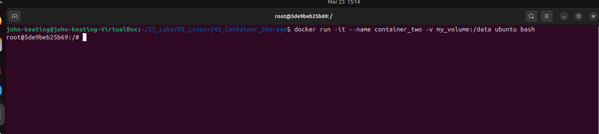

This screenshot shows a second container being launched with the same Docker volume attached. This highlights how Docker allows multiple containers to access the same persistent storage, enabling inter-container communication through shared files.

---

### Screenshot 12 – Read Shared Data (Container Two)
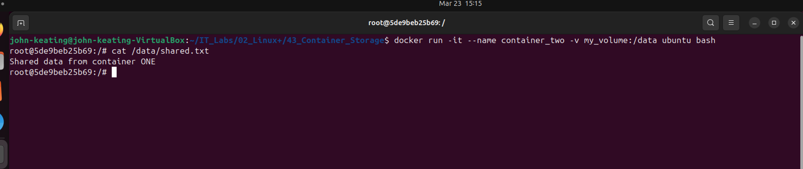

This screenshot demonstrates that the second container can read the data written by the first container. This confirms that Docker volumes enable shared, persistent storage across containers. This is a foundational concept for distributed systems, logging pipelines, and shared data services.

---

### Screenshot 13 – Remove Containers
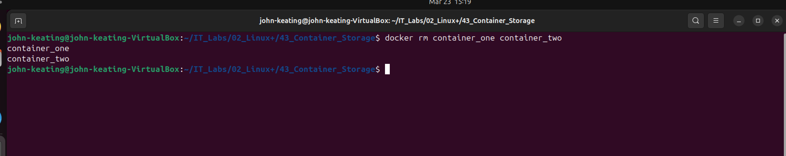

This screenshot shows all containers being removed as part of the cleanup process. Cleaning up unused containers is important for maintaining a clean and efficient working environment and preventing unnecessary resource consumption.

---

### Screenshot 14 – Verify No Containers Remain
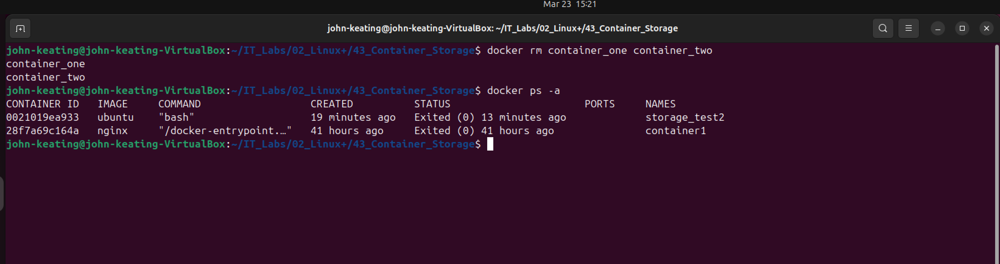

This output confirms that all containers have been successfully removed. The empty result from `docker ps -a` indicates a clean environment. This step ensures that no leftover containers remain that could interfere with future testing or deployments.

---

### Screenshot 15 – Full Cleanup Complete
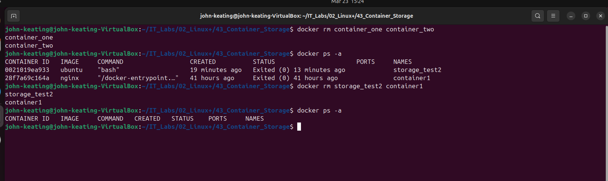

This screenshot verifies that the system has been fully cleaned of containers. This step reinforces good operational practices by ensuring that temporary resources are removed after use.

---

### Screenshot 16 – Remove Volume and Verify
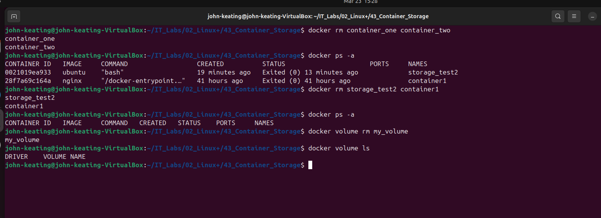

This output confirms that the Docker volume was successfully removed. The empty result from `docker volume ls` verifies that no volumes remain.

**README EXPLANATION (USE THIS)**  
This output confirms that the Docker volume was successfully removed. The empty result from `docker volume ls` verifies that no volumes remain. Proper cleanup of volumes is important because Docker volumes persist independently of containers and can consume disk space if not removed.
---

## Key Concepts

- Docker volumes provide persistent storage
- Volumes exist independently of containers
- Multiple containers can share the same volume
- Data survives container deletion
- Cleanup is required to avoid storage issues

---

## Real-World Relevance

Docker volumes are widely used in:

- Databases (MySQL, PostgreSQL)
- Logging systems
- Microservices architecture
- Kubernetes persistent storage
- Cloud-native applications

---

## What I Learned

- How to create and manage Docker volumes
- How to persist data across containers
- How containers share data using volumes
- Importance of cleaning up containers and volumes
- Real-world container storage concepts used in DevOps and cloud environments

---
