# Linux+ Lab 44 - Kubernetes or Orchestration Fundamentals

## Objective

The purpose of this lab was to install and configure core Kubernetes tools on Ubuntu Linux, initialize a Kubernetes control plane with `kubeadm`, configure local cluster access with `kubectl`, and troubleshoot cluster instability inside a VirtualBox-based Linux lab environment.

This lab focused on:

- Installing Kubernetes packages
- Adding the official Kubernetes repository
- Fixing GPG key trust issues
- Installing `kubectl`, `kubelet`, and `kubeadm`
- Initializing the Kubernetes control plane
- Configuring kubeconfig for cluster access
- Troubleshooting kubelet, API server, etcd, and container runtime issues
- Understanding how virtualization can affect Kubernetes stability

---

## Environment

- Ubuntu Linux VM
- Oracle VirtualBox
- Bash terminal
- Windows host machine
- Docker/container runtime already present
- Kubernetes tools:
  - `kubectl`
  - `kubeadm`
  - `kubelet`
  - `crictl`
  - `journalctl`
  - `systemctl`

---

## Lab Result

This lab was successful because the Kubernetes packages were installed correctly, the repository trust issue was fixed, and the Kubernetes control plane was initialized successfully with `kubeadm init`.

After initialization, the cluster later became unstable in the VirtualBox environment. Troubleshooting showed that `kubelet` was running, but control plane components and networking behavior were inconsistent. This still made the lab highly valuable because it demonstrated real-world installation, configuration, and troubleshooting skills instead of only a clean textbook setup.

---

## Commands Used

### Package and Repository Commands
- `sudo apt update`
- `sudo apt install -y curl gpg apt-transport-https ca-certificates`
- `curl -fsSL https://pkgs.k8s.io/core:/stable:/v1.29/deb/Release.key`
- `sudo gpg --dearmor -o /usr/share/keyrings/kubernetes-archive-keyring.gpg`
- `echo 'deb [signed-by=/usr/share/keyrings/kubernetes-archive-keyring.gpg] https://pkgs.k8s.io/core:/stable:/v1.29/deb/ /' | sudo tee /etc/apt/sources.list.d/kubernetes.list`

### Kubernetes Installation Commands
- `sudo apt install -y kubectl`
- `kubectl version --client`
- `sudo apt install -y kubelet kubeadm`
- `sudo kubeadm version`

### Kubernetes Initialization and Configuration Commands
- `sudo kubeadm init`
- `sudo modprobe br_netfilter`
- `sudo sysctl net.bridge.bridge-nf-call-iptables=1`
- `sudo swapoff -a`
- `sudo kubeadm reset -f`
- `sudo rm -rf /etc/cni/net.d`
- `sudo rm -rf $HOME/.kube`
- `sudo kubeadm init --pod-network-cidr=10.244.0.0/16`
- `mkdir -p $HOME/.kube`
- `sudo cp -i /etc/kubernetes/admin.conf $HOME/.kube/config`
- `sudo chown $(id -u):$(id -g) $HOME/.kube/config`

### Troubleshooting Commands
- `kubectl cluster-info`
- `kubectl get nodes`
- `sudo crictl ps -a`
- `sudo crictl logs $(sudo crictl ps -a | grep etcd | awk '{print $1}' | head -1)`
- `sudo crictl logs $(sudo crictl ps -a | grep kube-apiserver | awk '{print $1}' | head -1)`
- `sudo systemctl status kubelet`
- `sudo systemctl restart kubelet`
- `journalctl -u kubelet -n 50 --no-pager`

---

## Command Breakdown

### `sudo apt install -y kubectl`
- `sudo` = runs the command with administrator privileges
- `apt` = Ubuntu package manager
- `install` = tells apt to install software
- `-y` = automatically answers yes to prompts
- `kubectl` = Kubernetes command-line client

### `curl -fsSL <url>`
- `curl` = downloads data from a URL
- `-f` = fails silently on server errors
- `-s` = silent mode
- `-S` = still shows errors if they happen
- `-L` = follows redirects

### `sudo gpg --dearmor -o /usr/share/keyrings/kubernetes-archive-keyring.gpg`
- `gpg` = GNU Privacy Guard, used for key handling
- `--dearmor` = converts text-formatted key data into binary keyring format
- `-o` = writes output to a file

### `sudo kubeadm init --pod-network-cidr=10.244.0.0/16`
- `kubeadm` = Kubernetes bootstrap tool
- `init` = initializes the control plane
- `--pod-network-cidr=10.244.0.0/16` = assigns the pod network address range

### `sudo chown $(id -u):$(id -g) $HOME/.kube/config`
- `chown` = changes file ownership
- `$(id -u)` = inserts the current user ID
- `$(id -g)` = inserts the current group ID
- `$HOME` = current user home directory

### `journalctl -u kubelet -n 50 --no-pager`
- `journalctl` = reads system logs managed by systemd
- `-u kubelet` = shows logs only for the kubelet service
- `-n 50` = shows the last 50 log entries
- `--no-pager` = prints output directly to the screen

---

## Workflow / Steps

### 1. Created the lab directory
A dedicated lab folder was created for Kubernetes or orchestration fundamentals inside the Linux+ lab structure.

### 2. Verified the container environment
Docker version and Docker service status were checked to confirm the environment already had a working container platform.

### 3. Attempted Kubernetes installation from the default repositories
An initial attempt showed that the Kubernetes packages were not available through the default repository path, so the official Kubernetes repository had to be added manually.

### 4. Added the official Kubernetes GPG key
The Kubernetes GPG key was downloaded and converted into a trusted keyring file so the system could securely verify package signatures.

### 5. Added the official Kubernetes repository
A repository file was created under `/etc/apt/sources.list.d/` so Ubuntu could retrieve official Kubernetes packages.

### 6. Fixed the repository signature problem
An initial repository signature error occurred because the system could not verify the repository properly. Reinstalling the GPG key corrected the trust relationship, and `apt update` succeeded.

### 7. Installed `kubectl`
The Kubernetes command-line client was installed and verified successfully.

### 8. Installed `kubelet` and `kubeadm`
The node agent and cluster bootstrap tool were installed and version checked.

### 9. Began `kubeadm init`
The first cluster initialization attempt failed because the environment was missing required Linux bridge networking support.

### 10. Enabled required Kubernetes networking support
The `br_netfilter` kernel module was loaded and bridge traffic was configured to pass through iptables so Kubernetes networking checks could succeed.

### 11. Retried cluster initialization
A second initialization attempt moved further but later exposed additional issues including swap and leftover cluster state.

### 12. Disabled swap
Swap was turned off because Kubernetes expects swap to be disabled in standard setups.

### 13. Reset failed cluster state
A previous initialization attempt had already created manifests, occupied required ports, and left etcd data behind, so `kubeadm reset -f` was used to clean the failed state.

### 14. Removed leftover files
Remaining CNI files and old kubeconfig files were removed so the environment would be clean before retrying cluster setup.

### 15. Reinitialized the Kubernetes control plane
`kubeadm init --pod-network-cidr=10.244.0.0/16` completed successfully and produced the normal cluster initialization output.

### 16. Created local kubeconfig access
The `.kube` directory was created, `admin.conf` was copied into place, and permissions were corrected so the current user could use `kubectl`.

### 17. Began post-initialization troubleshooting
Although the control plane initialized successfully, later commands such as `kubectl get nodes` showed the cluster was unstable, so troubleshooting began.

### 18. Investigated containers, kubelet, API server, and etcd
`crictl`, `journalctl`, and `systemctl` were used to determine whether the problem was caused by container runtime behavior, API server instability, etcd problems, or kubelet issues.

### 19. Documented the final state
The final state of the lab showed that Kubernetes had been installed and initialized successfully, but the cluster later became unstable in the VirtualBox lab environment. This still represents a successful and realistic hands-on lab because it included full setup plus troubleshooting.

---

## Screenshots

> **Important:**  
> Your screenshots will only display on GitHub if your folder is named exactly:
>
> ```text
> Screenshots
> ```
>
> and your `README.md` is in the lab root folder, not inside the screenshots folder.
>
> Your screenshot markdown paths below are written for this exact structure:
>
> ```text
> 44_Kubernetes_or_Orchestration_Fundamentals/
> ├── README.md
> └── Screenshots/
>     ├── 01_create_lab_directory.png
>     ├── 02_check_docker_version.png
>     ├── ...
>     └── 41_kubelet_status_final_check.png
> ```

### 01_create_lab_directory.png
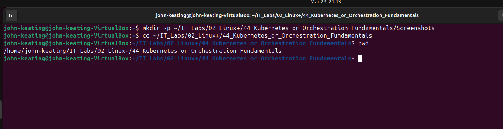

This screenshot shows the creation of the lab directory for the Kubernetes or Orchestration Fundamentals lab. Creating a dedicated directory keeps the project organized and matches professional lab documentation practices used in GitHub portfolios.

### 02_check_docker_version.png
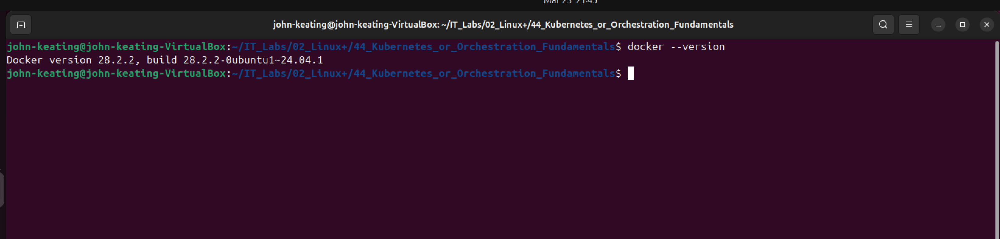

This screenshot shows Docker version verification. Checking the version first confirms that a container platform already exists on the system before beginning Kubernetes setup.

### 03_verify_docker_service.png
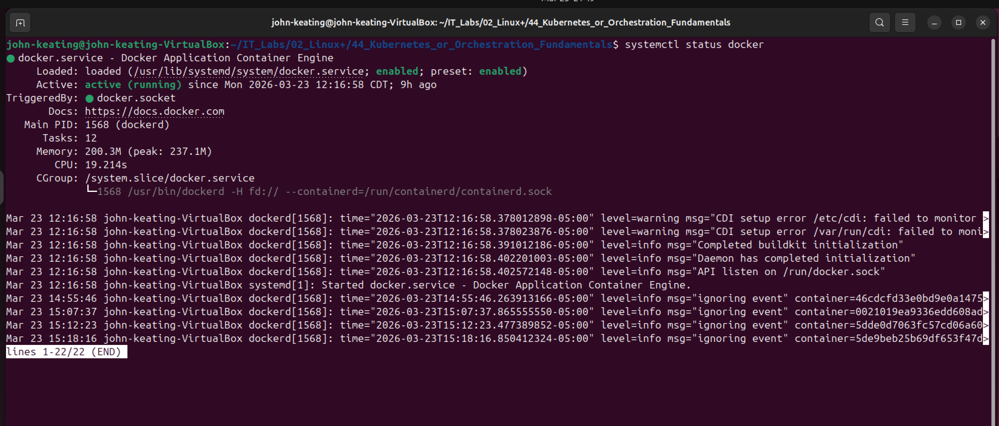

This screenshot shows the Docker service status check. Verifying that Docker is running helps confirm the machine is capable of supporting containerized workloads before installing Kubernetes tools.

### 04_kubectl_install_failed_default_repo.png
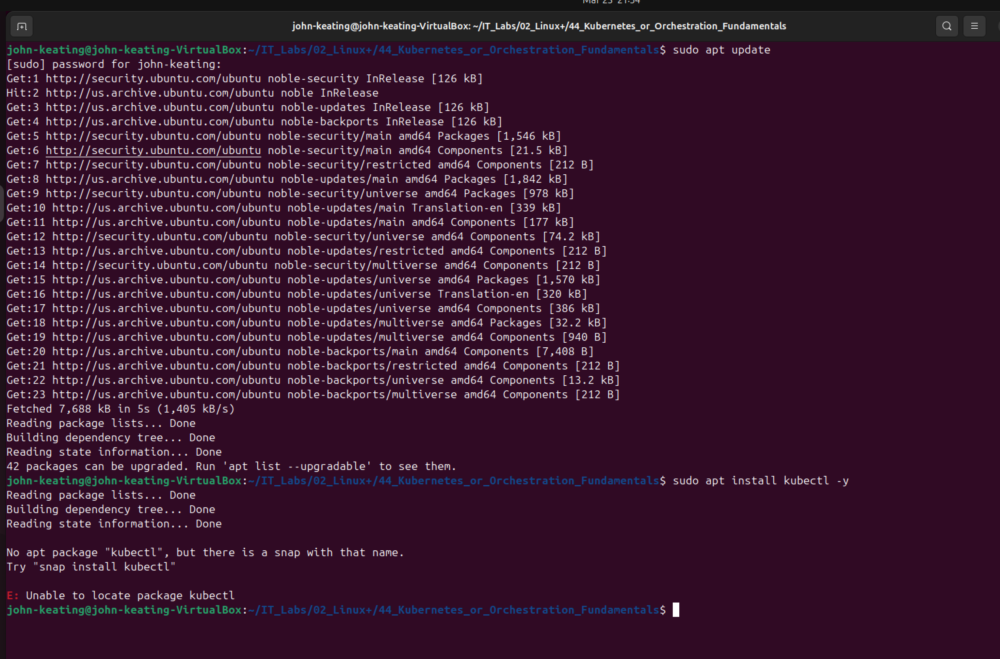

This screenshot shows an attempt to install Kubernetes tools from the default package path failing. This demonstrates that Kubernetes packages often require the official Kubernetes repository rather than depending on the default Ubuntu repositories.

### 05_install_kubernetes_dependencies.png
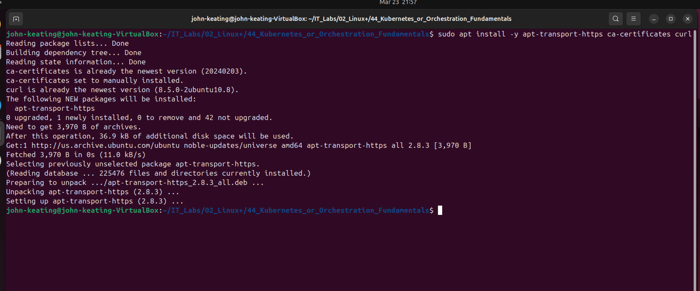

This screenshot shows the installation of supporting packages required for secure repository and package setup. These dependencies help Ubuntu retrieve repository data, manage certificates, and verify trusted keys.

### 06_add_kubernetes_gpg_key.png
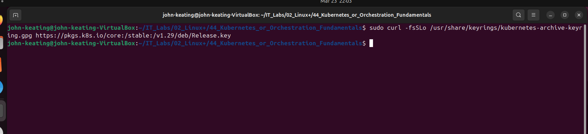

This screenshot shows the Kubernetes GPG key being downloaded and added to the system. The GPG key is used to verify the authenticity and integrity of Kubernetes packages before installation. Adding trusted keys is a security best practice that ensures software being installed has not been tampered with and originates from a trusted source. This step is critical in production environments where package security and software trust validation are required.

### 07_add_kubernetes_repository_success.png
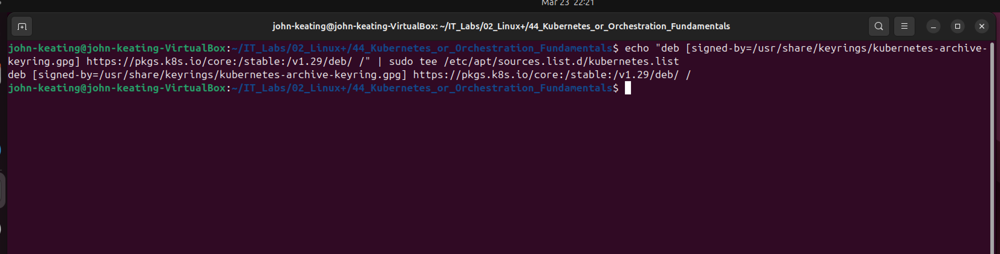

This screenshot shows the Kubernetes repository being added successfully. This allows Ubuntu to retrieve the official Kubernetes packages needed for the lab.

### 08_kubernetes_gpg_error.png
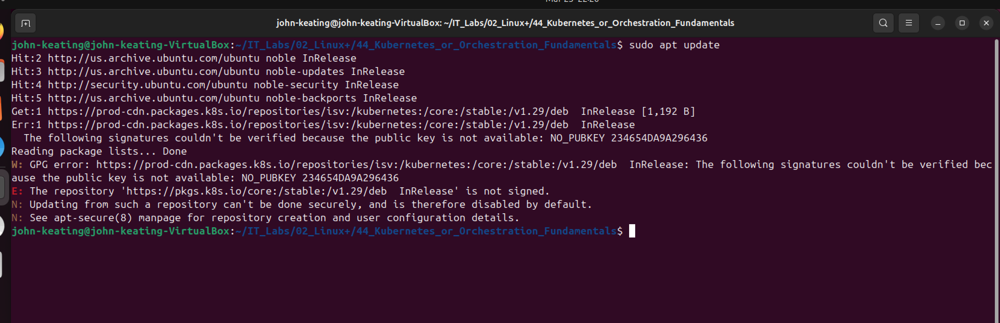

This screenshot shows the repository trust error caused by a missing or invalid GPG verification state. This is a real Linux administration issue because software installation must not continue until repository authenticity can be validated.

### 09_kubernetes_gpg_fix_update.png
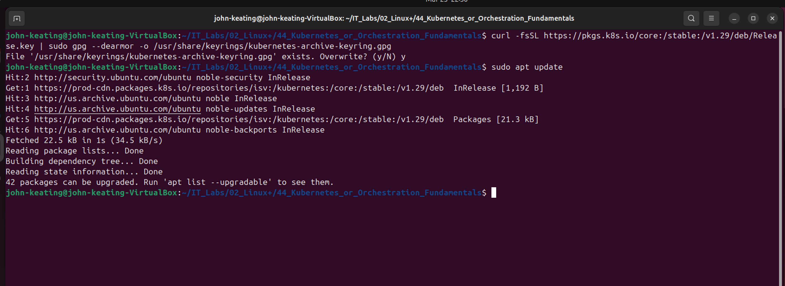

This screenshot shows the Kubernetes GPG key issue being resolved and the package repository updating successfully. The earlier NO_PUBKEY error meant the system could not verify the repository signature. Reinstalling the key fixed the trust relationship, allowing Ubuntu to securely read Kubernetes packages. This reflects real-world Linux administration, where repository signature errors must be corrected before software installation can continue safely.

### 10_install_kubectl_success.png
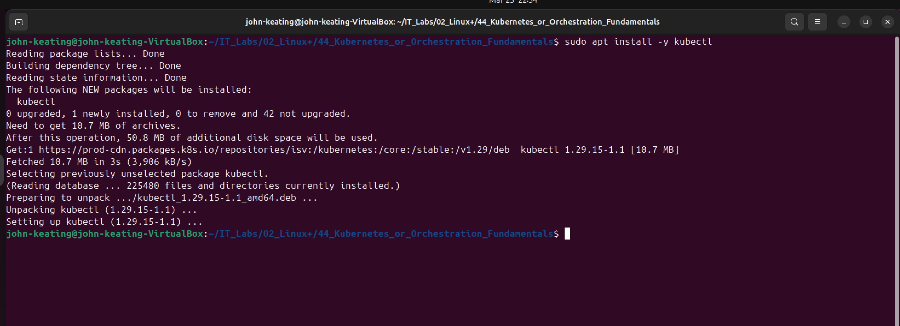

This screenshot shows `kubectl` being installed successfully. `kubectl` is the primary client used to manage Kubernetes resources from the command line.

### 11_verify_kubectl_installation.png
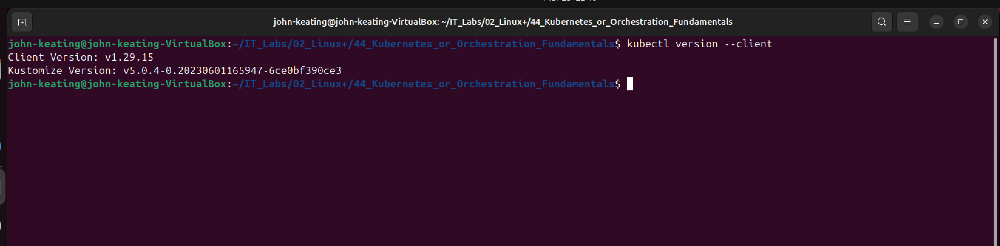

This screenshot shows verification of the installed `kubectl` client version. This confirms that the Kubernetes command-line client was installed correctly and is ready for use.

### 12_kubectl_no_cluster.png
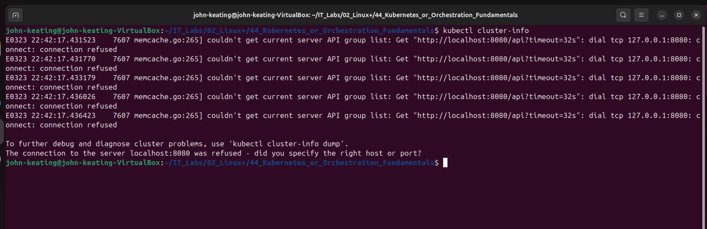

This screenshot shows `kubectl` installed but not yet connected to a Kubernetes cluster. This is expected before the control plane is initialized and kubeconfig is configured.

### 13_install_kubelet_kubeadm.png
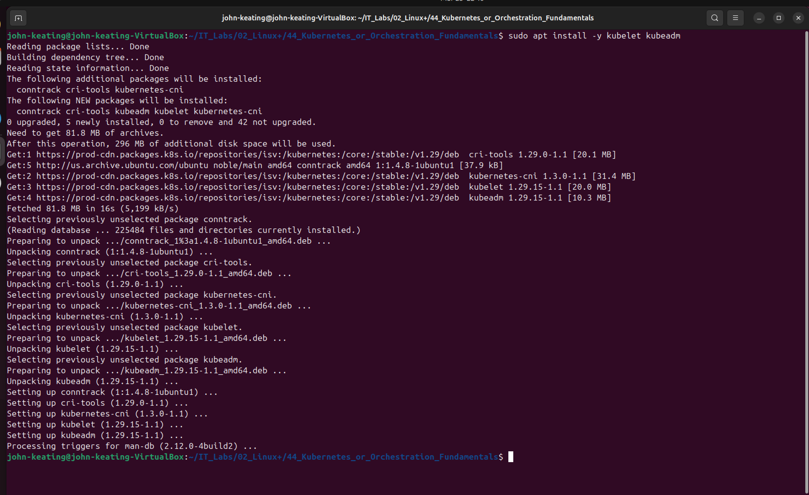

This screenshot shows the successful installation of `kubelet` and `kubeadm`. `kubelet` is the node agent, and `kubeadm` is the bootstrap utility used to initialize the cluster.

### 14_verify_kubeadm.png
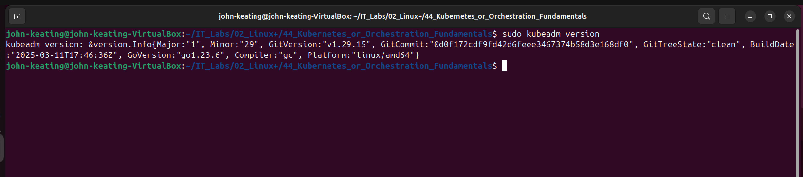

This screenshot shows the version verification of `kubeadm`. This confirms that the Kubernetes bootstrap tool is installed and ready.

### 15_kubeadm_init_error.png
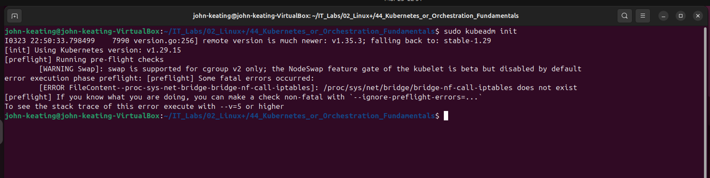

This screenshot shows an early `kubeadm init` failure. Initial Kubernetes setup often exposes missing kernel, networking, or system prerequisites that must be corrected before the cluster can start.

### 16_enable_bridge_module.png
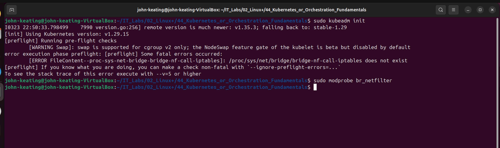

This screenshot shows the `br_netfilter` kernel module being loaded using `modprobe`. The `br_netfilter` module enables Kubernetes networking features required for container communication across bridge networks. This step resolves the kubeadm initialization error related to missing bridge networking support. Loading kernel modules is a common troubleshooting step when configuring Kubernetes in virtualized environments such as VirtualBox.

### 17_enable_iptables_bridge.png
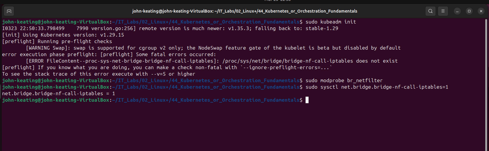

This screenshot shows bridge traffic being configured to pass through iptables. Kubernetes depends on this behavior so bridged pod traffic can be filtered and managed properly by Linux networking rules.

### 18_kubeadm_init_retry.png
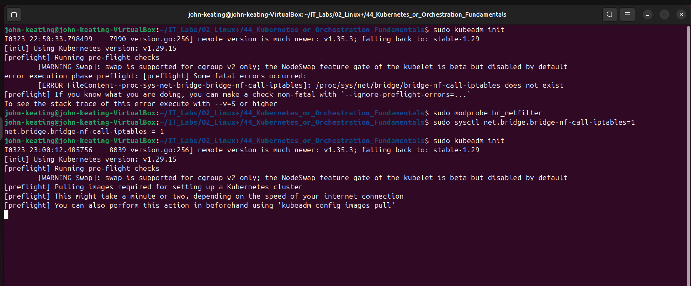

This screenshot shows `kubeadm init` being retried after enabling the required bridge networking settings. Retesting after a targeted fix is standard Linux troubleshooting practice.

### 19_kubelet_not_running_error.png
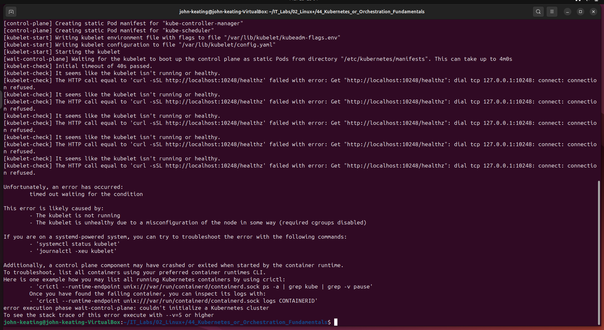

This screenshot shows another Kubernetes initialization issue, moving the lab into deeper troubleshooting. It reflects how Kubernetes setup often requires several rounds of validation and correction.

### 20_disable_swap.png
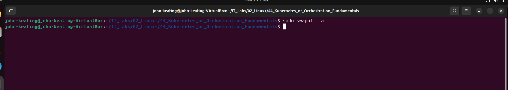

This screenshot shows swap being disabled. Kubernetes expects swap to be turned off because swap can interfere with predictable memory scheduling and resource management.

### 21_kubeadm_ports_in_use.png
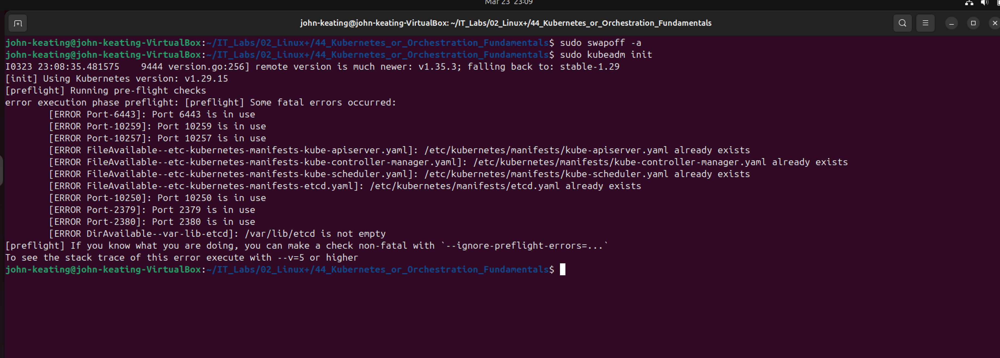

This screenshot shows Kubernetes reporting that ports and cluster files were already in use from previous initialization attempts. This is a common sign that partial cluster state remains and cleanup is required.

### 22_kubeadm_reset.png
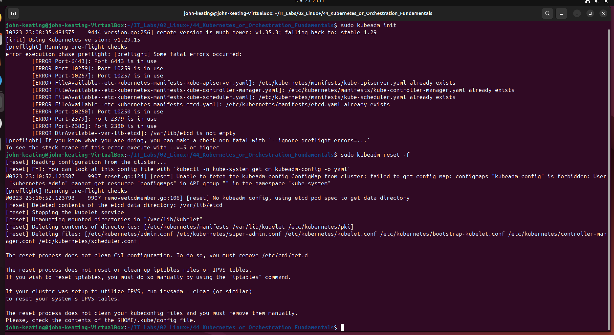

This screenshot shows `kubeadm reset -f` being used to remove the previous failed cluster configuration. Resetting failed state is a common recovery step in Kubernetes administration.

### 23_kubeadm_cluster_initialized.png
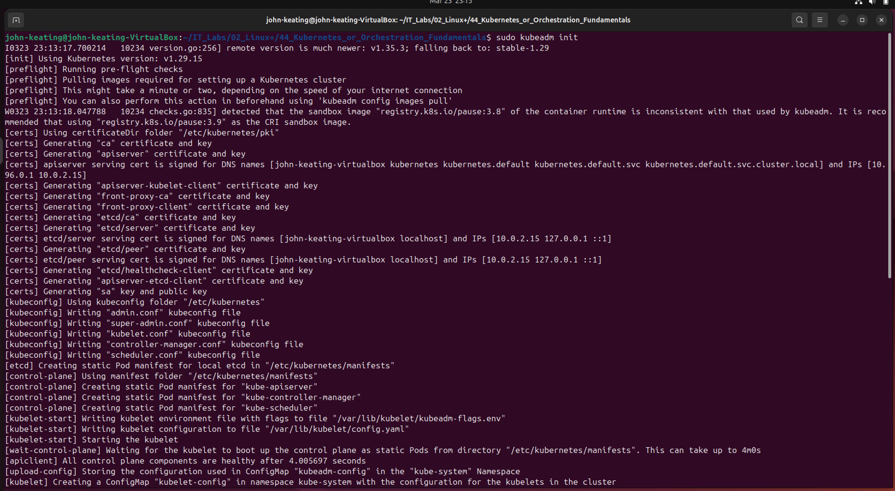

This screenshot shows a successful control plane initialization result. This confirms that the Kubernetes control plane was created successfully after correcting earlier issues.

### 24_kubeadm_join_command.png
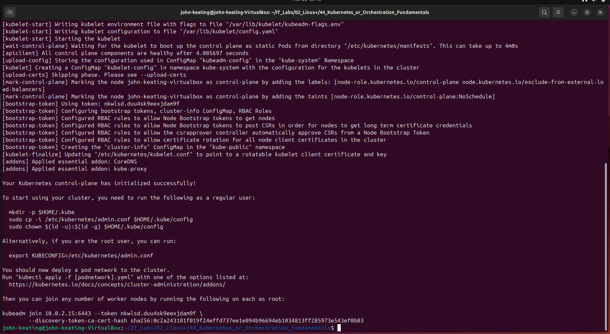

This screenshot shows the worker node join command generated by `kubeadm init`. In a multi-node environment, this command would be used to add worker nodes to the cluster.

### 25_create_kube_directory.png
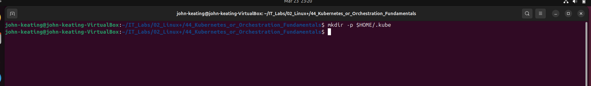

This screenshot shows the creation of the `.kube` directory in the user home folder. This is where the kubeconfig file is stored for `kubectl`.

### 26_kubeconfig_copy.png
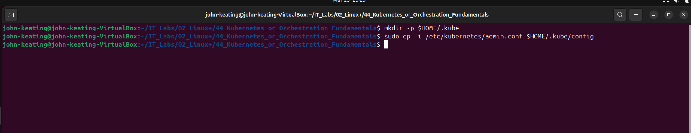

This screenshot shows the Kubernetes admin configuration file being copied into the local kubeconfig location. This step gives the current user access to the new cluster.

### 27_kube_permissions.png
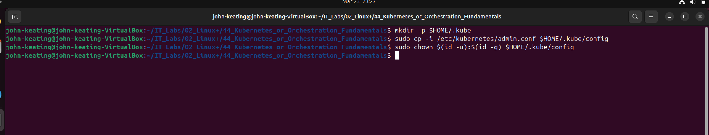

This screenshot shows the kubeconfig file ownership being changed to the current user and group. Without this step, `kubectl` may not have permission to use the config file.

### 28_kubectl_connection_refused.png
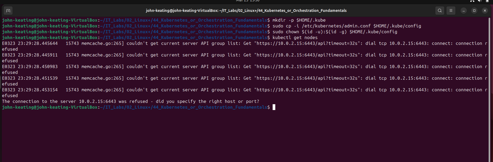

This screenshot shows `kubectl` failing to communicate with the Kubernetes API server after configuration. This marks the beginning of post-initialization troubleshooting.

### 29_kubectl_connection_retry.png
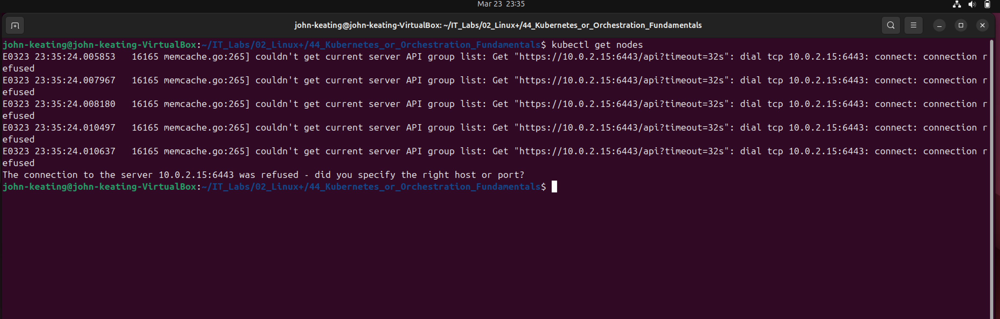

This screenshot shows a second connectivity test with `kubectl`. Repeating the test helps confirm that the problem is persistent rather than temporary.

### 30_kubelet_status.png
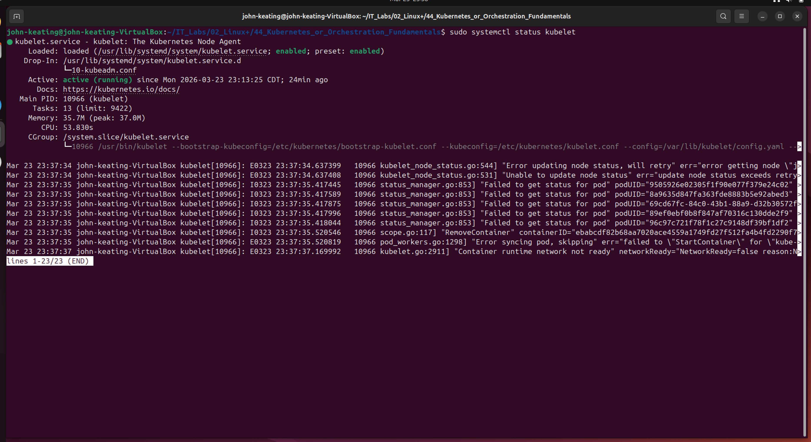

This screenshot shows the kubelet service status during troubleshooting. The kubelet is the node agent responsible for managing pods and communicating with the control plane.

### 31_kubernetes_containers_retry.png
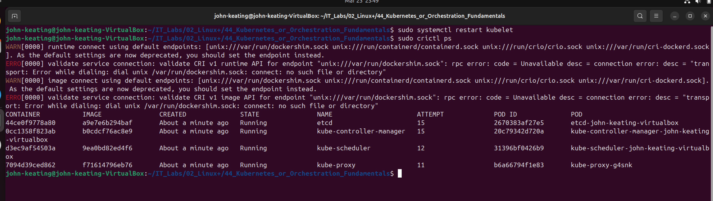

This screenshot shows Kubernetes-related containers being checked through the container runtime. This helps determine which control plane components are running, restarting, or failing.

### 32_kubectl_get_nodes.png
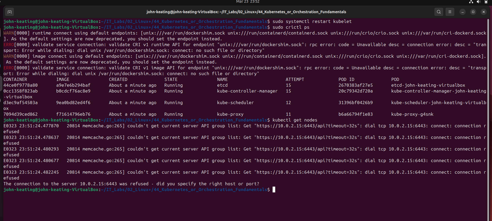

This screenshot shows another `kubectl get nodes` check. This verifies whether the cluster API server is available and whether the node is properly registered.

### 33_kube_apiserver_debug.png
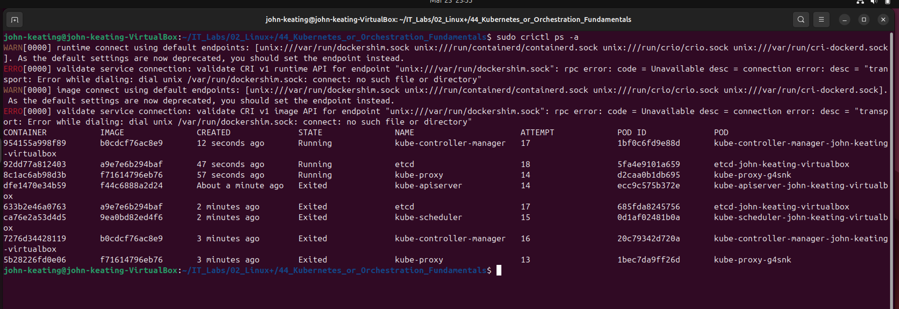

This screenshot shows deeper API server troubleshooting. This reflects real-world Kubernetes debugging when control plane access is unstable.

### 34_kube_apiserver_logs.png
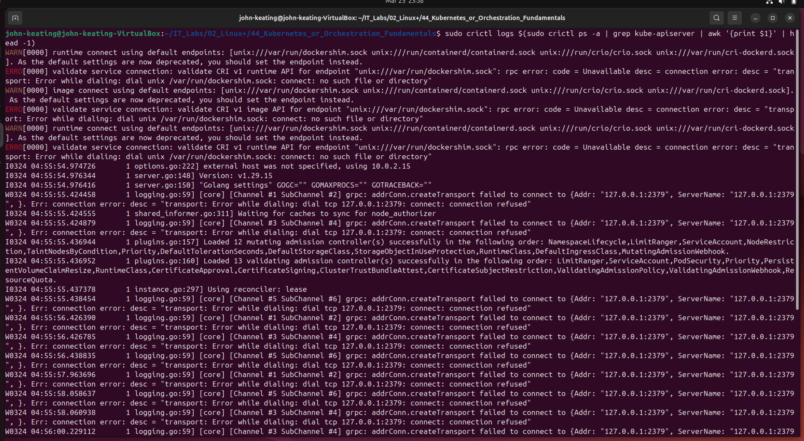

This screenshot shows Kubernetes API server logs being reviewed. Reading logs is one of the most important steps in Linux and Kubernetes troubleshooting because it exposes startup failures and service errors.

### 35_etcd_logs.png
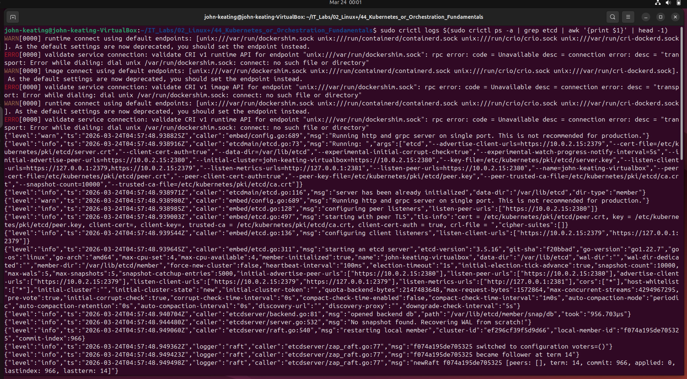

This screenshot shows etcd logs being examined. etcd stores the Kubernetes control plane state, so its health is essential for cluster stability.

### 36_kubelet_recent_logs.png
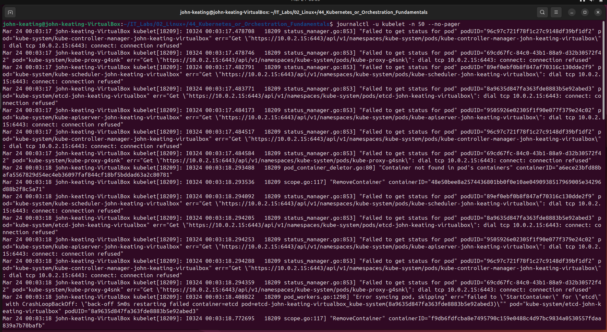

This screenshot shows recent kubelet logs being reviewed. This helps identify runtime networking issues, pod failures, and node communication problems.

### 37_kubeadm_reset.png
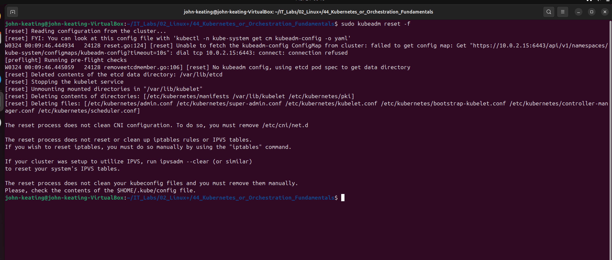

This screenshot shows another cluster reset during troubleshooting. This demonstrates a clean recovery approach instead of continuing on top of broken state.

### 38_cleanup_files.png
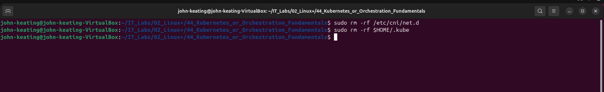

This screenshot shows leftover Kubernetes files being cleaned up. Removing stale files is often necessary before reattempting cluster initialization.

### 39_kubeadm_init_success.png
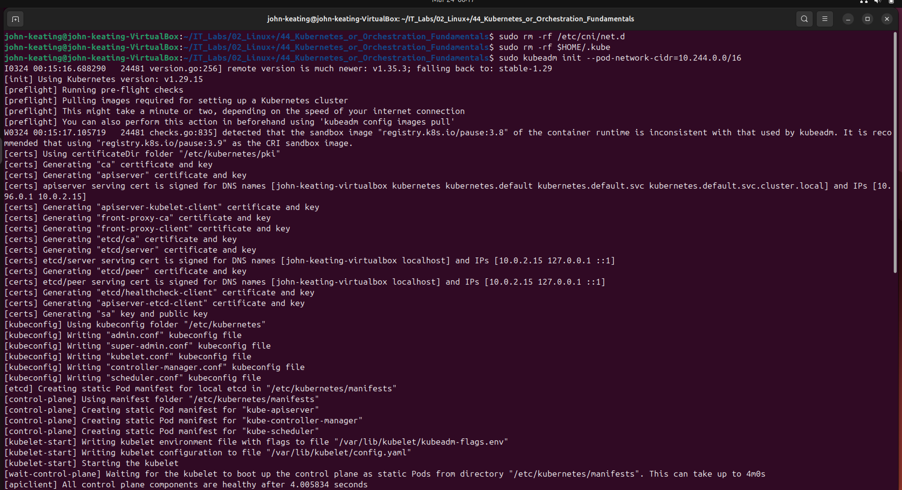

This screenshot shows `kubeadm init` succeeding after cleanup and corrective actions. This confirms that the control plane bootstrap process worked.

### 40_cluster_initialized.png
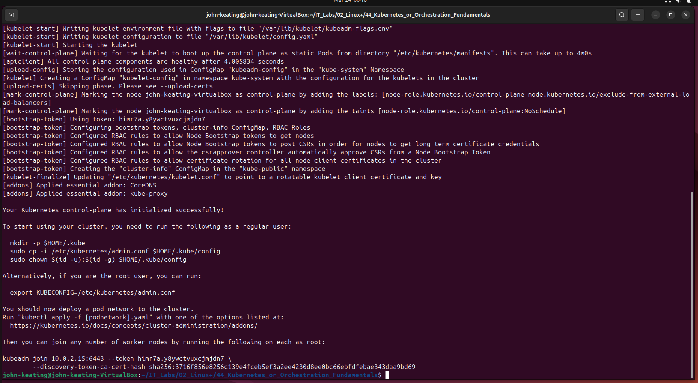

This screenshot shows the final cluster initialization success message. This is one of the most important screenshots in the lab because it proves the Kubernetes control plane initialized successfully.

### 41_kubelet_status_final_check.png
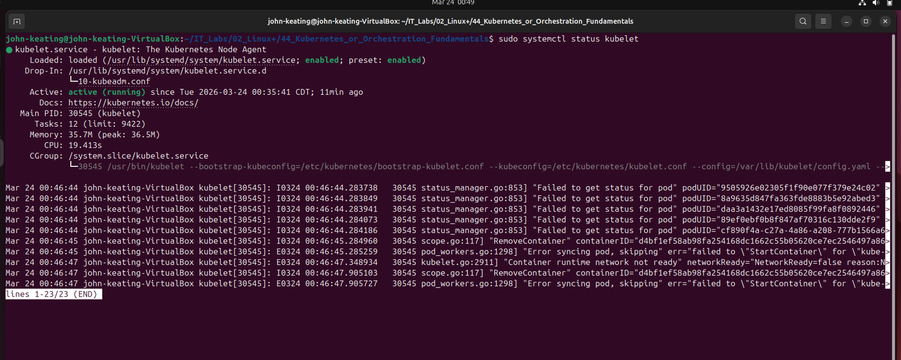

This screenshot shows the final kubelet service status during Kubernetes troubleshooting. The kubelet service was active and running, which confirmed that the node agent itself was not stopped. However, the logs showed pod synchronization failures and container runtime networking issues, indicating that the cluster instability was caused by control plane and networking problems rather than the kubelet service being down. This demonstrates a real-world Kubernetes troubleshooting scenario where services may appear active, but deeper log analysis reveals underlying runtime or networking failures.

---

## Key Concepts

### Kubernetes
Kubernetes is a container orchestration platform used to deploy, manage, and scale containerized applications.

### kubectl
`kubectl` is the command-line client used to interact with a Kubernetes cluster.

### kubeadm
`kubeadm` is the tool used to bootstrap and initialize a Kubernetes control plane.

### kubelet
`kubelet` is the node agent that manages pods and communicates with the Kubernetes control plane.

### etcd
etcd is the distributed key-value database that stores Kubernetes cluster state and configuration.

### kubeconfig
A kubeconfig file stores connection settings, cluster information, and authentication details used by `kubectl`.

### CNI
Container Network Interface is the networking layer Kubernetes uses to provide pod-to-pod networking.

### Repository Trust
Linux package managers use GPG keys to verify the authenticity of software repositories and packages.

---

## Real-World Relevance

This lab is relevant to work performed by:

- Linux Administrators
- System Administrators
- DevOps Engineers
- Cloud Engineers
- Platform Engineers
- Kubernetes Administrators
- Site Reliability Engineers

In real production or lab environments, engineers must know how to:

- add secure repositories
- fix GPG trust errors
- install Kubernetes tools
- initialize a cluster
- configure kubeconfig
- troubleshoot kubelet and API server failures
- inspect etcd behavior
- analyze container runtime output
- recover from failed bootstrap attempts

This lab demonstrates all of those skills.

---

## Troubleshooting Summary

During this lab, the following problems were identified and worked through:

1. Kubernetes packages were not initially available through the default installation path.
2. The repository failed due to GPG trust problems.
3. `kubeadm init` failed because required bridge networking support was missing.
4. Swap had to be disabled.
5. Previous failed cluster attempts left ports, manifests, and etcd data behind.
6. The cluster later became unstable after successful initialization.
7. `kubelet` remained active, but control plane components and networking were unreliable.
8. Logs from `kubelet`, `etcd`, and the API server were used to troubleshoot the environment.

This troubleshooting process reflects real Linux and Kubernetes administration work.

---

## What I Learned

In this lab I learned how to:

- install Kubernetes tools on Ubuntu
- add the official Kubernetes package repository
- configure trusted package signing keys
- troubleshoot repository signature problems
- initialize a Kubernetes control plane
- configure kubeconfig for `kubectl`
- load required kernel networking modules
- enable bridge networking behavior for Kubernetes
- disable swap for Kubernetes compatibility
- reset failed Kubernetes state safely
- inspect control plane containers
- review kubelet logs
- review etcd logs
- review API server logs
- understand how virtualization can cause cluster instability after successful installation

This lab also taught an important engineering lesson: success is not only about getting the software installed. Real infrastructure work includes diagnosing failures, cleaning broken state, retesting carefully, and documenting what actually happened.

---

## Final Summary

This lab successfully demonstrated Kubernetes installation and orchestration fundamentals on Ubuntu Linux in a VirtualBox environment. The official repository was added securely, the GPG trust issue was corrected, Kubernetes tools were installed, and the control plane was initialized successfully with `kubeadm`.

Although the cluster later became unstable, the lab still achieved its core learning goals because it covered installation, configuration, cluster bootstrap, and real troubleshooting using professional Linux administration tools.

This makes the lab a strong GitHub portfolio project because it shows both successful setup work and realistic problem-solving under lab conditions.
