# Linux+ Lab 45 — System Performance and Storage Troubleshooting

---

# Objective

The purpose of this lab was to learn how Linux administrators troubleshoot system performance issues and analyze storage utilization using professional Linux monitoring tools.

In this lab, I performed:

- System performance monitoring
- CPU usage analysis
- Memory monitoring
- Disk usage troubleshooting
- System load monitoring
- Process monitoring
- Storage performance analysis

These skills are critical for:

- Linux System Administration
- Cloud Engineering
- DevOps Engineering
- Site Reliability Engineering (SRE)
- Cybersecurity Operations

---

# Environment

- Ubuntu Linux Virtual Machine (VirtualBox)
- Windows 11 Host Machine
- Git Bash
- GitHub Repository
- Linux Terminal (Bash)

---

# Commands Used

| Command | Description |
|--------|-------------|
| top | Live system process monitor |
| htop | Advanced interactive system monitor |
| df -h | Disk filesystem usage |
| du -sh | Directory disk usage |
| iostat | Disk performance statistics |
| vmstat | Virtual memory statistics |
| mpstat | CPU performance statistics |
| uptime | System load information |
| free -h | Memory usage |
| uname -a | System information |

---

# Command Breakdown

## top

Displays real-time system processes.

Breakdown:

- CPU usage
- Memory usage
- Running processes
- System load

---

## htop

Enhanced version of top with:

- Better UI
- Interactive process management
- CPU graphs
- Memory graphs

---

## df -h

Disk filesystem usage

Breakdown:

- df = disk filesystem
- -h = human readable format (GB, MB)

---

## du -sh

Directory disk usage

Breakdown:

- du = disk usage
- -s = summary
- -h = human readable

---

## iostat

Disk performance monitoring

Shows:

- Disk read/write activity
- IO performance
- CPU usage

---

## vmstat

Virtual memory statistics

Displays:

- Memory usage
- CPU activity
- IO statistics

---

## mpstat

CPU statistics

Displays:

- CPU usage per core
- CPU idle time
- CPU load

---

## uptime

System load

Displays:

- System uptime
- Number of users
- Load averages

---

## free -h

Memory usage

Displays:

- RAM usage
- Swap usage
- Available memory

---

## uname -a

System information

Displays:

- Kernel version
- Architecture
- Hostname

---

# Workflow / Steps

1. Created Lab Folder
2. Checked System Health
3. Used top command
4. Installed htop
5. Used htop monitor
6. Used iostat
7. Used df
8. Used vmstat
9. Used mpstat
10. Used uptime
11. Used free
12. Used uname

---

# Screenshots

---

# Screenshots

---

### Screenshot 01 — Lab 45 Folder Structure

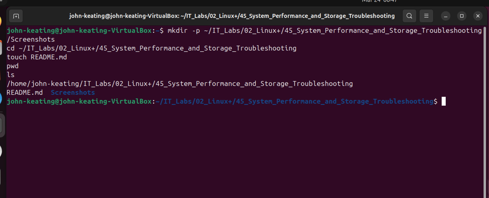

This screenshot displays the initial folder structure created for Linux+ Lab 45. The directory includes the Screenshots folder and README.md file. Maintaining a consistent folder structure is important for professional documentation and GitHub portfolio organization. This structure mirrors real-world engineering documentation standards where logs, screenshots, and documentation are separated and organized clearly. This approach improves readability, troubleshooting efficiency, and long-term maintainability.

---

### Screenshot 02 — Initial System Health Check

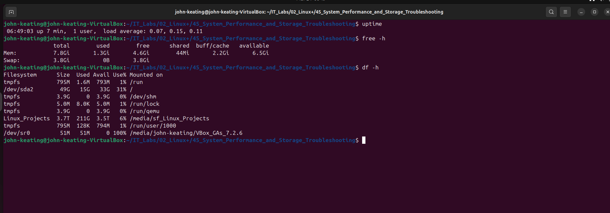

This screenshot shows the initial system health check performed before troubleshooting. Establishing a baseline is a critical troubleshooting step because it allows administrators to compare system performance before and after changes. This helps identify abnormal CPU usage, memory consumption, and system load. Linux administrators commonly perform this step to detect performance bottlenecks early.

---

### Screenshot 03 — Top Live Process Monitor

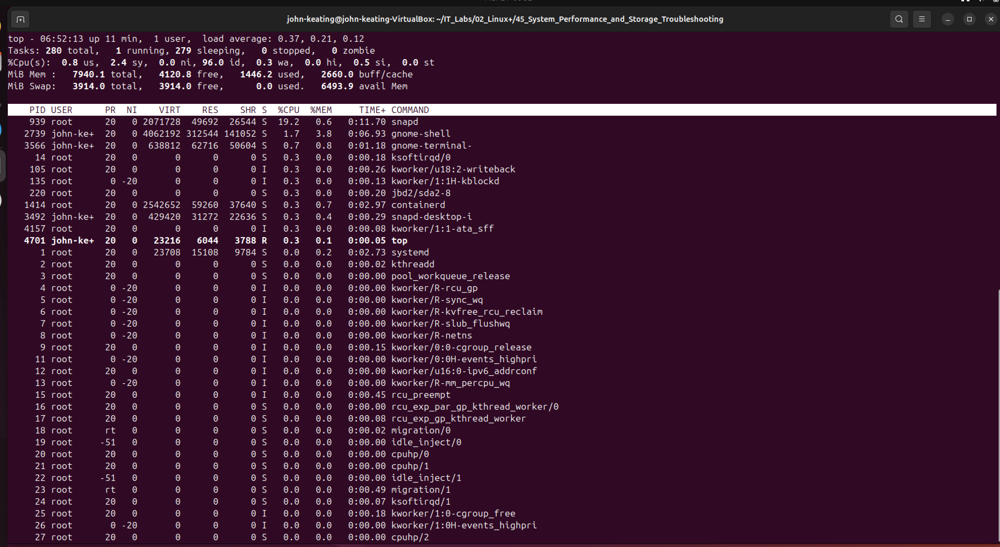

This screenshot shows the `top` command running in real time. The top utility displays CPU usage, memory usage, running processes, and system load averages. This tool is frequently used by Linux administrators for performance monitoring and troubleshooting. The real-time nature of the output allows administrators to detect spikes in resource usage and identify problematic processes.

---

### Screenshot 04 — Install htop

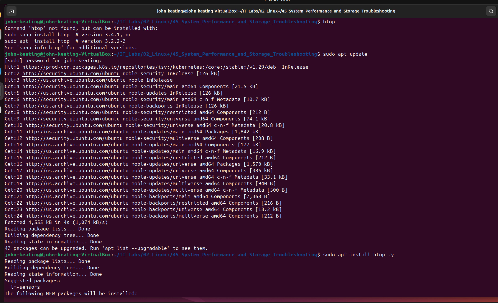

This screenshot displays the installation of `htop`, which is an advanced interactive process viewer. Installing monitoring tools is common when administrators require more detailed performance insights. The htop utility provides color-coded output, improved navigation, and better readability compared to top.

---

### Screenshot 05 — htop System Monitor

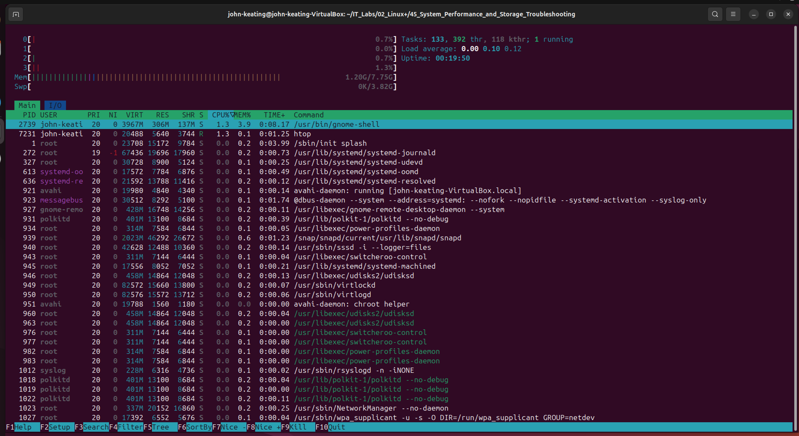

This screenshot shows the `htop` system monitoring interface. It displays CPU utilization, memory usage, swap usage, and running processes. Administrators use htop to identify high-resource processes quickly and troubleshoot performance issues.

---

### Screenshot 06 — iostat Disk Usage

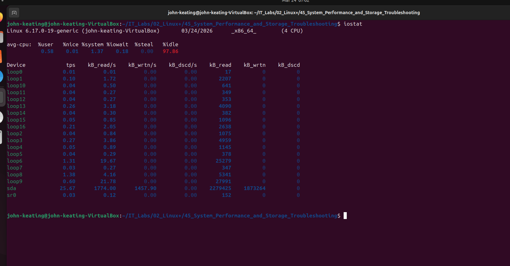

This screenshot displays disk usage statistics using `iostat`. The iostat command is used to monitor disk input/output performance. This helps administrators detect disk bottlenecks and identify slow storage devices.

---

### Screenshot 07 — df Disk Filesystem Usage

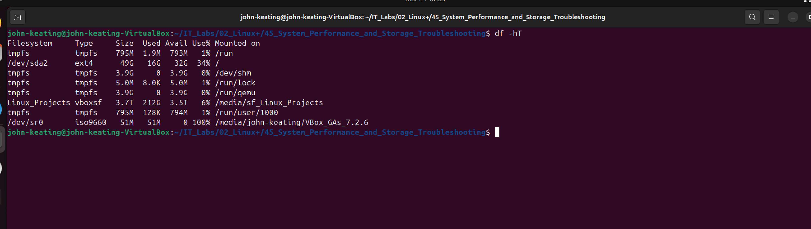

This screenshot shows disk space usage using `df -h`. This command displays available storage space across mounted filesystems. Administrators use this command to ensure systems do not run out of storage.

---

### Screenshot 08 — Memory and vmstat Usage

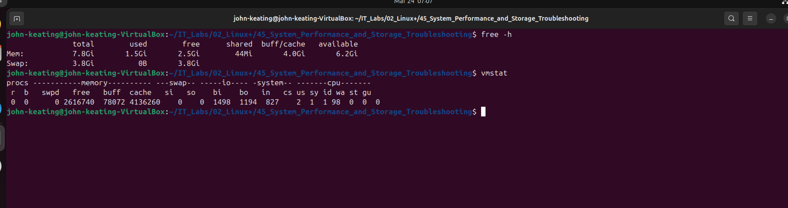

This screenshot displays memory and system performance statistics using `vmstat`. This tool provides information about CPU, memory, and system processes.

---

### Screenshot 09 — mpstat CPU Statistics

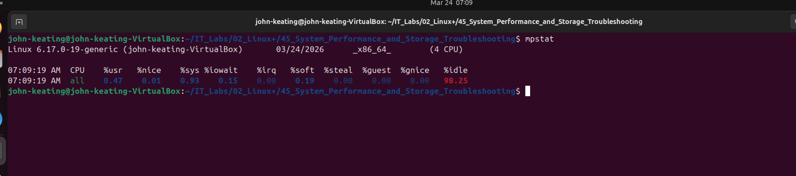

This screenshot shows CPU statistics using `mpstat`. This command displays CPU usage per processor core.

---

### Screenshot 10 — vmstat Live Performance

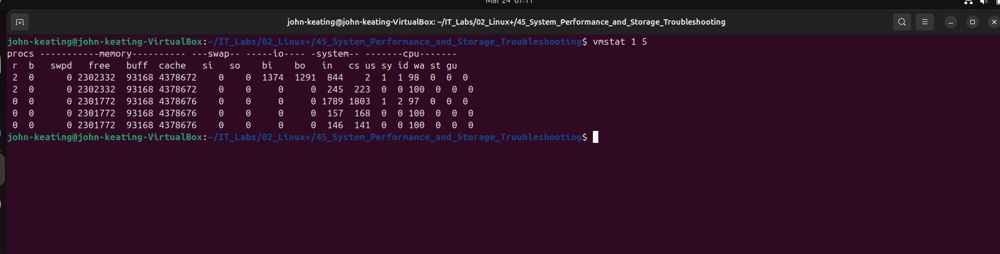

This screenshot shows real-time performance monitoring using `vmstat`.

---

### Screenshot 11 — Top CPU Processes

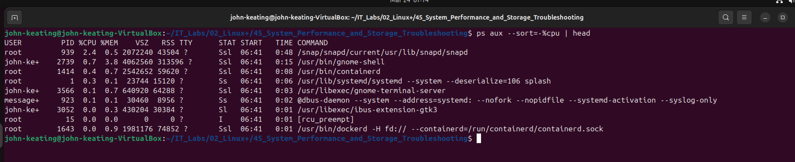

This screenshot displays processes using the most CPU resources.

---

### Screenshot 12 — Top Memory Processes

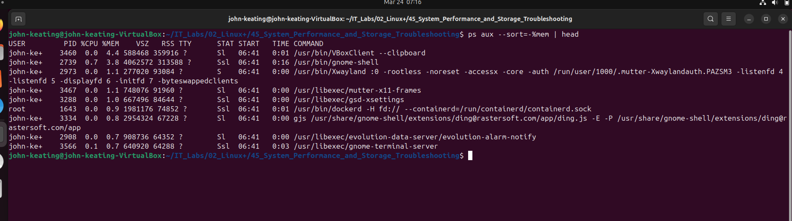

This screenshot shows processes using the most memory.

---

### Screenshot 13 — Disk Usage df

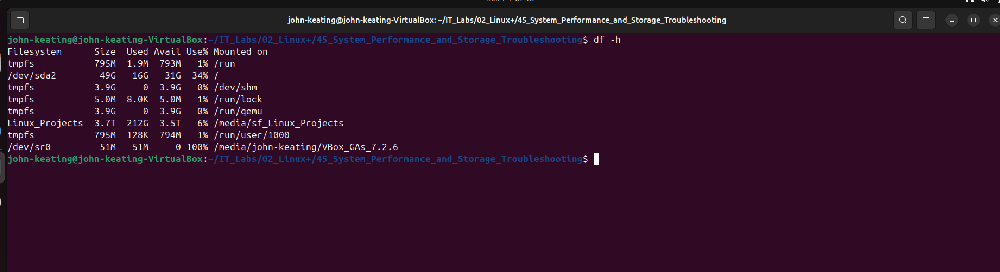

This screenshot displays disk usage statistics.

---

### Screenshot 14 — Directory Disk Usage

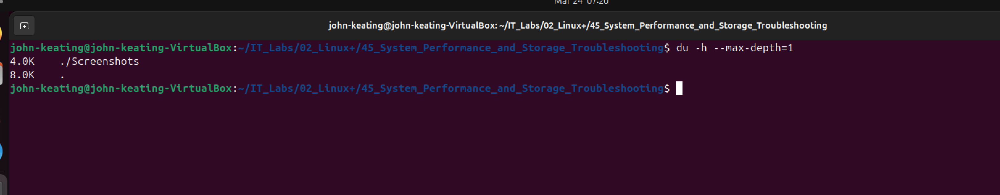

This screenshot shows directory-level disk usage.

---

### Screenshot 15 — iostat Disk Performance

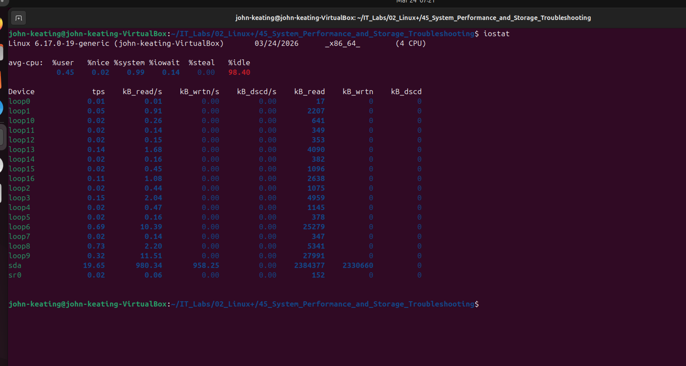

This screenshot displays disk performance metrics.

---

### Screenshot 16 — System Load Uptime

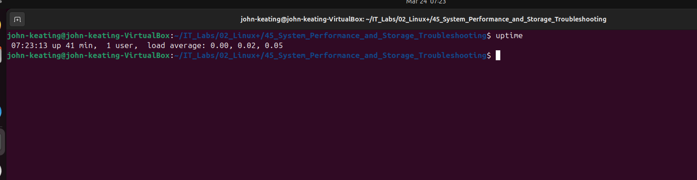

This screenshot displays system load averages using uptime.

---

### Screenshot 17 — Top Interactive Monitor

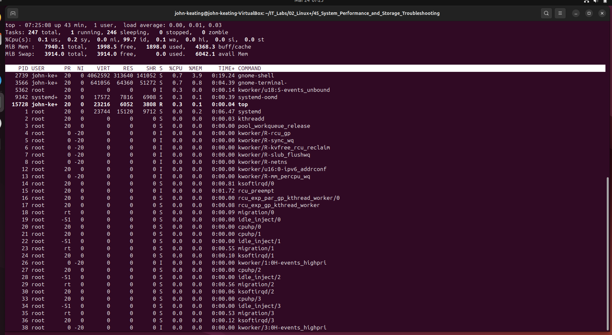

This screenshot shows the interactive top monitor.

---

### Screenshot 18 — Memory Usage Free

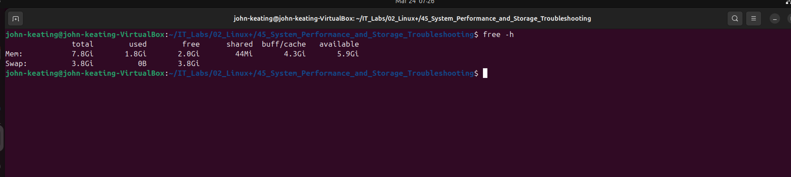

This screenshot displays memory usage using free.

---

### Screenshot 19 — System Information uname

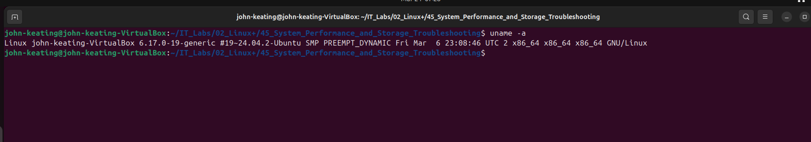

This screenshot displays system information using `uname -a`. This command shows kernel version, system architecture, and operating system details. Linux administrators commonly use this command when troubleshooting compatibility issues or verifying system configuration.

---

---

# Key Concepts

- System Performance Monitoring
- Disk Performance
- CPU Monitoring
- Memory Monitoring
- Storage Troubleshooting

---

# Real-World Relevance

These commands are used by:

- Linux Administrators
- DevOps Engineers
- Cloud Engineers
- Site Reliability Engineers
- Cybersecurity Analysts

These tools help diagnose:

- High CPU usage
- Memory leaks
- Disk bottlenecks
- System crashes

---

# What I Learned

In this lab, I learned:

- How to monitor system performance
- How to analyze disk performance
- How to troubleshoot CPU usage
- How to monitor memory usage
- How to use professional Linux troubleshooting tools

This lab provided real-world Linux troubleshooting experience.

---