# Linux+ Lab 46 — Boot Failure and Kernel Panic Troubleshooting

---

# Objective

The objective of this lab is to learn how to diagnose and troubleshoot Linux boot failures and kernel panic scenarios using professional Linux administration tools. This includes analyzing boot logs, identifying failed services, reviewing boot performance, checking GRUB configuration, verifying installed kernels, and confirming boot parameters.

This lab simulates real-world troubleshooting scenarios used by Linux administrators, cloud engineers, and DevOps professionals.

---

# Environment

- OS: Ubuntu Linux (VirtualBox VM)
- Host Machine: Lenovo ThinkPad P16 Gen 2
- CPU: Intel i9-13950HX
- RAM: 128 GB
- Storage: Dual 4 TB SSD
- Virtualization: Oracle VirtualBox
- Lab Folder:
  
```
IT_Labs/02_Linux+/46_Boot_Failure_and_Kernel_Panic_Troubleshooting
```

---

# Commands Used

```bash
journalctl -xb
systemctl --failed
systemd-analyze
systemd-analyze critical-chain
systemctl get-default
sudo cat /boot/grub/grub.cfg | head -20
dpkg --list | grep linux-image
cat /proc/cmdline
uname -r
```

---

# Command Breakdown

## journalctl -xb

- `journalctl` → View system logs
- `-x` → Show detailed explanations
- `-b` → Show logs from current boot

Used to analyze boot failures and system errors.

---

## systemctl --failed

- `systemctl` → Manage system services
- `--failed` → Show failed services

Used to identify services causing boot failures.

---

## systemd-analyze

Used to measure system boot performance.

Shows:

- Kernel boot time
- Userspace boot time
- Total boot time

---

## systemd-analyze critical-chain

Displays boot dependency chain and identifies slow services.

---

## systemctl get-default

Displays default boot target:

- graphical.target
- multi-user.target

---

## sudo cat /boot/grub/grub.cfg | head -20

- `sudo` → Run as administrator
- `cat` → Display file contents
- `head -20` → Show first 20 lines

Used to inspect GRUB bootloader configuration.

---

## dpkg --list | grep linux-image

- `dpkg --list` → List installed packages
- `grep` → Filter output

Used to identify installed kernels.

---

## cat /proc/cmdline

Displays kernel boot parameters.

---

## uname -r

Displays currently running kernel version.

---

# Workflow / Steps

1. Analyze boot logs
2. Identify system errors
3. Check failed services
4. Analyze boot performance
5. Identify slow services
6. Verify default boot target
7. Check GRUB configuration
8. Verify installed kernels
9. Check boot parameters
10. Confirm running kernel

---

# Screenshots

## 01_lab_46_folder_structure.png

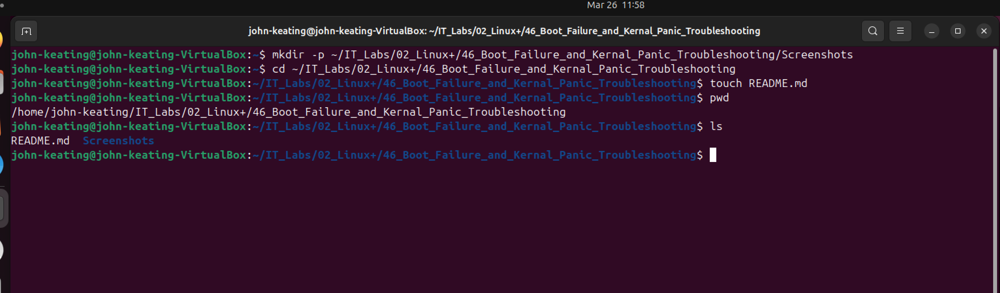

This screenshot shows the lab folder structure.

**Professional Explanation:**  
Organized folder structures improve troubleshooting workflows and documentation clarity.

---

## 02_lab_46_directory_verification.png

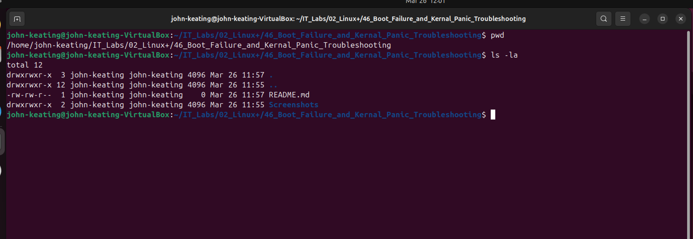

This screenshot verifies working directory.

**Professional Explanation:**  
Confirming directories prevents executing commands in incorrect locations.

---

## 03_kernel_version_check.png


This screenshot shows kernel version.

**Professional Explanation:**  
Kernel version validation helps confirm compatibility and troubleshooting scope.

---

## 04_boot_directory_kernels.png


This screenshot shows kernel files in /boot.

**Professional Explanation:**  
Multiple kernels allow rollback and recovery during boot failures.

---

## 05_boot_logs_journalctl.png

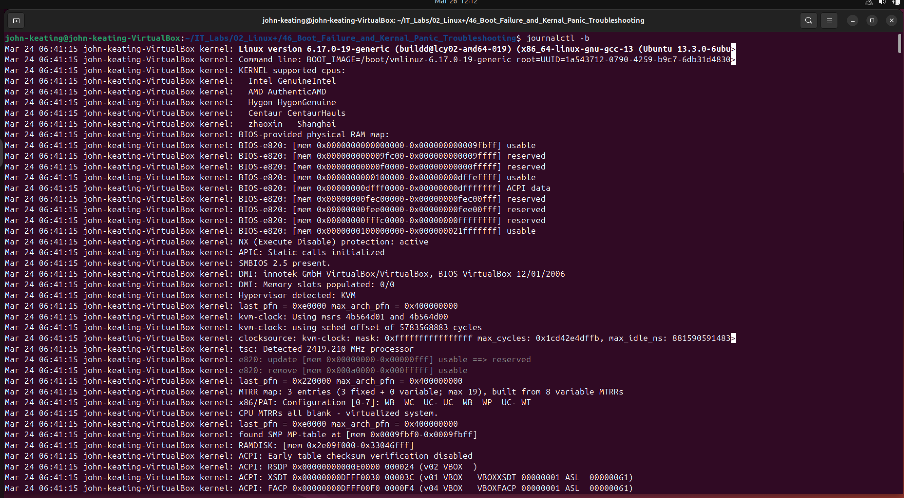

This screenshot shows system boot logs.

**Professional Explanation:**  
Boot logs help identify failures during system startup.

---

## 06_boot_errors_filtered.png

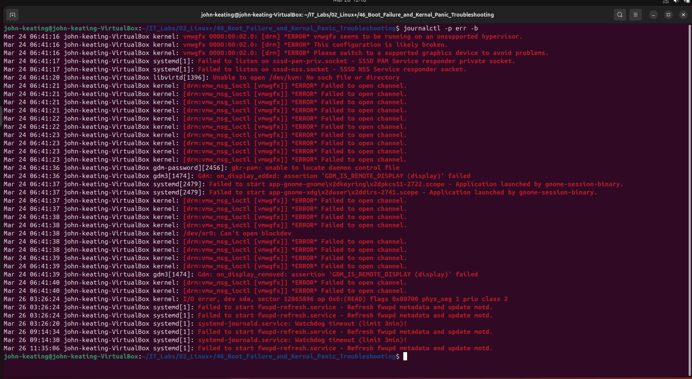

This screenshot shows filtered boot errors.

**Professional Explanation:**  
Filtering errors speeds troubleshooting.

---

## 07_dmesg_kernel_messages.png

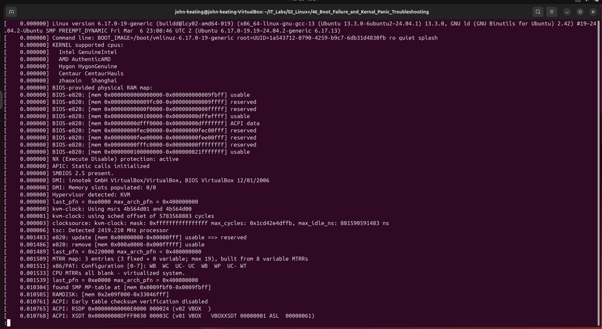

This screenshot shows kernel messages.

**Professional Explanation:**  
Kernel messages help identify hardware and driver issues.

---

## 08_failed_services.png

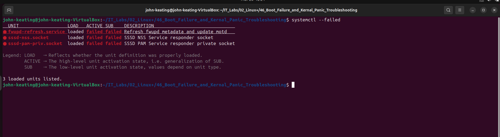

This screenshot shows failed services.

**Professional Explanation:**  
Failed services often indicate root cause of boot problems.

---

## 09_boot_time_analysis.png

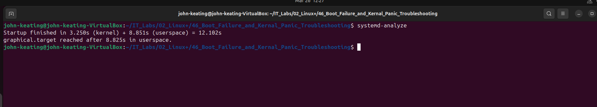

This screenshot shows boot time analysis.

**Professional Explanation:**  
Boot timing helps identify slow services.

---

## 10_boot_critical_chain.png

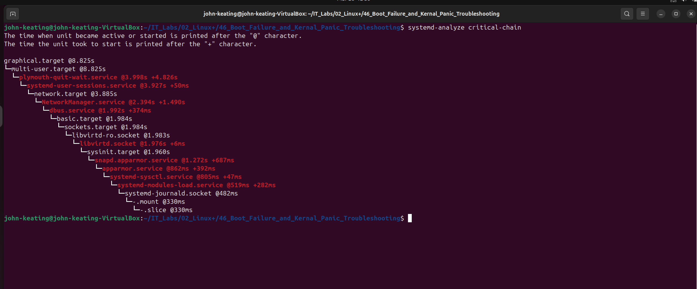

This screenshot shows boot dependency chain.

**Professional Explanation:**  
Critical chain identifies services delaying startup.

---

## 11_default_boot_target.png

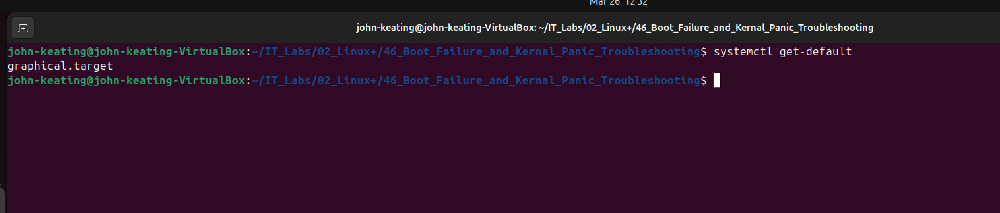

This screenshot shows default boot target.

**Professional Explanation:**  
Boot targets define system startup mode.

---

## 12_grub_configuration.png

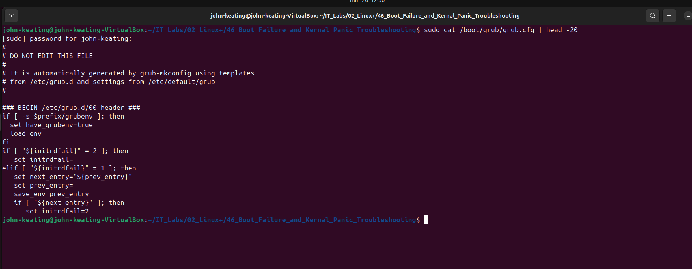

This screenshot shows GRUB configuration.

**Professional Explanation:**  
GRUB controls kernel selection and boot behavior.

---

## 13_installed_kernels.png

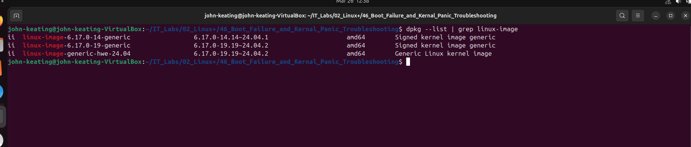

This screenshot shows installed kernels.

**Professional Explanation:**  
Multiple kernels provide fallback recovery.

---

## 14_boot_parameters.png

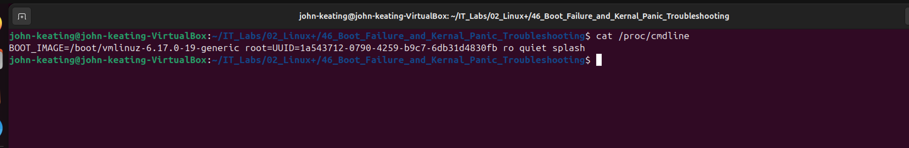

This screenshot shows boot parameters.

**Professional Explanation:**  
Boot parameters control kernel behavior.

---

## 15_kernel_version.png

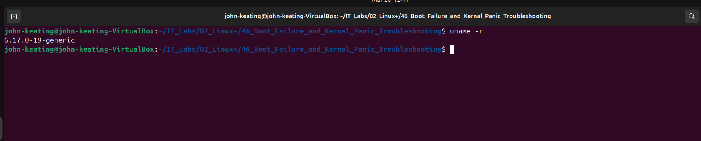

This screenshot shows running kernel version.

**Professional Explanation:**  
Verifying kernel version confirms successful boot.
---

# Key Concepts

- Boot troubleshooting
- Kernel panic recovery
- GRUB bootloader
- Systemd boot process
- Failed services
- Boot performance
- Kernel management
- System logs
- Boot dependencies

---

# Real-World Relevance

Linux administrators frequently troubleshoot:

- Kernel upgrade failures
- Bootloader misconfigurations
- Failed services
- Hardware driver issues
- Cloud instance boot failures

These skills apply to:

- Cloud Engineering
- DevOps
- Site Reliability Engineering
- Cybersecurity
- Linux System Administration

---

# Interview-Style Explanation

"In this lab, I practiced troubleshooting Linux boot failures using systemd tools and kernel diagnostics. I analyzed boot logs using journalctl, identified failed services with systemctl, evaluated boot performance using systemd-analyze, reviewed GRUB configuration, and verified kernel versions. These skills are critical for diagnosing production server issues and recovering systems from boot failures."

---

# What I Learned

- How to analyze boot failures
- How to identify failed services
- How to check kernel versions
- How to inspect GRUB configuration
- How to analyze boot performance
- How to troubleshoot kernel issues
- How to verify boot parameters

---

# Lab Complete

Linux+ Lab 46 — Boot Failure and Kernel Panic Troubleshooting  
Completed Successfully