# Linux+ Lab 47 - NFS and SMB Network Mounts

## Objective
The objective of this lab was to install, configure, test, and validate both NFS and SMB network file shares on Ubuntu Linux. This included troubleshooting package installation issues, creating shared directories, exporting an NFS share, configuring a Samba share, mounting both shares locally as a client, verifying file access, and unmounting the network mounts as part of proper cleanup.

## Environment
- Host Machine: Lenovo ThinkPad P16 Gen 2
- Host OS: Windows 11 Pro
- Virtualization Platform: Oracle VirtualBox
- Guest OS: Ubuntu
- Lab Folder: `~/IT_Labs/02_Linux+/47_NFS_and_SMB_Network_Mounts`
- Share Paths:
  - NFS Share: `/srv/nfs_share`
  - SMB Share: `/srv/smb_share`
- Client Mount Points:
  - NFS Client Mount: `/mnt/nfs_client`
  - SMB Client Mount: `/mnt/smb_client`

## Commands Used

### Lab Directory Verification
    cd ~/IT_Labs/02_Linux+/47_NFS_and_SMB_Network_Mounts
    pwd
    ls

### Package Installation and Initial Troubleshooting
    sudo apt update
    sudo apt install -y nfs-kernel-server nfs-common samba cifs-utils

### Network Troubleshooting
    ip a
    ping -c 4 8.8.8.8
    ping -c 4 google.com
    ip route
    nmcli device status
    sudo systemctl restart NetworkManager
    sudo nmcli connection down netplan-enp0s3
    sudo nmcli connection up netplan-enp0s3

### Time Troubleshooting
    date
    timedatectl
    sudo timedatectl set-ntp true
    sudo date -s "2026-03-31 19:19:00"
    sudo date -s "2026-04-01 05:30:00"

### APT Lock Cleanup
    ps -p 127469 -f
    sudo rm -f /var/lib/apt/lists/lock
    sudo rm -f /var/cache/apt/archives/lock
    sudo rm -f /var/lib/dpkg/lock-frontend
    sudo dpkg --configure -a

### NFS and SMB Share Directory Creation
    sudo mkdir -p /srv/nfs_share
    sudo mkdir -p /srv/smb_share
    sudo chmod 777 /srv/nfs_share
    sudo chmod 777 /srv/smb_share
    echo "This is the NFS test file" | sudo tee /srv/nfs_share/nfs_test.txt
    echo "This is the SMB test file" | sudo tee /srv/smb_share/smb_test.txt
    ls -ld /srv/nfs_share /srv/smb_share
    ls -l /srv/nfs_share /srv/smb_share

### NFS Export Configuration
    echo "/srv/nfs_share *(rw,sync,no_subtree_check,no_root_squash)" | sudo tee -a /etc/exports
    sudo exportfs -rav
    sudo exportfs -v

### NFS Client Mount Testing
    sudo mkdir -p /mnt/nfs_client
    sudo mount -t nfs localhost:/srv/nfs_share /mnt/nfs_client
    mount | grep nfs
    ls -l /mnt/nfs_client
    cat /mnt/nfs_client/nfs_test.txt

### Samba Configuration
    sudo cp /etc/samba/smb.conf /etc/samba/smb.conf.bak
    sudo bash -c 'cat >> /etc/samba/smb.conf <<EOF

    [smbshare]
       path = /srv/smb_share
       browseable = yes
       read only = no
       guest ok = yes
       force user = nobody
    EOF'
    sudo testparm

### Samba Service Validation
    sudo systemctl restart smbd
    sudo systemctl enable smbd
    sudo systemctl status smbd --no-pager

### SMB Client Mount Testing
    sudo mkdir -p /mnt/smb_client
    sudo mount -t cifs //localhost/smbshare /mnt/smb_client -o guest
    mount | grep cifs
    ls -l /mnt/smb_client
    cat /mnt/smb_client/smb_test.txt

### Cleanup
    sudo umount /mnt/nfs_client
    sudo umount /mnt/smb_client
    mount | grep -E 'nfs|cifs'
    mount | grep /mnt

## Command Breakdown

### Basic Navigation Commands
- `cd ~/IT_Labs/02_Linux+/47_NFS_and_SMB_Network_Mounts` changes into the Lab 47 working directory.
- `pwd` prints the full path of the current working directory.
- `ls` lists the files and folders in the current directory.

### Package Management Commands
- `sudo apt update` refreshes the package index from the configured repositories.
- `sudo apt install -y nfs-kernel-server nfs-common samba cifs-utils` installs the NFS server package, NFS client tools, Samba server package, and CIFS utilities.  
  - `-y` automatically answers yes to installation prompts.

### Network Troubleshooting Commands
- `ip a` displays all network interfaces and their IP addressing information.
- `ping -c 4 8.8.8.8` tests basic network connectivity by sending 4 ICMP echo requests to Google DNS.  
  - `-c 4` tells ping to send 4 packets and then stop.
- `ping -c 4 google.com` tests DNS name resolution and network connectivity together.
- `ip route` displays the system routing table, including the default gateway if one exists.
- `nmcli device status` shows the current state of network devices managed by NetworkManager.
- `sudo systemctl restart NetworkManager` restarts the NetworkManager service.
- `sudo nmcli connection down netplan-enp0s3` disables the active network connection profile.
- `sudo nmcli connection up netplan-enp0s3` re-enables the same network connection profile.

### Time Troubleshooting Commands
- `date` displays the current system date and time.
- `timedatectl` shows detailed time, time zone, and synchronization information.
- `sudo timedatectl set-ntp true` enables NTP-based time synchronization.
- `sudo date -s "2026-03-31 19:19:00"` manually sets the system date and time.
- `sudo date -s "2026-04-01 05:30:00"` manually moved the clock forward further so repository metadata would be considered valid.  
  - `-s` means set the system clock.

### Package Lock Repair Commands
- `ps -p 127469 -f` checks whether process ID 127469 is still running.  
  - `-p` specifies the process ID.  
  - `-f` shows full-format process details.
- `sudo rm -f /var/lib/apt/lists/lock` removes a stale APT lock file.  
  - `-f` forces removal without prompting.
- `sudo rm -f /var/cache/apt/archives/lock` removes the cached package archive lock file.
- `sudo rm -f /var/lib/dpkg/lock-frontend` removes the front-end DPKG lock file.
- `sudo dpkg --configure -a` completes unfinished package configuration tasks.  
  - `--configure -a` tells DPKG to configure all unpacked but unconfigured packages.

### Share Directory Creation Commands
- `sudo mkdir -p /srv/nfs_share` creates the NFS share directory.
- `sudo mkdir -p /srv/smb_share` creates the SMB share directory.  
  - `-p` creates parent directories if needed and does not error if the directory already exists.
- `sudo chmod 777 /srv/nfs_share` grants full read, write, and execute permissions to everyone on the NFS share directory.
- `sudo chmod 777 /srv/smb_share` grants full read, write, and execute permissions to everyone on the SMB share directory.  
  - `777` means owner, group, and others all get `rwx`.
- `echo "This is the NFS test file" | sudo tee /srv/nfs_share/nfs_test.txt` creates a sample file in the NFS share.
- `echo "This is the SMB test file" | sudo tee /srv/smb_share/smb_test.txt` creates a sample file in the SMB share.
- `ls -ld /srv/nfs_share /srv/smb_share` shows detailed information about the share directories themselves.  
  - `-l` means long listing format.  
  - `-d` means show directory entries instead of their contents.
- `ls -l /srv/nfs_share /srv/smb_share` shows the files inside both share directories.

### NFS Export Commands
- `echo "/srv/nfs_share *(rw,sync,no_subtree_check,no_root_squash)" | sudo tee -a /etc/exports` adds the NFS export definition to `/etc/exports`.  
  - `*` allows all hosts for this lab test.  
  - `rw` allows read and write access.  
  - `sync` forces synchronous writes.  
  - `no_subtree_check` disables subtree verification.  
  - `no_root_squash` allows remote root users to keep root privileges for the lab.  
  - `-a` appends the line instead of overwriting the file.
- `sudo exportfs -rav` reloads and re-exports all NFS shares verbosely.  
  - `-r` re-exports all directories.  
  - `-a` applies to all exports.  
  - `-v` enables verbose output.
- `sudo exportfs -v` displays the active NFS export configuration in detail.

### NFS Mount Testing Commands
- `sudo mkdir -p /mnt/nfs_client` creates the local NFS client mount point.
- `sudo mount -t nfs localhost:/srv/nfs_share /mnt/nfs_client` mounts the NFS share locally.  
  - `-t nfs` tells mount to use the NFS filesystem type.
- `mount | grep nfs` filters the mount list to show active NFS mounts.
- `ls -l /mnt/nfs_client` lists the contents of the mounted NFS share.
- `cat /mnt/nfs_client/nfs_test.txt` displays the NFS test file contents.

### Samba Configuration Commands
- `sudo cp /etc/samba/smb.conf /etc/samba/smb.conf.bak` creates a backup of the Samba configuration file.
- `sudo bash -c 'cat >> /etc/samba/smb.conf <<EOF ... EOF'` appends a new Samba share definition to `smb.conf`.  
  - `>>` appends text to the file.  
  - `EOF` is a heredoc marker used to paste multiple lines into the file at once.
- `sudo testparm` checks the Samba configuration for syntax problems before restarting the service.

### Samba Service Commands
- `sudo systemctl restart smbd` restarts the Samba SMB daemon.
- `sudo systemctl enable smbd` enables the Samba SMB daemon to start automatically at boot.
- `sudo systemctl status smbd --no-pager` displays the service status without opening the pager.  
  - `--no-pager` keeps the output directly in the terminal.

### SMB Mount Testing Commands
- `sudo mkdir -p /mnt/smb_client` creates the local SMB client mount point.
- `sudo mount -t cifs //localhost/smbshare /mnt/smb_client -o guest` mounts the Samba share locally using CIFS guest access.  
  - `-t cifs` tells mount to use the CIFS/SMB filesystem type.  
  - `-o guest` uses guest authentication with no username or password.
- `mount | grep cifs` filters the mount list to show active CIFS mounts.
- `ls -l /mnt/smb_client` lists the contents of the mounted SMB share.
- `cat /mnt/smb_client/smb_test.txt` displays the SMB test file contents.

### Cleanup Commands
- `sudo umount /mnt/nfs_client` unmounts the NFS client mount.
- `sudo umount /mnt/smb_client` unmounts the SMB client mount.
- `mount | grep -E 'nfs|cifs'` checks whether any NFS or CIFS mounts are still active.  
  - `-E` enables extended regular expressions.
- `mount | grep /mnt` checks whether any temporary mounts remain under `/mnt`.

## Command Breakdown
- `cd` = changes into a directory.
- `pwd` = prints the current working directory.
- `ls` = lists files and folders in the current directory.
- `sudo` = runs a command with administrative privileges.
- `apt update` = refreshes the package index from configured repositories.
- `apt install -y` = installs packages and automatically answers yes to prompts.
- `ip a` = displays network interfaces and IP addressing information.
- `ping -c 4` = sends 4 ICMP echo requests to test connectivity.
- `ip route` = displays the routing table.
- `nmcli device status` = shows the state of network devices managed by NetworkManager.
- `systemctl restart` = restarts a system service.
- `nmcli connection down` = deactivates a network connection profile.
- `nmcli connection up` = reactivates a network connection profile.
- `date` = displays or sets the system date and time.
- `timedatectl` = shows and manages system time, date, and synchronization status.
- `ps -p <PID> -f` = checks whether a specific process ID is running in full-format output.
- `rm -f` = force-removes a file without prompting.
- `dpkg --configure -a` = completes unfinished package configuration tasks.
- `mkdir -p` = creates a directory and any missing parent directories.
- `chmod 777` = gives read, write, and execute permissions to owner, group, and others.
- `echo` = outputs text to the terminal.
- `tee` = writes output both to the terminal and to a file.
- `ls -ld` = shows detailed information about directories themselves.
- `ls -l` = shows detailed file listing.
- `exportfs -rav` = re-exports all NFS shares verbosely.
- `exportfs -v` = displays active NFS export settings.
- `mount -t nfs` = mounts an NFS share.
- `mount -t cifs` = mounts an SMB/CIFS share.
- `cat` = displays file contents.
- `cp` = copies a file.
- `bash -c` = runs a command string in a Bash shell.
- `testparm` = validates Samba configuration syntax.
- `systemctl enable` = enables a service to start automatically at boot.
- `systemctl status --no-pager` = displays service status without opening the pager.
- `umount` = unmounts a mounted filesystem.
- `grep` = filters output for matching text patterns.

## Workflow / Steps
1. Verified the Lab 47 working directory in Ubuntu.
2. Attempted package installation and discovered package manager and network issues.
3. Troubleshot DNS and general connectivity problems using `ip a`, `ping`, `ip route`, and `nmcli`.
4. Restored outbound connectivity by restarting NetworkManager and reactivating the primary connection.
5. Found that package repository metadata was failing because the system clock was not synchronized.
6. Checked system time with `date` and `timedatectl`, then manually corrected the date and time.
7. Encountered an APT lock file issue and confirmed the blocking process was no longer running.
8. Removed stale lock files, repaired package configuration, and successfully refreshed the package index.
9. Installed the required NFS and Samba packages.
10. Created the NFS and SMB shared directories under `/srv`.
11. Assigned test permissions and created sample files in each share.
12. Added the NFS export entry to `/etc/exports` and reloaded the export table.
13. Mounted the NFS share locally through `/mnt/nfs_client` and verified file access.
14. Backed up the Samba configuration file and added a new guest-access SMB share definition.
15. Validated the Samba configuration using `testparm`.
16. Restarted and enabled the `smbd` service, then confirmed it was active and running.
17. Mounted the SMB share locally through `/mnt/smb_client` and verified file access.
18. Unmounted both temporary client mount points.
19. Confirmed cleanup by verifying that no mounts remained under `/mnt`.

## Screenshots

### 01_apt_update_dns_error.png
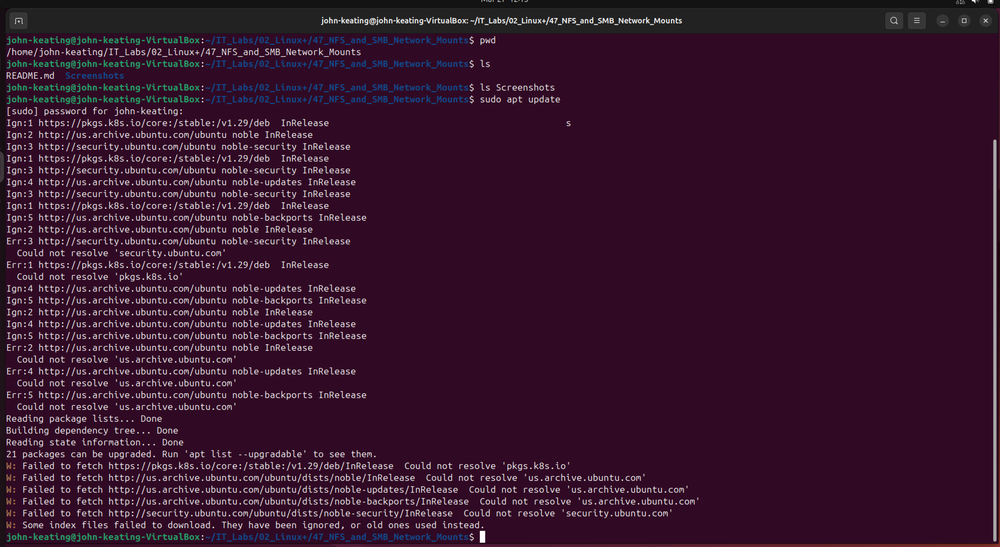

This screenshot shows package management failing during `apt update` because the system cannot resolve repository hostnames such as `us.archive.ubuntu.com`, `security.ubuntu.com`, and `pkgs.k8s.io`. This indicates a DNS or network name resolution problem rather than a package syntax issue. In a real Linux administration environment, this is an important troubleshooting step because package installation, updates, and service deployment all depend on working network connectivity and functional DNS resolution.

### 02_network_interface_and_ping_failure.png
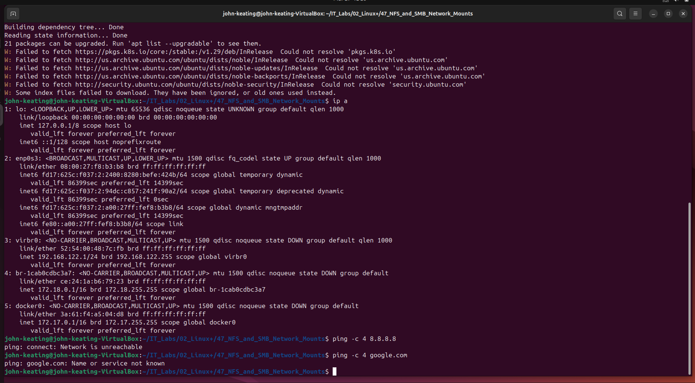

This screenshot shows that the system has active network interfaces, but outbound connectivity is still failing. The `ip a` output confirms the presence of interfaces and assigned addresses, while the failed ping to `8.8.8.8` shows that this is not only a DNS problem but also a broader network connectivity issue. In real-world Linux troubleshooting, this helps separate hostname resolution problems from full network path failures and points the administrator toward adapter, routing, or VirtualBox network configuration issues.

### 03_route_table_missing_default_gateway.png
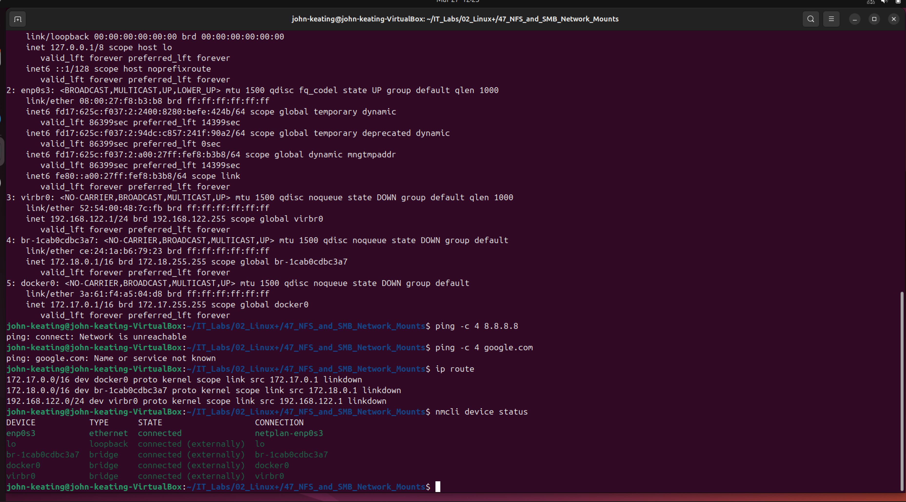

This screenshot shows that the system has an active network interface, but the routing table is incomplete. The `ip route` output only lists local bridge and container networks and does not show a default gateway, which explains why external connectivity fails. In real-world Linux troubleshooting, this means the system can see local interfaces but does not know where to send traffic for the internet or external package repositories.

### 04_network_restored_with_default_route.png
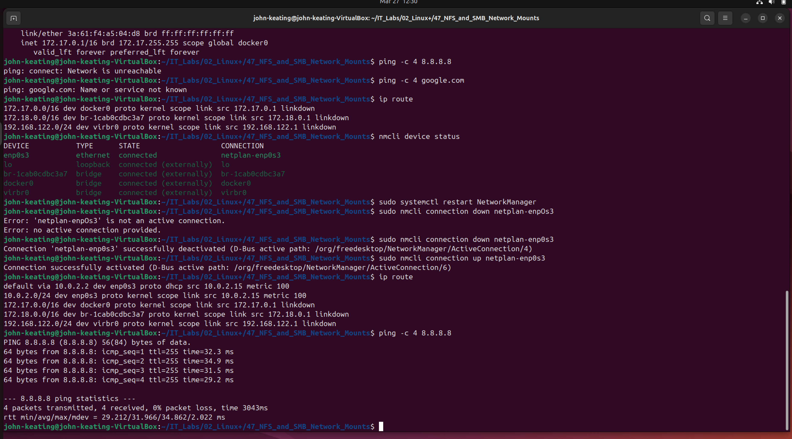

This screenshot shows successful recovery of network connectivity. The routing table now includes a default gateway, which allows the system to send traffic outside the local host and bridge networks, and the successful ping to `8.8.8.8` confirms outbound connectivity is working again. In a real Linux environment, restoring the default route is a key troubleshooting milestone because package installation, updates, remote mounts, and service communication all depend on proper routing.

### 05_apt_repository_time_sync_error.png
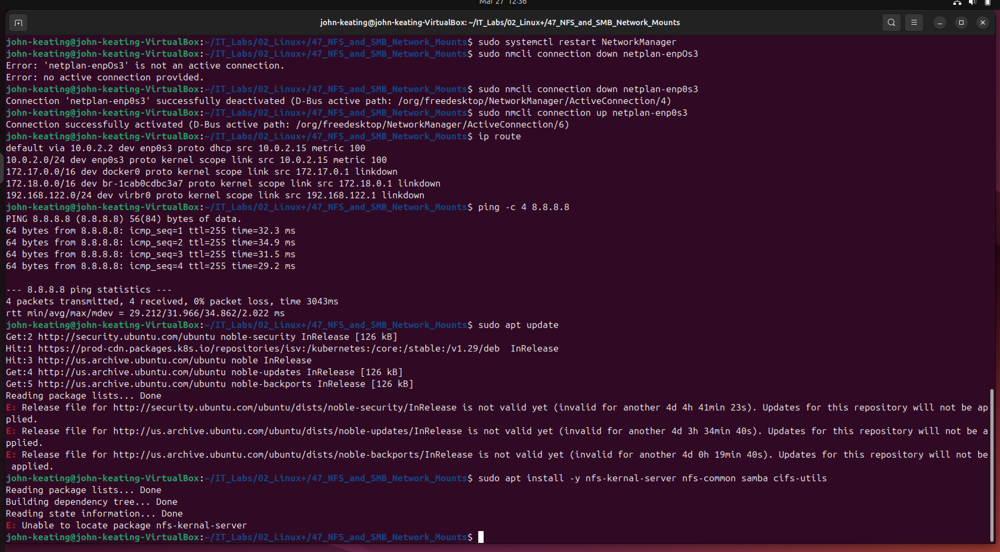

This screenshot shows that network connectivity has been restored, but package installation is still failing because the repository metadata is considered invalid based on system time. The messages stating that the release files are “not valid yet” indicate a clock or time synchronization problem, which prevents APT from trusting the repository data. In a real Linux environment, correct system time is critical because package validation, certificates, authentication, and secure communications all depend on accurate time settings.

### 06_timedatectl_unsynchronized_clock.png
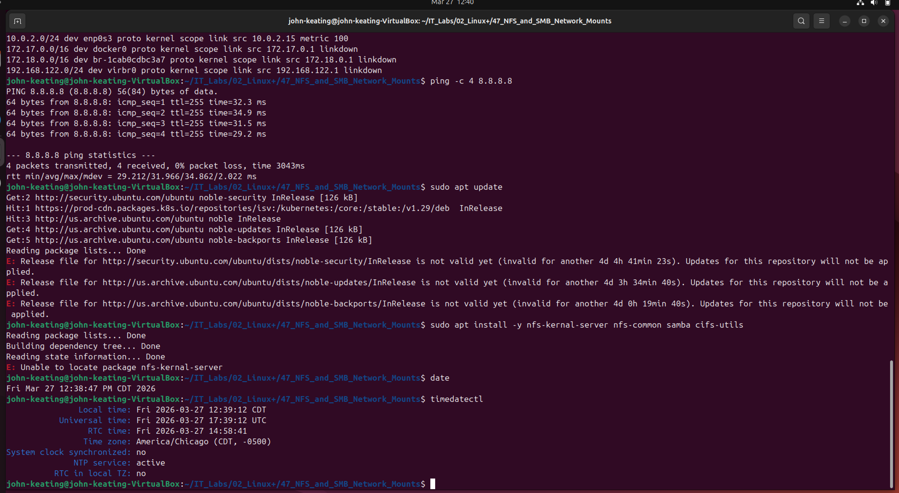

This screenshot confirms that the system’s date, time zone, and clock settings are visible, but the clock is not synchronized with a time source. The `timedatectl` output shows `System clock synchronized: no`, which explains why APT reports repository metadata as “not valid yet.” In real-world Linux administration, unsynchronized system time can break package installation, certificate validation, authentication, and other security-sensitive services.

### 07_manual_time_correction.png
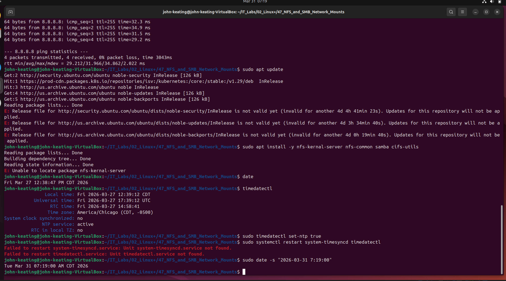

This screenshot shows the system clock being manually corrected to the current local date and time after repository validation failed because the clock was out of sync. Correcting the clock allows Linux to properly evaluate package metadata timestamps. In real-world administration, accurate system time is essential for package management, certificate validation, logging accuracy, and secure service communication.

### 08_apt_lock_file_blocking_update.png
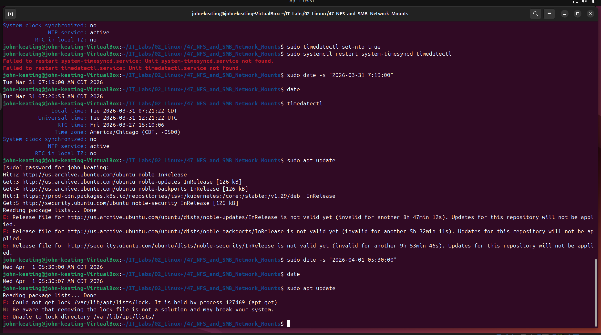

This screenshot shows that package management is now being blocked by an APT lock file rather than the earlier network or time issues. The message indicates another `apt-get` process is still holding the package database lock, which prevents concurrent package operations. In real-world Linux administration, this is an important safeguard because it protects the package database from corruption during simultaneous package operations.

### 09_apt_update_success_after_lock_cleanup.png
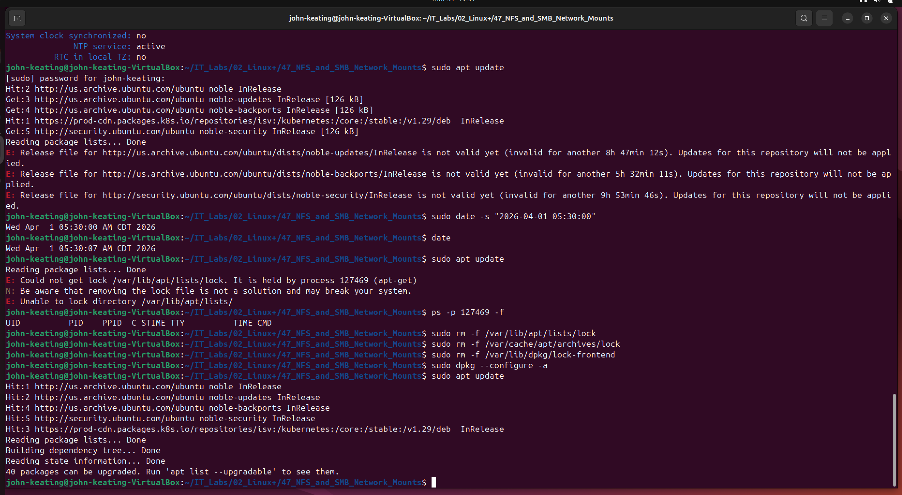

This screenshot shows successful recovery of APT after clearing stale lock files and revalidating the package database. Once the inactive lock files were removed and `dpkg --configure -a` completed, package operations resumed normally and `apt update` finished successfully. In a real Linux environment, this demonstrates proper package manager recovery after interrupted update activity and confirms the system is ready for package installation.

### 10_nfs_and_samba_packages_installed.png
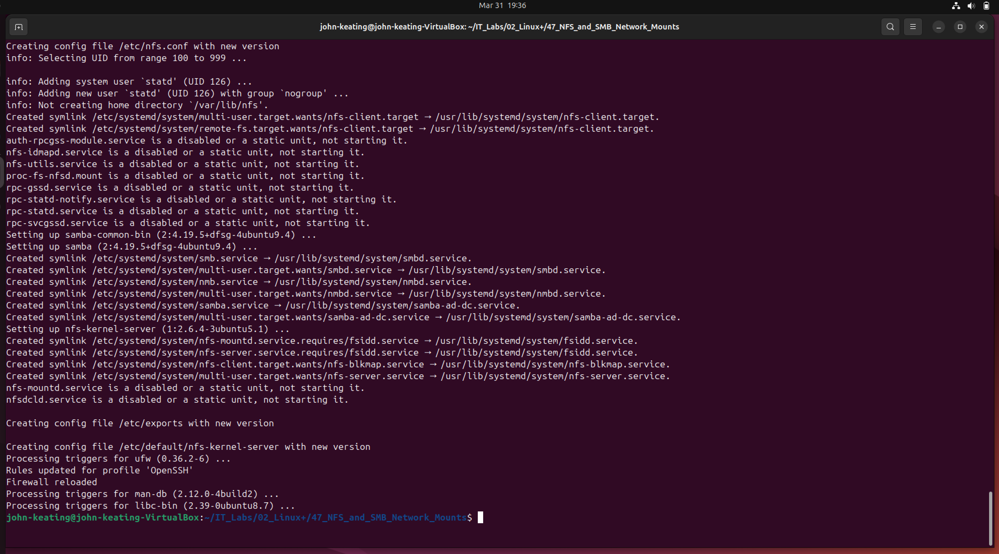

This screenshot confirms successful installation of the packages required for the lab, including NFS server/client components and Samba/SMB support utilities. The output shows package setup, service symlink creation, configuration file generation, and trigger processing completing without fatal errors. In a real Linux environment, this step prepares the system to host and mount both NFS and SMB network shares for cross-system file access.

### 11_shared_directories_and_test_files_created.png
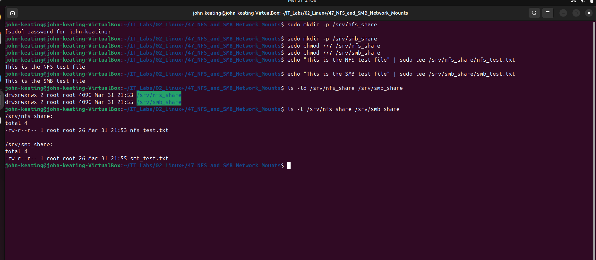

This screenshot confirms that the NFS and SMB share directories were created successfully under `/srv`, given broad test permissions, and populated with sample files for validation. The `ls -ld` output verifies the directory permissions and ownership, while the `ls -l` output confirms that each share contains its expected test file. In a real Linux environment, this step prepares the underlying storage paths that will later be exported through NFS and Samba for remote access testing.

### 12_nfs_export_configured_and_reloaded.png
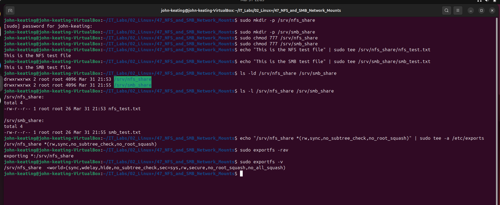

This screenshot confirms that the NFS export entry was added to `/etc/exports`, reloaded successfully with `exportfs -rav`, and verified with `exportfs -v`. The output shows `/srv/nfs_share` is now exported with the intended options, allowing clients to mount the share. In a real Linux environment, this step is how administrators publish a filesystem over NFS and confirm the export is active before client-side mount testing.

### 13_nfs_share_mounted_and_verified.png
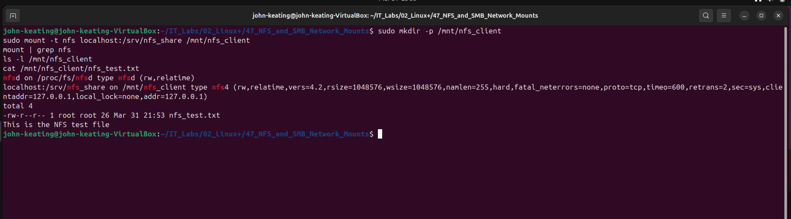

This screenshot confirms that the NFS share was successfully mounted locally to `/mnt/nfs_client` and recognized by the system as an NFS filesystem. The `mount | grep nfs` output verifies the active NFS mount, while the directory listing and file contents confirm that the exported share is accessible through the client mount point. In a real Linux environment, this validates both server-side export configuration and client-side mount functionality.

### 14_samba_share_config_validated.png
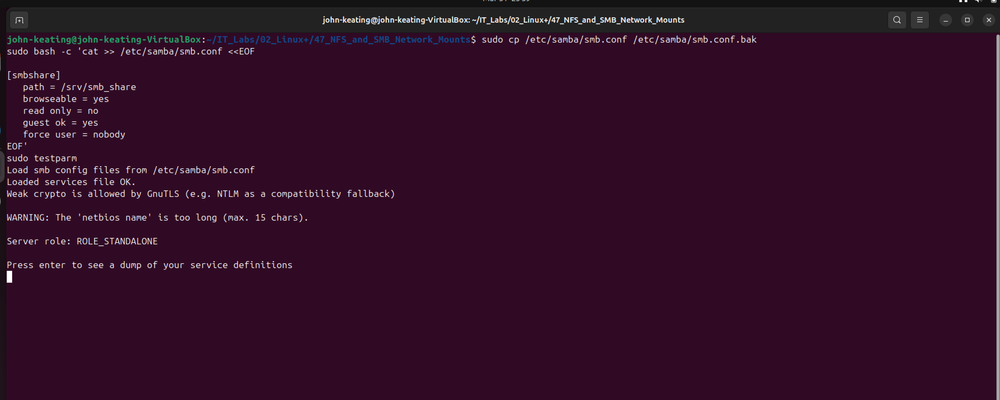

This screenshot confirms that the Samba share definition was added to `smb.conf` and successfully validated with `testparm`. The output shows Samba loaded the configuration file and accepted the new share settings, which confirms the syntax is usable. In a real Linux environment, validating Samba configuration before restarting services helps prevent service startup failures caused by configuration mistakes.

### 15_samba_service_running.png
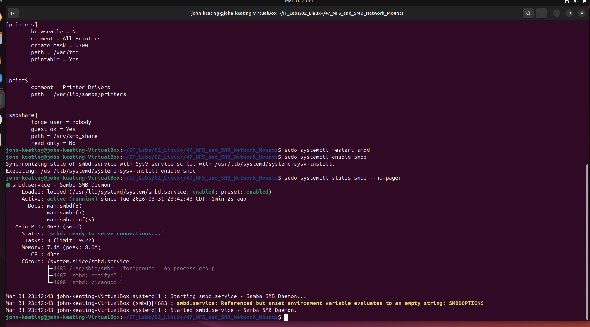

This screenshot confirms that the Samba service `smbd` was restarted, enabled at boot, and is currently active and running. The `systemctl status` output shows the service loaded successfully and is ready to serve SMB connections. In a real Linux environment, confirming the daemon is active is a critical validation step before testing client access to the shared directory.

### 16_smb_share_mounted_and_verified.png
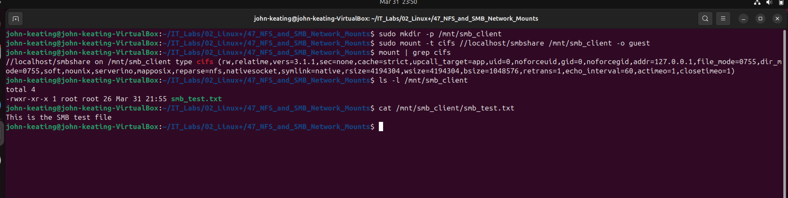

This screenshot confirms that the SMB share was successfully mounted locally to `/mnt/smb_client` using the CIFS protocol with guest access. The `mount | grep cifs` output verifies the active SMB mount, while the directory listing and file contents confirm that the shared file is accessible through the client mount point. In a real Linux environment, this validates both Samba server configuration and client-side SMB access.

### 17_network_mounts_unmounted_and_cleaned_up.png
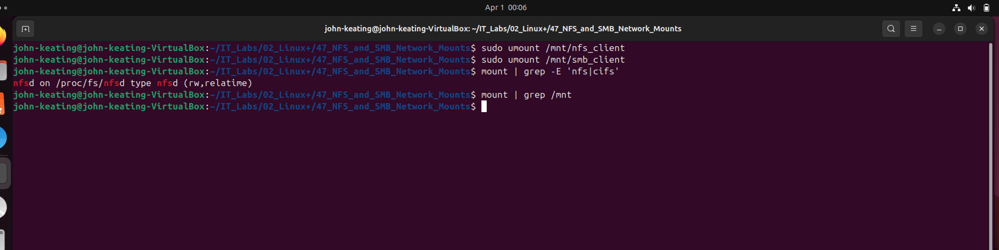

This screenshot confirms that the temporary NFS and SMB client mounts were successfully unmounted from `/mnt/nfs_client` and `/mnt/smb_client`. Verifying that no active test mounts remain is an important cleanup step because it shows the administrator can both mount and safely remove network filesystems after validation. In a real Linux environment, proper unmounting helps prevent stale mounts, resource issues, and confusion during later troubleshooting.

## Key Concepts
- NFS is a Linux and Unix focused network file sharing protocol commonly used for server-to-server file access.
- SMB/CIFS is a network file sharing protocol commonly used for Windows interoperability, but it is also widely supported on Linux through Samba.
- A default gateway is required for external network access beyond local subnets.
- DNS resolution is necessary for package repositories, hostnames, and many remote services.
- Accurate system time is required for repository metadata validation, certificates, logging, and secure communication.
- Stale APT lock files can block package operations after interrupted installs or updates.
- `/etc/exports` controls what directories are shared over NFS and with what options.
- Samba share definitions are stored in `/etc/samba/smb.conf`.
- `testparm` is used to validate Samba configuration before restarting services.
- `mount` and `umount` are used to attach and detach remote filesystems.
- `/srv` is a standard location for service data such as shared directories.

## Real-World Relevance
This lab reflects real administrative tasks used in enterprise Linux environments. System administrators regularly deploy NFS shares for Linux-based systems, configure SMB shares for mixed Linux and Windows environments, troubleshoot network routing and DNS issues, correct time synchronization problems, recover broken package manager states, and validate service availability before allowing client access. These skills are directly relevant to Linux administration, infrastructure support, network services management, and cloud-hosted Linux workloads.

## What I Learned
In this lab, I learned how to troubleshoot multiple layers of Linux system problems before a service could even be configured. I restored network connectivity, identified a missing default route, corrected time-related package repository errors, cleaned up stale APT lock files, installed NFS and Samba packages, built and tested both NFS and SMB shares, mounted them locally as a client, verified file access, and safely unmounted them during cleanup. This lab showed that successful network filesystem administration depends not only on share configuration, but also on working networking, accurate system time, healthy package management, and correct service validation.