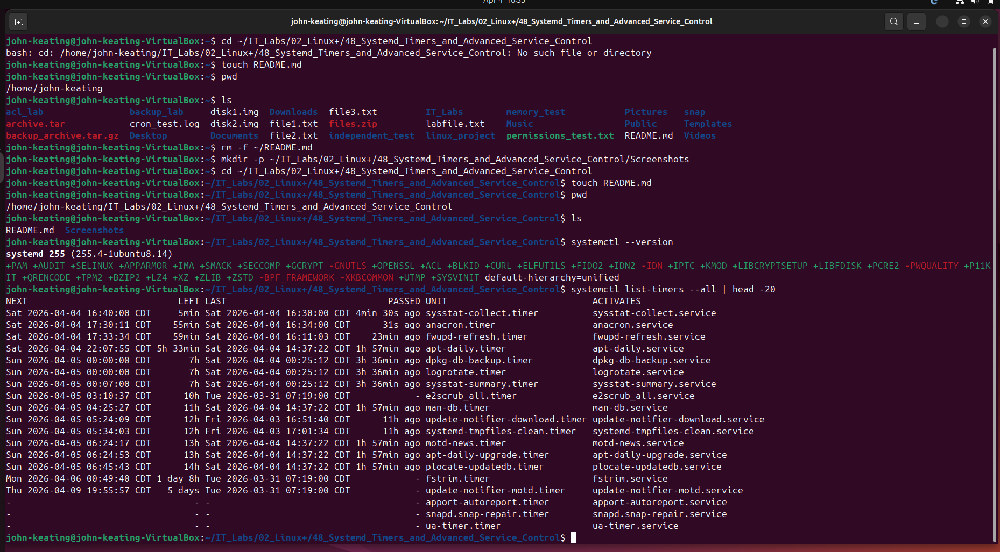
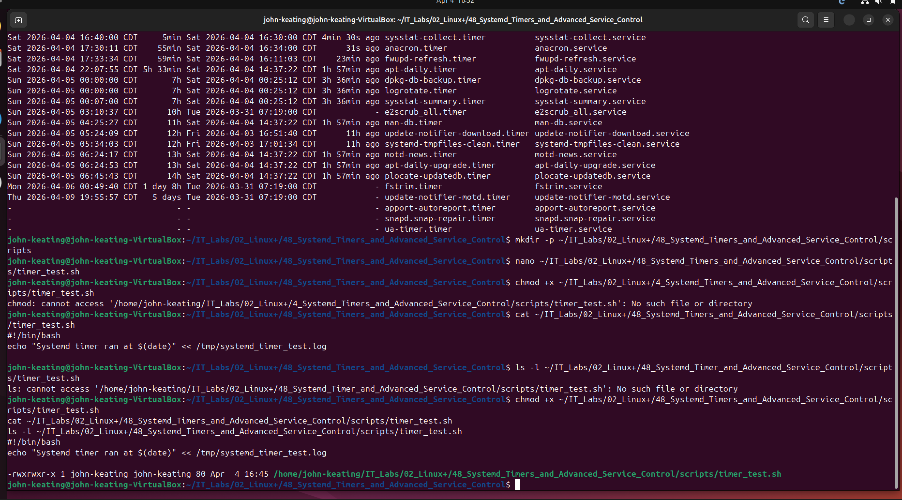
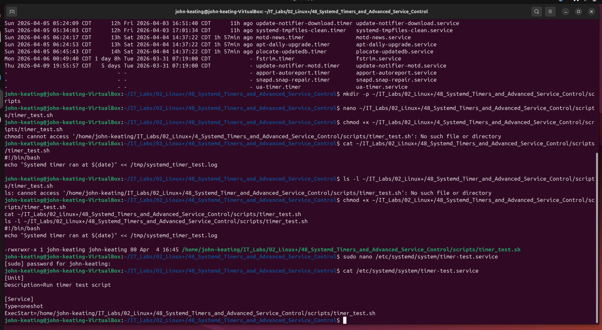
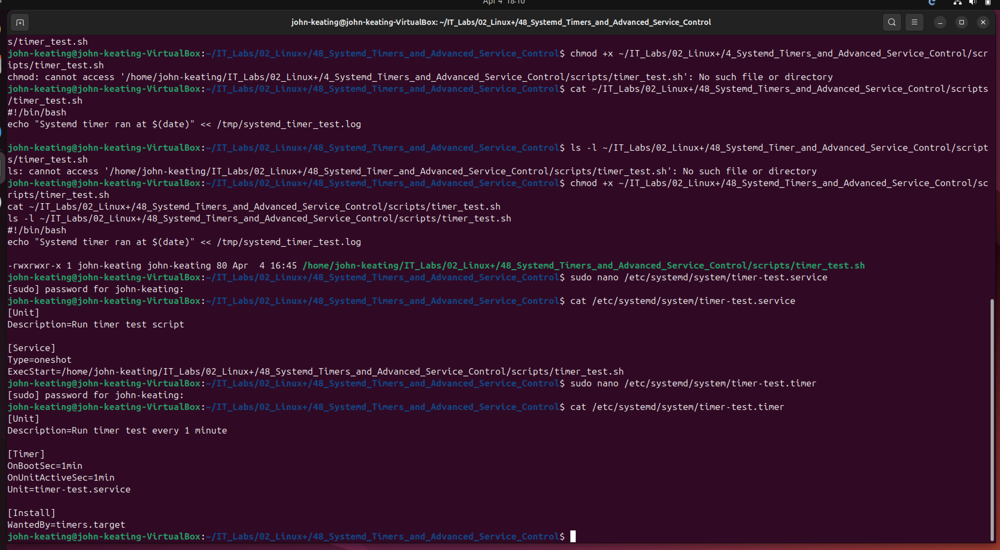
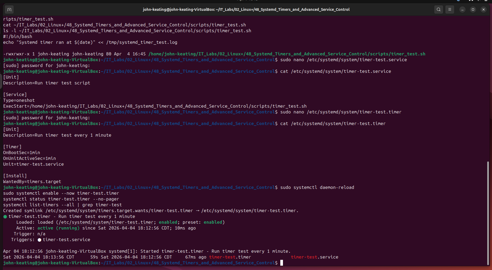
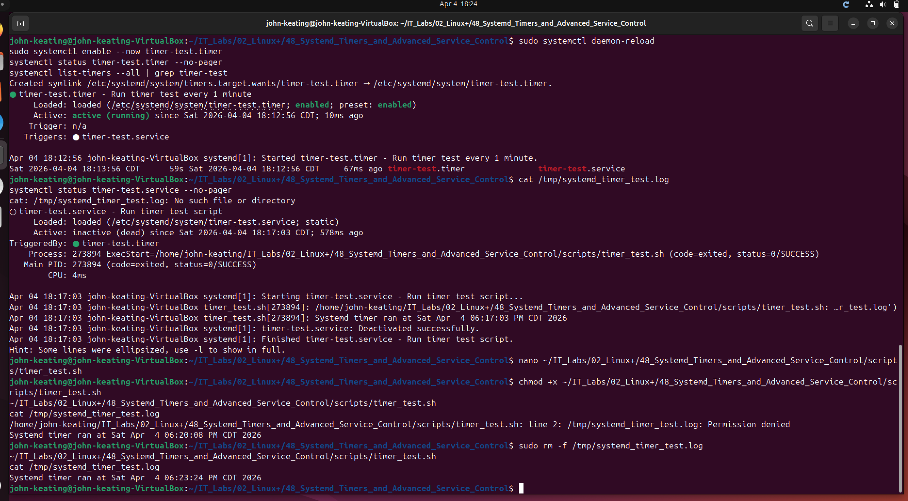
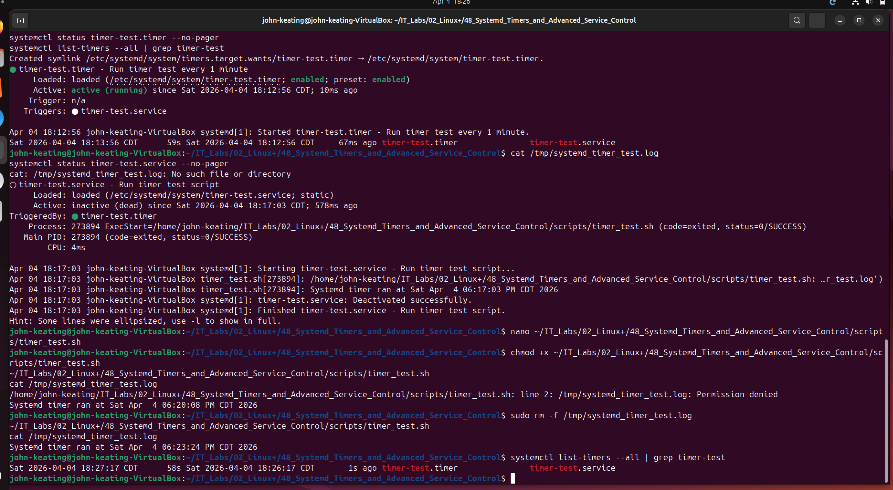
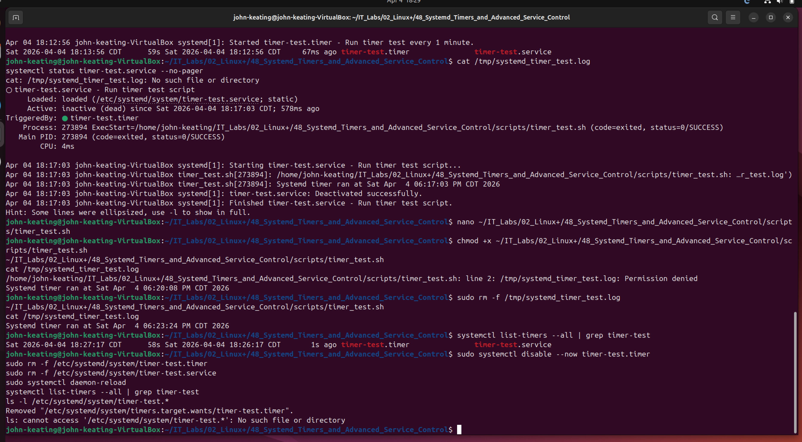

# Linux+ Lab 48 - Systemd Timers and Advanced Service Control

## Objective
The objective of this lab was to create, configure, validate, troubleshoot, and remove a custom systemd service and timer on Ubuntu Linux. This included verifying existing systemd timers, creating an executable script, building a oneshot service unit, creating a repeating timer unit, enabling and testing the timer, troubleshooting log file and permission issues, verifying successful execution, and performing full cleanup of the custom timer configuration.

## Environment
- Host Machine: Lenovo ThinkPad P16 Gen 2
- Host OS: Windows 11 Pro
- Virtualization Platform: Oracle VirtualBox
- Guest OS: Ubuntu
- Lab Folder: `~/IT_Labs/02_Linux+/48_Systemd_Timers_and_Advanced_Service_Control`
- Script Path: `~/IT_Labs/02_Linux+/48_Systemd_Timers_and_Advanced_Service_Control/scripts/timer_test.sh`
- Service Unit Path: `/etc/systemd/system/timer-test.service`
- Timer Unit Path: `/etc/systemd/system/timer-test.timer`
- Log File Path: `/tmp/systemd_timer_test.log`

## Commands Used

### Lab Directory Preparation
    mkdir -p ~/IT_Labs/02_Linux+/48_Systemd_Timers_and_Advanced_Service_Control/Screenshots
    cd ~/IT_Labs/02_Linux+/48_Systemd_Timers_and_Advanced_Service_Control
    touch README.md
    pwd
    ls

### Systemd Verification
    systemctl --version
    systemctl list-timers --all | head -20

### Script Creation
    mkdir -p ~/IT_Labs/02_Linux+/48_Systemd_Timers_and_Advanced_Service_Control/scripts
    nano ~/IT_Labs/02_Linux+/48_Systemd_Timers_and_Advanced_Service_Control/scripts/timer_test.sh
    chmod +x ~/IT_Labs/02_Linux+/48_Systemd_Timers_and_Advanced_Service_Control/scripts/timer_test.sh
    cat ~/IT_Labs/02_Linux+/48_Systemd_Timers_and_Advanced_Service_Control/scripts/timer_test.sh
    ls -l ~/IT_Labs/02_Linux+/48_Systemd_Timers_and_Advanced_Service_Control/scripts/timer_test.sh

### Service Unit Creation
    sudo nano /etc/systemd/system/timer-test.service
    cat /etc/systemd/system/timer-test.service

### Timer Unit Creation
    sudo nano /etc/systemd/system/timer-test.timer
    cat /etc/systemd/system/timer-test.timer

### Enable and Validate Timer
    sudo systemctl daemon-reload
    sudo systemctl enable --now timer-test.timer
    systemctl status timer-test.timer --no-pager
    systemctl list-timers --all | grep timer-test

### Trigger Verification and Troubleshooting
    cat /tmp/systemd_timer_test.log
    systemctl status timer-test.service --no-pager
    nano ~/IT_Labs/02_Linux+/48_Systemd_Timers_and_Advanced_Service_Control/scripts/timer_test.sh
    chmod +x ~/IT_Labs/02_Linux+/48_Systemd_Timers_and_Advanced_Service_Control/scripts/timer_test.sh
    ~/IT_Labs/02_Linux+/48_Systemd_Timers_and_Advanced_Service_Control/scripts/timer_test.sh
    cat /tmp/systemd_timer_test.log
    systemctl list-timers --all | grep timer-test

### Cleanup
    sudo systemctl disable --now timer-test.timer
    sudo rm -f /etc/systemd/system/timer-test.timer
    sudo rm -f /etc/systemd/system/timer-test.service
    sudo systemctl daemon-reload
    systemctl list-timers --all | grep timer-test
    ls -l /etc/systemd/system/timer-test.*

## Command Breakdown

### Basic Directory and File Commands
- `mkdir -p` creates a directory and any missing parent directories.
- `cd` changes into the specified directory.
- `touch README.md` creates the README file if it does not already exist.
- `pwd` prints the full current working directory.
- `ls` lists the files and folders in the current directory.

### Systemd Verification Commands
- `systemctl --version` displays the installed systemd version and supported features.
- `systemctl list-timers --all | head -20` shows the first 20 configured timers on the system, including inactive ones.  
  - `--all` includes both active and inactive timers.  
  - `|` is the pipe symbol, which sends output from one command into another.  
  - `head -20` limits the output to the first 20 lines.

### Script Creation Commands
- `nano <path>` opens the script file in the nano text editor.
- `chmod +x <path>` adds execute permission to the script file.  
  - `+x` means add executable permission.
- `cat <path>` displays the full contents of the file.
- `ls -l <path>` shows detailed file information, including permissions, ownership, size, and timestamp.  
  - `-l` means long listing format.

### Service Unit Commands
- `sudo nano /etc/systemd/system/timer-test.service` opens the custom service unit file for editing with administrative privileges.
- `cat /etc/systemd/system/timer-test.service` displays the saved service unit file contents.

### Timer Unit Commands
- `sudo nano /etc/systemd/system/timer-test.timer` opens the custom timer unit file for editing with administrative privileges.
- `cat /etc/systemd/system/timer-test.timer` displays the saved timer unit file contents.

### Systemd Control Commands
- `sudo systemctl daemon-reload` tells systemd to reload unit files after changes are made.
- `sudo systemctl enable --now timer-test.timer` enables the timer to start at boot and also starts it immediately.  
  - `enable` registers the unit for automatic startup.  
  - `--now` starts the unit immediately in the current session.
- `systemctl status timer-test.timer --no-pager` displays the timer status directly in the terminal.  
  - `--no-pager` prevents output from opening in a pager window.
- `systemctl list-timers --all | grep timer-test` filters the timer list to show only the custom timer.  
  - `grep` searches for matching text.

### Troubleshooting and Validation Commands
- `cat /tmp/systemd_timer_test.log` displays the timer log file contents.
- `systemctl status timer-test.service --no-pager` shows the execution status of the service unit triggered by the timer.
- `~/IT_Labs/02_Linux+/48_Systemd_Timers_and_Advanced_Service_Control/scripts/timer_test.sh` runs the script manually from the shell.
- `sudo rm -f /tmp/systemd_timer_test.log` removes the old log file so it can be recreated cleanly.  
  - `rm` removes a file.  
  - `-f` forces removal without prompting.

### Cleanup Commands
- `sudo systemctl disable --now timer-test.timer` stops the timer immediately and disables it from starting at boot.
- `sudo rm -f /etc/systemd/system/timer-test.timer` removes the custom timer unit file.
- `sudo rm -f /etc/systemd/system/timer-test.service` removes the custom service unit file.
- `systemctl list-timers --all | grep timer-test` checks whether the timer is still registered.
- `ls -l /etc/systemd/system/timer-test.*` checks whether either custom unit file still exists.

## Workflow / Steps
1. Created the Lab 48 folder structure in Ubuntu and verified the presence of `README.md` and `Screenshots`.
2. Verified that systemd was installed and functioning correctly by checking its version and listing existing timers.
3. Created a custom shell script named `timer_test.sh` to write a timestamped log entry to `/tmp/systemd_timer_test.log`.
4. Applied execute permissions to the script and verified both its contents and permissions.
5. Created a custom oneshot service unit named `timer-test.service` pointing to the script.
6. Created a custom timer unit named `timer-test.timer` configured to run one minute after boot and then every minute after each successful run.
7. Reloaded systemd, enabled the timer, and started it immediately.
8. Verified that the timer was active and scheduled properly.
9. Checked for the log file and service execution results after the timer ran.
10. Identified that the log file was not being created correctly and corrected the script redirection behavior.
11. Encountered a file ownership and permission issue caused by an earlier root-owned log file.
12. Removed the old log file, reran the script manually, and confirmed that the log file was created successfully.
13. Verified that the timer remained scheduled and active after troubleshooting.
14. Disabled the timer, removed the custom service and timer unit files, reloaded systemd, and confirmed the custom timer was fully removed.

## Screenshots

### 01_systemd_version_and_existing_timers.png

This screenshot confirms that the system is running `systemd` and that timer functionality is available on the host. The `systemctl --version` output verifies the installed systemd version, while `systemctl list-timers --all` shows currently configured system timers and their associated services. In a real Linux environment, this is an important starting step because administrators need to confirm timer support and understand existing scheduled tasks before deploying custom automation.

### 02_timer_script_created_and_executable.png

This screenshot confirms that the timer test script was created successfully, contains the correct logging command, and has executable permissions applied. The `cat` output verifies the script contents, while `ls -l` confirms the execute bit is set on the file. In a real Linux environment, this is an important preparation step because systemd services and timers depend on a valid executable target to perform scheduled tasks.

### 03_systemd_service_unit_created.png

This screenshot confirms that the custom systemd service unit file was created successfully and points to the correct timer test script. The `cat` output shows the unit description, service type, and `ExecStart` path used by systemd to launch the script. In a real Linux environment, this step is essential because a timer must trigger a valid service unit in order to automate a task.

### 04_systemd_timer_unit_created.png

This screenshot confirms that the custom systemd timer unit file was created successfully and linked to the `timer-test.service` unit. The `cat` output shows the scheduling directives `OnBootSec=1min` and `OnUnitActiveSec=1min`, which instruct systemd to run the service shortly after boot and then repeat it every minute. In a real Linux environment, timer units provide a modern alternative to cron for scheduling recurring administrative tasks.

### 05_systemd_timer_enabled_and_active.png

This screenshot confirms that the custom systemd timer was reloaded into systemd, enabled, started immediately, and is now active. The `systemctl status timer-test.timer` output shows the timer is loaded and waiting, while `systemctl list-timers --all | grep timer-test` confirms the next trigger time and its associated service. In a real Linux environment, this validates that scheduled automation is properly registered and ready to run without manual intervention.

### 06_timer_script_fixed_and_log_created.png

This screenshot confirms that the timer test script was corrected and successfully created the log file used for validation. After clearing the earlier root-owned log file, the script was executed again and wrote the expected timestamped entry to `/tmp/systemd_timer_test.log`. In a real Linux environment, this demonstrates successful script execution and highlights the importance of file ownership and permissions when automating tasks.

### 07_timer_still_scheduled_after_fix.png

This screenshot confirms that the custom systemd timer remains active and properly scheduled after the script and log file issues were corrected. The `systemctl list-timers --all | grep timer-test` output shows the next run time, the last run time, and the associated service unit. In a real Linux environment, this verifies that the timer continues operating normally after troubleshooting and confirms the scheduled automation is stable.

### 08_timer_removed_and_cleaned_up.png

This screenshot confirms that the custom systemd timer and service were disabled, removed, and cleaned up successfully. The output shows the timer symlink was removed, the custom unit files were deleted, and no active `timer-test` configuration remained. In a real Linux environment, proper cleanup is important because it prevents old or unnecessary scheduled tasks from remaining active and affecting future system behavior.

## Key Concepts
- `systemd` is the service manager used by many Linux distributions to control services, targets, and timers.
- A `.service` unit defines the task that systemd should execute.
- A `.timer` unit defines when a service should run.
- `Type=oneshot` is used for tasks that run once and then exit.
- `OnBootSec` schedules a timer relative to system boot time.
- `OnUnitActiveSec` schedules the next run relative to the last successful activation.
- `systemctl daemon-reload` is required after creating or modifying unit files.
- `enable --now` both enables and starts a unit.
- File permissions and ownership matter when a script writes to shared paths like `/tmp`.
- Systemd timers can be used instead of cron for modern scheduling and service-based automation.

## Real-World Relevance
This lab reflects a real administrative workflow used to automate recurring Linux tasks with systemd timers. Administrators often create custom services and timers to run scripts for maintenance, monitoring, reporting, cleanup, and alerting. This lab also demonstrates real troubleshooting situations involving script logic, missing files, and permissions. These are practical skills for Linux administration, platform engineering, cloud operations, and security-focused automation.

## What I Learned
In this lab, I learned how to build a complete systemd timer workflow from beginning to end. I verified systemd functionality, created an executable script, built a oneshot service, created a timer to schedule it, enabled and validated the timer, confirmed service execution, fixed a script redirection problem, resolved a log file ownership issue, verified the timer still worked after troubleshooting, and then removed the timer and service cleanly. This lab showed me how systemd timers can be used for reliable task automation and how small script or permission problems can prevent scheduled tasks from behaving as expected.